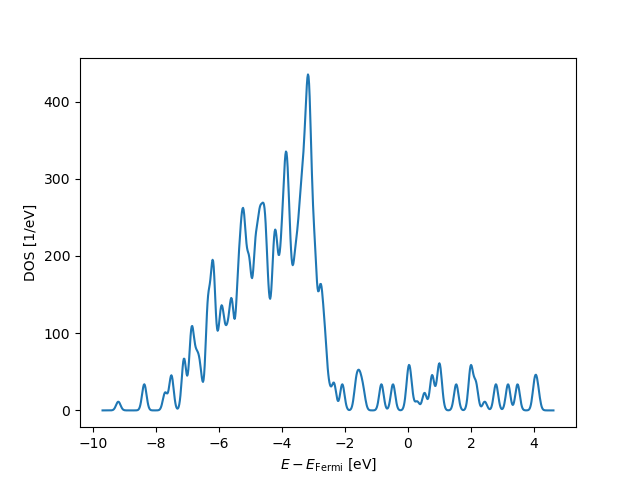
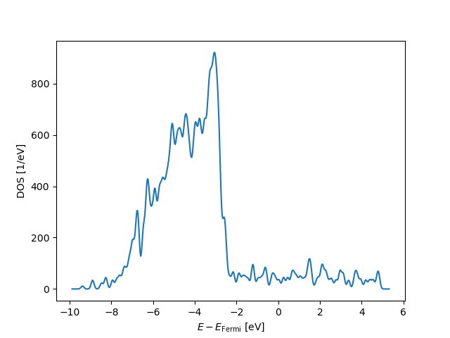
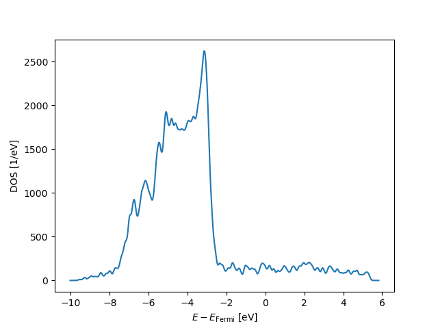
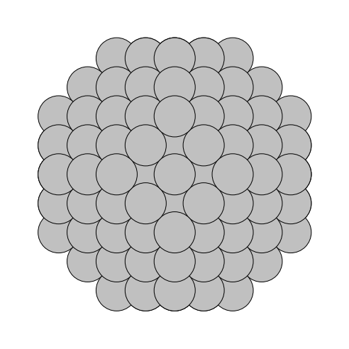
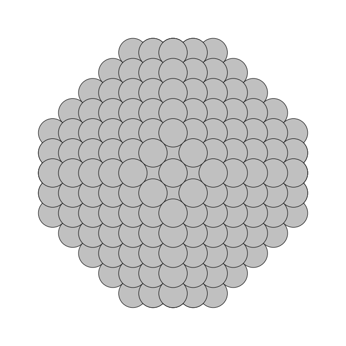
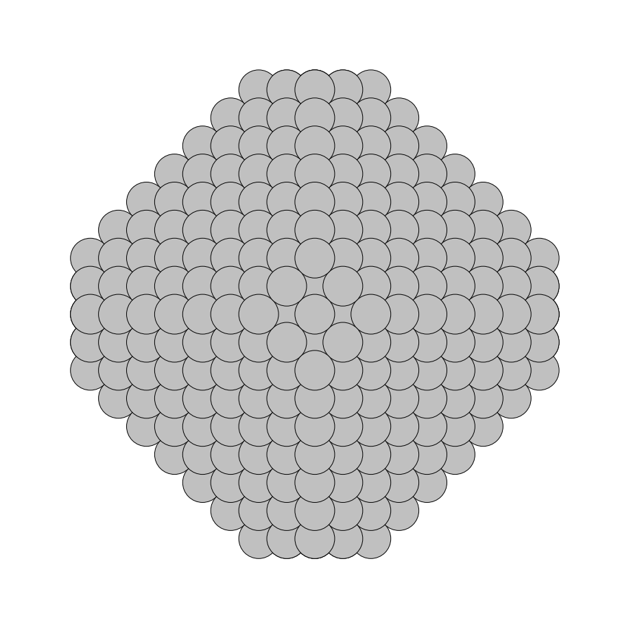
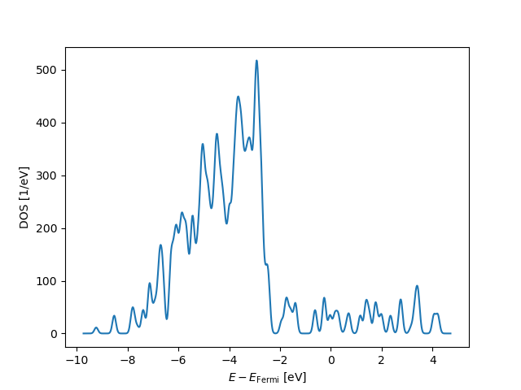
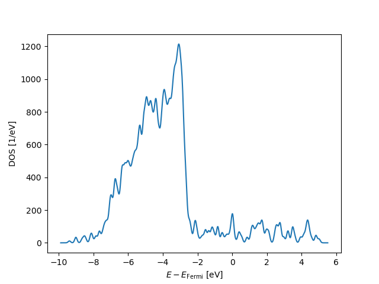

# Internship - week 11 - summary

 ASE (under empirical EMT potentials) and GPAW total energy calculations are described next for Ag nanoparticles, including an MPI weak scaling study for GPAW calculations of both octahedral and truncated octahedra Ag (fcc) nanoparticles as well as a hybrid parallel calculation set. Halfway through, a small computational project regarding HPC parameterisation has been started, although the main results are to be shown in the next weekly report.
   
## Ag fcc nanostructures - GPAW MPI weak scaling study under LCAO (acf)

ASE (EMT) geometry optimisation, GPAW (LCAO) self-consistent field electronic structure and GPAW electronic density of states calculations (*count.tar.gz* and *nanoparticlessilver.tar.gz*) have been carried out for a set of sizes of Ag octahedral and trucated-octahedral nanoparticles. The use of ASE in setting up atomistic geometry models from scratch is showcased next alongside total energy calculations. The "ase.cluster.octahedron" module allows the creation of atomistic geometries for both octahedral and truncated octahedral nanostructures: The fcc Ag nanoparticle example from the ASE tutorial material has been chosen for running. It includes three steps: 

 - The generation of atomistic geometries and the ASE (EMT) optimisation; 
 - the GPAW computation of the self-consistent electronic structure for the optimal cluster geometry, and 
 - a GPAW electronic density of states calculation starting from the GPAW electronically converged system. 

All three steps are (MPI) run on Genius for nanostructures of increasing size and a full weak-scaling study is presented. Incidentally, GPAW electronic structure calculations can be run using three different modes: (LCAO) atom-centered basis functions, real-space grids/multigrids and planewaves. This test has been run only under (LCAO) atom-centered functions, which are supposed to have the lowest memory consumption of all three methodologies. Moreover, the speed of the LCAO mode seems to overcome the other two for large system sizes, with planewaves winning for small systems. The finite-difference real-space methodology seems to be the last in the ranking in relation to both memory and speed. Regarding the precision of the discretisation method, LCAO is certainly the worst of all three modes: Probably, something to do with the **not systematically improvable** nature of the expansion of Kohn-Sham orbitals, electron density and effective potential.

Although they have been downloaded directly from the ASE [^1] and GPAW webpages [^2], the three python/ASE/GPAW input scripts used in this calculation are shown below for the sake of completeness (another subsection of this document will suggest modifications in order to achieve specific HPC procedures):

 - *step1.py*:

```python
from ase.cluster import Octahedron
from ase.calculators.emt import EMT
from ase.optimize import BFGS

atoms = Octahedron('Ag', 5, cutoff=2)
atoms.calc = EMT()
opt = BFGS(atoms, trajectory='opt.traj')
opt.run(fmax=0.01)
```
 - *step2.py*:

```python
from gpaw import GPAW, FermiDirac
from ase.io import read

atoms = read('opt.traj')

calc = GPAW(mode='lcao', basis='sz(dzp)', txt='gpaw.txt',
            occupations=FermiDirac(0.1),
            setups={'Ag': '11'})
atoms.calc = calc
atoms.center(vacuum=4.0)
atoms.get_potential_energy()
atoms.calc.write('groundstate.gpw')
```
 - *step3.py*:

```python
import matplotlib.pyplot as plt
from gpaw import GPAW
from ase.dft.dos import DOS

calc = GPAW('groundstate.gpw')
dos = DOS(calc, npts=800, width=0.1)
energies = dos.get_energies()
weights = dos.get_dos()

ax = plt.gca()
ax.plot(energies, weights)
ax.set_xlabel(r'$E - E_{\mathrm{Fermi}}$ [eV]')
ax.set_ylabel('DOS [1/eV]')
plt.savefig('dos.png')
plt.show()
```
One of the MPI job submission scripts (slurm) is displayed next -it has been uploaded as "mpi_GPAW_weakscaling.slurm" to the "computationalchemistry" GitHub repository-:
```bash
#!/usr/bin/env bash
#SBATCH --account=lp_h_vsc35663
#SBATCH --nodes=2
#SBATCH --ntasks=49
#SBATCH --cpus-per-task=1
#SBATCH --time=02:00:00
#SBATCH --cluster=genius
module purge
module use /apps/leuven/skylake/2021a/modules/all
module load ASE/3.22.0-intel-2021a
module load GPAW/21.6.0-intel-2021a
module load GPAW-setups/0.9.20000
cd $SLURM_SUBMIT_DIR
mpiexec gpaw python step1.py > outlog1.txt
mpiexec gpaw python step2.py > outlog2.txt
mpiexec gpaw python step3.py > outlog3.txt
. ./timev.sh
```
with the BASH shell script [^2] appearing in the bottom line (timev.sh):
```bash
#!/usr/bin/env bash
bmtime=$(grep "Total:" gpaw.txt | sed -e 's/Total: *//' | cut -d " " -f 1)
iterations=$(grep "Converged after" gpaw.txt | cut -d " " -f 3)
dipole=$(grep "Dipole" gpaw.txt | cut -d " " -f 5 | sed -e 's/)//')
fermi=$(grep "Fermi level:" gpaw.txt | cut -d ":" -f 2 | sed -e 's/ //g')
energy=$(grep "Extrapolated: " gpaw.txt | cut -d ":" -f 2 | sed -e 's/ //g')
echo -e "\nResult information:\n" \
    " * Time:                   $bmtime s\n" \
    " * Number of iterations:   $iterations\n" \
    " * Dipole (3rd component): $dipole\n" \
    " * Fermi level:            $fermi\n" \
    " * Extrapolated energy:    $energy\n"
```
The table below contains images of the atomistic geometry of each Ag nanoparticle and its respective electronic density of states, as resulting from the calculations:

<table>
  <tr>
    <th>NP=5</th>
    <th>NP=6</th>
    <th>NP=7</th>
    <th>NP=8</th>
    <th>NP=9</th>
    <th>NP=10</th>
    <th>NP=11</th>
  </tr>
  <tr>
    <td></td>
    <td></td>
    <td></td>
    <td></td>
    <td></td>
    <td></td>
    <td></td>   
  </tr>
  <tr>
    <td></td>
    <td></td>
    <td></td>
    <td></td>
    <td></td>
    <td></td>  
    <td></td>
    </tr>
  <tr>
    <th>NP=5 / NT=2</th>
    <th>NP=6 / NT=2</th>
    <th>NP=7 / NT=2</th>
    <th>NP=8 / NT=2</th>
    <th>NP=9 / NT=2</th>
    <th>NP=10/ NT=2</th>
    <th>NP=11 / NT=2</th>
  </tr>
  <tr>
    <td></td>
    <td></td>
    <td></td>
    <td></td>
    <td></td>
    <td></td>
    <td></td>   
  </tr>
  <tr>
    <td></td>
    <td></td>
    <td></td>
    <td></td>
    <td></td>
    <td></td>  
    <td></td>
    </tr>
  <tr>
    <th></th>
    <th></th>
    <th></th>
    <th></th>
    <th></th>
    <th>NP=10 / NT=4</th>
    <th></th>
  </tr>
  <tr>
    <td></td>
    <td></td>
    <td></td>
    <td></td>
    <td></td>
    <td></td>
    <td></td>   
  </tr>
  <tr>
    <td></td>
    <td></td>
    <td></td>
    <td></td>
    <td></td>
    <td></td>  
    <td></td>
    </tr>
</table>

Moreover, two separate data tables are shown: One with the number of atoms in the nanoparticle, the other with the MPI wall-time for the second step of the calculation (GPAW self-consistent field electronic structure calculation). Neither the first (EMT geometry optimisation) nor the third step (electronic density of states) are accounted for at this point. As a weak scaling problem, the number of MPI cores is assumed to increase proportionally to the number of cluster atoms (in fact, the atom number divided by 6 is taken as the best option). On the other hand, two types of truncation is considered, ie a `cutoff=2` truncation and a cutoff 40 % truncation. No details on the atomic geometry generation algorith are given.

|NPAR|c=40%|NATpOH|NATtOH2|NATtOH40|Nc(pOH)|Nc(c=2)|Nc(c=40)|
|----|-----|------|-------|--------|-------|-------|--------|
|5   |  2  |85    |    55 |   ---  |     9 |     6 |     -- |
|6   |  -  |146   |   116 |   ---  |    15 |    12 |     -- |
|7   |  -  |231   |   201 |   ---  |    23 |    20 |     -- |
|8   |  -  |344   |   314 |   ---  |    34 |    31 |     -- |
|9   |  -  |489   |   459 |   ---  |    49 |    46 |     -- |
|10  |  4  |670   |   640 |   490  |    67 |    64 |     49 |
|11  |  -  |891   |   861 |   ---  |    89 |    86 |     -- |
|12  |  -  |1156  |  1126 |   ---  |   116 |   113 |     -- |
|13  |  -  |1469  |  1439 |   ---  |   147 |   144 |     -- |
|14  |  -  |1834  |  1804 |   ---  |   183 |   180 |     -- |
|15  |  6  |2255  |  2225 |  1709  |   226 |   223 |    171 |
|20  |  8  |5340  |  5310 |  4116  |   534 |   531 |    412 |

The first column contains the values of the main parameter defining the octahedron size (NPAR). The second one is the value of the truncation parameter c for 40 % of the original octahedron size parameter (NPAR).
The third, fourth and fifth columns contain the main piece of information of this table, ie the number of atoms of each specific cluster (pOH refers to "pure-octahedron"; tOH2 is the truncated octahedron originally built under size parameter NPAR and subsequent truncation variable c=2; tOH40 is the truncated octahedron originally built under size parameter NPAR and truncation variable c=40% of NPAR). The last three columns contain the number of MPI cores for each calculation.

 Regarding the wall-time table:
 
|NPAR|NCpOH|NCc=2|NC c=40|WTpOH [s]|WTtOH2[s]|WTtOH40  |
|----|-----|-----|-------|---------|---------|---------|
|5   |9    |6    |   --- |75.258   |17.607   |  ---    |
|6   |15   |12   |   --- |92.670   |36.106   |  ---    |
|7   |23   |20   |   --- |176.731  |69.871   |  ---    |
|8   |34   |31   |   --- |220.460  |140.867  |  ---    |
|9   |49   |46   |   --- |795.626  |495.511  |  ---    |
|10  |67   |64   |    49 |1574.049 |1046.277 |269.801  |
|11  |89   |86   |   --- |FAIL[^3] |2421.106 |  ---    |

The GPAW scf calculations fail for NPAR above 11. After simple inspection of the total energies, it is apparent that they exhibit huge fluctuations, which, in turn is characteristic of the charge sloshing behaviour of delocalised electronic systems (metals), when LCAO basis functions are used.

A good example of charge sloshing seems to be the truncated-octahedron Ag nanoparticle corresponding to NP=15/c=6 (40 %), which does not appear on any of the tables above. Being a 1709 atom system whose geometry I have been able to optimise using ASE(EMT) in 46 BFGS cycles, the GPAW scf calculation crashes this time after carrying out 31 electronic iterations.
The first excerpt below displays the full ASE(EMT) energy convergence during optimisation, whilst the second clearly shows the huge oscillations in energy (charge sloshing!) before the GPAW scf calculation crashes:
```
      Step     Time          Energy         fmax
BFGS:    0 01:37:46      187.636981        0.6054
BFGS:    1 01:38:39      186.908506        0.5661
BFGS:    2 01:39:34      183.188116        0.4253
BFGS:    3 01:40:29      182.935680        0.2938
BFGS:    4 01:41:24      182.687962        0.2213
BFGS:    5 01:42:18      181.698596        0.2080
BFGS:    6 01:43:13      181.202814        0.2266
BFGS:    7 01:44:07      180.859665        0.2625
BFGS:    8 01:45:01      180.674164        0.2352
BFGS:    9 01:45:55      180.389822        0.1670
BFGS:   10 01:46:50      179.943037        0.1638
BFGS:   11 01:47:44      179.544985        0.1765
BFGS:   12 01:48:38      179.318653        0.1967
BFGS:   13 01:49:32      179.154223        0.1783
BFGS:   14 01:50:26      178.931037        0.1273
BFGS:   15 01:51:20      178.616056        0.1275
BFGS:   16 01:52:14      178.322715        0.1526
BFGS:   17 01:53:08      178.136408        0.1503
BFGS:   18 01:54:01      178.021339        0.1332
BFGS:   19 01:54:55      177.893847        0.1016
BFGS:   20 01:55:48      177.711871        0.0904
BFGS:   21 01:56:42      177.561769        0.1043
BFGS:   22 01:57:34      177.486857        0.1052
BFGS:   23 01:58:27      177.442355        0.0942
BFGS:   24 01:59:20      177.386915        0.0708
BFGS:   25 02:00:14      177.317819        0.0714
BFGS:   26 02:01:09      177.263835        0.0687
BFGS:   27 02:02:02      177.238902        0.0590
BFGS:   28 02:02:55      177.226711        0.0462
BFGS:   29 02:03:48      177.212974        0.0343
BFGS:   30 02:04:40      177.197830        0.0290
BFGS:   31 02:05:33      177.188687        0.0280
BFGS:   32 02:06:26      177.185048        0.0328
BFGS:   33 02:07:19      177.182413        0.0308
BFGS:   34 02:08:13      177.178080        0.0238
BFGS:   35 02:09:06      177.172397        0.0248
BFGS:   36 02:09:59      177.167537        0.0329
BFGS:   37 02:10:51      177.164765        0.0334
BFGS:   38 02:11:43      177.162708        0.0283
BFGS:   39 02:12:35      177.159919        0.0167
BFGS:   40 02:13:27      177.156592        0.0169
BFGS:   41 02:14:20      177.154263        0.0151
BFGS:   42 02:15:12      177.153273        0.0183
BFGS:   43 02:16:04      177.152666        0.0165
BFGS:   44 02:16:56      177.151794        0.0115
BFGS:   45 02:17:47      177.150712        0.0100
BFGS:   46 02:18:22      177.149903        0.0067
```
```
                     log10-error:    total        iterations:
           time      wfs    density  energy       poisson
iter:   1  02:24:23                -3463.327014    1
iter:   2  02:30:40         -1.88  -3894.198812    1
iter:   3  02:36:58         -1.65  -3916.795754    1
iter:   4  02:43:14         -1.67  -4194.759750    1
iter:   5  02:49:30         -1.82  -5429.475320    1
iter:   6  02:55:45         -1.62  -5626.065761    1
iter:   7  03:02:01         -1.66  -34933.189205    1
iter:   8  03:08:16         -0.99  -8260.650695    1
iter:   9  03:14:32         -1.58  -5940.456411    1
iter:  10  03:20:51         -1.72  -10934.286843    1
iter:  11  03:27:11         -1.22  -20294.980301    1
iter:  12  03:33:29         -1.02  -7327.388614    1
iter:  13  03:39:49         -1.42  -9459.523139    1
iter:  14  03:46:13         -1.28  -12942.464418    1
iter:  15  03:52:34         -1.15  -12303.858937    1
iter:  16  03:58:53         -1.12  -16020.374519    1
iter:  17  04:05:10         -1.20  -45143.985214    1
iter:  18  04:11:27         -1.13  -21621.006146    1
iter:  19  04:17:49         -1.24  -42104.540202    1
iter:  20  04:24:05         -1.07  -20353.824341    1
iter:  21  04:30:23         -1.25  -18643.804298    1
iter:  22  04:36:41         -1.27  -21170.206953    1
iter:  23  04:43:02         -1.24  -31966.072216    1
iter:  24  04:49:19         -1.09  -13836.892061    1
iter:  25  04:55:39         -1.31  -19855.470946    1
iter:  26  05:01:58         -1.19  -16337.288065    1
iter:  27  05:08:16         -1.22  -60648.581601    1
iter:  28  05:14:34         -1.05  -26816.910716    1
iter:  29  05:20:54         -1.13  -25799.559600    1
iter:  30  05:27:11         -1.16  -39993.277301    1
iter:  31  05:33:33         -1.18  -29663.397435    1
```
### HPC parameterisation 

This is an exercise regarding automatisation for ASE-GAPW calculations including BASH scripting and ATOOLS job submission: A more professional approach to the above ASE-GPAW calculation is sought. It actually constitutes a unique chance to try not only your BASH skills and learn the ATOOLS software, but the following will be brushed off as well:

  - Python: ASE and GPAW both require Python scripts.
  - M4: In order to HPC-parameterise the calculation, several Python variables need search/replacement, although ATOOLS contains already a
  templating tool.
  
As a matter of fact, a new Python script is provided by GJB in order to carry out a particular subtask (search/replacement of a particular variable with special syntax, on a Python script) and used directly by the intern. Regarding the M4 tool, it has been used for simple cases.
A couple of comments are in order in relation to M4, before we carry on. Firstly, and since the intern did not explicitly mention it during the LAMMPS input file exercise in previous weekly reports, it should be noted that the case at hand (LAMMPS ethanol input file search/replacement) is easily solved:

>
> $ m4 -D xFORM="CH3COOH" -D xDATAP=$(pwd) templateM4.txt > in.acetic
>
  
where the templateM4.txt file (modified "in.ethanol" file) contains two lines (36 and 37) with the actual variables to be searched/replaced:

```
molecule        xFORM xDATAP
create_atoms    0 region start_box mol xFORM 6871
```
The rest of the document coincides with "in.ethanol".

The second comment is about more involved M4 syntax: It turns out a string `part1_part2` requires a specific macros in order to have "part2" searched/replaced, whilst leaving "part1_" still. If you create a file (preserve.m4) with the contents:
```m4
format(SOMETHING_%s, ELSE)
```
the search/replace operation is now:

>
> $ m4 --define ELSE='123456789' preserve.m4 > output.txt
>

the file "output.txt" successfully containing:
```
SOMETHING_123456789
```
A good example is now in order. Imagine both the "atoms_xEXT" variable and the "atoms_xEXT.xyz" filename appearing within the ASE python script below (s1geo.m4), needs to have the part "xEXT" searched/replaced:

```python
from ase.cluster import Octahedron
from ase.io import write, read
atoms_xEXT = Octahedron('Ag', xNP)
write('atoms_xEXT.xyz', atoms_xEXT)
```
In this case,

```bash
#!/usr/bin/env bash
OLD='atoms_xEXT'
NEW='format(atoms_%s, xEXT)'
sed -i "s#${OLD}#${NEW}#g" s1geo.m4
```
the simple BASH script (name it "file.sh") will create the appropriate M4 macros (bash ./file.sh):

```m4
from ase.cluster import Octahedron
from ase.io import write, read
format(atoms_%s, xEXT) = Octahedron('Ag', xNP)
write(format(atoms_%s, xEXT).xyz', format(atoms_%s, xEXT))
```
which, after applying M4:

>
> $ m4 --define xEXT="123456789" s1geo.m4 > result.py
>

gives the resulting python file:

```python
from ase.cluster import Octahedron
from ase.io import write, read
atoms_123456789 = Octahedron('Ag', xNP)
write(atoms_123456789.xyz', atoms_123456789)
```
No doubt this is an impractical route to search/replace. As a matter of fact, GJB has decided to write a Python script (gjb.py) that does the job in no time (Python to modify Python!):
```python
#!/usr/bin/env python

import argparse
from ase.cluster import Octahedron
from ase.io import write

def main():
    arg_parser = argparse.ArgumentParser(description='Oh geometry file')
    arg_parser.add_argument('file', help='file name to generate')
    arg_parser.add_argument('--NP', type=int, default=1, help='main Oh size parameter')
    options = arg_parser.parse_args()

    write(options.file, Octahedron('Ag', options.NP))

if __name__ == '__main__':
    main()
```
In order to produce the sought after geometry file, the following command is given:

>
> $ python ./gjb.py atoms_poh_igg_NP5.xyz --NP 5
>

with the following output:
```
85
Properties=species:S:1:pos:R:3 pbc="F F F"
Ag      -6.13500000      -2.04500000       0.00000000
Ag      -6.13500000       0.00000000      -2.04500000
Ag      -8.18000000       0.00000000       0.00000000
Ag      -6.13500000       0.00000000       2.04500000
Ag      -6.13500000       2.04500000       0.00000000
Ag      -2.04500000      -6.13500000       0.00000000
Ag      -4.09000000      -2.04500000      -2.04500000
Ag      -2.04500000      -4.09000000      -2.04500000
Ag      -2.04500000      -2.04500000      -4.09000000
Ag      -4.09000000      -4.09000000       0.00000000
Ag      -4.09000000      -2.04500000       2.04500000
Ag      -2.04500000      -4.09000000       2.04500000
Ag      -2.04500000      -2.04500000       0.00000000
Ag      -2.04500000      -2.04500000       4.09000000
Ag      -2.04500000       0.00000000      -6.13500000
Ag      -4.09000000       0.00000000      -4.09000000
Ag      -4.09000000       2.04500000      -2.04500000
Ag      -2.04500000       0.00000000      -2.04500000
Ag      -2.04500000       2.04500000      -4.09000000
Ag      -4.09000000       0.00000000       0.00000000
Ag      -4.09000000       2.04500000       2.04500000
Ag      -2.04500000       0.00000000       2.04500000
Ag      -2.04500000       2.04500000       0.00000000
Ag      -4.09000000       0.00000000       4.09000000
Ag      -2.04500000       0.00000000       6.13500000
Ag      -2.04500000       2.04500000       4.09000000
Ag      -2.04500000       4.09000000      -2.04500000
Ag      -4.09000000       4.09000000       0.00000000
Ag      -2.04500000       4.09000000       2.04500000
Ag      -2.04500000       6.13500000       0.00000000
Ag       0.00000000      -6.13500000      -2.04500000
Ag       0.00000000      -8.18000000       0.00000000
Ag       0.00000000      -6.13500000       2.04500000
Ag       2.04500000      -6.13500000       0.00000000
Ag       0.00000000      -2.04500000      -6.13500000
Ag       0.00000000      -4.09000000      -4.09000000
Ag       0.00000000      -2.04500000      -2.04500000
Ag       2.04500000      -4.09000000      -2.04500000
Ag       2.04500000      -2.04500000      -4.09000000
Ag       0.00000000      -4.09000000       0.00000000
Ag       0.00000000      -2.04500000       2.04500000
Ag       2.04500000      -4.09000000       2.04500000
Ag       2.04500000      -2.04500000       0.00000000
Ag       0.00000000      -4.09000000       4.09000000
Ag       0.00000000      -2.04500000       6.13500000
Ag       2.04500000      -2.04500000       4.09000000
Ag       0.00000000       0.00000000      -8.18000000
Ag       0.00000000       2.04500000      -6.13500000
Ag       2.04500000       0.00000000      -6.13500000
Ag       0.00000000       0.00000000      -4.09000000
Ag       0.00000000       2.04500000      -2.04500000
Ag       2.04500000       0.00000000      -2.04500000
Ag       2.04500000       2.04500000      -4.09000000
Ag       0.00000000       0.00000000       0.00000000
Ag       0.00000000       2.04500000       2.04500000
Ag       2.04500000       0.00000000       2.04500000
Ag       2.04500000       2.04500000       0.00000000
Ag       0.00000000       0.00000000       4.09000000
Ag       0.00000000       2.04500000       6.13500000
Ag       2.04500000       0.00000000       6.13500000
Ag       2.04500000       2.04500000       4.09000000
Ag       0.00000000       0.00000000       8.18000000
Ag       0.00000000       4.09000000      -4.09000000
Ag       0.00000000       6.13500000      -2.04500000
Ag       2.04500000       4.09000000      -2.04500000
Ag       0.00000000       4.09000000       0.00000000
Ag       0.00000000       6.13500000       2.04500000
Ag       2.04500000       4.09000000       2.04500000
Ag       2.04500000       6.13500000       0.00000000
Ag       0.00000000       4.09000000       4.09000000
Ag       0.00000000       8.18000000       0.00000000
Ag       4.09000000      -2.04500000      -2.04500000
Ag       4.09000000      -4.09000000       0.00000000
Ag       4.09000000      -2.04500000       2.04500000
Ag       6.13500000      -2.04500000       0.00000000
Ag       4.09000000       0.00000000      -4.09000000
Ag       4.09000000       2.04500000      -2.04500000
Ag       6.13500000       0.00000000      -2.04500000
Ag       4.09000000       0.00000000       0.00000000
Ag       4.09000000       2.04500000       2.04500000
Ag       6.13500000       0.00000000       2.04500000
Ag       6.13500000       2.04500000       0.00000000
Ag       4.09000000       0.00000000       4.09000000
Ag       4.09000000       4.09000000       0.00000000
Ag       8.18000000       0.00000000       0.00000000
```
GJB has written two simple job submission scripts (serial) in order to provide a good explanation for the intern to get started with ATOOLS from scratch, one for the Genius cluster and the other for wICE. The intern has added a third script, which goes one step further (nothing extreme!). All three scripts are shown next alonside one of the job array outputs (and the general output as well) for the wICE jobs (the genius script has not been run):
```bash
#!/bin/bash -l

#SBATCH --account=lp_h_vsc35663
#SBATCH --cluster=wice
#SBATCH --nodes=1
#SBATCH --ntasks=1
#SBATCH --time=00:05:00
#SBATCH --mem=1g

module purge
module load atools

alog --state start

source <(aenv --data data.csv)

echo "$alpha $beta $gamma"

alog --state end --exit $?
```
```bash
#!/bin/bash -l

#SBATCH --account=lpt2_sysadmin
#SBATCH --cluster=genius
#SBATCH --nodes=1
#SBATCH --ntasks=1
#SBATCH --time=00:05:00
#SBATCH --mem=1g

module purge
module use /apps/leuven/skylake/2021a/modules/all
module load atools

alog --state start

source <(aenv --data data.csv)

echo "$alpha $beta $gamma"

alog --state end --exit $?
```
```bash
#!/bin/bash -l

#SBATCH --account=lp_h_vsc35663
#SBATCH --cluster=wice
#SBATCH --nodes=1
#SBATCH --ntasks=1
#SBATCH --time=00:15:00
#SBATCH --mem=1g

module purge
module load atools

alog --state start

source <(aenv --data data.csv)

echo "$x $y"

OUT_FILE="out_${x}_${y}.txt"

./sum.exe $x $y > $OUT_FILE

alog --state end --exit $?
```
```
SLURM_JOB_ID: 60687497
SLURM_JOB_USER: vsc35663
SLURM_JOB_ACCOUNT: lp_h_vsc35663
SLURM_JOB_NAME: mpi.slurm
SLURM_CLUSTER_NAME: wice
SLURM_JOB_PARTITION: batch
SLURM_ARRAY_JOB_ID: 60687497
SLURM_ARRAY_TASK_ID: 10
SLURM_NNODES: 1
SLURM_NODELIST: p33c25n4
SLURM_JOB_CPUS_PER_NODE: 1
Date: Wed Sep 13 12:15:15 CEST 2023
Walltime: 00-00:05:00
========================================================================
10.0 11.0 12.0
```
```
1 started by n28c32n4 at 2023-09-13 12:15:07
1 completed by n28c32n4 at 2023-09-13 12:15:07
8 started by p33c25n4 at 2023-09-13 12:15:08
4 started by p33c25n4 at 2023-09-13 12:15:08
9 started by p33c25n4 at 2023-09-13 12:15:08
8 completed by p33c25n4 at 2023-09-13 12:15:08
4 completed by p33c25n4 at 2023-09-13 12:15:08
9 completed by p33c25n4 at 2023-09-13 12:15:08
3 started by p33c25n4 at 2023-09-13 12:15:09
3 completed by p33c25n4 at 2023-09-13 12:15:09
5 started by p33c25n4 at 2023-09-13 12:15:12
5 completed by p33c25n4 at 2023-09-13 12:15:12
2 started by n28c32n4 at 2023-09-13 12:15:13
7 started by p33c25n4 at 2023-09-13 12:15:13
2 completed by n28c32n4 at 2023-09-13 12:15:13
7 completed by p33c25n4 at 2023-09-13 12:15:13
10 started by p33c25n4 at 2023-09-13 12:15:16
10 completed by p33c25n4 at 2023-09-13 12:15:16
6 started by p33c25n4 at 2023-09-13 12:15:27
6 completed by p33c25n4 at 2023-09-13 12:15:27
```
```
SLURM_JOB_ID: 60687640
SLURM_JOB_USER: vsc35663
SLURM_JOB_ACCOUNT: lp_h_vsc35663
SLURM_JOB_NAME: mpi.slurm
SLURM_CLUSTER_NAME: wice
SLURM_JOB_PARTITION: batch
SLURM_ARRAY_JOB_ID: 60687629
SLURM_ARRAY_TASK_ID: 10
SLURM_NNODES: 1
SLURM_NODELIST: p33c25n4
SLURM_JOB_CPUS_PER_NODE: 1
Date: Wed Sep 13 13:13:48 CEST 2023
Walltime: 00-00:15:00
========================================================================
9 10
```
```
19.000000
```
```
15 started by r33c25n1 at 2023-09-13 13:13:44
11 started by p33c25n4 at 2023-09-13 13:13:44
15 completed by r33c25n1 at 2023-09-13 13:13:44
11 completed by p33c25n4 at 2023-09-13 13:13:44
6 started by n28c32n4 at 2023-09-13 13:13:44
6 completed by n28c32n4 at 2023-09-13 13:13:44
5 started by n28c32n4 at 2023-09-13 13:13:45
5 completed by n28c32n4 at 2023-09-13 13:13:45
4 started by n28c32n4 at 2023-09-13 13:13:46
4 completed by n28c32n4 at 2023-09-13 13:13:46
12 started by p33c25n4 at 2023-09-13 13:13:46
12 completed by p33c25n4 at 2023-09-13 13:13:46
14 started by r33c25n1 at 2023-09-13 13:13:48
14 completed by r33c25n1 at 2023-09-13 13:13:48
7 started by n28c32n4 at 2023-09-13 13:13:49
7 completed by n28c32n4 at 2023-09-13 13:13:49
10 started by p33c25n4 at 2023-09-13 13:13:49
10 completed by p33c25n4 at 2023-09-13 13:13:49
1 started by n28c32n4 at 2023-09-13 13:13:51
1 completed by n28c32n4 at 2023-09-13 13:13:51
8 started by p33c25n4 at 2023-09-13 13:13:51
8 completed by p33c25n4 at 2023-09-13 13:13:51
17 started by r33c25n1 at 2023-09-13 13:13:52
17 completed by r33c25n1 at 2023-09-13 13:13:52
13 started by r33c25n1 at 2023-09-13 13:13:53
13 completed by r33c25n1 at 2023-09-13 13:13:53
```
For the sake of completeness, both CSV data files and the C code (the latter has been taken from the examples directory within the ATOOLS distribution) are shown:
```
alpha,beta,gamma
1.0,2.0,3.0
2.0,3.0,4.0
3.0,4.0,5.0
4.0,5.0,6.0
5.0,6.0,7.0
6.0,7.0,8.0
7.0,8.0,9.0
8.0,9.0,10.0
9.0,10.0,11.0
10.0,11.0,12.0
```
```
x,y
0,1
1,2
2,3
3,4
4,5
5,6
6,7
7,8
8,9
9,10
10,11
11,12
12,13
13,14
14,15
15,16
16,17
```
```C
#include <stdio.h>
#include <stdlib.h>

int main(int argc, char *argv[]) {
        double sum = 0.0;
        int i;
        for (i = 1; i < argc; i++) {
        double value = atof(argv[i]);
        sum += value;
        }
        printf("%lf\n", sum);
        return 0;
        }
```
After looking at the above cases and at the ATOOLS documentation, the need for the `acreate` command is anticipated for our case: A simple "data.csv"
file seems to be required (NP,NT in the first line, NP corresponding to the main Oh size  parameter and NT to the cutoff/truncation parameter), although many instances of templating for all three `gpaw-python` files (step1.py, step2.py and step3.py) will be needed as well. Moreover, the 
above samples let us see that ATOOLS is not designed to include any of the slurm variables (number of MPI processes, number of nodes, number of OMP threads) as one of the "data.csv" HPC-parameters, as previously explained by GJB.

## Hybrid mode calculations

For future reference, the following Python script is suggested in a PRACE publication on GPAW [^4], in order to test the initialisation using the import Python command:
```python
from ase import Atoms
from gpaw import GPAW
from gpaw.mpi import rank, world

world.barrier()
if rank == 0:
print "Init completed"
```
One of the above ASE/GPAW calculation sets (that with NP=11/c=2) is repeated, this time under hybrid parallelisation and using 43 as the number of MPI processes. Moreover, it is key to note that in order to fully test the hybrid mode, the finite-difference real-space discretisation mode of GPAW should be applied as well, although it will appear in the next weekly report. The table below corresponds to a fixed number of MPI processes, 43 using LCAO (acf):

| thread number |wall-time [secs]|
|:-------------:|:--------------:|
|1              |    2625.024    |
|2              |    1934.532    |
|3              |    1939.047    |
|4              |    2200.317    |
|6              |    1859.788    |

Extensive discussions with GJB lead to the consideration of the problem of *load balancing*, which seems to be associated, in this case, to 43 being a prime number. Load balancing is probably the reason why the case with a number of threads equals to 5 (6 gives no error message; 8 fails again) is rejected by the slurm queueing system. For the sake of completeness, the job submission script is enclosed next:

```bash
#!/usr/bin/env bash
#SBATCH --account=lp_h_vsc35663
#SBATCH --nodes=6
#SBATCH --ntasks=43
#SBATCH --cpus-per-task=5
#SBATCH --time=12:00:00
#SBATCH --cluster=genius
module purge
module use /apps/leuven/skylake/2021a/modules/all
module load ASE/3.22.0-intel-2021a
module load GPAW/21.6.0-intel-2021a
module load GPAW-setups/0.9.20000
cd $SLURM_SUBMIT_DIR
export OMP_NUM_THREADS=$SLURM_CPUS_PER_TASK
export OMP_PROC_BIND=true
mpiexec gpaw python step1.py > outlog1.txt
mpiexec gpaw python step2.py > outlog2.txt
mpiexec gpaw python step3.py > outlog3.txt
. ./timev.sh
```
Direct inspection of the shell script lets us spot the problem straight away: *43 is not divisible by 6*. GJB's suggestion is to use the directive

```bash
#SBATCH --ntasks-per-node=7
``` 
instead of the current one,
```bash
#SBATCH --ntasks=43
```
This change implies a total number of 42 MPI processes, which seems to be the closest to the original parameter. In case more stringent criteria are required (insist on 43 instead of 42 as number of MPI processes), a new design of the computer experiment for weak scaling is needed: A "weak scaling + strong scaling" experiment taking into account from the outset both the machine architecture (36 cores per node), the use of consistent division factors, system size and the actual parallelisation methods existing for the software GPAW. Once again, the need for diving deeper into the study of the GPAW code goes hand in hand with the need for experimenting further with the discretisation modes of real-space finite-difference (and multigrids!), LCAO and planewaves.

On the other hand, the exercise is not complete unless the linear-response TDDFT method is run, for which specific hybrid computational methodology seems to have been developed for inverting the $/Omega$ matrix [^4]. It will appear in the next weekly report as well.

For the sake of completeness, some data regarding the small script at the begining of this subsection, are to be presented as well shortly.

# Conclusion

The most difficult part of automatising the nanoparticle weak scaling calculations seems to be related to the "load balancing" problem. Rephrasing the above: Strictly speaking, weak scaling is incompatible with MPI on CPUs.  Considering the number of MPI processes needs to be divisible by the number of nodes and also the outcome of approximately dividing the atom number by a certain factor (6), the "weak scaling" experiment becomes "approximate weak scaling" if load balancing is to be avoided. In any case, ATOOLS does not allow changes in the number of nodes/MPI processes/OpenMP threads, which means not even approximate weak scaling?

[^1]: https://wiki.fysik.dtu.dk/ase/
[^2]: https://wiki.fysik.dtu.dk/gpaw/
[^3]: The GPAW total energy calculation for this 891 atom (fcc Ag) octahedral nanoparticle (NPAR=11) has simply reached the time limit, without failure. Moreover, it should be noted that *the first step of the calculation, ie the EMT classical geometry optimisation (ASE), has converged in 43 cycles*. Regarding the GPAW total energy calculation, it must be mentioned that 89 electronic iterations had been completed before the calculation reached the time limit, without achieving electronic convergence.
[^4]: "Optimizing GPAW", Jussi Enkovaara, Martti Louhivouri, Petar Jovanovich, Vladimir Slavnic, Michael Raennar, Partnership for Advanced Computing in Europe. The authors refer to "Scalable Python" when describing their Python optimised methodology. It is my understanding that this is the same software Dr Jussi Enkovaara provides on a GitHub page
(https://github.com/CSCfi/scalable-python) as a full Python distribution. The latter as well as the paper information constitutes a possible starting point for further MPI, OpenMP and hybrid calculations on my side, in order to learn more on optimising GPAW.
