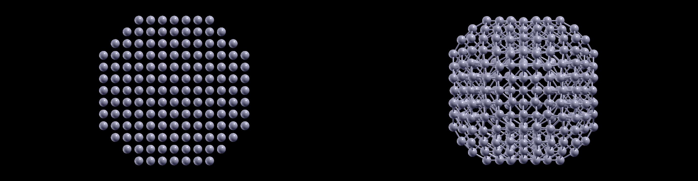

# Internship - week 13 - summary

ASE calculations using force fields from the OpenKIM collection, have been run for BCC metals. Tungsten (W) has been chosen as a testbed for having the highest melting point of all known materials.

## *The SNAP machine-learning potential for Tungsten*

Machine-learning potentials are derived from quantum mechanical DFT calculations, and this particular SNAP W potential has been previously tested on Tungsten surfaces by other workers (atomic Hydrogen adsorption on bcc W(100)), being one of the most exact force fields that are currently available for Tungsten.

### Introduction

The following CIF files are used as starting point for both bcc and fcc (bulk) W. The latter has been built using ``atomsk` for the experimental lattice constant of fcc Tungsten (4.15 Angstrom), while the former has been downloaded directly from the COD website:
```
#------------------------------------------------------------------------------
#$Date: 2023-03-26 10:30:59 +0300 (Sun, 26 Mar 2023) $
#$Revision: 282067 $
#$URL: file:///home/coder/svn-repositories/cod/cif/9/00/64/9006486.cif $
#------------------------------------------------------------------------------
#
# This file is available in the Crystallography Open Database (COD),
# http://www.crystallography.net/. The original data for this entry
# were provided the American Mineralogist Crystal Structure Database,
# http://rruff.geo.arizona.edu/AMS/amcsd.php
#
# The file may be used within the scientific community so long as
# proper attribution is given to the journal article from which the
# data were obtained.
#
data_9006486
loop_
_publ_author_name
'Dubrovinsky, L. S.'
'Saxena, S. K.'
_publ_section_title
;
 Thermal expansion of periclase (MgO) and tungsten (W)
 to melting temperatures
 Sample: T = 298 K
;
_journal_name_full               'Physics and Chemistry of Minerals'
_journal_page_first              547
_journal_page_last               550
_journal_paper_doi               10.1007/s002690050070
_journal_volume                  24
_journal_year                    1997
_chemical_formula_sum            W
_chemical_name_mineral           Tungsten
_space_group_IT_number           229
_symmetry_space_group_name_Hall  '-I 4 2 3'
_symmetry_space_group_name_H-M   'I m -3 m'
_cell_angle_alpha                90
_cell_angle_beta                 90
_cell_angle_gamma                90
_cell_length_a                   3.1648
_cell_length_b                   3.1648
_cell_length_c                   3.1648
_cell_volume                     31.699
_database_code_amcsd             0008068
_diffrn_ambient_temperature      298
_exptl_crystal_density_diffrn    19.262
_cod_original_sg_symbol_H-M      'I m 3 m'
_cod_database_code               9006486
loop_
_space_group_symop_operation_xyz
x,y,z
1/2+x,1/2+y,1/2+z
z,-x,y
1/2+z,1/2-x,1/2+y
-y,z,-x
1/2-y,1/2+z,1/2-x
x,-y,z
1/2+x,1/2-y,1/2+z
-z,x,-y
1/2-z,1/2+x,1/2-y
y,-z,x
1/2+y,1/2-z,1/2+x
-x,y,-z
1/2-x,1/2+y,1/2-z
x,-z,-y
1/2+x,1/2-z,1/2-y
-z,y,x
1/2-z,1/2+y,1/2+x
y,-x,-z
1/2+y,1/2-x,1/2-z
-x,z,y
1/2-x,1/2+z,1/2+y
z,-y,-x
1/2+z,1/2-y,1/2-x
-y,x,z
1/2-y,1/2+x,1/2+z
x,z,y
1/2+x,1/2+z,1/2+y
-z,-y,-x
1/2-z,1/2-y,1/2-x
y,x,z
1/2+y,1/2+x,1/2+z
-x,-z,-y
1/2-x,1/2-z,1/2-y
z,y,x
1/2+z,1/2+y,1/2+x
-y,-x,-z
1/2-y,1/2-x,1/2-z
z,x,-y
1/2+z,1/2+x,1/2-y
-y,-z,x
1/2-y,1/2-z,1/2+x
x,y,-z
1/2+x,1/2+y,1/2-z
-z,-x,y
1/2-z,1/2-x,1/2+y
y,z,-x
1/2+y,1/2+z,1/2-x
-x,-y,z
1/2-x,1/2-y,1/2+z
-z,x,y
1/2-z,1/2+x,1/2+y
y,-z,-x
1/2+y,1/2-z,1/2-x
-x,y,z
1/2-x,1/2+y,1/2+z
z,-x,-y
1/2+z,1/2-x,1/2-y
-y,z,x
1/2-y,1/2+z,1/2+x
x,-y,-z
1/2+x,1/2-y,1/2-z
-x,z,-y
1/2-x,1/2+z,1/2-y
z,-y,x
1/2+z,1/2-y,1/2+x
-y,x,-z
1/2-y,1/2+x,1/2-z
x,-z,y
1/2+x,1/2-z,1/2+y
-z,y,-x
1/2-z,1/2+y,1/2-x
y,-x,z
1/2+y,1/2-x,1/2+z
-x,-z,y
1/2-x,1/2-z,1/2+y
z,y,-x
1/2+z,1/2+y,1/2-x
-y,-x,z
1/2-y,1/2-x,1/2+z
x,z,-y
1/2+x,1/2+z,1/2-y
-z,-y,x
1/2-z,1/2-y,1/2+x
y,x,-z
1/2+y,1/2+x,1/2-z
-z,-x,-y
1/2-z,1/2-x,1/2-y
y,z,x
1/2+y,1/2+z,1/2+x
-x,-y,-z
1/2-x,1/2-y,1/2-z
z,x,y
1/2+z,1/2+x,1/2+y
-y,-z,-x
1/2-y,1/2-z,1/2-x
loop_
_atom_site_label
_atom_site_fract_x
_atom_site_fract_y
_atom_site_fract_z
W 0.00000 0.00000 0.00000
loop_
_cod_related_entry_id
_cod_related_entry_database
_cod_related_entry_code
1 ChemSpider 22403
2 MPOD 1000063
3 MPOD 1000077
4 MPOD 1000078
5 AMCSD 0008068
```
```
# CIF file created by FINDSYM, version 7.1.3

data_findsym-output
_audit_creation_method FINDSYM

_cell_length_a    4.1499955566
_cell_length_b    4.1499955566
_cell_length_c    4.1499955566
_cell_angle_alpha 90.0000000000
_cell_angle_beta  90.0000000000
_cell_angle_gamma 90.0000000000
_cell_volume      71.4731454234

_symmetry_space_group_name_H-M "F 4/m -3 2/m"
_symmetry_Int_Tables_number 225
_space_group.reference_setting '225:-F 4 2 3'
_space_group.transform_Pp_abc a,b,c;0,0,0

loop_
_space_group_symop_id
_space_group_symop_operation_xyz
1 x,y,z
2 x,-y,-z
3 -x,y,-z
4 -x,-y,z
5 y,z,x
6 y,-z,-x
7 -y,z,-x
8 -y,-z,x
9 z,x,y
10 z,-x,-y
11 -z,x,-y
12 -z,-x,y
13 -y,-x,-z
14 -y,x,z
15 y,-x,z
16 y,x,-z
17 -x,-z,-y
18 -x,z,y
19 x,-z,y
20 x,z,-y
21 -z,-y,-x
22 -z,y,x
23 z,-y,x
24 z,y,-x
25 -x,-y,-z
26 -x,y,z
27 x,-y,z
28 x,y,-z
29 -y,-z,-x
30 -y,z,x
31 y,-z,x
32 y,z,-x
33 -z,-x,-y
34 -z,x,y
35 z,-x,y
36 z,x,-y
37 y,x,z
38 y,-x,-z
39 -y,x,-z
40 -y,-x,z
41 x,z,y
42 x,-z,-y
43 -x,z,-y
44 -x,-z,y
45 z,y,x
46 z,-y,-x
47 -z,y,-x
48 -z,-y,x
49 x,y+1/2,z+1/2
50 x,-y+1/2,-z+1/2
51 -x,y+1/2,-z+1/2
52 -x,-y+1/2,z+1/2
53 y,z+1/2,x+1/2
54 y,-z+1/2,-x+1/2
55 -y,z+1/2,-x+1/2
56 -y,-z+1/2,x+1/2
57 z,x+1/2,y+1/2
58 z,-x+1/2,-y+1/2
59 -z,x+1/2,-y+1/2
60 -z,-x+1/2,y+1/2
61 -y,-x+1/2,-z+1/2
62 -y,x+1/2,z+1/2
63 y,-x+1/2,z+1/2
64 y,x+1/2,-z+1/2
65 -x,-z+1/2,-y+1/2
66 -x,z+1/2,y+1/2
67 x,-z+1/2,y+1/2
68 x,z+1/2,-y+1/2
69 -z,-y+1/2,-x+1/2
70 -z,y+1/2,x+1/2
71 z,-y+1/2,x+1/2
72 z,y+1/2,-x+1/2
73 -x,-y+1/2,-z+1/2
74 -x,y+1/2,z+1/2
75 x,-y+1/2,z+1/2
76 x,y+1/2,-z+1/2
77 -y,-z+1/2,-x+1/2
78 -y,z+1/2,x+1/2
79 y,-z+1/2,x+1/2
80 y,z+1/2,-x+1/2
81 -z,-x+1/2,-y+1/2
82 -z,x+1/2,y+1/2
83 z,-x+1/2,y+1/2
84 z,x+1/2,-y+1/2
85 y,x+1/2,z+1/2
86 y,-x+1/2,-z+1/2
87 -y,x+1/2,-z+1/2
88 -y,-x+1/2,z+1/2
89 x,z+1/2,y+1/2
90 x,-z+1/2,-y+1/2
91 -x,z+1/2,-y+1/2
92 -x,-z+1/2,y+1/2
93 z,y+1/2,x+1/2
94 z,-y+1/2,-x+1/2
95 -z,y+1/2,-x+1/2
96 -z,-y+1/2,x+1/2
97 x+1/2,y,z+1/2
98 x+1/2,-y,-z+1/2
99 -x+1/2,y,-z+1/2
100 -x+1/2,-y,z+1/2
101 y+1/2,z,x+1/2
102 y+1/2,-z,-x+1/2
103 -y+1/2,z,-x+1/2
104 -y+1/2,-z,x+1/2
105 z+1/2,x,y+1/2
106 z+1/2,-x,-y+1/2
107 -z+1/2,x,-y+1/2
108 -z+1/2,-x,y+1/2
109 -y+1/2,-x,-z+1/2
110 -y+1/2,x,z+1/2
111 y+1/2,-x,z+1/2
112 y+1/2,x,-z+1/2
113 -x+1/2,-z,-y+1/2
114 -x+1/2,z,y+1/2
115 x+1/2,-z,y+1/2
116 x+1/2,z,-y+1/2
117 -z+1/2,-y,-x+1/2
118 -z+1/2,y,x+1/2
119 z+1/2,-y,x+1/2
120 z+1/2,y,-x+1/2
121 -x+1/2,-y,-z+1/2
122 -x+1/2,y,z+1/2
123 x+1/2,-y,z+1/2
124 x+1/2,y,-z+1/2
125 -y+1/2,-z,-x+1/2
126 -y+1/2,z,x+1/2
127 y+1/2,-z,x+1/2
128 y+1/2,z,-x+1/2
129 -z+1/2,-x,-y+1/2
130 -z+1/2,x,y+1/2
131 z+1/2,-x,y+1/2
132 z+1/2,x,-y+1/2
133 y+1/2,x,z+1/2
134 y+1/2,-x,-z+1/2
135 -y+1/2,x,-z+1/2
136 -y+1/2,-x,z+1/2
137 x+1/2,z,y+1/2
138 x+1/2,-z,-y+1/2
139 -x+1/2,z,-y+1/2
140 -x+1/2,-z,y+1/2
141 z+1/2,y,x+1/2
142 z+1/2,-y,-x+1/2
143 -z+1/2,y,-x+1/2
144 -z+1/2,-y,x+1/2
145 x+1/2,y+1/2,z
146 x+1/2,-y+1/2,-z
147 -x+1/2,y+1/2,-z
148 -x+1/2,-y+1/2,z
149 y+1/2,z+1/2,x
150 y+1/2,-z+1/2,-x
151 -y+1/2,z+1/2,-x
152 -y+1/2,-z+1/2,x
153 z+1/2,x+1/2,y
154 z+1/2,-x+1/2,-y
155 -z+1/2,x+1/2,-y
156 -z+1/2,-x+1/2,y
157 -y+1/2,-x+1/2,-z
158 -y+1/2,x+1/2,z
159 y+1/2,-x+1/2,z
160 y+1/2,x+1/2,-z
161 -x+1/2,-z+1/2,-y
162 -x+1/2,z+1/2,y
163 x+1/2,-z+1/2,y
164 x+1/2,z+1/2,-y
165 -z+1/2,-y+1/2,-x
166 -z+1/2,y+1/2,x
167 z+1/2,-y+1/2,x
168 z+1/2,y+1/2,-x
169 -x+1/2,-y+1/2,-z
170 -x+1/2,y+1/2,z
171 x+1/2,-y+1/2,z
172 x+1/2,y+1/2,-z
173 -y+1/2,-z+1/2,-x
174 -y+1/2,z+1/2,x
175 y+1/2,-z+1/2,x
176 y+1/2,z+1/2,-x
177 -z+1/2,-x+1/2,-y
178 -z+1/2,x+1/2,y
179 z+1/2,-x+1/2,y
180 z+1/2,x+1/2,-y
181 y+1/2,x+1/2,z
182 y+1/2,-x+1/2,-z
183 -y+1/2,x+1/2,-z
184 -y+1/2,-x+1/2,z
185 x+1/2,z+1/2,y
186 x+1/2,-z+1/2,-y
187 -x+1/2,z+1/2,-y
188 -x+1/2,-z+1/2,y
189 z+1/2,y+1/2,x
190 z+1/2,-y+1/2,-x
191 -z+1/2,y+1/2,-x
192 -z+1/2,-y+1/2,x

loop_
_atom_site_label
_atom_site_type_symbol
_atom_site_symmetry_multiplicity
_atom_site_Wyckoff_label
_atom_site_fract_x
_atom_site_fract_y
_atom_site_fract_z
_atom_site_occupancy
_atom_site_fract_symmform
W1 W   4 a 0.00000 0.00000 0.00000 1.00000 0,0,0 

# end of cif
```
On the other hand, the following (ASE) Python script could be used in order to reconfirm access, within OpenKim, to a specific force field (SNAP potential for W):
```python
from ase.lattice.cubic import FaceCenteredCubic
from ase.calculators.kim.kim import KIM

atoms = FaceCenteredCubic(symbol='W', latticeconstant=4.15, size=(1,1,1))
calc = KIM("SNAP_LiChenZheng_2019_NbTaWMo__MO_560387080449_000")
atoms.set_calculator(calc)

energy = atoms.get_potential_energy()
print("Potential energy: {} eV".format(energy))
```
Other potentials for Tungsten include (entry to the KIM function):

 - "EAM_Dynamo_Ackland_2003_W__MO_141627196590_005"
 - "EAM_Dynamo_HanZepedaAckland_2003_W__MO_286137913440_000"
 - "EAM_Dynamo_MarinicaVentelonGilbert_2013EAM2_W__MO_204305659515_000"

There is one documented Tungsten potential in the OpenKim collection that fails when trying to access it:

>
> "MEAM_LAMMPS_HiremathMelinBitzek_2022_W__MO_943864507178_001"
>

Moreover, it is very helpful to have access (via a Python package called "kim-query") to lattice constant reference values in the OpenKim collection, as seen in this fcc Aluminum case:
```python
from kim_query import get_lattice_constant_cubic
get_lattice_constant_cubic(["MO_123629422045_005"], ["fcc"], ["Al"], ["angstrom"])
```
which gives the following output:

>
> [4.032082033157349]
>

### Bulk fcc W equation of state ASE calculation - binding curve

Similarly to the bcc Ag binding curve computed in the report of week 10, the resulting binding curve for fcc W is:


### Unreconstructed bcc W(111) surface with ASE - MPI weak scaling 

A wall-time table is shown below:

|number MPI procs |     1     |    16     |    64     |   144     |    400    |
|---------------- |-----------|-----------|-----------|-----------|-----------|
|   atom number   |    682    |   10912   |   43648   |   98208   |   272800  |
|surface extension|     -     |   (4x4)   |   (8x8)   |  (12x12)  |  (20x20)  |
|      time/s     |   1284    |   1288    |   1746    |   1781    |    1654   |

### ASE relaxation of fcc W nanoparticle

The following Python input file is used to run ASE in order to optimise the geometry of a 675 atom W cluster under the SNAP W potential:

```python
import ase
from ase.cluster.cubic import FaceCenteredCubic
from ase.io import write
from ase.calculators.kim.kim import KIM
from ase.optimize import BFGS
# REFERENCE VALUE alattBCCW=3.181190997362137 Angstrom
# REFERENCE VALUE alattFCCW=4.010717555880547 Angstrom

surfaces = [(1, 0, 0), (1, 1, 0), (1, 1, 1)]
layers = [6, 9, 5]

lc = 4.010717555880547
atoms = FaceCenteredCubic('W', surfaces, layers, latticeconstant=lc)
write('idealfccWcluster.xyz', atoms)
calc = KIM("SNAP_LiChenZheng_2019_NbTaWMo__MO_560387080449_000")
atoms.set_calculator(calc)
atoms.center(vacuum=4.0)
dyng = BFGS(atoms)
dyng.run(fmax=0.001)
write('optimalfccWcluster.xyz', atoms)
```
While the (ideal) starting geometry is given by the xyz file:
```
675
Properties=species:S:1:pos:R:3 pbc="F F F"
W      -12.03215267      -6.01607633      -2.00535878
W      -10.02679389      -8.02143511      -2.00535878
W      -10.02679389      -6.01607633      -4.01071756
W      -12.03215267      -6.01607633       2.00535878
W      -10.02679389      -8.02143511       2.00535878
W      -10.02679389      -6.01607633       0.00000000
W      -10.02679389      -6.01607633       4.01071756
W      -12.03215267      -2.00535878      -6.01607633
W      -10.02679389      -4.01071756      -6.01607633
W      -10.02679389      -2.00535878      -8.02143511
W      -12.03215267      -4.01071756      -4.01071756
W      -12.03215267      -2.00535878      -2.00535878
W      -10.02679389      -4.01071756      -2.00535878
W      -10.02679389      -2.00535878      -4.01071756
W      -12.03215267      -4.01071756       0.00000000
W      -12.03215267      -2.00535878       2.00535878
W      -10.02679389      -4.01071756       2.00535878
W      -10.02679389      -2.00535878       0.00000000
W      -12.03215267      -4.01071756       4.01071756
W      -12.03215267      -2.00535878       6.01607633
W      -10.02679389      -4.01071756       6.01607633
W      -10.02679389      -2.00535878       4.01071756
W      -10.02679389      -2.00535878       8.02143511
W      -12.03215267       2.00535878      -6.01607633
W      -10.02679389       0.00000000      -6.01607633
W      -10.02679389       2.00535878      -8.02143511
W      -12.03215267       0.00000000      -4.01071756
W      -12.03215267       2.00535878      -2.00535878
W      -10.02679389       0.00000000      -2.00535878
W      -10.02679389       2.00535878      -4.01071756
W      -12.03215267       0.00000000       0.00000000
W      -12.03215267       2.00535878       2.00535878
W      -10.02679389       0.00000000       2.00535878
W      -10.02679389       2.00535878       0.00000000
W      -12.03215267       0.00000000       4.01071756
W      -12.03215267       2.00535878       6.01607633
W      -10.02679389       0.00000000       6.01607633
W      -10.02679389       2.00535878       4.01071756
W      -10.02679389       2.00535878       8.02143511
W      -10.02679389       4.01071756      -6.01607633
W      -12.03215267       4.01071756      -4.01071756
W      -12.03215267       6.01607633      -2.00535878
W      -10.02679389       4.01071756      -2.00535878
W      -10.02679389       6.01607633      -4.01071756
W      -12.03215267       4.01071756       0.00000000
W      -12.03215267       6.01607633       2.00535878
W      -10.02679389       4.01071756       2.00535878
W      -10.02679389       6.01607633       0.00000000
W      -12.03215267       4.01071756       4.01071756
W      -10.02679389       4.01071756       6.01607633
W      -10.02679389       6.01607633       4.01071756
W      -10.02679389       8.02143511      -2.00535878
W      -10.02679389       8.02143511       2.00535878
W       -8.02143511     -10.02679389      -2.00535878
W       -6.01607633     -12.03215267      -2.00535878
W       -6.01607633     -10.02679389      -4.01071756
W       -8.02143511     -10.02679389       2.00535878
W       -6.01607633     -12.03215267       2.00535878
W       -6.01607633     -10.02679389       0.00000000
W       -6.01607633     -10.02679389       4.01071756
W       -8.02143511      -6.01607633      -6.01607633
W       -6.01607633      -8.02143511      -6.01607633
W       -6.01607633      -6.01607633      -8.02143511
W       -8.02143511      -8.02143511      -4.01071756
W       -8.02143511      -6.01607633      -2.00535878
W       -6.01607633      -8.02143511      -2.00535878
W       -6.01607633      -6.01607633      -4.01071756
W       -8.02143511      -8.02143511       0.00000000
W       -8.02143511      -6.01607633       2.00535878
W       -6.01607633      -8.02143511       2.00535878
W       -6.01607633      -6.01607633       0.00000000
W       -8.02143511      -8.02143511       4.01071756
W       -8.02143511      -6.01607633       6.01607633
W       -6.01607633      -8.02143511       6.01607633
W       -6.01607633      -6.01607633       4.01071756
W       -6.01607633      -6.01607633       8.02143511
W       -8.02143511      -2.00535878     -10.02679389
W       -6.01607633      -4.01071756     -10.02679389
W       -6.01607633      -2.00535878     -12.03215267
W       -8.02143511      -4.01071756      -8.02143511
W       -8.02143511      -2.00535878      -6.01607633
W       -6.01607633      -4.01071756      -6.01607633
W       -6.01607633      -2.00535878      -8.02143511
W       -8.02143511      -4.01071756      -4.01071756
W       -8.02143511      -2.00535878      -2.00535878
W       -6.01607633      -4.01071756      -2.00535878
W       -6.01607633      -2.00535878      -4.01071756
W       -8.02143511      -4.01071756       0.00000000
W       -8.02143511      -2.00535878       2.00535878
W       -6.01607633      -4.01071756       2.00535878
W       -6.01607633      -2.00535878       0.00000000
W       -8.02143511      -4.01071756       4.01071756
W       -8.02143511      -2.00535878       6.01607633
W       -6.01607633      -4.01071756       6.01607633
W       -6.01607633      -2.00535878       4.01071756
W       -8.02143511      -4.01071756       8.02143511
W       -8.02143511      -2.00535878      10.02679389
W       -6.01607633      -4.01071756      10.02679389
W       -6.01607633      -2.00535878       8.02143511
W       -6.01607633      -2.00535878      12.03215267
W       -8.02143511       2.00535878     -10.02679389
W       -6.01607633       0.00000000     -10.02679389
W       -6.01607633       2.00535878     -12.03215267
W       -8.02143511       0.00000000      -8.02143511
W       -8.02143511       2.00535878      -6.01607633
W       -6.01607633       0.00000000      -6.01607633
W       -6.01607633       2.00535878      -8.02143511
W       -8.02143511       0.00000000      -4.01071756
W       -8.02143511       2.00535878      -2.00535878
W       -6.01607633       0.00000000      -2.00535878
W       -6.01607633       2.00535878      -4.01071756
W       -8.02143511       0.00000000       0.00000000
W       -8.02143511       2.00535878       2.00535878
W       -6.01607633       0.00000000       2.00535878
W       -6.01607633       2.00535878       0.00000000
W       -8.02143511       0.00000000       4.01071756
W       -8.02143511       2.00535878       6.01607633
W       -6.01607633       0.00000000       6.01607633
W       -6.01607633       2.00535878       4.01071756
W       -8.02143511       0.00000000       8.02143511
W       -8.02143511       2.00535878      10.02679389
W       -6.01607633       0.00000000      10.02679389
W       -6.01607633       2.00535878       8.02143511
W       -6.01607633       2.00535878      12.03215267
W       -6.01607633       4.01071756     -10.02679389
W       -8.02143511       4.01071756      -8.02143511
W       -8.02143511       6.01607633      -6.01607633
W       -6.01607633       4.01071756      -6.01607633
W       -6.01607633       6.01607633      -8.02143511
W       -8.02143511       4.01071756      -4.01071756
W       -8.02143511       6.01607633      -2.00535878
W       -6.01607633       4.01071756      -2.00535878
W       -6.01607633       6.01607633      -4.01071756
W       -8.02143511       4.01071756       0.00000000
W       -8.02143511       6.01607633       2.00535878
W       -6.01607633       4.01071756       2.00535878
W       -6.01607633       6.01607633       0.00000000
W       -8.02143511       4.01071756       4.01071756
W       -8.02143511       6.01607633       6.01607633
W       -6.01607633       4.01071756       6.01607633
W       -6.01607633       6.01607633       4.01071756
W       -8.02143511       4.01071756       8.02143511
W       -6.01607633       4.01071756      10.02679389
W       -6.01607633       6.01607633       8.02143511
W       -6.01607633       8.02143511      -6.01607633
W       -8.02143511       8.02143511      -4.01071756
W       -8.02143511      10.02679389      -2.00535878
W       -6.01607633       8.02143511      -2.00535878
W       -6.01607633      10.02679389      -4.01071756
W       -8.02143511       8.02143511       0.00000000
W       -8.02143511      10.02679389       2.00535878
W       -6.01607633       8.02143511       2.00535878
W       -6.01607633      10.02679389       0.00000000
W       -8.02143511       8.02143511       4.01071756
W       -6.01607633       8.02143511       6.01607633
W       -6.01607633      10.02679389       4.01071756
W       -6.01607633      12.03215267      -2.00535878
W       -6.01607633      12.03215267       2.00535878
W       -4.01071756     -10.02679389      -6.01607633
W       -2.00535878     -12.03215267      -6.01607633
W       -2.00535878     -10.02679389      -8.02143511
W       -4.01071756     -12.03215267      -4.01071756
W       -4.01071756     -10.02679389      -2.00535878
W       -2.00535878     -12.03215267      -2.00535878
W       -2.00535878     -10.02679389      -4.01071756
W       -4.01071756     -12.03215267       0.00000000
W       -4.01071756     -10.02679389       2.00535878
W       -2.00535878     -12.03215267       2.00535878
W       -2.00535878     -10.02679389       0.00000000
W       -4.01071756     -12.03215267       4.01071756
W       -4.01071756     -10.02679389       6.01607633
W       -2.00535878     -12.03215267       6.01607633
W       -2.00535878     -10.02679389       4.01071756
W       -2.00535878     -10.02679389       8.02143511
W       -4.01071756      -6.01607633     -10.02679389
W       -2.00535878      -8.02143511     -10.02679389
W       -2.00535878      -6.01607633     -12.03215267
W       -4.01071756      -8.02143511      -8.02143511
W       -4.01071756      -6.01607633      -6.01607633
W       -2.00535878      -8.02143511      -6.01607633
W       -2.00535878      -6.01607633      -8.02143511
W       -4.01071756      -8.02143511      -4.01071756
W       -4.01071756      -6.01607633      -2.00535878
W       -2.00535878      -8.02143511      -2.00535878
W       -2.00535878      -6.01607633      -4.01071756
W       -4.01071756      -8.02143511       0.00000000
W       -4.01071756      -6.01607633       2.00535878
W       -2.00535878      -8.02143511       2.00535878
W       -2.00535878      -6.01607633       0.00000000
W       -4.01071756      -8.02143511       4.01071756
W       -4.01071756      -6.01607633       6.01607633
W       -2.00535878      -8.02143511       6.01607633
W       -2.00535878      -6.01607633       4.01071756
W       -4.01071756      -8.02143511       8.02143511
W       -4.01071756      -6.01607633      10.02679389
W       -2.00535878      -8.02143511      10.02679389
W       -2.00535878      -6.01607633       8.02143511
W       -2.00535878      -6.01607633      12.03215267
W       -4.01071756      -4.01071756     -12.03215267
W       -4.01071756      -2.00535878     -10.02679389
W       -2.00535878      -4.01071756     -10.02679389
W       -2.00535878      -2.00535878     -12.03215267
W       -4.01071756      -4.01071756      -8.02143511
W       -4.01071756      -2.00535878      -6.01607633
W       -2.00535878      -4.01071756      -6.01607633
W       -2.00535878      -2.00535878      -8.02143511
W       -4.01071756      -4.01071756      -4.01071756
W       -4.01071756      -2.00535878      -2.00535878
W       -2.00535878      -4.01071756      -2.00535878
W       -2.00535878      -2.00535878      -4.01071756
W       -4.01071756      -4.01071756       0.00000000
W       -4.01071756      -2.00535878       2.00535878
W       -2.00535878      -4.01071756       2.00535878
W       -2.00535878      -2.00535878       0.00000000
W       -4.01071756      -4.01071756       4.01071756
W       -4.01071756      -2.00535878       6.01607633
W       -2.00535878      -4.01071756       6.01607633
W       -2.00535878      -2.00535878       4.01071756
W       -4.01071756      -4.01071756       8.02143511
W       -4.01071756      -2.00535878      10.02679389
W       -2.00535878      -4.01071756      10.02679389
W       -2.00535878      -2.00535878       8.02143511
W       -4.01071756      -4.01071756      12.03215267
W       -2.00535878      -2.00535878      12.03215267
W       -4.01071756       0.00000000     -12.03215267
W       -4.01071756       2.00535878     -10.02679389
W       -2.00535878       0.00000000     -10.02679389
W       -2.00535878       2.00535878     -12.03215267
W       -4.01071756       0.00000000      -8.02143511
W       -4.01071756       2.00535878      -6.01607633
W       -2.00535878       0.00000000      -6.01607633
W       -2.00535878       2.00535878      -8.02143511
W       -4.01071756       0.00000000      -4.01071756
W       -4.01071756       2.00535878      -2.00535878
W       -2.00535878       0.00000000      -2.00535878
W       -2.00535878       2.00535878      -4.01071756
W       -4.01071756       0.00000000       0.00000000
W       -4.01071756       2.00535878       2.00535878
W       -2.00535878       0.00000000       2.00535878
W       -2.00535878       2.00535878       0.00000000
W       -4.01071756       0.00000000       4.01071756
W       -4.01071756       2.00535878       6.01607633
W       -2.00535878       0.00000000       6.01607633
W       -2.00535878       2.00535878       4.01071756
W       -4.01071756       0.00000000       8.02143511
W       -4.01071756       2.00535878      10.02679389
W       -2.00535878       0.00000000      10.02679389
W       -2.00535878       2.00535878       8.02143511
W       -4.01071756       0.00000000      12.03215267
W       -2.00535878       2.00535878      12.03215267
W       -4.01071756       4.01071756     -12.03215267
W       -4.01071756       6.01607633     -10.02679389
W       -2.00535878       4.01071756     -10.02679389
W       -2.00535878       6.01607633     -12.03215267
W       -4.01071756       4.01071756      -8.02143511
W       -4.01071756       6.01607633      -6.01607633
W       -2.00535878       4.01071756      -6.01607633
W       -2.00535878       6.01607633      -8.02143511
W       -4.01071756       4.01071756      -4.01071756
W       -4.01071756       6.01607633      -2.00535878
W       -2.00535878       4.01071756      -2.00535878
W       -2.00535878       6.01607633      -4.01071756
W       -4.01071756       4.01071756       0.00000000
W       -4.01071756       6.01607633       2.00535878
W       -2.00535878       4.01071756       2.00535878
W       -2.00535878       6.01607633       0.00000000
W       -4.01071756       4.01071756       4.01071756
W       -4.01071756       6.01607633       6.01607633
W       -2.00535878       4.01071756       6.01607633
W       -2.00535878       6.01607633       4.01071756
W       -4.01071756       4.01071756       8.02143511
W       -4.01071756       6.01607633      10.02679389
W       -2.00535878       4.01071756      10.02679389
W       -2.00535878       6.01607633       8.02143511
W       -4.01071756       4.01071756      12.03215267
W       -2.00535878       6.01607633      12.03215267
W       -2.00535878       8.02143511     -10.02679389
W       -4.01071756       8.02143511      -8.02143511
W       -4.01071756      10.02679389      -6.01607633
W       -2.00535878       8.02143511      -6.01607633
W       -2.00535878      10.02679389      -8.02143511
W       -4.01071756       8.02143511      -4.01071756
W       -4.01071756      10.02679389      -2.00535878
W       -2.00535878       8.02143511      -2.00535878
W       -2.00535878      10.02679389      -4.01071756
W       -4.01071756       8.02143511       0.00000000
W       -4.01071756      10.02679389       2.00535878
W       -2.00535878       8.02143511       2.00535878
W       -2.00535878      10.02679389       0.00000000
W       -4.01071756       8.02143511       4.01071756
W       -4.01071756      10.02679389       6.01607633
W       -2.00535878       8.02143511       6.01607633
W       -2.00535878      10.02679389       4.01071756
W       -4.01071756       8.02143511       8.02143511
W       -2.00535878       8.02143511      10.02679389
W       -2.00535878      10.02679389       8.02143511
W       -2.00535878      12.03215267      -6.01607633
W       -4.01071756      12.03215267      -4.01071756
W       -2.00535878      12.03215267      -2.00535878
W       -4.01071756      12.03215267       0.00000000
W       -2.00535878      12.03215267       2.00535878
W       -4.01071756      12.03215267       4.01071756
W       -2.00535878      12.03215267       6.01607633
W        0.00000000     -10.02679389      -6.01607633
W        2.00535878     -12.03215267      -6.01607633
W        2.00535878     -10.02679389      -8.02143511
W        0.00000000     -12.03215267      -4.01071756
W        0.00000000     -10.02679389      -2.00535878
W        2.00535878     -12.03215267      -2.00535878
W        2.00535878     -10.02679389      -4.01071756
W        0.00000000     -12.03215267       0.00000000
W        0.00000000     -10.02679389       2.00535878
W        2.00535878     -12.03215267       2.00535878
W        2.00535878     -10.02679389       0.00000000
W        0.00000000     -12.03215267       4.01071756
W        0.00000000     -10.02679389       6.01607633
W        2.00535878     -12.03215267       6.01607633
W        2.00535878     -10.02679389       4.01071756
W        2.00535878     -10.02679389       8.02143511
W        0.00000000      -6.01607633     -10.02679389
W        2.00535878      -8.02143511     -10.02679389
W        2.00535878      -6.01607633     -12.03215267
W        0.00000000      -8.02143511      -8.02143511
W        0.00000000      -6.01607633      -6.01607633
W        2.00535878      -8.02143511      -6.01607633
W        2.00535878      -6.01607633      -8.02143511
W        0.00000000      -8.02143511      -4.01071756
W        0.00000000      -6.01607633      -2.00535878
W        2.00535878      -8.02143511      -2.00535878
W        2.00535878      -6.01607633      -4.01071756
W        0.00000000      -8.02143511       0.00000000
W        0.00000000      -6.01607633       2.00535878
W        2.00535878      -8.02143511       2.00535878
W        2.00535878      -6.01607633       0.00000000
W        0.00000000      -8.02143511       4.01071756
W        0.00000000      -6.01607633       6.01607633
W        2.00535878      -8.02143511       6.01607633
W        2.00535878      -6.01607633       4.01071756
W        0.00000000      -8.02143511       8.02143511
W        0.00000000      -6.01607633      10.02679389
W        2.00535878      -8.02143511      10.02679389
W        2.00535878      -6.01607633       8.02143511
W        2.00535878      -6.01607633      12.03215267
W        0.00000000      -4.01071756     -12.03215267
W        0.00000000      -2.00535878     -10.02679389
W        2.00535878      -4.01071756     -10.02679389
W        2.00535878      -2.00535878     -12.03215267
W        0.00000000      -4.01071756      -8.02143511
W        0.00000000      -2.00535878      -6.01607633
W        2.00535878      -4.01071756      -6.01607633
W        2.00535878      -2.00535878      -8.02143511
W        0.00000000      -4.01071756      -4.01071756
W        0.00000000      -2.00535878      -2.00535878
W        2.00535878      -4.01071756      -2.00535878
W        2.00535878      -2.00535878      -4.01071756
W        0.00000000      -4.01071756       0.00000000
W        0.00000000      -2.00535878       2.00535878
W        2.00535878      -4.01071756       2.00535878
W        2.00535878      -2.00535878       0.00000000
W        0.00000000      -4.01071756       4.01071756
W        0.00000000      -2.00535878       6.01607633
W        2.00535878      -4.01071756       6.01607633
W        2.00535878      -2.00535878       4.01071756
W        0.00000000      -4.01071756       8.02143511
W        0.00000000      -2.00535878      10.02679389
W        2.00535878      -4.01071756      10.02679389
W        2.00535878      -2.00535878       8.02143511
W        0.00000000      -4.01071756      12.03215267
W        2.00535878      -2.00535878      12.03215267
W        0.00000000       0.00000000     -12.03215267
W        0.00000000       2.00535878     -10.02679389
W        2.00535878       0.00000000     -10.02679389
W        2.00535878       2.00535878     -12.03215267
W        0.00000000       0.00000000      -8.02143511
W        0.00000000       2.00535878      -6.01607633
W        2.00535878       0.00000000      -6.01607633
W        2.00535878       2.00535878      -8.02143511
W        0.00000000       0.00000000      -4.01071756
W        0.00000000       2.00535878      -2.00535878
W        2.00535878       0.00000000      -2.00535878
W        2.00535878       2.00535878      -4.01071756
W        0.00000000       0.00000000       0.00000000
W        0.00000000       2.00535878       2.00535878
W        2.00535878       0.00000000       2.00535878
W        2.00535878       2.00535878       0.00000000
W        0.00000000       0.00000000       4.01071756
W        0.00000000       2.00535878       6.01607633
W        2.00535878       0.00000000       6.01607633
W        2.00535878       2.00535878       4.01071756
W        0.00000000       0.00000000       8.02143511
W        0.00000000       2.00535878      10.02679389
W        2.00535878       0.00000000      10.02679389
W        2.00535878       2.00535878       8.02143511
W        0.00000000       0.00000000      12.03215267
W        2.00535878       2.00535878      12.03215267
W        0.00000000       4.01071756     -12.03215267
W        0.00000000       6.01607633     -10.02679389
W        2.00535878       4.01071756     -10.02679389
W        2.00535878       6.01607633     -12.03215267
W        0.00000000       4.01071756      -8.02143511
W        0.00000000       6.01607633      -6.01607633
W        2.00535878       4.01071756      -6.01607633
W        2.00535878       6.01607633      -8.02143511
W        0.00000000       4.01071756      -4.01071756
W        0.00000000       6.01607633      -2.00535878
W        2.00535878       4.01071756      -2.00535878
W        2.00535878       6.01607633      -4.01071756
W        0.00000000       4.01071756       0.00000000
W        0.00000000       6.01607633       2.00535878
W        2.00535878       4.01071756       2.00535878
W        2.00535878       6.01607633       0.00000000
W        0.00000000       4.01071756       4.01071756
W        0.00000000       6.01607633       6.01607633
W        2.00535878       4.01071756       6.01607633
W        2.00535878       6.01607633       4.01071756
W        0.00000000       4.01071756       8.02143511
W        0.00000000       6.01607633      10.02679389
W        2.00535878       4.01071756      10.02679389
W        2.00535878       6.01607633       8.02143511
W        0.00000000       4.01071756      12.03215267
W        2.00535878       6.01607633      12.03215267
W        2.00535878       8.02143511     -10.02679389
W        0.00000000       8.02143511      -8.02143511
W        0.00000000      10.02679389      -6.01607633
W        2.00535878       8.02143511      -6.01607633
W        2.00535878      10.02679389      -8.02143511
W        0.00000000       8.02143511      -4.01071756
W        0.00000000      10.02679389      -2.00535878
W        2.00535878       8.02143511      -2.00535878
W        2.00535878      10.02679389      -4.01071756
W        0.00000000       8.02143511       0.00000000
W        0.00000000      10.02679389       2.00535878
W        2.00535878       8.02143511       2.00535878
W        2.00535878      10.02679389       0.00000000
W        0.00000000       8.02143511       4.01071756
W        0.00000000      10.02679389       6.01607633
W        2.00535878       8.02143511       6.01607633
W        2.00535878      10.02679389       4.01071756
W        0.00000000       8.02143511       8.02143511
W        2.00535878       8.02143511      10.02679389
W        2.00535878      10.02679389       8.02143511
W        2.00535878      12.03215267      -6.01607633
W        0.00000000      12.03215267      -4.01071756
W        2.00535878      12.03215267      -2.00535878
W        0.00000000      12.03215267       0.00000000
W        2.00535878      12.03215267       2.00535878
W        0.00000000      12.03215267       4.01071756
W        2.00535878      12.03215267       6.01607633
W        4.01071756     -10.02679389      -6.01607633
W        4.01071756     -12.03215267      -4.01071756
W        4.01071756     -10.02679389      -2.00535878
W        6.01607633     -12.03215267      -2.00535878
W        6.01607633     -10.02679389      -4.01071756
W        4.01071756     -12.03215267       0.00000000
W        4.01071756     -10.02679389       2.00535878
W        6.01607633     -12.03215267       2.00535878
W        6.01607633     -10.02679389       0.00000000
W        4.01071756     -12.03215267       4.01071756
W        4.01071756     -10.02679389       6.01607633
W        6.01607633     -10.02679389       4.01071756
W        4.01071756      -6.01607633     -10.02679389
W        4.01071756      -8.02143511      -8.02143511
W        4.01071756      -6.01607633      -6.01607633
W        6.01607633      -8.02143511      -6.01607633
W        6.01607633      -6.01607633      -8.02143511
W        4.01071756      -8.02143511      -4.01071756
W        4.01071756      -6.01607633      -2.00535878
W        6.01607633      -8.02143511      -2.00535878
W        6.01607633      -6.01607633      -4.01071756
W        4.01071756      -8.02143511       0.00000000
W        4.01071756      -6.01607633       2.00535878
W        6.01607633      -8.02143511       2.00535878
W        6.01607633      -6.01607633       0.00000000
W        4.01071756      -8.02143511       4.01071756
W        4.01071756      -6.01607633       6.01607633
W        6.01607633      -8.02143511       6.01607633
W        6.01607633      -6.01607633       4.01071756
W        4.01071756      -8.02143511       8.02143511
W        4.01071756      -6.01607633      10.02679389
W        6.01607633      -6.01607633       8.02143511
W        4.01071756      -4.01071756     -12.03215267
W        4.01071756      -2.00535878     -10.02679389
W        6.01607633      -4.01071756     -10.02679389
W        6.01607633      -2.00535878     -12.03215267
W        4.01071756      -4.01071756      -8.02143511
W        4.01071756      -2.00535878      -6.01607633
W        6.01607633      -4.01071756      -6.01607633
W        6.01607633      -2.00535878      -8.02143511
W        4.01071756      -4.01071756      -4.01071756
W        4.01071756      -2.00535878      -2.00535878
W        6.01607633      -4.01071756      -2.00535878
W        6.01607633      -2.00535878      -4.01071756
W        4.01071756      -4.01071756       0.00000000
W        4.01071756      -2.00535878       2.00535878
W        6.01607633      -4.01071756       2.00535878
W        6.01607633      -2.00535878       0.00000000
W        4.01071756      -4.01071756       4.01071756
W        4.01071756      -2.00535878       6.01607633
W        6.01607633      -4.01071756       6.01607633
W        6.01607633      -2.00535878       4.01071756
W        4.01071756      -4.01071756       8.02143511
W        4.01071756      -2.00535878      10.02679389
W        6.01607633      -4.01071756      10.02679389
W        6.01607633      -2.00535878       8.02143511
W        4.01071756      -4.01071756      12.03215267
W        6.01607633      -2.00535878      12.03215267
W        4.01071756       0.00000000     -12.03215267
W        4.01071756       2.00535878     -10.02679389
W        6.01607633       0.00000000     -10.02679389
W        6.01607633       2.00535878     -12.03215267
W        4.01071756       0.00000000      -8.02143511
W        4.01071756       2.00535878      -6.01607633
W        6.01607633       0.00000000      -6.01607633
W        6.01607633       2.00535878      -8.02143511
W        4.01071756       0.00000000      -4.01071756
W        4.01071756       2.00535878      -2.00535878
W        6.01607633       0.00000000      -2.00535878
W        6.01607633       2.00535878      -4.01071756
W        4.01071756       0.00000000       0.00000000
W        4.01071756       2.00535878       2.00535878
W        6.01607633       0.00000000       2.00535878
W        6.01607633       2.00535878       0.00000000
W        4.01071756       0.00000000       4.01071756
W        4.01071756       2.00535878       6.01607633
W        6.01607633       0.00000000       6.01607633
W        6.01607633       2.00535878       4.01071756
W        4.01071756       0.00000000       8.02143511
W        4.01071756       2.00535878      10.02679389
W        6.01607633       0.00000000      10.02679389
W        6.01607633       2.00535878       8.02143511
W        4.01071756       0.00000000      12.03215267
W        6.01607633       2.00535878      12.03215267
W        4.01071756       4.01071756     -12.03215267
W        4.01071756       6.01607633     -10.02679389
W        6.01607633       4.01071756     -10.02679389
W        4.01071756       4.01071756      -8.02143511
W        4.01071756       6.01607633      -6.01607633
W        6.01607633       4.01071756      -6.01607633
W        6.01607633       6.01607633      -8.02143511
W        4.01071756       4.01071756      -4.01071756
W        4.01071756       6.01607633      -2.00535878
W        6.01607633       4.01071756      -2.00535878
W        6.01607633       6.01607633      -4.01071756
W        4.01071756       4.01071756       0.00000000
W        4.01071756       6.01607633       2.00535878
W        6.01607633       4.01071756       2.00535878
W        6.01607633       6.01607633       0.00000000
W        4.01071756       4.01071756       4.01071756
W        4.01071756       6.01607633       6.01607633
W        6.01607633       4.01071756       6.01607633
W        6.01607633       6.01607633       4.01071756
W        4.01071756       4.01071756       8.02143511
W        4.01071756       6.01607633      10.02679389
W        6.01607633       4.01071756      10.02679389
W        6.01607633       6.01607633       8.02143511
W        4.01071756       4.01071756      12.03215267
W        4.01071756       8.02143511      -8.02143511
W        4.01071756      10.02679389      -6.01607633
W        6.01607633       8.02143511      -6.01607633
W        4.01071756       8.02143511      -4.01071756
W        4.01071756      10.02679389      -2.00535878
W        6.01607633       8.02143511      -2.00535878
W        6.01607633      10.02679389      -4.01071756
W        4.01071756       8.02143511       0.00000000
W        4.01071756      10.02679389       2.00535878
W        6.01607633       8.02143511       2.00535878
W        6.01607633      10.02679389       0.00000000
W        4.01071756       8.02143511       4.01071756
W        4.01071756      10.02679389       6.01607633
W        6.01607633       8.02143511       6.01607633
W        6.01607633      10.02679389       4.01071756
W        4.01071756       8.02143511       8.02143511
W        4.01071756      12.03215267      -4.01071756
W        6.01607633      12.03215267      -2.00535878
W        4.01071756      12.03215267       0.00000000
W        6.01607633      12.03215267       2.00535878
W        4.01071756      12.03215267       4.01071756
W        8.02143511     -10.02679389      -2.00535878
W        8.02143511     -10.02679389       2.00535878
W        8.02143511      -6.01607633      -6.01607633
W        8.02143511      -8.02143511      -4.01071756
W        8.02143511      -6.01607633      -2.00535878
W       10.02679389      -8.02143511      -2.00535878
W       10.02679389      -6.01607633      -4.01071756
W        8.02143511      -8.02143511       0.00000000
W        8.02143511      -6.01607633       2.00535878
W       10.02679389      -8.02143511       2.00535878
W       10.02679389      -6.01607633       0.00000000
W        8.02143511      -8.02143511       4.01071756
W        8.02143511      -6.01607633       6.01607633
W       10.02679389      -6.01607633       4.01071756
W        8.02143511      -2.00535878     -10.02679389
W        8.02143511      -4.01071756      -8.02143511
W        8.02143511      -2.00535878      -6.01607633
W       10.02679389      -4.01071756      -6.01607633
W       10.02679389      -2.00535878      -8.02143511
W        8.02143511      -4.01071756      -4.01071756
W        8.02143511      -2.00535878      -2.00535878
W       10.02679389      -4.01071756      -2.00535878
W       10.02679389      -2.00535878      -4.01071756
W        8.02143511      -4.01071756       0.00000000
W        8.02143511      -2.00535878       2.00535878
W       10.02679389      -4.01071756       2.00535878
W       10.02679389      -2.00535878       0.00000000
W        8.02143511      -4.01071756       4.01071756
W        8.02143511      -2.00535878       6.01607633
W       10.02679389      -4.01071756       6.01607633
W       10.02679389      -2.00535878       4.01071756
W        8.02143511      -4.01071756       8.02143511
W        8.02143511      -2.00535878      10.02679389
W       10.02679389      -2.00535878       8.02143511
W        8.02143511       2.00535878     -10.02679389
W        8.02143511       0.00000000      -8.02143511
W        8.02143511       2.00535878      -6.01607633
W       10.02679389       0.00000000      -6.01607633
W       10.02679389       2.00535878      -8.02143511
W        8.02143511       0.00000000      -4.01071756
W        8.02143511       2.00535878      -2.00535878
W       10.02679389       0.00000000      -2.00535878
W       10.02679389       2.00535878      -4.01071756
W        8.02143511       0.00000000       0.00000000
W        8.02143511       2.00535878       2.00535878
W       10.02679389       0.00000000       2.00535878
W       10.02679389       2.00535878       0.00000000
W        8.02143511       0.00000000       4.01071756
W        8.02143511       2.00535878       6.01607633
W       10.02679389       0.00000000       6.01607633
W       10.02679389       2.00535878       4.01071756
W        8.02143511       0.00000000       8.02143511
W        8.02143511       2.00535878      10.02679389
W       10.02679389       2.00535878       8.02143511
W        8.02143511       4.01071756      -8.02143511
W        8.02143511       6.01607633      -6.01607633
W       10.02679389       4.01071756      -6.01607633
W        8.02143511       4.01071756      -4.01071756
W        8.02143511       6.01607633      -2.00535878
W       10.02679389       4.01071756      -2.00535878
W       10.02679389       6.01607633      -4.01071756
W        8.02143511       4.01071756       0.00000000
W        8.02143511       6.01607633       2.00535878
W       10.02679389       4.01071756       2.00535878
W       10.02679389       6.01607633       0.00000000
W        8.02143511       4.01071756       4.01071756
W        8.02143511       6.01607633       6.01607633
W       10.02679389       4.01071756       6.01607633
W       10.02679389       6.01607633       4.01071756
W        8.02143511       4.01071756       8.02143511
W        8.02143511       8.02143511      -4.01071756
W        8.02143511      10.02679389      -2.00535878
W       10.02679389       8.02143511      -2.00535878
W        8.02143511       8.02143511       0.00000000
W        8.02143511      10.02679389       2.00535878
W       10.02679389       8.02143511       2.00535878
W        8.02143511       8.02143511       4.01071756
W       12.03215267      -6.01607633      -2.00535878
W       12.03215267      -6.01607633       2.00535878
W       12.03215267      -2.00535878      -6.01607633
W       12.03215267      -4.01071756      -4.01071756
W       12.03215267      -2.00535878      -2.00535878
W       12.03215267      -4.01071756       0.00000000
W       12.03215267      -2.00535878       2.00535878
W       12.03215267      -4.01071756       4.01071756
W       12.03215267      -2.00535878       6.01607633
W       12.03215267       2.00535878      -6.01607633
W       12.03215267       0.00000000      -4.01071756
W       12.03215267       2.00535878      -2.00535878
W       12.03215267       0.00000000       0.00000000
W       12.03215267       2.00535878       2.00535878
W       12.03215267       0.00000000       4.01071756
W       12.03215267       2.00535878       6.01607633
W       12.03215267       4.01071756      -4.01071756
W       12.03215267       6.01607633      -2.00535878
W       12.03215267       4.01071756       0.00000000
W       12.03215267       6.01607633       2.00535878
W       12.03215267       4.01071756       4.01071756
```
the optimal (xyz) resulting geometry file is:
```
675
Lattice="32.06430533528328 0.0 0.0 0.0 32.06430533528328 0.0 0.0 0.0 32.06430533528328" Properties=species:S:1:pos:R:3:forces:R:3 energy=686.4613237912592 stress="2.8615179858049756e-06 2.6124351179865316e-17 1.8631996756681805e-17 2.6124351179865316e-17 2.8615179855275164e-06 -3.766428667010909e-17 1.8631996756681805e-17 -3.766428667010909e-17 2.8615179859897444e-06" free_energy=686.4613237912592 pbc="F F F"
W        4.53535045      10.03283549      13.96633233       0.00017826      -0.00018197       0.00008663
W        5.87609800       7.70207499      13.76514531       0.00052023       0.00053376       0.00021517
W        6.00153680       9.72534654      11.70633663      -0.00014536      -0.00002867      -0.00005380
W        4.53535045      10.03283549      18.09797301       0.00017826      -0.00018197      -0.00008663
W        5.87609800       7.70207499      18.29916003       0.00052023       0.00053376      -0.00021517
W        6.10554368       9.70049962      16.03215267       0.00019131      -0.00005614       0.00000000
W        6.00153680       9.72534654      20.35796871      -0.00014536      -0.00002867       0.00005380
W        4.53535045      13.96633233      10.03283549       0.00017826       0.00008663      -0.00018197
W        6.00153680      11.70633663       9.72534654      -0.00014536      -0.00005380      -0.00002867
W        5.87609800      13.76514531       7.70207499       0.00052023       0.00021517       0.00053376
W        4.59195168      12.12733978      12.12733978      -0.00000254       0.00006134       0.00006134
W        4.77297127      14.18410119      14.18410119       0.00006832       0.00015425       0.00015425
W        6.44077519      11.89073295      13.96533965      -0.00008543      -0.00013774      -0.00018237
W        6.44077519      13.96533965      11.89073295      -0.00008543      -0.00018237      -0.00013774
W        4.73294277      12.10431062      16.03215267       0.00015650       0.00007629       0.00000000
W        4.77297127      14.18410119      17.88020415       0.00006832       0.00015425      -0.00015425
W        6.44077519      11.89073295      18.09896569      -0.00008543      -0.00013774       0.00018237
W        6.78211257      14.00651555      16.03215267      -0.00023529       0.00014612      -0.00000000
W        4.59195168      12.12733978      19.93696556      -0.00000254       0.00006134      -0.00006134
W        4.53535045      13.96633233      22.03146985       0.00017826       0.00008663       0.00018197
W        6.00153680      11.70633663      22.33895880      -0.00014536      -0.00005380       0.00002867
W        6.44077519      13.96533965      20.17357239      -0.00008543      -0.00018237       0.00013774
W        5.87609800      13.76514531      24.36223035       0.00052023       0.00021517      -0.00053376
W        4.53535045      18.09797301      10.03283549       0.00017826      -0.00008663      -0.00018197
W        6.10554368      16.03215267       9.70049962       0.00019131       0.00000000      -0.00005614
W        5.87609800      18.29916003       7.70207499       0.00052023      -0.00021517       0.00053376
W        4.73294277      16.03215267      12.10431062       0.00015650       0.00000000       0.00007629
W        4.77297127      17.88020415      14.18410119       0.00006832      -0.00015425       0.00015425
W        6.78211257      16.03215267      14.00651555      -0.00023529      -0.00000000       0.00014612
W        6.44077519      18.09896569      11.89073295      -0.00008543       0.00018237      -0.00013774
W        4.70896602      16.03215267      16.03215267      -0.00047445       0.00000000      -0.00000000
W        4.77297127      17.88020415      17.88020415       0.00006832      -0.00015425      -0.00015425
W        6.78211257      16.03215267      18.05778978      -0.00023529      -0.00000000      -0.00014612
W        6.78211257      18.05778978      16.03215267      -0.00023529      -0.00014612      -0.00000000
W        4.73294277      16.03215267      19.95999471       0.00015650       0.00000000      -0.00007629
W        4.53535045      18.09797301      22.03146985       0.00017826      -0.00008663       0.00018197
W        6.10554368      16.03215267      22.36380572       0.00019131       0.00000000       0.00005614
W        6.44077519      18.09896569      20.17357239      -0.00008543       0.00018237       0.00013774
W        5.87609800      18.29916003      24.36223035       0.00052023      -0.00021517      -0.00053376
W        6.00153680      20.35796871       9.72534654      -0.00014536       0.00005380      -0.00002867
W        4.59195168      19.93696556      12.12733978      -0.00000254      -0.00006134       0.00006134
W        4.53535045      22.03146985      13.96633233       0.00017826       0.00018197       0.00008663
W        6.44077519      20.17357239      13.96533965      -0.00008543       0.00013774      -0.00018237
W        6.00153680      22.33895880      11.70633663      -0.00014536       0.00002867      -0.00005380
W        4.73294277      19.95999471      16.03215267       0.00015650      -0.00007629       0.00000000
W        4.53535045      22.03146985      18.09797301       0.00017826       0.00018197      -0.00008663
W        6.44077519      20.17357239      18.09896569      -0.00008543       0.00013774       0.00018237
W        6.10554368      22.36380572      16.03215267       0.00019131       0.00005614      -0.00000000
W        4.59195168      19.93696556      19.93696556      -0.00000254      -0.00006134      -0.00006134
W        6.00153680      20.35796871      22.33895880      -0.00014536       0.00005380       0.00002867
W        6.00153680      22.33895880      20.35796871      -0.00014536       0.00002867       0.00005380
W        5.87609800      24.36223035      13.76514531       0.00052023      -0.00053376       0.00021517
W        5.87609800      24.36223035      18.29916003       0.00052023      -0.00053376      -0.00021517
W        7.70207499       5.87609800      13.76514531       0.00053376       0.00052023       0.00021517
W       10.03283549       4.53535045      13.96633233      -0.00018197       0.00017826       0.00008663
W        9.72534654       6.00153680      11.70633663      -0.00002867      -0.00014536      -0.00005380
W        7.70207499       5.87609800      18.29916003       0.00053376       0.00052023      -0.00021517
W       10.03283549       4.53535045      18.09797301      -0.00018197       0.00017826      -0.00008663
W        9.70049962       6.10554368      16.03215267      -0.00005614       0.00019131      -0.00000000
W        9.72534654       6.00153680      20.35796871      -0.00002867      -0.00014536       0.00005380
W        7.50933503       9.44506168       9.44506168       0.00007788      -0.00011073      -0.00011073
W        9.44506168       7.50933503       9.44506168      -0.00011073       0.00007788      -0.00011073
W        9.44506168       9.44506168       7.50933503      -0.00011073      -0.00011073       0.00007788
W        7.47342734       7.47342734      11.51137643       0.00013205       0.00013205       0.00001977
W        7.69815939       9.53684986      13.82824422      -0.00034215       0.00011549      -0.00044609
W        9.53684986       7.69815939      13.82824422       0.00011549      -0.00034215      -0.00044609
W        9.36672081       9.36672081      11.53308909      -0.00019560      -0.00019560      -0.00092102
W        7.37842444       7.37842444      16.03215267       0.00032020       0.00032020       0.00000000
W        7.69815939       9.53684986      18.23606111      -0.00034215       0.00011549       0.00044609
W        9.53684986       7.69815939      18.23606111       0.00011549      -0.00034215       0.00044609
W        9.39689375       9.39689375      16.03215267       0.00061359       0.00061359      -0.00000000
W        7.47342734       7.47342734      20.55292891       0.00013205       0.00013205      -0.00001977
W        7.50933503       9.44506168      22.61924366       0.00007788      -0.00011073       0.00011073
W        9.44506168       7.50933503      22.61924366      -0.00011073       0.00007788       0.00011073
W        9.36672081       9.36672081      20.53121625      -0.00019560      -0.00019560       0.00092102
W        9.44506168       9.44506168      24.55497030      -0.00011073      -0.00011073      -0.00007788
W        7.70207499      13.76514531       5.87609800       0.00053376       0.00021517       0.00052023
W        9.72534654      11.70633663       6.00153680      -0.00002867      -0.00005380      -0.00014536
W       10.03283549      13.96633233       4.53535045      -0.00018197       0.00008663       0.00017826
W        7.47342734      11.51137643       7.47342734       0.00013205       0.00001977       0.00013205
W        7.69815939      13.82824422       9.53684986      -0.00034215      -0.00044609       0.00011549
W        9.36672081      11.53308909       9.36672081      -0.00019560      -0.00092102      -0.00019560
W        9.53684986      13.82824422       7.69815939       0.00011549      -0.00044609      -0.00034215
W        7.93266866      11.67685499      11.67685499      -0.00001635       0.00005758       0.00005758
W        8.39646207      13.88092375      13.88092375       0.00002130      -0.00027065      -0.00027065
W        9.70252269      11.56908718      13.77231921      -0.00015437       0.00027779       0.00006461
W        9.70252269      13.77231921      11.56908718      -0.00015437       0.00006461       0.00027779
W        8.17359257      11.72022181      16.03215267      -0.00024515      -0.00014370       0.00000000
W        8.39646207      13.88092375      18.18338158       0.00002130      -0.00027065       0.00027065
W        9.70252269      11.56908718      18.29198612      -0.00015437       0.00027779      -0.00006461
W       10.18145591      13.80563593      16.03215267       0.00042017       0.00005732      -0.00000000
W        7.93266866      11.67685499      20.38745034      -0.00001635       0.00005758      -0.00005758
W        7.69815939      13.82824422      22.52745548      -0.00034215      -0.00044609      -0.00011549
W        9.36672081      11.53308909      22.69758453      -0.00019560      -0.00092102       0.00019560
W        9.70252269      13.77231921      20.49521815      -0.00015437       0.00006461      -0.00027779
W        7.47342734      11.51137643      24.59087799       0.00013205       0.00001977      -0.00013205
W        7.70207499      13.76514531      26.18820733       0.00053376       0.00021517      -0.00052023
W        9.72534654      11.70633663      26.06276854      -0.00002867      -0.00005380       0.00014536
W        9.53684986      13.82824422      24.36614595       0.00011549      -0.00044609       0.00034215
W       10.03283549      13.96633233      27.52895489      -0.00018197       0.00008663      -0.00017826
W        7.70207499      18.29916003       5.87609800       0.00053376      -0.00021517       0.00052023
W        9.70049962      16.03215267       6.10554368      -0.00005614       0.00000000       0.00019131
W       10.03283549      18.09797301       4.53535045      -0.00018197      -0.00008663       0.00017826
W        7.37842444      16.03215267       7.37842444       0.00032020       0.00000000       0.00032020
W        7.69815939      18.23606111       9.53684986      -0.00034215       0.00044609       0.00011549
W        9.39689375      16.03215267       9.39689375       0.00061359       0.00000000       0.00061359
W        9.53684986      18.23606111       7.69815939       0.00011549       0.00044609      -0.00034215
W        8.17359257      16.03215267      11.72022181      -0.00024515      -0.00000000      -0.00014370
W        8.39646207      18.18338158      13.88092375       0.00002130       0.00027065      -0.00027065
W       10.18145591      16.03215267      13.80563593       0.00042017      -0.00000000       0.00005732
W        9.70252269      18.29198612      11.56908718      -0.00015437      -0.00006461       0.00027779
W        8.66563221      16.03215267      16.03215267       0.00029682      -0.00000000      -0.00000000
W        8.39646207      18.18338158      18.18338158       0.00002130       0.00027065       0.00027065
W       10.18145591      16.03215267      18.25866941       0.00042017      -0.00000000      -0.00005732
W       10.18145591      18.25866941      16.03215267       0.00042017      -0.00005732       0.00000000
W        8.17359257      16.03215267      20.34408353      -0.00024515      -0.00000000       0.00014370
W        7.69815939      18.23606111      22.52745548      -0.00034215       0.00044609      -0.00011549
W        9.39689375      16.03215267      22.66741158       0.00061359       0.00000000      -0.00061359
W        9.70252269      18.29198612      20.49521815      -0.00015437      -0.00006461      -0.00027779
W        7.37842444      16.03215267      24.68588090       0.00032020       0.00000000      -0.00032020
W        7.70207499      18.29916003      26.18820733       0.00053376      -0.00021517      -0.00052023
W        9.70049962      16.03215267      25.95876165      -0.00005614       0.00000000      -0.00019131
W        9.53684986      18.23606111      24.36614595       0.00011549       0.00044609       0.00034215
W       10.03283549      18.09797301      27.52895489      -0.00018197      -0.00008663      -0.00017826
W        9.72534654      20.35796871       6.00153680      -0.00002867       0.00005380      -0.00014536
W        7.47342734      20.55292891       7.47342734       0.00013205      -0.00001977       0.00013205
W        7.50933503      22.61924366       9.44506168       0.00007788       0.00011073      -0.00011073
W        9.36672081      20.53121625       9.36672081      -0.00019560       0.00092102      -0.00019560
W        9.44506168      22.61924366       7.50933503      -0.00011073       0.00011073       0.00007788
W        7.93266866      20.38745034      11.67685499      -0.00001635      -0.00005758       0.00005758
W        7.69815939      22.52745548      13.82824422      -0.00034215      -0.00011549      -0.00044609
W        9.70252269      20.49521815      13.77231921      -0.00015437      -0.00027779       0.00006461
W        9.36672081      22.69758453      11.53308909      -0.00019560       0.00019560      -0.00092102
W        8.17359257      20.34408353      16.03215267      -0.00024515       0.00014370       0.00000000
W        7.69815939      22.52745548      18.23606111      -0.00034215      -0.00011549       0.00044609
W        9.70252269      20.49521815      18.29198612      -0.00015437      -0.00027779      -0.00006461
W        9.39689375      22.66741158      16.03215267       0.00061359      -0.00061359       0.00000000
W        7.93266866      20.38745034      20.38745034      -0.00001635      -0.00005758      -0.00005758
W        7.50933503      22.61924366      22.61924366       0.00007788       0.00011073       0.00011073
W        9.36672081      20.53121625      22.69758453      -0.00019560       0.00092102       0.00019560
W        9.36672081      22.69758453      20.53121625      -0.00019560       0.00019560       0.00092102
W        7.47342734      20.55292891      24.59087799       0.00013205      -0.00001977      -0.00013205
W        9.72534654      20.35796871      26.06276854      -0.00002867       0.00005380       0.00014536
W        9.44506168      22.61924366      24.55497030      -0.00011073       0.00011073      -0.00007788
W        9.44506168      24.55497030       9.44506168      -0.00011073      -0.00007788      -0.00011073
W        7.47342734      24.59087799      11.51137643       0.00013205      -0.00013205       0.00001977
W        7.70207499      26.18820733      13.76514531       0.00053376      -0.00052023       0.00021517
W        9.53684986      24.36614595      13.82824422       0.00011549       0.00034215      -0.00044609
W        9.72534654      26.06276854      11.70633663      -0.00002867       0.00014536      -0.00005380
W        7.37842444      24.68588090      16.03215267       0.00032020      -0.00032020       0.00000000
W        7.70207499      26.18820733      18.29916003       0.00053376      -0.00052023      -0.00021517
W        9.53684986      24.36614595      18.23606111       0.00011549       0.00034215       0.00044609
W        9.70049962      25.95876165      16.03215267      -0.00005614      -0.00019131      -0.00000000
W        7.47342734      24.59087799      20.55292891       0.00013205      -0.00013205      -0.00001977
W        9.44506168      24.55497030      22.61924366      -0.00011073      -0.00007788       0.00011073
W        9.72534654      26.06276854      20.35796871      -0.00002867       0.00014536       0.00005380
W       10.03283549      27.52895489      13.96633233      -0.00018197      -0.00017826       0.00008663
W       10.03283549      27.52895489      18.09797301      -0.00018197      -0.00017826      -0.00008663
W       11.70633663       6.00153680       9.72534654      -0.00005380      -0.00014536      -0.00002867
W       13.96633233       4.53535045      10.03283549       0.00008663       0.00017826      -0.00018197
W       13.76514531       5.87609800       7.70207499       0.00021517       0.00052023       0.00053376
W       12.12733978       4.59195168      12.12733978       0.00006134      -0.00000254       0.00006134
W       11.89073295       6.44077519      13.96533965      -0.00013774      -0.00008543      -0.00018237
W       14.18410119       4.77297127      14.18410119       0.00015425       0.00006832       0.00015425
W       13.96533965       6.44077519      11.89073295      -0.00018237      -0.00008543      -0.00013774
W       12.10431062       4.73294277      16.03215267       0.00007629       0.00015650      -0.00000000
W       11.89073295       6.44077519      18.09896569      -0.00013774      -0.00008543       0.00018237
W       14.18410119       4.77297127      17.88020415       0.00015425       0.00006832      -0.00015425
W       14.00651555       6.78211257      16.03215267       0.00014612      -0.00023529      -0.00000000
W       12.12733978       4.59195168      19.93696556       0.00006134      -0.00000254      -0.00006134
W       11.70633663       6.00153680      22.33895880      -0.00005380      -0.00014536       0.00002867
W       13.96633233       4.53535045      22.03146985       0.00008663       0.00017826       0.00018197
W       13.96533965       6.44077519      20.17357239      -0.00018237      -0.00008543       0.00013774
W       13.76514531       5.87609800      24.36223035       0.00021517       0.00052023      -0.00053376
W       11.70633663       9.72534654       6.00153680      -0.00005380      -0.00002867      -0.00014536
W       13.76514531       7.70207499       5.87609800       0.00021517       0.00053376       0.00052023
W       13.96633233      10.03283549       4.53535045       0.00008663      -0.00018197       0.00017826
W       11.51137643       7.47342734       7.47342734       0.00001977       0.00013205       0.00013205
W       11.53308909       9.36672081       9.36672081      -0.00092102      -0.00019560      -0.00019560
W       13.82824422       7.69815939       9.53684986      -0.00044609      -0.00034215       0.00011549
W       13.82824422       9.53684986       7.69815939      -0.00044609       0.00011549      -0.00034215
W       11.67685499       7.93266866      11.67685499       0.00005758      -0.00001635       0.00005758
W       11.56908718       9.70252269      13.77231921       0.00027779      -0.00015437       0.00006461
W       13.88092375       8.39646207      13.88092375      -0.00027065       0.00002130      -0.00027065
W       13.77231921       9.70252269      11.56908718       0.00006461      -0.00015437       0.00027779
W       11.72022181       8.17359257      16.03215267      -0.00014370      -0.00024515      -0.00000000
W       11.56908718       9.70252269      18.29198612       0.00027779      -0.00015437      -0.00006461
W       13.88092375       8.39646207      18.18338158      -0.00027065       0.00002130       0.00027065
W       13.80563593      10.18145591      16.03215267       0.00005732       0.00042017      -0.00000000
W       11.67685499       7.93266866      20.38745034       0.00005758      -0.00001635      -0.00005758
W       11.53308909       9.36672081      22.69758453      -0.00092102      -0.00019560       0.00019560
W       13.82824422       7.69815939      22.52745548      -0.00044609      -0.00034215      -0.00011549
W       13.77231921       9.70252269      20.49521815       0.00006461      -0.00015437      -0.00027779
W       11.51137643       7.47342734      24.59087799       0.00001977       0.00013205      -0.00013205
W       11.70633663       9.72534654      26.06276854      -0.00005380      -0.00002867       0.00014536
W       13.76514531       7.70207499      26.18820733       0.00021517       0.00053376      -0.00052023
W       13.82824422       9.53684986      24.36614595      -0.00044609       0.00011549       0.00034215
W       13.96633233      10.03283549      27.52895489       0.00008663      -0.00018197      -0.00017826
W       12.12733978      12.12733978       4.59195168       0.00006134       0.00006134      -0.00000254
W       11.89073295      13.96533965       6.44077519      -0.00013774      -0.00018237      -0.00008543
W       13.96533965      11.89073295       6.44077519      -0.00018237      -0.00013774      -0.00008543
W       14.18410119      14.18410119       4.77297127       0.00015425       0.00015425       0.00006832
W       11.67685499      11.67685499       7.93266866       0.00005758       0.00005758      -0.00001635
W       11.56908718      13.77231921       9.70252269       0.00027779       0.00006461      -0.00015437
W       13.77231921      11.56908718       9.70252269       0.00006461       0.00027779      -0.00015437
W       13.88092375      13.88092375       8.39646207      -0.00027065      -0.00027065       0.00002130
W       11.39393337      11.39393337      11.39393337      -0.00024510      -0.00024510      -0.00024510
W       11.65801753      13.68677907      13.68677907      -0.00007747      -0.00022229      -0.00022229
W       13.68677907      11.65801753      13.68677907      -0.00022229      -0.00007747      -0.00022229
W       13.68677907      13.68677907      11.65801753      -0.00022229      -0.00022229      -0.00007747
W       11.47270910      11.47270910      16.03215267       0.00019192       0.00019192      -0.00000000
W       11.65801753      13.68677907      18.37752627      -0.00007747      -0.00022229       0.00022229
W       13.68677907      11.65801753      18.37752627      -0.00022229      -0.00007747       0.00022229
W       13.66796619      13.66796619      16.03215267      -0.00008894      -0.00008894      -0.00000000
W       11.39393337      11.39393337      20.67037197      -0.00024510      -0.00024510       0.00024510
W       11.56908718      13.77231921      22.36178264       0.00027779       0.00006461       0.00015437
W       13.77231921      11.56908718      22.36178264       0.00006461       0.00027779       0.00015437
W       13.68677907      13.68677907      20.40628781      -0.00022229      -0.00022229       0.00007747
W       11.67685499      11.67685499      24.13163667       0.00005758       0.00005758       0.00001635
W       11.89073295      13.96533965      25.62353015      -0.00013774      -0.00018237       0.00008543
W       13.96533965      11.89073295      25.62353015      -0.00018237      -0.00013774       0.00008543
W       13.88092375      13.88092375      23.66784326      -0.00027065      -0.00027065      -0.00002130
W       12.12733978      12.12733978      27.47235365       0.00006134       0.00006134       0.00000254
W       14.18410119      14.18410119      27.29133407       0.00015425       0.00015425      -0.00006832
W       12.10431062      16.03215267       4.73294277       0.00007629       0.00000000       0.00015650
W       11.89073295      18.09896569       6.44077519      -0.00013774       0.00018237      -0.00008543
W       14.00651555      16.03215267       6.78211257       0.00014612      -0.00000000      -0.00023529
W       14.18410119      17.88020415       4.77297127       0.00015425      -0.00015425       0.00006832
W       11.72022181      16.03215267       8.17359257      -0.00014370       0.00000000      -0.00024515
W       11.56908718      18.29198612       9.70252269       0.00027779      -0.00006461      -0.00015437
W       13.80563593      16.03215267      10.18145591       0.00005732      -0.00000000       0.00042017
W       13.88092375      18.18338158       8.39646207      -0.00027065       0.00027065       0.00002130
W       11.47270910      16.03215267      11.47270910       0.00019192      -0.00000000       0.00019192
W       11.65801753      18.37752627      13.68677907      -0.00007747       0.00022229      -0.00022229
W       13.66796619      16.03215267      13.66796619      -0.00008894      -0.00000000      -0.00008894
W       13.68677907      18.37752627      11.65801753      -0.00022229       0.00022229      -0.00007747
W       11.96401258      16.03215267      16.03215267      -0.00020811      -0.00000000      -0.00000000
W       11.65801753      18.37752627      18.37752627      -0.00007747       0.00022229       0.00022229
W       13.66796619      16.03215267      18.39633914      -0.00008894       0.00000000       0.00008894
W       13.66796619      18.39633914      16.03215267      -0.00008894       0.00008894      -0.00000000
W       11.47270910      16.03215267      20.59159624       0.00019192       0.00000000      -0.00019192
W       11.56908718      18.29198612      22.36178264       0.00027779      -0.00006461       0.00015437
W       13.80563593      16.03215267      21.88284943       0.00005732      -0.00000000      -0.00042017
W       13.68677907      18.37752627      20.40628781      -0.00022229       0.00022229       0.00007747
W       11.72022181      16.03215267      23.89071276      -0.00014370       0.00000000       0.00024515
W       11.89073295      18.09896569      25.62353015      -0.00013774       0.00018237       0.00008543
W       14.00651555      16.03215267      25.28219277       0.00014612      -0.00000000       0.00023529
W       13.88092375      18.18338158      23.66784326      -0.00027065       0.00027065      -0.00002130
W       12.10431062      16.03215267      27.33136257       0.00007629       0.00000000      -0.00015650
W       14.18410119      17.88020415      27.29133407       0.00015425      -0.00015425      -0.00006832
W       12.12733978      19.93696556       4.59195168       0.00006134      -0.00006134      -0.00000254
W       11.70633663      22.33895880       6.00153680      -0.00005380       0.00002867      -0.00014536
W       13.96533965      20.17357239       6.44077519      -0.00018237       0.00013774      -0.00008543
W       13.96633233      22.03146985       4.53535045       0.00008663       0.00018197       0.00017826
W       11.67685499      20.38745034       7.93266866       0.00005758      -0.00005758      -0.00001635
W       11.53308909      22.69758453       9.36672081      -0.00092102       0.00019560      -0.00019560
W       13.77231921      20.49521815       9.70252269       0.00006461      -0.00027779      -0.00015437
W       13.82824422      22.52745548       7.69815939      -0.00044609      -0.00011549      -0.00034215
W       11.39393337      20.67037197      11.39393337      -0.00024510       0.00024510      -0.00024510
W       11.56908718      22.36178264      13.77231921       0.00027779       0.00015437       0.00006461
W       13.68677907      20.40628781      13.68677907      -0.00022229       0.00007747      -0.00022229
W       13.77231921      22.36178264      11.56908718       0.00006461       0.00015437       0.00027779
W       11.47270910      20.59159624      16.03215267       0.00019192      -0.00019192      -0.00000000
W       11.56908718      22.36178264      18.29198612       0.00027779       0.00015437      -0.00006461
W       13.68677907      20.40628781      18.37752627      -0.00022229       0.00007747       0.00022229
W       13.80563593      21.88284943      16.03215267       0.00005732      -0.00042017      -0.00000000
W       11.39393337      20.67037197      20.67037197      -0.00024510       0.00024510       0.00024510
W       11.53308909      22.69758453      22.69758453      -0.00092102       0.00019560       0.00019560
W       13.77231921      20.49521815      22.36178264       0.00006461      -0.00027779       0.00015437
W       13.77231921      22.36178264      20.49521815       0.00006461       0.00015437      -0.00027779
W       11.67685499      20.38745034      24.13163667       0.00005758      -0.00005758       0.00001635
W       11.70633663      22.33895880      26.06276854      -0.00005380       0.00002867       0.00014536
W       13.96533965      20.17357239      25.62353015      -0.00018237       0.00013774       0.00008543
W       13.82824422      22.52745548      24.36614595      -0.00044609      -0.00011549       0.00034215
W       12.12733978      19.93696556      27.47235365       0.00006134      -0.00006134       0.00000254
W       13.96633233      22.03146985      27.52895489       0.00008663       0.00018197      -0.00017826
W       13.76514531      24.36223035       5.87609800       0.00021517      -0.00053376       0.00052023
W       11.51137643      24.59087799       7.47342734       0.00001977      -0.00013205       0.00013205
W       11.70633663      26.06276854       9.72534654      -0.00005380       0.00014536      -0.00002867
W       13.82824422      24.36614595       9.53684986      -0.00044609       0.00034215       0.00011549
W       13.76514531      26.18820733       7.70207499       0.00021517      -0.00052023       0.00053376
W       11.67685499      24.13163667      11.67685499       0.00005758       0.00001635       0.00005758
W       11.89073295      25.62353015      13.96533965      -0.00013774       0.00008543      -0.00018237
W       13.88092375      23.66784326      13.88092375      -0.00027065      -0.00002130      -0.00027065
W       13.96533965      25.62353015      11.89073295      -0.00018237       0.00008543      -0.00013774
W       11.72022181      23.89071276      16.03215267      -0.00014370       0.00024515      -0.00000000
W       11.89073295      25.62353015      18.09896569      -0.00013774       0.00008543       0.00018237
W       13.88092375      23.66784326      18.18338158      -0.00027065      -0.00002130       0.00027065
W       14.00651555      25.28219277      16.03215267       0.00014612       0.00023529       0.00000000
W       11.67685499      24.13163667      20.38745034       0.00005758       0.00001635      -0.00005758
W       11.70633663      26.06276854      22.33895880      -0.00005380       0.00014536       0.00002867
W       13.82824422      24.36614595      22.52745548      -0.00044609       0.00034215      -0.00011549
W       13.96533965      25.62353015      20.17357239      -0.00018237       0.00008543       0.00013774
W       11.51137643      24.59087799      24.59087799       0.00001977      -0.00013205      -0.00013205
W       13.76514531      24.36223035      26.18820733       0.00021517      -0.00053376      -0.00052023
W       13.76514531      26.18820733      24.36223035       0.00021517      -0.00052023      -0.00053376
W       13.96633233      27.52895489      10.03283549       0.00008663      -0.00017826      -0.00018197
W       12.12733978      27.47235365      12.12733978       0.00006134       0.00000254       0.00006134
W       14.18410119      27.29133407      14.18410119       0.00015425      -0.00006832       0.00015425
W       12.10431062      27.33136257      16.03215267       0.00007629      -0.00015650      -0.00000000
W       14.18410119      27.29133407      17.88020415       0.00015425      -0.00006832      -0.00015425
W       12.12733978      27.47235365      19.93696556       0.00006134       0.00000254      -0.00006134
W       13.96633233      27.52895489      22.03146985       0.00008663      -0.00017826       0.00018197
W       16.03215267       6.10554368       9.70049962      -0.00000000       0.00019131      -0.00005614
W       18.09797301       4.53535045      10.03283549      -0.00008663       0.00017826      -0.00018197
W       18.29916003       5.87609800       7.70207499      -0.00021517       0.00052023       0.00053376
W       16.03215267       4.73294277      12.10431062      -0.00000000       0.00015650       0.00007629
W       16.03215267       6.78211257      14.00651555      -0.00000000      -0.00023529       0.00014612
W       17.88020415       4.77297127      14.18410119      -0.00015425       0.00006832       0.00015425
W       18.09896569       6.44077519      11.89073295       0.00018237      -0.00008543      -0.00013774
W       16.03215267       4.70896602      16.03215267       0.00000000      -0.00047445       0.00000000
W       16.03215267       6.78211257      18.05778978      -0.00000000      -0.00023529      -0.00014612
W       17.88020415       4.77297127      17.88020415      -0.00015425       0.00006832      -0.00015425
W       18.05778978       6.78211257      16.03215267      -0.00014612      -0.00023529       0.00000000
W       16.03215267       4.73294277      19.95999471      -0.00000000       0.00015650      -0.00007629
W       16.03215267       6.10554368      22.36380572      -0.00000000       0.00019131       0.00005614
W       18.09797301       4.53535045      22.03146985      -0.00008663       0.00017826       0.00018197
W       18.09896569       6.44077519      20.17357239       0.00018237      -0.00008543       0.00013774
W       18.29916003       5.87609800      24.36223035      -0.00021517       0.00052023      -0.00053376
W       16.03215267       9.70049962       6.10554368      -0.00000000      -0.00005614       0.00019131
W       18.29916003       7.70207499       5.87609800      -0.00021517       0.00053376       0.00052023
W       18.09797301      10.03283549       4.53535045      -0.00008663      -0.00018197       0.00017826
W       16.03215267       7.37842444       7.37842444      -0.00000000       0.00032020       0.00032020
W       16.03215267       9.39689375       9.39689375      -0.00000000       0.00061359       0.00061359
W       18.23606111       7.69815939       9.53684986       0.00044609      -0.00034215       0.00011549
W       18.23606111       9.53684986       7.69815939       0.00044609       0.00011549      -0.00034215
W       16.03215267       8.17359257      11.72022181      -0.00000000      -0.00024515      -0.00014370
W       16.03215267      10.18145591      13.80563593      -0.00000000       0.00042017       0.00005732
W       18.18338158       8.39646207      13.88092375       0.00027065       0.00002130      -0.00027065
W       18.29198612       9.70252269      11.56908718      -0.00006461      -0.00015437       0.00027779
W       16.03215267       8.66563221      16.03215267       0.00000000       0.00029682       0.00000000
W       16.03215267      10.18145591      18.25866941       0.00000000       0.00042017      -0.00005732
W       18.18338158       8.39646207      18.18338158       0.00027065       0.00002130       0.00027065
W       18.25866941      10.18145591      16.03215267      -0.00005732       0.00042017       0.00000000
W       16.03215267       8.17359257      20.34408353      -0.00000000      -0.00024515       0.00014370
W       16.03215267       9.39689375      22.66741158       0.00000000       0.00061359      -0.00061359
W       18.23606111       7.69815939      22.52745548       0.00044609      -0.00034215      -0.00011549
W       18.29198612       9.70252269      20.49521815      -0.00006461      -0.00015437      -0.00027779
W       16.03215267       7.37842444      24.68588090       0.00000000       0.00032020      -0.00032020
W       16.03215267       9.70049962      25.95876165      -0.00000000      -0.00005614      -0.00019131
W       18.29916003       7.70207499      26.18820733      -0.00021517       0.00053376      -0.00052023
W       18.23606111       9.53684986      24.36614595       0.00044609       0.00011549       0.00034215
W       18.09797301      10.03283549      27.52895489      -0.00008663      -0.00018197      -0.00017826
W       16.03215267      12.10431062       4.73294277      -0.00000000       0.00007629       0.00015650
W       16.03215267      14.00651555       6.78211257      -0.00000000       0.00014612      -0.00023529
W       18.09896569      11.89073295       6.44077519       0.00018237      -0.00013774      -0.00008543
W       17.88020415      14.18410119       4.77297127      -0.00015425       0.00015425       0.00006832
W       16.03215267      11.72022181       8.17359257      -0.00000000      -0.00014370      -0.00024515
W       16.03215267      13.80563593      10.18145591       0.00000000       0.00005732       0.00042017
W       18.29198612      11.56908718       9.70252269      -0.00006461       0.00027779      -0.00015437
W       18.18338158      13.88092375       8.39646207       0.00027065      -0.00027065       0.00002130
W       16.03215267      11.47270910      11.47270910       0.00000000       0.00019192       0.00019192
W       16.03215267      13.66796619      13.66796619      -0.00000000      -0.00008894      -0.00008894
W       18.37752627      11.65801753      13.68677907       0.00022229      -0.00007747      -0.00022229
W       18.37752627      13.68677907      11.65801753       0.00022229      -0.00022229      -0.00007747
W       16.03215267      11.96401258      16.03215267       0.00000000      -0.00020811      -0.00000000
W       16.03215267      13.66796619      18.39633914      -0.00000000      -0.00008894       0.00008894
W       18.37752627      11.65801753      18.37752627       0.00022229      -0.00007747       0.00022229
W       18.39633914      13.66796619      16.03215267       0.00008894      -0.00008894      -0.00000000
W       16.03215267      11.47270910      20.59159624      -0.00000000       0.00019192      -0.00019192
W       16.03215267      13.80563593      21.88284943       0.00000000       0.00005732      -0.00042017
W       18.29198612      11.56908718      22.36178264      -0.00006461       0.00027779       0.00015437
W       18.37752627      13.68677907      20.40628781       0.00022229      -0.00022229       0.00007747
W       16.03215267      11.72022181      23.89071276       0.00000000      -0.00014370       0.00024515
W       16.03215267      14.00651555      25.28219277      -0.00000000       0.00014612       0.00023529
W       18.09896569      11.89073295      25.62353015       0.00018237      -0.00013774       0.00008543
W       18.18338158      13.88092375      23.66784326       0.00027065      -0.00027065      -0.00002130
W       16.03215267      12.10431062      27.33136257       0.00000000       0.00007629      -0.00015650
W       17.88020415      14.18410119      27.29133407      -0.00015425       0.00015425      -0.00006832
W       16.03215267      16.03215267       4.70896602       0.00000000      -0.00000000      -0.00047445
W       16.03215267      18.05778978       6.78211257      -0.00000000      -0.00014612      -0.00023529
W       18.05778978      16.03215267       6.78211257      -0.00014612      -0.00000000      -0.00023529
W       17.88020415      17.88020415       4.77297127      -0.00015425      -0.00015425       0.00006832
W       16.03215267      16.03215267       8.66563221       0.00000000      -0.00000000       0.00029682
W       16.03215267      18.25866941      10.18145591       0.00000000      -0.00005732       0.00042017
W       18.25866941      16.03215267      10.18145591      -0.00005732      -0.00000000       0.00042017
W       18.18338158      18.18338158       8.39646207       0.00027065       0.00027065       0.00002130
W       16.03215267      16.03215267      11.96401258       0.00000000      -0.00000000      -0.00020811
W       16.03215267      18.39633914      13.66796619      -0.00000000       0.00008894      -0.00008894
W       18.39633914      16.03215267      13.66796619       0.00008894      -0.00000000      -0.00008894
W       18.37752627      18.37752627      11.65801753       0.00022229       0.00022229      -0.00007747
W       16.03215267      16.03215267      16.03215267       0.00000000       0.00000000      -0.00000000
W       16.03215267      18.39633914      18.39633914       0.00000000       0.00008894       0.00008894
W       18.39633914      16.03215267      18.39633914       0.00008894       0.00000000       0.00008894
W       18.39633914      18.39633914      16.03215267       0.00008894       0.00008894      -0.00000000
W       16.03215267      16.03215267      20.10029276      -0.00000000      -0.00000000       0.00020811
W       16.03215267      18.25866941      21.88284943       0.00000000      -0.00005732      -0.00042017
W       18.25866941      16.03215267      21.88284943      -0.00005732      -0.00000000      -0.00042017
W       18.37752627      18.37752627      20.40628781       0.00022229       0.00022229       0.00007747
W       16.03215267      16.03215267      23.39867313       0.00000000      -0.00000000      -0.00029682
W       16.03215267      18.05778978      25.28219277       0.00000000      -0.00014612       0.00023529
W       18.05778978      16.03215267      25.28219277      -0.00014612      -0.00000000       0.00023529
W       18.18338158      18.18338158      23.66784326       0.00027065       0.00027065      -0.00002130
W       16.03215267      16.03215267      27.35533931       0.00000000      -0.00000000       0.00047445
W       17.88020415      17.88020415      27.29133407      -0.00015425      -0.00015425      -0.00006832
W       16.03215267      19.95999471       4.73294277      -0.00000000      -0.00007629       0.00015650
W       16.03215267      22.36380572       6.10554368      -0.00000000       0.00005614       0.00019131
W       18.09896569      20.17357239       6.44077519       0.00018237       0.00013774      -0.00008543
W       18.09797301      22.03146985       4.53535045      -0.00008663       0.00018197       0.00017826
W       16.03215267      20.34408353       8.17359257       0.00000000       0.00014370      -0.00024515
W       16.03215267      22.66741158       9.39689375      -0.00000000      -0.00061359       0.00061359
W       18.29198612      20.49521815       9.70252269      -0.00006461      -0.00027779      -0.00015437
W       18.23606111      22.52745548       7.69815939       0.00044609      -0.00011549      -0.00034215
W       16.03215267      20.59159624      11.47270910      -0.00000000      -0.00019192       0.00019192
W       16.03215267      21.88284943      13.80563593       0.00000000      -0.00042017       0.00005732
W       18.37752627      20.40628781      13.68677907       0.00022229       0.00007747      -0.00022229
W       18.29198612      22.36178264      11.56908718      -0.00006461       0.00015437       0.00027779
W       16.03215267      20.10029276      16.03215267      -0.00000000       0.00020811      -0.00000000
W       16.03215267      21.88284943      18.25866941      -0.00000000      -0.00042017      -0.00005732
W       18.37752627      20.40628781      18.37752627       0.00022229       0.00007747       0.00022229
W       18.25866941      21.88284943      16.03215267      -0.00005732      -0.00042017       0.00000000
W       16.03215267      20.59159624      20.59159624       0.00000000      -0.00019192      -0.00019192
W       16.03215267      22.66741158      22.66741158       0.00000000      -0.00061359      -0.00061359
W       18.29198612      20.49521815      22.36178264      -0.00006461      -0.00027779       0.00015437
W       18.29198612      22.36178264      20.49521815      -0.00006461       0.00015437      -0.00027779
W       16.03215267      20.34408353      23.89071276      -0.00000000       0.00014370       0.00024515
W       16.03215267      22.36380572      25.95876165      -0.00000000       0.00005614      -0.00019131
W       18.09896569      20.17357239      25.62353015       0.00018237       0.00013774       0.00008543
W       18.23606111      22.52745548      24.36614595       0.00044609      -0.00011549       0.00034215
W       16.03215267      19.95999471      27.33136257      -0.00000000      -0.00007629      -0.00015650
W       18.09797301      22.03146985      27.52895489      -0.00008663       0.00018197      -0.00017826
W       18.29916003      24.36223035       5.87609800      -0.00021517      -0.00053376       0.00052023
W       16.03215267      24.68588090       7.37842444       0.00000000      -0.00032020       0.00032020
W       16.03215267      25.95876165       9.70049962       0.00000000      -0.00019131      -0.00005614
W       18.23606111      24.36614595       9.53684986       0.00044609       0.00034215       0.00011549
W       18.29916003      26.18820733       7.70207499      -0.00021517      -0.00052023       0.00053376
W       16.03215267      23.89071276      11.72022181       0.00000000       0.00024515      -0.00014370
W       16.03215267      25.28219277      14.00651555       0.00000000       0.00023529       0.00014612
W       18.18338158      23.66784326      13.88092375       0.00027065      -0.00002130      -0.00027065
W       18.09896569      25.62353015      11.89073295       0.00018237       0.00008543      -0.00013774
W       16.03215267      23.39867313      16.03215267      -0.00000000      -0.00029682      -0.00000000
W       16.03215267      25.28219277      18.05778978      -0.00000000       0.00023529      -0.00014612
W       18.18338158      23.66784326      18.18338158       0.00027065      -0.00002130       0.00027065
W       18.05778978      25.28219277      16.03215267      -0.00014612       0.00023529      -0.00000000
W       16.03215267      23.89071276      20.34408353       0.00000000       0.00024515       0.00014370
W       16.03215267      25.95876165      22.36380572       0.00000000      -0.00019131       0.00005614
W       18.23606111      24.36614595      22.52745548       0.00044609       0.00034215      -0.00011549
W       18.09896569      25.62353015      20.17357239       0.00018237       0.00008543       0.00013774
W       16.03215267      24.68588090      24.68588090      -0.00000000      -0.00032020      -0.00032020
W       18.29916003      24.36223035      26.18820733      -0.00021517      -0.00053376      -0.00052023
W       18.29916003      26.18820733      24.36223035      -0.00021517      -0.00052023      -0.00053376
W       18.09797301      27.52895489      10.03283549      -0.00008663      -0.00017826      -0.00018197
W       16.03215267      27.33136257      12.10431062       0.00000000      -0.00015650       0.00007629
W       17.88020415      27.29133407      14.18410119      -0.00015425      -0.00006832       0.00015425
W       16.03215267      27.35533931      16.03215267      -0.00000000       0.00047445       0.00000000
W       17.88020415      27.29133407      17.88020415      -0.00015425      -0.00006832      -0.00015425
W       16.03215267      27.33136257      19.95999471       0.00000000      -0.00015650      -0.00007629
W       18.09797301      27.52895489      22.03146985      -0.00008663      -0.00017826       0.00018197
W       20.35796871       6.00153680       9.72534654       0.00005380      -0.00014536      -0.00002867
W       19.93696556       4.59195168      12.12733978      -0.00006134      -0.00000254       0.00006134
W       20.17357239       6.44077519      13.96533965       0.00013774      -0.00008543      -0.00018237
W       22.03146985       4.53535045      13.96633233       0.00018197       0.00017826       0.00008663
W       22.33895880       6.00153680      11.70633663       0.00002867      -0.00014536      -0.00005380
W       19.95999471       4.73294277      16.03215267      -0.00007629       0.00015650      -0.00000000
W       20.17357239       6.44077519      18.09896569       0.00013774      -0.00008543       0.00018237
W       22.03146985       4.53535045      18.09797301       0.00018197       0.00017826      -0.00008663
W       22.36380572       6.10554368      16.03215267       0.00005614       0.00019131       0.00000000
W       19.93696556       4.59195168      19.93696556      -0.00006134      -0.00000254      -0.00006134
W       20.35796871       6.00153680      22.33895880       0.00005380      -0.00014536       0.00002867
W       22.33895880       6.00153680      20.35796871       0.00002867      -0.00014536       0.00005380
W       20.35796871       9.72534654       6.00153680       0.00005380      -0.00002867      -0.00014536
W       20.55292891       7.47342734       7.47342734      -0.00001977       0.00013205       0.00013205
W       20.53121625       9.36672081       9.36672081       0.00092102      -0.00019560      -0.00019560
W       22.61924366       7.50933503       9.44506168       0.00011073       0.00007788      -0.00011073
W       22.61924366       9.44506168       7.50933503       0.00011073      -0.00011073       0.00007788
W       20.38745034       7.93266866      11.67685499      -0.00005758      -0.00001635       0.00005758
W       20.49521815       9.70252269      13.77231921      -0.00027779      -0.00015437       0.00006461
W       22.52745548       7.69815939      13.82824422      -0.00011549      -0.00034215      -0.00044609
W       22.69758453       9.36672081      11.53308909       0.00019560      -0.00019560      -0.00092102
W       20.34408353       8.17359257      16.03215267       0.00014370      -0.00024515       0.00000000
W       20.49521815       9.70252269      18.29198612      -0.00027779      -0.00015437      -0.00006461
W       22.52745548       7.69815939      18.23606111      -0.00011549      -0.00034215       0.00044609
W       22.66741158       9.39689375      16.03215267      -0.00061359       0.00061359       0.00000000
W       20.38745034       7.93266866      20.38745034      -0.00005758      -0.00001635      -0.00005758
W       20.53121625       9.36672081      22.69758453       0.00092102      -0.00019560       0.00019560
W       22.61924366       7.50933503      22.61924366       0.00011073       0.00007788       0.00011073
W       22.69758453       9.36672081      20.53121625       0.00019560      -0.00019560       0.00092102
W       20.55292891       7.47342734      24.59087799      -0.00001977       0.00013205      -0.00013205
W       20.35796871       9.72534654      26.06276854       0.00005380      -0.00002867       0.00014536
W       22.61924366       9.44506168      24.55497030       0.00011073      -0.00011073      -0.00007788
W       19.93696556      12.12733978       4.59195168      -0.00006134       0.00006134      -0.00000254
W       20.17357239      13.96533965       6.44077519       0.00013774      -0.00018237      -0.00008543
W       22.33895880      11.70633663       6.00153680       0.00002867      -0.00005380      -0.00014536
W       22.03146985      13.96633233       4.53535045       0.00018197       0.00008663       0.00017826
W       20.38745034      11.67685499       7.93266866      -0.00005758       0.00005758      -0.00001635
W       20.49521815      13.77231921       9.70252269      -0.00027779       0.00006461      -0.00015437
W       22.69758453      11.53308909       9.36672081       0.00019560      -0.00092102      -0.00019560
W       22.52745548      13.82824422       7.69815939      -0.00011549      -0.00044609      -0.00034215
W       20.67037197      11.39393337      11.39393337       0.00024510      -0.00024510      -0.00024510
W       20.40628781      13.68677907      13.68677907       0.00007747      -0.00022229      -0.00022229
W       22.36178264      11.56908718      13.77231921       0.00015437       0.00027779       0.00006461
W       22.36178264      13.77231921      11.56908718       0.00015437       0.00006461       0.00027779
W       20.59159624      11.47270910      16.03215267      -0.00019192       0.00019192       0.00000000
W       20.40628781      13.68677907      18.37752627       0.00007747      -0.00022229       0.00022229
W       22.36178264      11.56908718      18.29198612       0.00015437       0.00027779      -0.00006461
W       21.88284943      13.80563593      16.03215267      -0.00042017       0.00005732       0.00000000
W       20.67037197      11.39393337      20.67037197       0.00024510      -0.00024510       0.00024510
W       20.49521815      13.77231921      22.36178264      -0.00027779       0.00006461       0.00015437
W       22.69758453      11.53308909      22.69758453       0.00019560      -0.00092102       0.00019560
W       22.36178264      13.77231921      20.49521815       0.00015437       0.00006461      -0.00027779
W       20.38745034      11.67685499      24.13163667      -0.00005758       0.00005758       0.00001635
W       20.17357239      13.96533965      25.62353015       0.00013774      -0.00018237       0.00008543
W       22.33895880      11.70633663      26.06276854       0.00002867      -0.00005380       0.00014536
W       22.52745548      13.82824422      24.36614595      -0.00011549      -0.00044609       0.00034215
W       19.93696556      12.12733978      27.47235365      -0.00006134       0.00006134       0.00000254
W       22.03146985      13.96633233      27.52895489       0.00018197       0.00008663      -0.00017826
W       19.95999471      16.03215267       4.73294277      -0.00007629       0.00000000       0.00015650
W       20.17357239      18.09896569       6.44077519       0.00013774       0.00018237      -0.00008543
W       22.36380572      16.03215267       6.10554368       0.00005614       0.00000000       0.00019131
W       22.03146985      18.09797301       4.53535045       0.00018197      -0.00008663       0.00017826
W       20.34408353      16.03215267       8.17359257       0.00014370       0.00000000      -0.00024515
W       20.49521815      18.29198612       9.70252269      -0.00027779      -0.00006461      -0.00015437
W       22.66741158      16.03215267       9.39689375      -0.00061359       0.00000000       0.00061359
W       22.52745548      18.23606111       7.69815939      -0.00011549       0.00044609      -0.00034215
W       20.59159624      16.03215267      11.47270910      -0.00019192       0.00000000       0.00019192
W       20.40628781      18.37752627      13.68677907       0.00007747       0.00022229      -0.00022229
W       21.88284943      16.03215267      13.80563593      -0.00042017      -0.00000000       0.00005732
W       22.36178264      18.29198612      11.56908718       0.00015437      -0.00006461       0.00027779
W       20.10029276      16.03215267      16.03215267       0.00020811      -0.00000000      -0.00000000
W       20.40628781      18.37752627      18.37752627       0.00007747       0.00022229       0.00022229
W       21.88284943      16.03215267      18.25866941      -0.00042017      -0.00000000      -0.00005732
W       21.88284943      18.25866941      16.03215267      -0.00042017      -0.00005732       0.00000000
W       20.59159624      16.03215267      20.59159624      -0.00019192       0.00000000      -0.00019192
W       20.49521815      18.29198612      22.36178264      -0.00027779      -0.00006461       0.00015437
W       22.66741158      16.03215267      22.66741158      -0.00061359       0.00000000      -0.00061359
W       22.36178264      18.29198612      20.49521815       0.00015437      -0.00006461      -0.00027779
W       20.34408353      16.03215267      23.89071276       0.00014370       0.00000000       0.00024515
W       20.17357239      18.09896569      25.62353015       0.00013774       0.00018237       0.00008543
W       22.36380572      16.03215267      25.95876165       0.00005614      -0.00000000      -0.00019131
W       22.52745548      18.23606111      24.36614595      -0.00011549       0.00044609       0.00034215
W       19.95999471      16.03215267      27.33136257      -0.00007629       0.00000000      -0.00015650
W       22.03146985      18.09797301      27.52895489       0.00018197      -0.00008663      -0.00017826
W       19.93696556      19.93696556       4.59195168      -0.00006134      -0.00006134      -0.00000254
W       20.35796871      22.33895880       6.00153680       0.00005380       0.00002867      -0.00014536
W       22.33895880      20.35796871       6.00153680       0.00002867       0.00005380      -0.00014536
W       20.38745034      20.38745034       7.93266866      -0.00005758      -0.00005758      -0.00001635
W       20.53121625      22.69758453       9.36672081       0.00092102       0.00019560      -0.00019560
W       22.69758453      20.53121625       9.36672081       0.00019560       0.00092102      -0.00019560
W       22.61924366      22.61924366       7.50933503       0.00011073       0.00011073       0.00007788
W       20.67037197      20.67037197      11.39393337       0.00024510       0.00024510      -0.00024510
W       20.49521815      22.36178264      13.77231921      -0.00027779       0.00015437       0.00006461
W       22.36178264      20.49521815      13.77231921       0.00015437      -0.00027779       0.00006461
W       22.69758453      22.69758453      11.53308909       0.00019560       0.00019560      -0.00092102
W       20.59159624      20.59159624      16.03215267      -0.00019192      -0.00019192       0.00000000
W       20.49521815      22.36178264      18.29198612      -0.00027779       0.00015437      -0.00006461
W       22.36178264      20.49521815      18.29198612       0.00015437      -0.00027779      -0.00006461
W       22.66741158      22.66741158      16.03215267      -0.00061359      -0.00061359       0.00000000
W       20.67037197      20.67037197      20.67037197       0.00024510       0.00024510       0.00024510
W       20.53121625      22.69758453      22.69758453       0.00092102       0.00019560       0.00019560
W       22.69758453      20.53121625      22.69758453       0.00019560       0.00092102       0.00019560
W       22.69758453      22.69758453      20.53121625       0.00019560       0.00019560       0.00092102
W       20.38745034      20.38745034      24.13163667      -0.00005758      -0.00005758       0.00001635
W       20.35796871      22.33895880      26.06276854       0.00005380       0.00002867       0.00014536
W       22.33895880      20.35796871      26.06276854       0.00002867       0.00005380       0.00014536
W       22.61924366      22.61924366      24.55497030       0.00011073       0.00011073      -0.00007788
W       19.93696556      19.93696556      27.47235365      -0.00006134      -0.00006134       0.00000254
W       20.55292891      24.59087799       7.47342734      -0.00001977      -0.00013205       0.00013205
W       20.35796871      26.06276854       9.72534654       0.00005380       0.00014536      -0.00002867
W       22.61924366      24.55497030       9.44506168       0.00011073      -0.00007788      -0.00011073
W       20.38745034      24.13163667      11.67685499      -0.00005758       0.00001635       0.00005758
W       20.17357239      25.62353015      13.96533965       0.00013774       0.00008543      -0.00018237
W       22.52745548      24.36614595      13.82824422      -0.00011549       0.00034215      -0.00044609
W       22.33895880      26.06276854      11.70633663       0.00002867       0.00014536      -0.00005380
W       20.34408353      23.89071276      16.03215267       0.00014370       0.00024515       0.00000000
W       20.17357239      25.62353015      18.09896569       0.00013774       0.00008543       0.00018237
W       22.52745548      24.36614595      18.23606111      -0.00011549       0.00034215       0.00044609
W       22.36380572      25.95876165      16.03215267       0.00005614      -0.00019131      -0.00000000
W       20.38745034      24.13163667      20.38745034      -0.00005758       0.00001635      -0.00005758
W       20.35796871      26.06276854      22.33895880       0.00005380       0.00014536       0.00002867
W       22.61924366      24.55497030      22.61924366       0.00011073      -0.00007788       0.00011073
W       22.33895880      26.06276854      20.35796871       0.00002867       0.00014536       0.00005380
W       20.55292891      24.59087799      24.59087799      -0.00001977      -0.00013205      -0.00013205
W       19.93696556      27.47235365      12.12733978      -0.00006134       0.00000254       0.00006134
W       22.03146985      27.52895489      13.96633233       0.00018197      -0.00017826       0.00008663
W       19.95999471      27.33136257      16.03215267      -0.00007629      -0.00015650      -0.00000000
W       22.03146985      27.52895489      18.09797301       0.00018197      -0.00017826      -0.00008663
W       19.93696556      27.47235365      19.93696556      -0.00006134       0.00000254      -0.00006134
W       24.36223035       5.87609800      13.76514531      -0.00053376       0.00052023       0.00021517
W       24.36223035       5.87609800      18.29916003      -0.00053376       0.00052023      -0.00021517
W       24.55497030       9.44506168       9.44506168      -0.00007788      -0.00011073      -0.00011073
W       24.59087799       7.47342734      11.51137643      -0.00013205       0.00013205       0.00001977
W       24.36614595       9.53684986      13.82824422       0.00034215       0.00011549      -0.00044609
W       26.18820733       7.70207499      13.76514531      -0.00052023       0.00053376       0.00021517
W       26.06276854       9.72534654      11.70633663       0.00014536      -0.00002867      -0.00005380
W       24.68588090       7.37842444      16.03215267      -0.00032020       0.00032020       0.00000000
W       24.36614595       9.53684986      18.23606111       0.00034215       0.00011549       0.00044609
W       26.18820733       7.70207499      18.29916003      -0.00052023       0.00053376      -0.00021517
W       25.95876165       9.70049962      16.03215267      -0.00019131      -0.00005614       0.00000000
W       24.59087799       7.47342734      20.55292891      -0.00013205       0.00013205      -0.00001977
W       24.55497030       9.44506168      22.61924366      -0.00007788      -0.00011073       0.00011073
W       26.06276854       9.72534654      20.35796871       0.00014536      -0.00002867       0.00005380
W       24.36223035      13.76514531       5.87609800      -0.00053376       0.00021517       0.00052023
W       24.59087799      11.51137643       7.47342734      -0.00013205       0.00001977       0.00013205
W       24.36614595      13.82824422       9.53684986       0.00034215      -0.00044609       0.00011549
W       26.06276854      11.70633663       9.72534654       0.00014536      -0.00005380      -0.00002867
W       26.18820733      13.76514531       7.70207499      -0.00052023       0.00021517       0.00053376
W       24.13163667      11.67685499      11.67685499       0.00001635       0.00005758       0.00005758
W       23.66784326      13.88092375      13.88092375      -0.00002130      -0.00027065      -0.00027065
W       25.62353015      11.89073295      13.96533965       0.00008543      -0.00013774      -0.00018237
W       25.62353015      13.96533965      11.89073295       0.00008543      -0.00018237      -0.00013774
W       23.89071276      11.72022181      16.03215267       0.00024515      -0.00014370      -0.00000000
W       23.66784326      13.88092375      18.18338158      -0.00002130      -0.00027065       0.00027065
W       25.62353015      11.89073295      18.09896569       0.00008543      -0.00013774       0.00018237
W       25.28219277      14.00651555      16.03215267       0.00023529       0.00014612      -0.00000000
W       24.13163667      11.67685499      20.38745034       0.00001635       0.00005758      -0.00005758
W       24.36614595      13.82824422      22.52745548       0.00034215      -0.00044609      -0.00011549
W       26.06276854      11.70633663      22.33895880       0.00014536      -0.00005380       0.00002867
W       25.62353015      13.96533965      20.17357239       0.00008543      -0.00018237       0.00013774
W       24.59087799      11.51137643      24.59087799      -0.00013205       0.00001977      -0.00013205
W       24.36223035      13.76514531      26.18820733      -0.00053376       0.00021517      -0.00052023
W       26.18820733      13.76514531      24.36223035      -0.00052023       0.00021517      -0.00053376
W       24.36223035      18.29916003       5.87609800      -0.00053376      -0.00021517       0.00052023
W       24.68588090      16.03215267       7.37842444      -0.00032020       0.00000000       0.00032020
W       24.36614595      18.23606111       9.53684986       0.00034215       0.00044609       0.00011549
W       25.95876165      16.03215267       9.70049962      -0.00019131       0.00000000      -0.00005614
W       26.18820733      18.29916003       7.70207499      -0.00052023      -0.00021517       0.00053376
W       23.89071276      16.03215267      11.72022181       0.00024515       0.00000000      -0.00014370
W       23.66784326      18.18338158      13.88092375      -0.00002130       0.00027065      -0.00027065
W       25.28219277      16.03215267      14.00651555       0.00023529      -0.00000000       0.00014612
W       25.62353015      18.09896569      11.89073295       0.00008543       0.00018237      -0.00013774
W       23.39867313      16.03215267      16.03215267      -0.00029682      -0.00000000      -0.00000000
W       23.66784326      18.18338158      18.18338158      -0.00002130       0.00027065       0.00027065
W       25.28219277      16.03215267      18.05778978       0.00023529       0.00000000      -0.00014612
W       25.28219277      18.05778978      16.03215267       0.00023529      -0.00014612      -0.00000000
W       23.89071276      16.03215267      20.34408353       0.00024515       0.00000000       0.00014370
W       24.36614595      18.23606111      22.52745548       0.00034215       0.00044609      -0.00011549
W       25.95876165      16.03215267      22.36380572      -0.00019131       0.00000000       0.00005614
W       25.62353015      18.09896569      20.17357239       0.00008543       0.00018237       0.00013774
W       24.68588090      16.03215267      24.68588090      -0.00032020      -0.00000000      -0.00032020
W       24.36223035      18.29916003      26.18820733      -0.00053376      -0.00021517      -0.00052023
W       26.18820733      18.29916003      24.36223035      -0.00052023      -0.00021517      -0.00053376
W       24.59087799      20.55292891       7.47342734      -0.00013205      -0.00001977       0.00013205
W       24.55497030      22.61924366       9.44506168      -0.00007788       0.00011073      -0.00011073
W       26.06276854      20.35796871       9.72534654       0.00014536       0.00005380      -0.00002867
W       24.13163667      20.38745034      11.67685499       0.00001635      -0.00005758       0.00005758
W       24.36614595      22.52745548      13.82824422       0.00034215      -0.00011549      -0.00044609
W       25.62353015      20.17357239      13.96533965       0.00008543       0.00013774      -0.00018237
W       26.06276854      22.33895880      11.70633663       0.00014536       0.00002867      -0.00005380
W       23.89071276      20.34408353      16.03215267       0.00024515       0.00014370       0.00000000
W       24.36614595      22.52745548      18.23606111       0.00034215      -0.00011549       0.00044609
W       25.62353015      20.17357239      18.09896569       0.00008543       0.00013774       0.00018237
W       25.95876165      22.36380572      16.03215267      -0.00019131       0.00005614       0.00000000
W       24.13163667      20.38745034      20.38745034       0.00001635      -0.00005758      -0.00005758
W       24.55497030      22.61924366      22.61924366      -0.00007788       0.00011073       0.00011073
W       26.06276854      20.35796871      22.33895880       0.00014536       0.00005380       0.00002867
W       26.06276854      22.33895880      20.35796871       0.00014536       0.00002867       0.00005380
W       24.59087799      20.55292891      24.59087799      -0.00013205      -0.00001977      -0.00013205
W       24.59087799      24.59087799      11.51137643      -0.00013205      -0.00013205       0.00001977
W       24.36223035      26.18820733      13.76514531      -0.00053376      -0.00052023       0.00021517
W       26.18820733      24.36223035      13.76514531      -0.00052023      -0.00053376       0.00021517
W       24.68588090      24.68588090      16.03215267      -0.00032020      -0.00032020       0.00000000
W       24.36223035      26.18820733      18.29916003      -0.00053376      -0.00052023      -0.00021517
W       26.18820733      24.36223035      18.29916003      -0.00052023      -0.00053376      -0.00021517
W       24.59087799      24.59087799      20.55292891      -0.00013205      -0.00013205      -0.00001977
W       27.52895489      10.03283549      13.96633233      -0.00017826      -0.00018197       0.00008663
W       27.52895489      10.03283549      18.09797301      -0.00017826      -0.00018197      -0.00008663
W       27.52895489      13.96633233      10.03283549      -0.00017826       0.00008663      -0.00018197
W       27.47235365      12.12733978      12.12733978       0.00000254       0.00006134       0.00006134
W       27.29133407      14.18410119      14.18410119      -0.00006832       0.00015425       0.00015425
W       27.33136257      12.10431062      16.03215267      -0.00015650       0.00007629       0.00000000
W       27.29133407      14.18410119      17.88020415      -0.00006832       0.00015425      -0.00015425
W       27.47235365      12.12733978      19.93696556       0.00000254       0.00006134      -0.00006134
W       27.52895489      13.96633233      22.03146985      -0.00017826       0.00008663       0.00018197
W       27.52895489      18.09797301      10.03283549      -0.00017826      -0.00008663      -0.00018197
W       27.33136257      16.03215267      12.10431062      -0.00015650       0.00000000       0.00007629
W       27.29133407      17.88020415      14.18410119      -0.00006832      -0.00015425       0.00015425
W       27.35533931      16.03215267      16.03215267       0.00047445      -0.00000000      -0.00000000
W       27.29133407      17.88020415      17.88020415      -0.00006832      -0.00015425      -0.00015425
W       27.33136257      16.03215267      19.95999471      -0.00015650       0.00000000      -0.00007629
W       27.52895489      18.09797301      22.03146985      -0.00017826      -0.00008663       0.00018197
W       27.47235365      19.93696556      12.12733978       0.00000254      -0.00006134       0.00006134
W       27.52895489      22.03146985      13.96633233      -0.00017826       0.00018197       0.00008663
W       27.33136257      19.95999471      16.03215267      -0.00015650      -0.00007629       0.00000000
W       27.52895489      22.03146985      18.09797301      -0.00017826       0.00018197      -0.00008663
W       27.47235365      19.93696556      19.93696556       0.00000254      -0.00006134      -0.00006134
``` 
The output is:
```
      Step     Time          Energy         fmax
BFGS:    0 19:59:09      810.861120        1.9482
BFGS:    1 19:59:10      805.326739        1.8543
BFGS:    2 19:59:12      785.323989        0.9726
BFGS:    3 19:59:14      784.037006        0.7162
BFGS:    4 19:59:15      780.226538        0.5533
BFGS:    5 19:59:17      777.028504        0.6322
BFGS:    6 19:59:18      775.955881        0.6315
BFGS:    7 19:59:20      773.482006        0.5934
BFGS:    8 19:59:22      772.007334        0.5489
BFGS:    9 19:59:23      769.930364        0.6249
BFGS:   10 19:59:25      768.603219        0.6645
BFGS:   11 19:59:27      765.618979        0.7616
BFGS:   12 19:59:28      762.939252        0.7908
BFGS:   13 19:59:30      759.437704        1.0545
BFGS:   14 19:59:31      755.515960        1.2505
BFGS:   15 19:59:33      750.405972        1.3397
BFGS:   16 19:59:34      742.749746        1.5431
BFGS:   17 19:59:36      733.877825        1.6909
BFGS:   18 19:59:38      726.186784        1.5897
BFGS:   19 19:59:41      719.885547        1.4430
BFGS:   20 19:59:42      715.693823        1.0948
BFGS:   21 19:59:46      710.954079        1.1118
BFGS:   22 19:59:47      705.066076        0.9874
BFGS:   23 19:59:49      701.723912        0.7529
BFGS:   24 19:59:50      698.614390        0.6243
BFGS:   25 19:59:52      696.401819        0.4943
BFGS:   26 19:59:54      695.215194        0.4595
BFGS:   27 19:59:55      694.515800        0.4722
BFGS:   28 19:59:57      693.852125        0.4133
BFGS:   29 19:59:58      693.248455        0.5146
BFGS:   30 20:00:00      692.753923        0.3969
BFGS:   31 20:00:02      692.235118        0.4725
BFGS:   32 20:00:03      691.592852        0.5042
BFGS:   33 20:00:05      690.853078        0.8264
BFGS:   34 20:00:07      690.096003        1.0444
BFGS:   35 20:00:08      689.403704        0.8497
BFGS:   36 20:00:10      688.873465        0.4894
BFGS:   37 20:00:14      688.506190        0.3830
BFGS:   38 20:00:16      688.249061        0.3481
BFGS:   39 20:00:18      688.064785        0.3909
BFGS:   40 20:00:20      687.892413        0.2985
BFGS:   41 20:00:21      687.741238        0.3476
BFGS:   42 20:00:23      687.600410        0.3861
BFGS:   43 20:00:24      687.451613        0.3292
BFGS:   44 20:00:26      687.292247        0.1966
BFGS:   45 20:00:28      687.150280        0.1690
BFGS:   46 20:00:29      687.040938        0.1719
BFGS:   47 20:00:31      686.939761        0.1845
BFGS:   48 20:00:33      686.838546        0.1555
BFGS:   49 20:00:34      686.737553        0.0829
BFGS:   50 20:00:36      686.686437        0.0715
BFGS:   51 20:00:37      686.653947        0.0698
BFGS:   52 20:00:39      686.627531        0.0716
BFGS:   53 20:00:41      686.601402        0.0696
BFGS:   54 20:00:45      686.580801        0.0672
BFGS:   55 20:00:47      686.564212        0.0650
BFGS:   56 20:00:48      686.548183        0.0592
BFGS:   57 20:00:50      686.531095        0.0450
BFGS:   58 20:00:51      686.515033        0.0570
BFGS:   59 20:00:53      686.500508        0.0676
BFGS:   60 20:00:55      686.486846        0.0568
BFGS:   61 20:00:56      686.475547        0.0323
BFGS:   62 20:00:58      686.469066        0.0278
BFGS:   63 20:00:59      686.466345        0.0245
BFGS:   64 20:01:01      686.464928        0.0198
BFGS:   65 20:01:03      686.463730        0.0144
BFGS:   66 20:01:04      686.462849        0.0109
BFGS:   67 20:01:06      686.462341        0.0091
BFGS:   68 20:01:10      686.462029        0.0083
BFGS:   69 20:01:11      686.461779        0.0066
BFGS:   70 20:01:13      686.461586        0.0048
BFGS:   71 20:01:15      686.461466        0.0039
BFGS:   72 20:01:17      686.461400        0.0034
BFGS:   73 20:01:18      686.461364        0.0025
BFGS:   74 20:01:20      686.461346        0.0024
BFGS:   75 20:01:22      686.461336        0.0020
BFGS:   76 20:01:23      686.461328        0.0012
BFGS:   77 20:01:25      686.461324        0.0010
```
The pictures below depict both the ideal (lhs) and optimal (rhs) W fcc nanoparticles:



Since a 15.34 % energy relaxation accompanies this optimisation, some estimates of the duration of fully quantum-mechanical GPAW calculations have been attemped on this cluster, this time on 'Genius'.

 - Planewave GPAW: 36 process MPI run (1 skylake node - Genius).
   The Python script below, should, in principle, sample the main    calculation parameters, ie planewave cutoff (kinetic) energy and    vacuum size:

```python
from ase.cluster.cubic import FaceCenteredCubic
from gpaw import GPAW, PW
a0 = 4.010717555880547
surfaces = [(1, 0, 0), (1, 1, 0), (1, 1, 1)]
layers = [6, 9, 5]
atoms = FaceCenteredCubic('W', surfaces, layers, latticeconstant=a0)
for x in [100, 200, 300, 400, 500, 600, 700, 800, 900, 1000, 1100, 1200, 1300, 1400, 1500]:
    for y in [4.0, 4.5, 5.0, 5.5, 6.0, 6.5, 7.0, 7.5, 8.0, 8.5, 9.0, 9.5, 10.0, 10.5, 11.0, 11.5, 12.0]:
        calc = GPAW(mode=PW(x),
                    xc='PBE',
                    kpts={'size': (1, 1, 1), 'gamma': True},
                    txt=f'convergence_{x}_{y}.txt')

        atoms.calc = calc
        atoms.center(vacuum=y)
        print(x, y, atoms.get_forces())
```
   The slurm job submission script is shown as well:

```bash   
#!/usr/bin/env bash
#SBATCH --account=lp_h_vsc35663
#SBATCH --nodes=1
#SBATCH --ntasks=36
#SBATCH --cpus-per-task=1
#SBATCH --time=06:00:00
#SBATCH --cluster=genius
module purge
module use /apps/leuven/skylake/2021a/modules/all
module load ASE/3.22.0-intel-2021a
module load GPAW/21.6.0-intel-2021a
module load GPAW-setups/0.9.20000
mpirun gpaw python pwfcc.py > outlog.txt
```
   Since the planewave calculation has turned out to be too costly, only    one PW electronic iteration has been carried out at this point (PW 100   eV; vacuum 4 Angstrom). An excerpt of the output file (electronic        iterations) follows:
   
```
                     log10-error:    total        iterations:
           time      wfs    density  energy       poisson
iter:   1  02:47:49                -2101.616759
iter:   2  03:03:16  -1.27  -0.97  -2312.417308
```
 - LCAO (acf) GPAW: 36 process MPI run (1 skylake node - Genius). In        order to make some progress on the electronic structure of the W fcc     cluster, faster LCAO calculations are attempted, which, could be used    as starting point for the expensive PW runs. Python input file as well   as slurm job submission script and an excerpt of the output file         detailing the electronic iterations are shown below:  

```python
from ase.cluster.cubic import FaceCenteredCubic
from gpaw import GPAW, FermiDirac
a0 = 4.010717555880547
surfaces = [(1, 0, 0), (1, 1, 0), (1, 1, 1)]
layers = [6, 9, 5]
atoms = FaceCenteredCubic('W', surfaces, layers, latticeconstant=a0)
for y in [4.0, 4.5, 5.0, 5.5, 6.0, 6.5, 7.0, 7.5, 8.0, 8.5, 9.0, 9.5, 10.0, 10.5, 11.0, 11.5, 12.0]:
        calc = GPAW(mode='lcao',
                    basis='sz(dzp)',
                    xc='PBE',
                    occupations=FermiDirac(0.1),
                    txt=f'convergence_{y}.txt')

        atoms.calc = calc
        atoms.center(vacuum=y)
        print(y, atoms.get_forces())
        atoms.write(f'cwf_{y}.gpw', 'all')
```
```bash
#!/usr/bin/env bash
#SBATCH --account=lp_h_vsc35663
#SBATCH --nodes=1
#SBATCH --ntasks=36
#SBATCH --cpus-per-task=1
#SBATCH --time=06:00:00
#SBATCH --cluster=genius
module purge
module use /apps/leuven/skylake/2021a/modules/all
module load ASE/3.22.0-intel-2021a
module load GPAW/21.6.0-intel-2021a
module load GPAW-setups/0.9.20000
mpirun gpaw python lcao.py > outlog.txt
```
```
                     log10-error:    total        iterations:
           time      wfs    density  energy       poisson
iter:   1  03:07:49                -6876.243455    1
iter:   2  03:12:42         -1.27  -28369.348565    1
iter:   3  03:17:35         -0.52  -12688.112180    1
iter:   4  03:22:27         -0.75  -9635.904533    1
iter:   5  03:27:20         -0.97  -7062.986317    1
iter:   6  03:32:13         -1.24  -17395.513454    1
iter:   7  03:37:07         -0.55  -15105.591570    1
iter:   8  03:42:00         -0.68  -13702.068198    1
iter:   9  03:46:54         -0.90  -20467.250806    1
iter:  10  03:51:47         -0.57  -19290.488441    1
iter:  11  03:56:41         -0.54  -90275.562305    1
iter:  12  04:01:35         -0.41  -47423.108946    1
iter:  13  04:06:30         -0.52  -49893.511541    1
iter:  14  04:11:24         -0.45  -107480.593911    1
iter:  15  04:16:19         -0.33  -106111.188655    1
iter:  16  04:21:12         -0.41  -28621.031050    1
iter:  17  04:26:08         -0.54  -58881.485077    1
iter:  18  04:31:02         -0.45  -145516.244824    1
iter:  19  04:35:56         -0.32  -37574.077737    1
iter:  20  04:40:50         -0.50  -32483.384965    1
iter:  21  04:45:45         -0.59  -32671.186483    1
iter:  22  04:50:38         -0.51  -104530.865185    1
iter:  23  04:55:34         -0.35  -84518.245789    1
iter:  24  05:00:28         -0.43  -34039.750377    1
iter:  25  05:05:23         -0.55  -67870.275221    1
iter:  26  05:10:17         -0.44  -97776.691146    1
iter:  27  05:15:11         -0.36  -93374.172361    1
iter:  28  05:20:06         -0.41  -39419.571873    1
iter:  29  05:25:00         -0.51  -36937.585736    1
iter:  30  05:29:53         -0.51  -118789.986641    1
iter:  31  05:34:49         -0.35  -42093.545194    1
iter:  32  05:39:42         -0.48  -29561.835428    1
iter:  33  05:44:37         -0.59  -48816.062478    1
iter:  34  05:49:31         -0.47  -87501.147254    1
iter:  35  05:54:25         -0.36  -81011.968151    1
iter:  36  05:59:19         -0.43  -35368.693511    1
iter:  37  06:04:14         -0.55  -52133.791183    1
iter:  38  06:09:08         -0.46  -103900.865313    1
iter:  39  06:14:03         -0.36  -85632.012277    1
iter:  40  06:18:57         -0.42  -34645.273018    1
iter:  41  06:23:52         -0.53  -41772.399178    1
iter:  42  06:28:46         -0.49  -124011.929614    1
iter:  43  06:33:41         -0.33  -48898.423648    1
iter:  44  06:38:34         -0.46  -29331.348940    1
iter:  45  06:43:29         -0.62  -46416.043557    1
iter:  46  06:48:24         -0.48  -114078.677551    1
iter:  47  06:53:18         -0.33  -60630.142946    1
iter:  48  06:58:12         -0.46  -34645.645050    1
iter:  49  07:03:07         -0.58  -55255.545588    1
iter:  50  07:08:00         -0.46  -81215.512414    1
iter:  51  07:12:55         -0.36  -75255.911817    1
iter:  52  07:17:48         -0.44  -35000.974942    1
iter:  53  07:22:42         -0.55  -39104.936141    1
iter:  54  07:27:36         -0.49  -106720.799105    1
iter:  55  07:32:31         -0.36  -104876.191818    1
iter:  56  07:37:25         -0.40  -31599.367470    1
iter:  57  07:42:19         -0.53  -52958.994882    1
iter:  58  07:47:12         -0.46  -117697.914998    1
iter:  59  07:52:08         -0.35  -53341.158092    1
iter:  60  07:57:00         -0.45  -37376.662790    1
iter:  61  08:01:55         -0.55  -35898.291838    1
iter:  62  08:06:48         -0.51  -79037.322966    1
iter:  63  08:11:43         -0.37  -97152.979628    1
iter:  64  08:16:37         -0.41  -30523.583124    1
iter:  65  08:21:32         -0.55  -60214.497711    1
iter:  66  08:26:26         -0.45  -133488.978666    1
iter:  67  08:31:21         -0.33  -55605.483907    1
iter:  68  08:36:14         -0.45  -29430.877132    1
iter:  69  08:41:09         -0.61  -44797.993588    1
iter:  70  08:46:04         -0.48  -125032.976585    1
iter:  71  08:50:58         -0.32  -43173.374781    1
iter:  72  08:55:52         -0.50  -40826.256695    1
iter:  73  09:00:47         -0.57  -56437.885677    1
```
The electronic structure calculation at PW 100 (fixed 4.0 Angstrom vacuum) has not converged, as evidenced by the charge-sloshing behaviour of the electronic iterations. Therefore, LCAO using dzp basis functions is not helping at all!

One possibility to try would be TZ3P basis functions (currently not available at GPAW) for LCAO calculations, and obviously, attempting finite-difference real-space calculations. In any case, heavy CPU consumption is foreseen if planewave calculations are intended.
