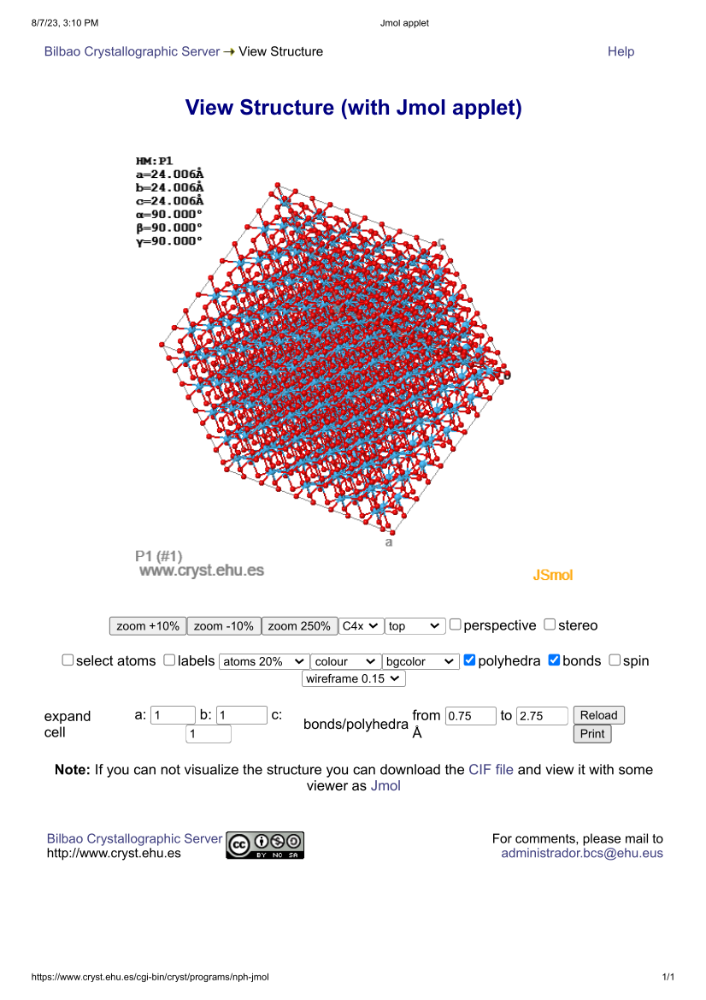

# Internship - Week 7 - Summary

Work with LAMMPS is herein reported, as well as some information about ALPHAFOLD and geometry manipulation tools.

## Solving the LAMMPS parallel calculation problem in the hybrid mode

Since I identified last week what I thought could be a problem when running LAMMPS in the hybrid mode (OpenMP/MPI), comprehensive discussions were held with GJB. The original indication of a problem was a meaningful difference in wall time for specific LAMMPS calculations (official distribution example directory) in the hybrid mode, when the parallel calculation is carried out under the `mpirun lmp -sf omp -pk omp ${OMP_NUM_THREADS} -in in.comb.Cu2O.elastic -l log_2.txt` options, and in comparison with the case in which the specific options have been removed: `mpirun lmp -in in.comb.Cu2O.elastic -l log_2.txt`.

During this week, GJB has provided an extensive description of the "OpenMP racing problem". He suggested this possibility as the most likely source of  wall time discrepancies found for hybrid mode calculations (see week 5 report). Direct inspection of the output files lets us see that different C++ routines are called/run in the hybrid mode when including all the options described in the documentation, as opposed to not using such options. The LAMMPS manual already explains that an explicit subroutine (omp 0) that sets up explicit variables with an extension "omp" in their name is called whenever the `-sf omp` option is utilised, used for pure OpenMP calculations as well. On the other hand, the `-pk` option calls an explicit LAMMPS package. It is fair to say that, in principle, running parallel LAMMPS jobs in the hybrid mode, should strictly follow the LAMMPS manual, and, therefore, the results obtained in the hybrid mode without the appropiate option syntax, must simply be discarded as wrongful!

Still, we decided to seek an explanation for the above. Following GJB's suggestions on the nature of the "OpenMP racing problem", which would involve the appearance of uncertainty in the absolute values of the computed properties as well as on the total wall time, we made the decision of comparing for one specific system, the output of:
 - Sequential calculation.
 - MPI calculation.
 - OpenMP calculation.
 - Hybrid calculation with all the correct submission options (`mpirun lmp -sf omp -pk omp ${OMP_NUM_THREADS} -in in.comb.Cu2O.elastic -l log_2.txt`)
 - Hybrid calculation with no options included (`mpirun lmp -in in.comb.Cu2O.elastic -l log_2.txt`).

Provided our hypothesis had turned out to be correct, including some statistics in the data would have been key to this exercise. Therefore, we have computed ten times each of the above calculations. On the other hand, we decided to pick a specific physical property well known for the dependence of its absolute value on the convergence criteria, ie a second energy derivative, phonons/elastic constants. Located within the examples directory of the LAMMPS distribution ("COMB"), the Cu2O elastic constants problem constitutes the chosen system.

To our surprise, the outcome indicates that the "OpenMP racing problem" has to be discarded as the source of our numerical discrepancies: No statistical variation of the absolute values of the computed elastic constants can be seen at all. Still, we seem to have partly isolated the problem, since, after comparing the elastic constants for all five calculation modes, we find two separate groups of values:

 - Sequential:
 ```
   Elastic constants (GPa):
C11 =    2937.501
C12 =    1552.401
C13 =    1462.783
C14 =     -28.321
C15 =     -34.381
C16 =      -2.030
C33 =    2980.169
C44 =    1509.223
C66 =    1485.259
  B =    1979.012
  G =    1192.555 
 ```
 - MPI:
 ```
 Elastic constants (GPa):
C11 =    2937.501
C12 =    1552.401
C13 =    1462.783
C14 =     -28.321
C15 =     -34.381
C16 =      -2.030
C33 =    2980.169
C44 =    1509.223
C66 =    1485.259
  B =    1979.012
  G =    1192.555
 ```
 - OpenMP
 ```
 Elastic constants (GPa):
C11 =    1483.422
C12 =     805.400
C13 =     767.869
C14 =     -13.036
C15 =     -14.736
C16 =      -1.144
C33 =    1501.464
C44 =     740.086
C66 =     730.685
  B =    1016.731
  G =     583.983
 ```
 - Hybrid under `mpirun lmp -sf omp -pk omp ${OMP_NUM_THREADS} -in in.comb.Cu2O.elastic -l log_2.txt`
 ``` 
  Elastic constants (GPa):
C11 =    1483.422
C12 =     805.400
C13 =     767.869
C14 =     -13.036
C15 =     -14.736
C16 =      -1.144
C33 =    1501.464
C44 =     740.086
C66 =     730.685
  B =    1016.731
  G =     583.983
 ```
- Hybrid with no options: `mpirun lmp -in in.comb.Cu2O.elastic -l log_2.txt`
 ```
 Elastic constants (GPa):
C11 =    2937.501
C12 =    1552.401
C13 =    1462.783
C14 =     -28.321
C15 =     -34.381
C16 =      -2.030
C33 =    2980.169
C44 =    1509.223
C66 =    1485.259
  B =    1979.012
  G =    1192.555
 ```
The standard in parallel computing is that the outcome of the serial calculation is the correct one. Under this condition, two groups of values seem apparent:

 - The correct values are produced when we carry out: 
  1. The sequential calculation,
  1. the MPI calculation,
  1. the hybrid calculation under `mpirun lmp -in in.comb.Cu2O.elastic -l log_2.txt` (no -sf -pk options).

 - Otherwise, wrong values are obtained:
  1. Pure OpenMP calculation, and
  1. hybrid calculation under `mpirun lmp -sf omp -pk omp ${OMP_NUM_THREADS} -in in.comb.Cu2O.elastic -l log_2.txt` (all the options specified in the manual have been included)

At this point, it seems almost irrelevant to discuss calculation timing. For the sake of completeness, the table below shows total wall times (including statistics):
|calculation mode  |sequential |MPI 36     |0penMP 36  |Hybrid-with|Hybrid-no |
|------------------|-----------|-----------|-----------|-----------|----------|
|core configuration|     -     |     -     |     -     | 2pr/18th  | 2pr/18th |
|time (sec) 1      |    480    |    18     |    196    |    223    |   223    |
|time (sec) 2      |    479    |    18     |    141    |    222    |   223    |
|time (sec) 3      |    479    |    18     |    111    |    223    |   224    |
|time (sec) 4      |    479    |    18     |    218    |    218    |   223    |
|time (sec) 5      |    478    |    18     |     88    |    223    |   224    |
|time (sec) 6      |    480    |    18     |    133    |    224    |   223    |
|time (sec) 7      |    480    |    18     |    209    |    218    |   223    |
|time (sec) 8      |    454    |    18     |    229    |    221    |   224    |
|time (sec) 9      |    456    |    18     |    139    |    222    |   221    |
|time (sec) 10     |    468    |    19     |     73    |    221    |   223    | 

Direct inspection of the wall time data seems to indicate that the actual core configuration for hybrid calculations (number of MPI processes/number of OpenMP threads) is far from optimal, considering there is no difference in the timing values between the two hybrid parallel modes. It must be noted that the original indications of a possible problem stemmed from the non-negligible differences in wall time between them. As a matter of fact, going back to the wall time tables in the report of week 5 for the Lennard-Jones fluid hybrid calculations, it is apparent that in terms of timing, the optimal situation corresponds to the smallest possible number of OpenMP threads. Regarding a single node (36 GENIUS cores) calculation, the hybrid mode including all the options described in the manual seems to get the lowest wall time for a core configuration of 18 MPI processes/2 OpenMP threads (162 seconds), while the hybrid mode without those options, gets the lowest wall time value for a 12 MPI processes/3 OpenMP threads configuration (123 seconds). The converse are 143 seconds (18/2 configuration for hybrid mode without options) and 201 seconds (12/3 configuration for hybrid mode with all the options). We must eventually try for our case both configurations, ie 18/2 and 12/3.

On the other hand, we can conclude that there exists a real problem, and it has to do with the accuracy of parallel LAMMPS calculations  whenever OpenMP is introduced. Our conclusion has been reconfirmed by carrying out pure OpenMP calculations on 2 cores and 1 core under the `-sf om` option. The as-provided example (elastic constants of Cu2O within the comb directory) is to be computed and the results submitted to the developers of LAMMPS, in order to look for a solution to our problem. It must be noted that the data above correspond to the same system, although after including a larger number of iterations as to record meaningul wall time values (the exact LAMMPS example has reconfirmed once more our conclusions!).

NOTE: The swift response from the LAMMPS developers is shown below:

> Did some investigation on this:

>> this issue also exists on 2Aug2023 (but really you should check by yourself to see if the newest version already has the bugfix…);

>> there are large difference on c_fx[1] c_fx[2] c_fx[3] c_fx[4] c_fx[5] c_fx[6] (and other directions) between mpi only and OpenMP runs, while the energies are exactly same. So my guess is that the issue lies in the compute stress/atom for comb/omp;

>> there are some changes in the format of log.lammps so that the elastic.f90 does not work out-of-the-box anymore. To workaround this I replaced all " Step Lx" with “Step Lx” in log.lammps before feeding it into that program.

## Running an MPI weak scaling problem: OH adsorbed on graphene deposited on Cu2O(110)

This is one of the LAMMPS provided examples, which has two-dimensional periodicity. The goal is to carry out weak scaling runs similarly to what I had described in the report of week 6 (LAMMPS benchmarks), but this time extending only the surface dimensions: The original 689-atom geometry is extended according to the 4x4, 8x8, 12x12, ... rule, system size (number of atoms) increasing exactly according to the number of MPI cores in the parallel calculation (16, 64, 144, ...). Results follow:

|number MPI cores |     1     |    16     |    64     |   144     |    400    |
|---------------- |-----------|-----------|-----------|-----------|-----------|
|   atom number   |    682    |   10912   |   43648   |   98208   |   272800  |
|surface extension|     -     |   (4x4)   |   (8x8)   |  (12x12)  |  (20x20)  |
|      time/s     |   1284    |   1288    |   1746    |   1781    |    1654   |

## Information gathering and tool testing

### Geometry tools

Both "CIF2CELL" and "atomsk" have been installed and are currently being tested for CIF/XSF/PDB geometry generation, as well as for producing geometries appropriate to the LAMMPS syntax. At the moment, simple geometries and supercells are being built. The latter is very helpful as starting point for point defect geometry generation, for which a specific tool associated to ASE is to be installed and tested shortly. In my experience, both atomsk and CIF2CELL are very helpful when generating a geometry file from scratch and for the subsequent creation of a supercell.

PYMOL and YASARA for visualising PDB files, as well as XCRYSDEN for XSF files have been installed. On the other hand, both the crystal toolkit within the materials project website (materialsproject.org) and the JMOL applet within the Bilbao Crystallographic Server (https://www.cryst.ehu.es/) are used to visualise CIF files. Regarding the latter, it must be noted that some crystal databases contain their own visualisation facility.

Moreover, the inverse process of converting LAMMPS geometry files provided within the examples/benchmark directories of the distribution, to CIF/PDB/XSF geometries for direct visualisation, is being tried in order to identify some of the provided complex systems. Firstly, our attemps with atomsk to convert LAMMPS geometry files (data.*) to a readable format have failed execution. The alternative in LAMMPS is to write out an "xyz" file after running the `lmp` executable under the "dump" directive, to be later converted to CIF format using atomsk. In this case, the CIF2CELL tool has been unable to read the obtained CIF supercell file, although the CIF file sanity has been reassured by the CIF2STANDARD tool within the website https://www.cryst.ehu.es/, where we have at last been able to visualise this specific c-HfO2 supercell geometry (see the picture below).



A general purpose visualisation program called VMD already installed on the GENIUS hpc system, has been run recently. Since all the cases we have tried on GENIUS seem to crash, a ticket needs to be submitted to VSC.

### Geometry databases and specific geometry file acquisition

A list of specific websites with structural databases (and CIF files) for crystalline solids is given next:
 1. The "materials explorer" within materialsproject.org.
 1. The "Crystallography Open Database" (COD): crystallography.net.
 1. BILBAO CRYSTALLOGRAPHY SERVER: https://www.cryst.ehu.es/.
 1. The "Materials Cloud three-dimensional crystals database (MC3D)"
 within materialscloud.org.
 1. nomad-lab.eu

Although no specific structural databases have been located for amorphous solids/glasses, the website of the SIMONS COLLABORATION FOR CRACKING THE GLASS PROBLEM (https://scglass.uchicago.edu/) provides an interesting entry point to the subject. A useful aspect of this source is given by sets of LAMMPS files for specific calculations within glass physics.

Protein structural databases (http://www.rscb.org/ and https://alphafold.ebi.ac.uk/) are probably the best known in Science. They include both proteins in solution and in the crystalline state. The PDB format is the standard in protein geometries. As an example of geometry visualisation, the picture below depitcs the ZFHX4 gene, which is a transient protein for which an initial guess of the structure ("template") is provided at the AlphaFold-EBI database.


There is an interesting aspect of the study of proteins from the point of view of the intern: The physics of hydrated proteins has one point in common with that of glasses, ie the dynamics of both is characterised by the "boson peak", which corresponds to low-frequency phonons in the Terahertz regime, and can be identified experimentally by Raman spectroscopy. Incidentally, the boson peak has been extensively documented in molecular dynamics studies for both proteins in water solutions and for glasses. It is worth mentioning as well the current interest in protein molecular topology and the large-scale computer-aided drug design project VirtualFlow [^1]. Needless to say, the crystalline state of proteins is a manmade enterprise (pharmaceutical industry), whilst proteins in nature only exist in the hydrated state.

The metal-organic framework (MOFs) and covalent organic framework (COFs) databases are mentioned as well, considering this type of material has become a hot topic in materials science (not a comprehensive list):

 - https://mof.tech.northwestern.edu/
 - https://mof-international.org/mof-structures/
 - MOF Explorer within materialsproject.org

Topological materials constitute the last category we consider worth mentioning at this point. Two databases follow:

 - TopoMat within materialscloud.org, and
 - Topological Quantum Chemistry within https://www.cryst.ehu.es/

### AlphaFold

As far as I can tell, the VSC/VIB training material [^2] on AlphaFold is the best of all the material that VSC provides for any software. It constitutes a really good entry point for anyone attempting to run AlphaFold on the GENIUS cluster. On the other hand, there exists an AlphaFold user group in Flanders.
Moreover, the geometry files provided by the AlphaFold-EBI database [^3] are very helpful for computing protein structures and dynamics. Although I have not run any specific case with AlphaFold as yet, I have been looking at some literature and tools for geometry modification. It seems that one of the most common steps in this field goes through the preparation of a hydrated protein structure starting from a CIF file of the crystalline state of the pure protein (PACKMOL and VMD provide such tool). 

[^1]: https://virtual-flow.org/ (the developers claim to have screened with the second version a few billion molecules)
[^2]: https://www.vscentrum.be/alphafold
[^3]: https://alphafold.ebi.ac.uk/
