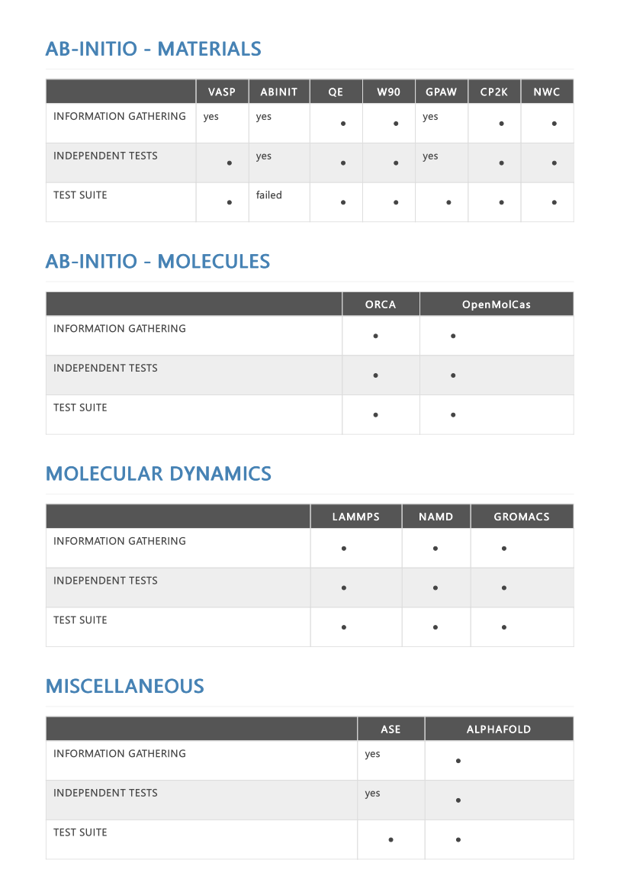

# Week 2: REPORT

Since no specific tasks have been given this week, the intern has devoted his efforts towards the completion of tasks 3, 4 and 5, all set out during week 1. Whilst task 3 involves a long term objective (Ab Initio/MD codes) and is therefore **work in progress**, both tasks 4 (Markdown) and 5 (GitHub/Git) have been **completed**. A full description of the work carried out for all three tasks follows next. 

## Teaching material for Ab Initio and for Molecular Dynamics codes

Leaving aside all codes of interest not yet implemented on Genius, the full list of MD and quantum mechanical first-principles codes already implemented on the HPC is presented in tabular form, alongside information regarding on which of the software packages there has been progress: Information gathering, independent job testing, test suite run. Certainly, knowing that codes run fine for specific jobs is more than enough for most of our purposes. However, running a full battery of tests lets us make sure precision checks with respect to reference outputs, have been carried out (let alone the importance of comprehensive test suites for the intern to remember the full functionality of the packages). Since the *atomic simulation environment* enters both Ab Initio and MD categories (in fact having recently become a fully-fledged high-throughput computational materials science platform), we have decided to include it in this section. Moreover, the OpenMM Molecular Dynamics code is implemented in Genius as part the AlphaFold package, and since no specific module seems to exis as such, we have decided to include them both as a single item. Incidentally, we are not yet at the stage of providing any teaching material: The first step is to ascertain that the codes work.



## Learning Markdown

A sufficient number of documents has been written by the intern with Markdown, including weekly reports and the documents describing the exercises completed for task 5 (GitHub/Git): definitive_day1.md,  definitive_day1contest.md and definitive_day2.md. The intern is slowly increasing the complexity of the Markdown documents (nested lists, images, tables, footnotes) as well as gathering information on (i) an existing online editor for quick typesetting (stackedit.io) and (ii) a Linux editor for conversion to high quality HTML/PDF documents (grip). For future reference, other aspects of Markdown worth looking into include templates/styles (dillinger and the kramdown converter) as well as scientific writing (authorea.com) and linting (markdownlint and markupsafe).

## Learning GitHub/Git

### "Day 1"

After attending a comprehensive trainign session on June 22, 2023 regarding GitHub/Git (a temporary repository "to_remove" with all the produced material was provided), the intern carried out the tutorial "hello_work" located at the GitHub website. During this exercise, and after the creation of a repository with the same name, all the png images corresponding to task 2 (step-by-step description, in the form of screenshots, of the HPC application process at VSC-KU Leuven-ICTS) have been uploaded, therefore completing this part of the task. 

Once the training material Version-control-with-git had been studied by the intern, he carried out the first attempt to reproduce the most basic steps within those described at the repository "to_remove", but this time on the repository "hello_world". As a matter of fact it was a really unfortunate attempt, as described on the document definitive_day1.md. 

Firstly, the global configuration process failed as well as adding a private key. Instead of giving up, I continued by (wrongly) cloning two separate repositories, ie "hellow_world" and "to_remove". I then made the decision of copying the ```.gitignore``` file within "to_remove"  to "hello_world", after which a stage/commit sequence followed. It must be noted that the commit step did indeed fail! (with an error message regarding the need to set up the global configuration!). 

At that point, I managed to properly set up the global configuration, after which I decided to edit and modify the README.md file within "hello_world". I then staged the modified file and proceeded to commit: This time it was successful. However, when I tried ```git push```, the process via password did fail indeed!

### Corrections of the exercise "Day 1"

Following discussions with GJB, he was able to spot the main mistake I incurred upon during the Day 1 exercise: ==an SSH agent has to be set up==. Only after that (see document definitive_day1contest.md) it is possible to add a private key on your Linux system. There was a second mistake spotted by GJB regarding the exercise of Day 1: I had failed in the way I set up the repository cloning stage on the website (the SSH option must be chosen as opposed to the default HTTPS option; the address included in the git clone command must be that proposed by the website as opposed to the main repository website). Since I now have the global configuration properly set up, I am able to add a private key every day to my Linux account, and the cloning is properly set up and carried out, the pushes now work fine.

### "Day 2"

After checking the personal notes taken by the intern regarding the GitHub/Git training session that took place on June 23, 2023 and further studying the Version-control-with-git training material, the intern decided to ask GJB to clarify aspectes of branching. He decided to go through a full training session devoted to *branching*. The produced material was added to the already existing repository "to_remove". This section is a summary of the work carried out as described on the document definitive_day2.md, which sets out to reproduce the steps of the training session devoted to *branching*. ==The full step-by-step procedure was in fact successfully reproduced afterwards==.

The diagram **main**$\rightarrow$**development**$\rightarrow$**feature** describes the structure of the exercise to be followed. In the first place, a new repository named "branchexercisepart1" was created (on the website) containing simply a README.md file. Once the private key had been added on the Linux system and the cloning process had been carried out, the README.md file had some simple modifications. Afterwards a stage/commit sequence was carried out, which was followed by git push. Note that up to this point, a single branch (main) does exist on both website and local Linux system.  

Locally on the Linux system, a new branch named "development" is started from "main". Immediately, from "development", a new feature branch named feature/hello_world is started.
I am inside the feature branch, where the work is to be done: (i) create a hello.f90 fortran file with a simple print statement, and (ii) create a simple makefile (named Makefile) accordingly.
Once I compile-link and run the executable hello.exe successfully, I make the decision of creating/copying from a former repository a .gitignore file in order to avoid executables. Being still on the feature branch, and having now the .gitignore file alongside hello.f90, Makefile and hello.exe, I make the decision of carrying out a sequence stage/commit only for .gitignore.
I make then the decision of keeping (in the future) the .gitignore file on my "development" branch. I switch to development and carry out a push to origin of development (at this point, development only contains the README.md file).

Then, I switch back to feature and carry out a stage/commit sequence on both hello.f90 and Makefile. Immediately, carry out a push to origin of the feature branch, and go to the website to set up a **feature**$\rightarrow$**development** Pull-Request (deleting feature on website). Then, locally switch to development and pull development from origin. From the development branch, create a new feature branch named "feature/bye_world", after which you push the new branch (switching first) to origin. Being on the new feature branch, create a bye.f90 file by modifying the previous hello.f90 file: The print statement is now "bye_world". The makefile (Makefile, keeping the same name), is modified accordingly to compile-link bye.f90. Once compile, link and run (bye.exe) stages have been completed, a sequence stage(bye.f90)/commit (both bye.f90 and the modified Makefile, ie commit -a) is carried out. Immediately, the feature branch feature/bye_world is pushed to origin. Interestingly, the merging **feature**$\rightarrow$**development** is now carried out locally (previousy switch to development), instead of on the website (the feature/hello_world branch was merged onto development on the website!). You could get rid of both local feature branches, and later on of the remote feature/bye_world branch.

The very last few steps follow: (i) Push development to Origin (previous switch ), (ii) set up on the website a **development**$\rightarrow$**main** Pull-Request and carry out the merging (do not delete development), (iii) on the local Linux system switch to main and pull main from remote, and (iv) switch back to development.