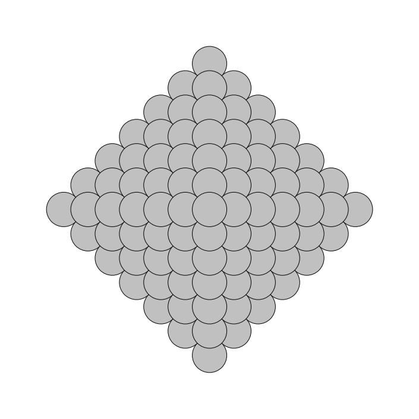
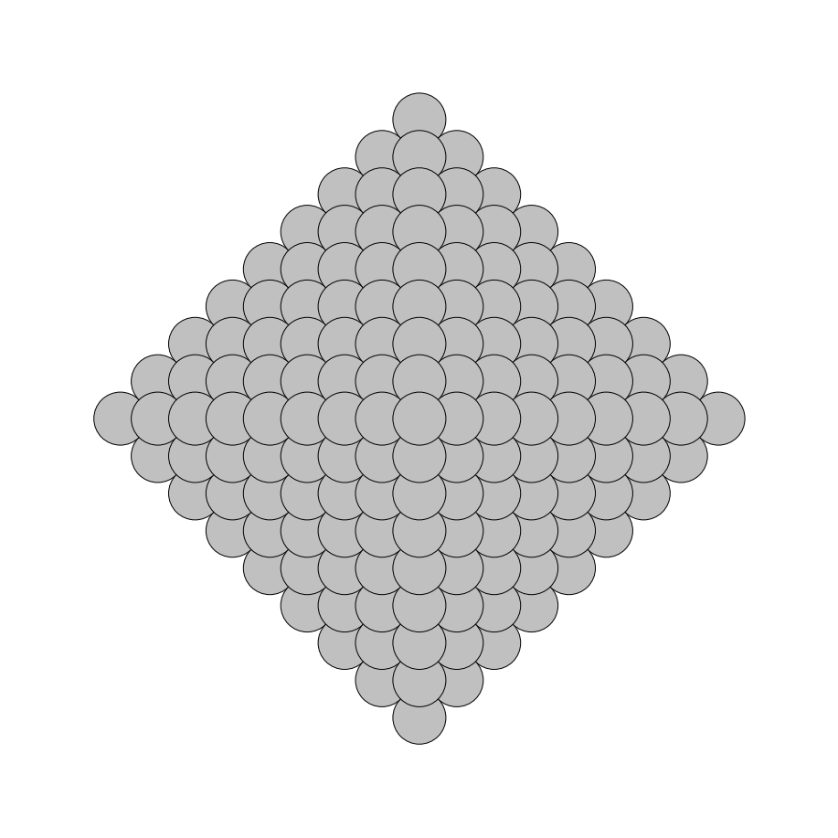
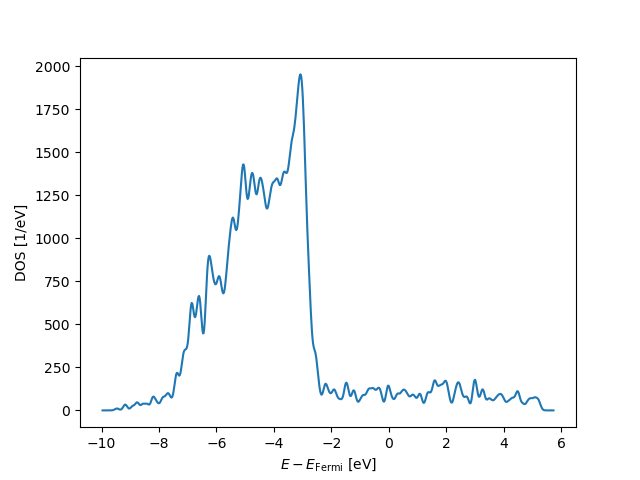

<table>
  <thead>                 <!-- an optional table header -->
    <tr>                  <!-- a header row -->
      <th>Oh NP=5</th>    <!-- a single header cell -->
      <th>Oh NP=6</th>
      <th>Oh NP=7</th>
      <th>Oh NP=8</th>
      <th>Oh NP=9</th>
      <th>Oh NP=10</th>
      <th>Oh NP=11</th>
    </tr>
  </thead>
  <tbody>                 <!-- a table's body -->
    <tr>                  <!-- a table's row -->
      <td></td> <!-- a row's cell -->
      <td></td>
      <td></td>
      <td></td>
      <td></td><
      <td></td>
      <td></td>
    </tr>
    <tr>
      <td></td> <!-- a row's cell -->
      <td></td>
      <td></td>
      <td></td>
      <td></td><
      <td></td>
      <td><></td>
    </tr>
  </tbody>
</table>
