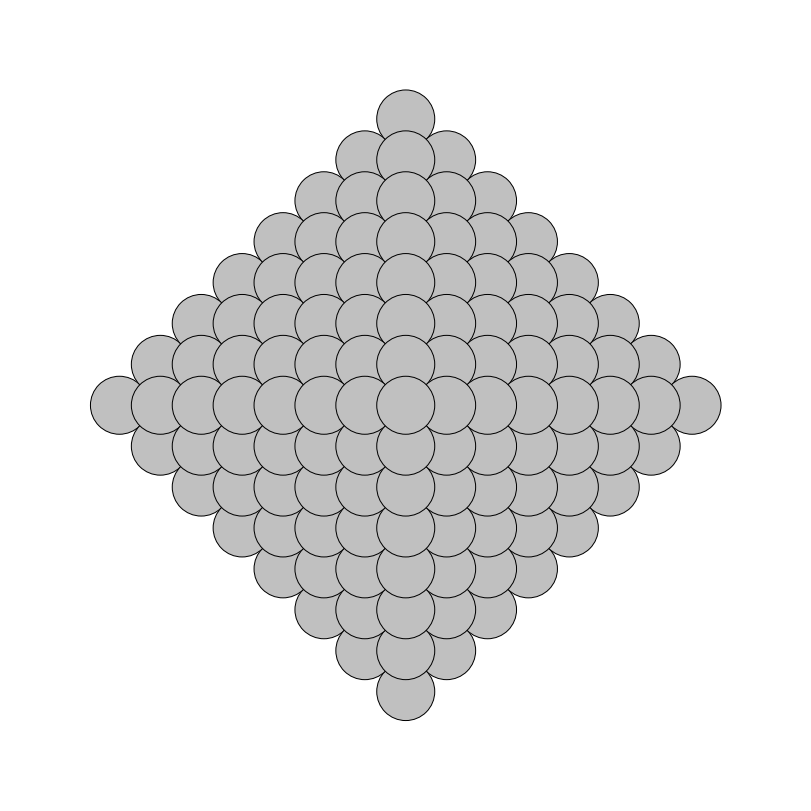
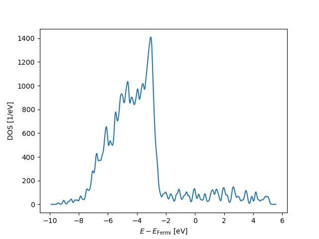

# Ag OCTAHEDRAL NANOPARTICLES - ATOMISTIC GEOMETRIES AND ELECTRONIC DENSITY OF STATES

<table>
  <tr>
    <th>Oh NP=5</th>
    <th>Oh NP=6</th>
    <th>Oh NP=7</th>
    <th>Oh NP=8</th>
    <th>Oh NP=9</th>
    <th>Oh NP=10</th>
    <th>Oh NP=11</th>
  </tr>
  <tr>
    <td></td>
    <td></td>
    <td></td>
    <td></td>
    <td></td>
    <td></td>
    <td></td>
  </tr>
  <tr>
    <td></td>
    <td></td>"
    <td></td>"
    <td></td>"
    <td></td>"
    <td></td>"
    <td></td>"
  </tr>
</table>
