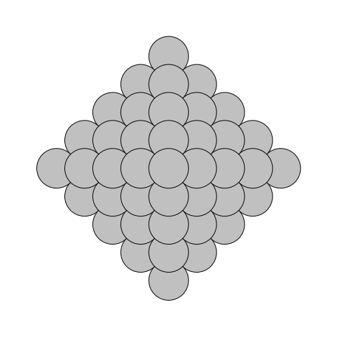
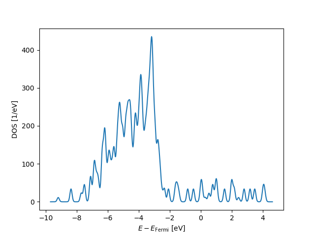
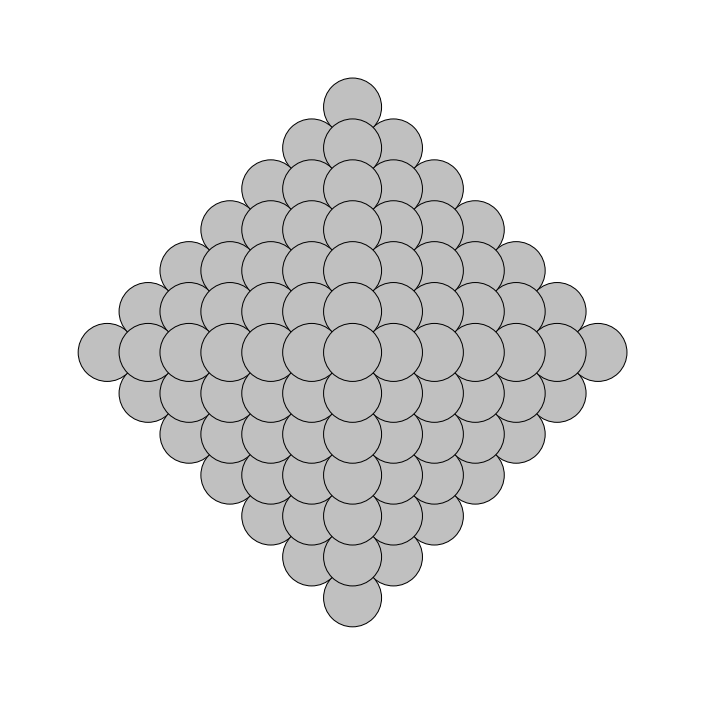
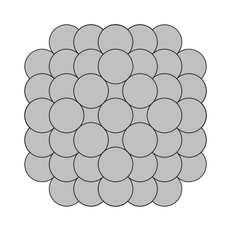
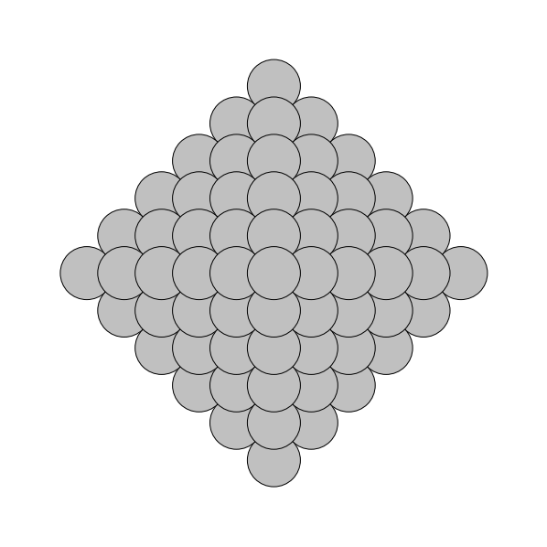
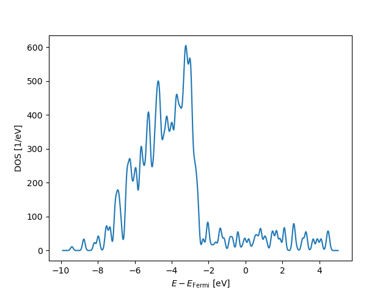
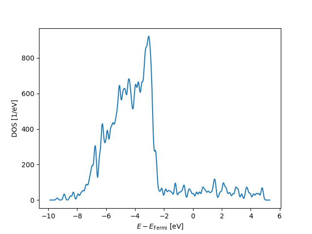
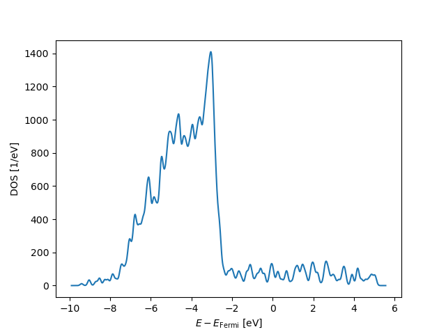

# ATOMISTIC GEOMETRIES AND ELECTRONIC DENSITY OF STATES - Ag octahedral nanoparticles

<table>
  <tr>
    <th>Column 1</th>
    <th>Column 2</th>
  </tr>
  <tr>
    <td></td>
    <td></td>
    <td></td>
    <td></td>
  </tr>
  <tr>
    <td></td>
    <td></td>
    <td></td>
    <td></td>
      </tr>
</table>
