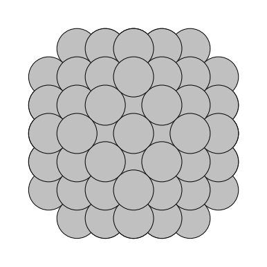
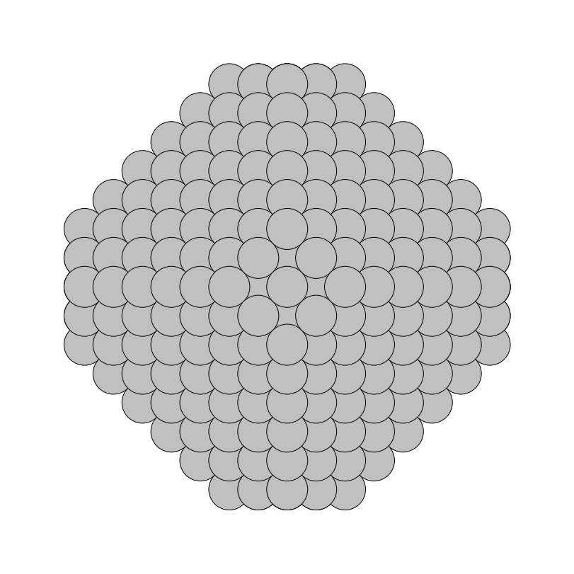
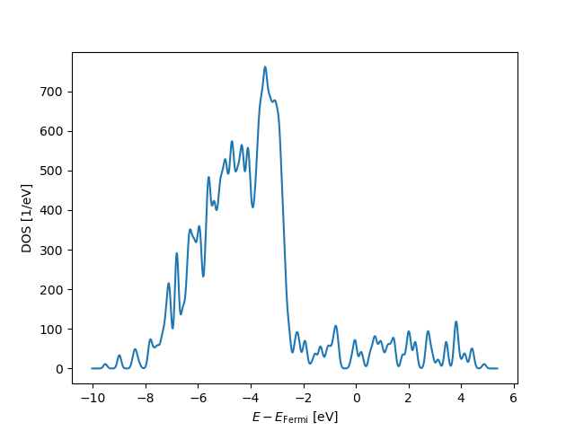
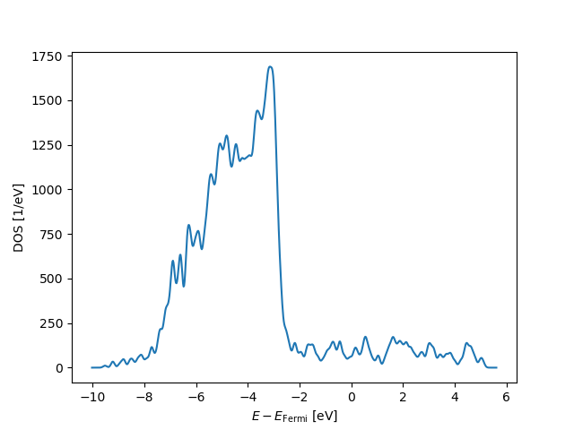
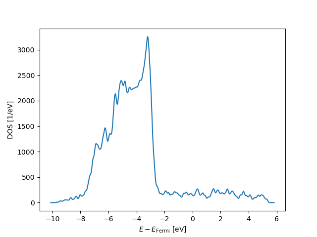

# ATOMISTIC GEOMETRIES AND ELECTRONIC DENSITY OF STATES - Ag octahedral nanoparticles

<table>
  <tr>
    <th>NP=5</th>
    <th>NP=6</th>
    <th>NP=7</th>
    <th>NP=8</th>
    <th>NP=9</th>
    <th>NP=10</th>
    <th>NP=11</th>
  </tr>
  <tr>
    <td></td>
    <td></td>
    <td></td>
    <td></td>
    <td></td>
    <td></td>
    <td></td>   
  </tr>
  <tr>
    <td></td>
    <td></td>
    <td></td>
    <td></td>
    <td></td>
    <td></td>  
    <td></td>
    </tr>
</table>
