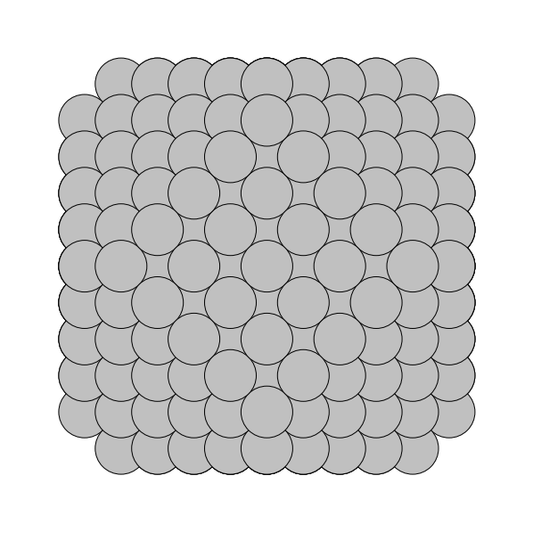
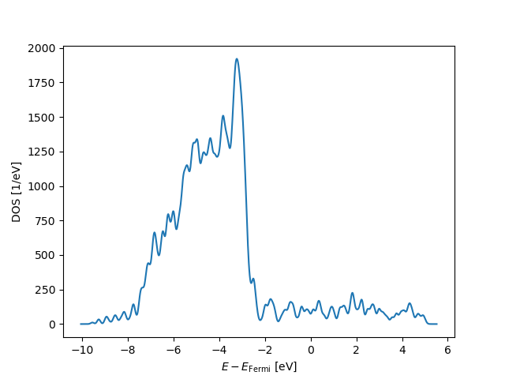

# Ag truncated-octahedra (c=40% of NP)

<table>
  <tr>
    <th></th>
    <th></th>
    <th></th>
    <th></th>
    <th></th>
    <th>NP=10 / NT=4</th>
    <th></th>
  </tr>
  <tr>
    <td></td>
    <td></td>
    <td></td>
    <td></td>
    <td></td>
    <td></td>
    <td></td>   
  </tr>
  <tr>
    <td></td>
    <td></td>
    <td></td>
    <td></td>
    <td></td>
    <td></td>  
    <td></td>
    </tr>
</table>
