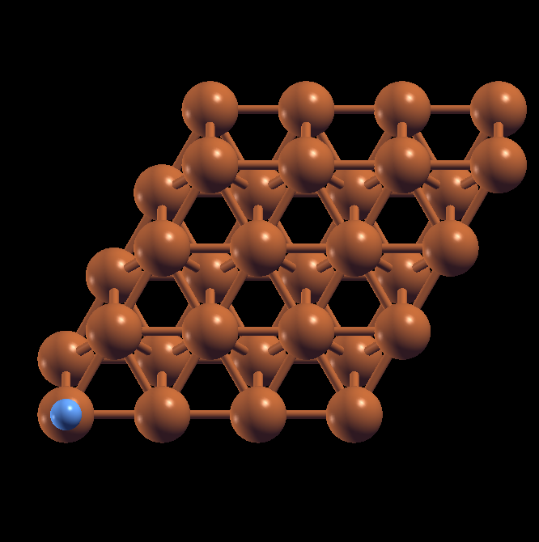

# Internship - Week 10 - Summary

## Atomistic Geometries

The software **CIF2CELL**, **atomsk**, **open babel** and **atomic simulation environment** are utilised for geometry creation, manipulation or conversion. There is an interesting point regarding the graphics with ASE: If you create an XYZ formatted file during ASE total energy calculation and convert it to CIF using "ase convert" (use ASE as a geometry tool, with no total energy calculation), the resulting CIF is *perfectly sanitised* ("standard setting") via CIF2STD (cryst.ehu.es). On the other hand, if you convert the XYZ file produced with ASE using atomsk, the resulting CIF file does not pass the validation test (neither a cell is defined nor a spacegroup). We have tested it on the CIF file producing the picture below (EMT optimisation for (atop) N2 adsorbed on Cu(111)):

 
