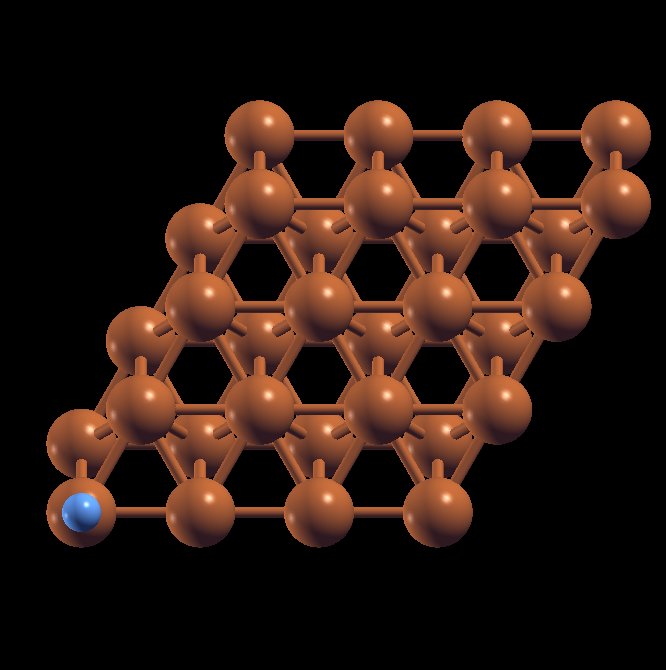

# Internship - Week 10 - Summary

## Atomistic Geometries

The software **CIF2CELL**, **atomsk**, **open babel** and **atomic simulation environment** are applied to the creation of geometry files as well as to their manipulation and conversion. ASE generated geometry files seem to be of "higher quality" than others: If you create an XYZ formatted file during ASE total energy calculation and convert it to the CIF format using "ase convert", the resulting CIF file is *perfectly validated* ("standard setting") by CIF2STD (cryst.ehu.es). On the other hand, if the ASE generated XYZ file, is converted by means of atomsk, the resulting CIF file does not pass the validation test (neither a cell is defined nor a spacegroup). The picture below (EMT optimisation for (atop) N2 adsorbed on Cu(111)) corresponds to the CIF/XYZ files tested above - both CIF and image files have been uploaded to this repository -:

 

On the other hand, the three input file generators materialscloud.org, AFLOW and CIF2CELL are being compared from the point of view of the creation of quantum espresso input files and the particular example of body-centred orthorhombic PdAg2O2. Both conventional 10 atom cell and primitive 5 atom cell are being considered. Further consistency conventional-primitive cell is to be sought with the "spacegroup" tool of ELK [^1] (FP-LAPW code) and with the cryst.ehu.es tools.

It must be noted that the inverse process of extracting geometries from QE outputs as well as converting them to different formats and reconfirming the space group assignment, can be initiated with XCRYSDEN. Incidentally, the latter has the possibility of producing WIEN2K [^2] (a FP-APW+lo code) structure files. Moreover, the same analysis of QE inputs/outputs started with XCRYSDEN is to be tried with "open babel", which, can read QE input/output (PWSCF) files, but not convert files with a different format into PWSCF input format.

A few geometries produced with ASE are discussed next. Since the result of geometry optimisation using empirical potentials is very fast and therfore parallel computation is out of the question for the time being, I have decided to include these as part of the atomistic geometry section. Furthermore, EMT empirical potentials are not reliable in surface chemistry, therefore, the resulting geometries are utlised only as examples for this section (geometry tutorial).

The tutorial cases for both ASE and GPAW are being run, as well as the software extensions WULFPACK and SSCHA. The latter considers calculations of some caliber based on both quantum-espresso and ASE.

### ASE calculations and geometry file generation

Both input and output files are exhibited next, as well as the intermediate/resulting geometry file in either XYZ, PDB or CIF format. Whilst the first case is an example taken directly from the ASE webpage (tutorial), the remaining cases have been generated by the intern.

- N2 adsorption on Cu(111)
```python
from ase import Atoms
from ase.io import write
from ase.calculators.emt import EMT
from ase.constraints import FixAtoms
from ase.optimize import QuasiNewton
from ase.build import fcc111, add_adsorbate

h = 1.85
d = 1.10

slab = fcc111('Cu', size=(4, 4, 2), vacuum=10.0)

slab.calc = EMT()
e_slab = slab.get_potential_energy()

molecule = Atoms('2N', positions=[(0., 0., 0.), (0., 0., d)])
molecule.calc = EMT()
e_N2 = molecule.get_potential_energy()

add_adsorbate(slab, molecule, h, 'ontop')
constraint = FixAtoms(mask=[a.symbol != 'N' for a in slab])
slab.set_constraint(constraint)
dyn = QuasiNewton(slab, trajectory='N2Cu.traj')
dyn.run(fmax=0.05)

print('Adsorption energy:', e_slab + e_N2 - slab.get_potential_energy())
write('slab.xyz', slab)
```
Save this file as N2Cu.py and run it (`python N2Cu.py`). The output file should coincide with:
```
? [Aug/23 12:32] vsc35663@tier2-p-login-1 /data/leuven/356/vsc35663/theplatform/runase/getstarted2
3082023/nobatch/tutoN2cops $ python N2Cu.py
                Step[ FC]     Time          Energy          fmax
*Force-consistent energies used in optimization.
BFGSLineSearch:    0[  0] 12:32:52       11.689927*       1.0797
BFGSLineSearch:    1[  2] 12:32:53       11.670814*       0.4090
BFGSLineSearch:    2[  4] 12:32:53       11.625880*       0.0409
Adsorption energy: 0.3235194223180837
/apps/leuven/skylake/2021a/software/ASE/3.22.0-intel-2021a/lib/python3.9/site-packages/ase/io/extxyz.py:302: UserWarning: Skipping unhashable information adsorbate_info
  warnings.warn('Skipping unhashable information '
```
and the geometry file with:
```
34
Lattice="10.210621920333747 0.0 0.0 5.105310960166873 8.842657971447272 0.0 0.0 0.0 22.08423447177455" Properties=species:S:1:pos:R:3:tags:I:1:forces:R:3:energies:R:1 energy=11.625880434287913 free_energy=11.625880434287913 pbc="T T F"
Cu      -0.00000000       1.47377633      10.00000000        2       0.00000000       0.00438413       0.15454687       0.35957378
Cu       2.55265548       1.47377633      10.00000000        2       0.00024989       0.00014427       0.16027800       0.35963899
Cu       5.10531096       1.47377633      10.00000000        2       0.00000000       0.00000564       0.16066385       0.35965801
Cu       7.65796644       1.47377633      10.00000000        2      -0.00024989       0.00014427       0.16027800       0.35963899
Cu       1.27632774       3.68444082      10.00000000        2       0.00001583       0.00015883       0.16047543       0.35965801
Cu       3.82898322       3.68444082      10.00000000        2       0.00000489      -0.00000282       0.16066385       0.35965801
Cu       6.38163870       3.68444082      10.00000000        2      -0.00000489      -0.00000282       0.16066385       0.35965801
Cu       8.93429418       3.68444082      10.00000000        2      -0.00001583       0.00015883       0.16047543       0.35965801
Cu       2.55265548       5.89510531      10.00000000        2      -0.00012964      -0.00009312       0.16047543       0.35965801
Cu       5.10531096       5.89510531      10.00000000        2       0.00000000      -0.00028854       0.16027800       0.35963899
Cu       7.65796644       5.89510531      10.00000000        2       0.00012964      -0.00009312       0.16047543       0.35965801
Cu      10.21062192       5.89510531      10.00000000        2      -0.00000000       0.00000000       0.16067097       0.35965801
Cu       3.82898322       8.10576981      10.00000000        2      -0.00379677      -0.00219206       0.15454687       0.35957378
Cu       6.38163870       8.10576981      10.00000000        2       0.00379677      -0.00219206       0.15454687       0.35957378
Cu       8.93429418       8.10576981      10.00000000        2       0.00014547      -0.00006571       0.16047543       0.35965801
Cu      11.48694966       8.10576981      10.00000000        2      -0.00014547      -0.00006571       0.16047543       0.35965801
Cu       0.00000000       0.00000000      12.08423447        1       0.00000000      -0.00000000      -0.17465494       0.53063928
Cu       2.55265548       0.00000000      12.08423447        1      -0.00593160       0.00000127      -0.14712396       0.36036409
Cu       5.10531096       0.00000000      12.08423447        1       0.00000000      -0.00000002      -0.16066081       0.35965751
Cu       7.65796644       0.00000000      12.08423447        1       0.00593160       0.00000127      -0.14712396       0.36036409
Cu       1.27632774       2.21066449      12.08423447        1      -0.00296470      -0.00513755      -0.14712396       0.36036409
Cu       3.82898322       2.21066449      12.08423447        1      -0.00003207      -0.00001851      -0.16042538       0.35962410
Cu       6.38163870       2.21066449      12.08423447        1       0.00003207      -0.00001851      -0.16042538       0.35962410
Cu       8.93429418       2.21066449      12.08423447        1       0.00296470      -0.00513755      -0.14712396       0.36036409
Cu       2.55265548       4.42132899      12.08423447        1      -0.00000001       0.00000001      -0.16066081       0.35965751
Cu       5.10531096       4.42132899      12.08423447        1       0.00000000       0.00003703      -0.16042538       0.35962410
Cu       7.65796644       4.42132899      12.08423447        1       0.00000001       0.00000001      -0.16066081       0.35965751
Cu      10.21062192       4.42132899      12.08423447        1      -0.00000000      -0.00003728      -0.16042585       0.35962410
Cu       3.82898322       6.63199348      12.08423447        1       0.00296690       0.00513628      -0.14712396       0.36036409
Cu       6.38163870       6.63199348      12.08423447        1      -0.00296690       0.00513628      -0.14712396       0.36036409
Cu       8.93429418       6.63199348      12.08423447        1      -0.00003228       0.00001864      -0.16042585       0.35962410
Cu      11.48694966       6.63199348      12.08423447        1       0.00003228       0.00001864      -0.16042585       0.35962410
N       -0.00000000       0.00000000      14.17087660        0      -0.00000000      -0.00000000      -0.00715306      -0.18324354
N        0.00000000       0.00000000      15.21541878        0       0.00000000      -0.00000000      -0.04090179       0.12536463
```
- H2O adsorption on Ag(111)
```python
from ase import Atoms
from ase.io import write
from ase.calculators.emt import EMT
from ase.optimize import QuasiNewton
from ase.build import fcc111, root_surface, add_adsorbate
import numpy as np
h = 1.85
d = 0.9575
ang = 104.51
t = np.pi / 180 * ang
water = Atoms('H2O',
              positions=[(d, 0, 0),
                         (d * np.cos(t), d * np.sin(t), 0),
                         (0, 0, 0)]
)

slab = fcc111('Ag', (1, 1, 3), vacuum=15.0)
slab = root_surface(slab, 27)

slab.calc = EMT()
e_slab = slab.get_potential_energy()

water.calc = EMT()
e_H2O = water.get_potential_energy()

add_adsorbate(slab, water, h, 'ontop')

dyn = QuasiNewton(slab, trajectory='H2OAg.traj')
dyn.run(fmax=0.001)

print('Adsorption energy:', e_slab + e_H2O - slab.get_potential_energy()
)
write('slab.xyz', slab)
```
```
? [Aug/27 15:17] vsc35663@tier2-p-login-1 /data/leuven/356/vsc35663/theplatform/runase/surfaceANDs
upercellINFO/run7Ag111root3H2Oallop $ python fulloptimisation.py
                Step[ FC]     Time          Energy          fmax
*Force-consistent energies used in optimization.
BFGSLineSearch:    0[  0] 15:17:54       20.355271*      19.8115
BFGSLineSearch:    1[  1] 15:17:54       14.687239*       3.7463
BFGSLineSearch:    2[  2] 15:17:54       13.949524*       2.7261
BFGSLineSearch:    3[  4] 15:17:54       13.730251*       1.2570
BFGSLineSearch:    4[  5] 15:17:55       13.635519*       0.5522
BFGSLineSearch:    5[  7] 15:17:55       13.590297*       0.2671
BFGSLineSearch:    6[  9] 15:17:55       13.575459*       0.2840
BFGSLineSearch:    7[ 11] 15:17:55       13.557591*       0.1164
BFGSLineSearch:    8[ 13] 15:17:55       13.550180*       0.0801
BFGSLineSearch:    9[ 15] 15:17:55       13.545582*       0.0787
BFGSLineSearch:   10[ 17] 15:17:56       13.542570*       0.0761
BFGSLineSearch:   11[ 19] 15:17:56       13.540112*       0.0592
BFGSLineSearch:   12[ 21] 15:17:56       13.538418*       0.1268
BFGSLineSearch:   13[ 23] 15:17:56       13.534474*       0.0855
BFGSLineSearch:   14[ 25] 15:17:56       13.528724*       0.0962
BFGSLineSearch:   15[ 26] 15:17:56       13.525322*       0.0587
BFGSLineSearch:   16[ 27] 15:17:56       13.521894*       0.0453
BFGSLineSearch:   17[ 28] 15:17:56       13.520019*       0.0308
BFGSLineSearch:   18[ 29] 15:17:56       13.518749*       0.0319
BFGSLineSearch:   19[ 30] 15:17:57       13.517754*       0.0344
BFGSLineSearch:   20[ 31] 15:17:57       13.517162*       0.0344
BFGSLineSearch:   21[ 32] 15:17:57       13.516709*       0.0339
BFGSLineSearch:   22[ 33] 15:17:57       13.516307*       0.0305
BFGSLineSearch:   23[ 34] 15:17:57       13.515927*       0.0274
BFGSLineSearch:   24[ 35] 15:17:57       13.515594*       0.0229
BFGSLineSearch:   25[ 36] 15:17:57       13.515320*       0.0204
BFGSLineSearch:   26[ 37] 15:17:57       13.515105*       0.0171
BFGSLineSearch:   27[ 38] 15:17:57       13.514938*       0.0159
BFGSLineSearch:   28[ 39] 15:17:57       13.514806*       0.0129
BFGSLineSearch:   29[ 40] 15:17:57       13.514700*       0.0117
BFGSLineSearch:   30[ 41] 15:17:57       13.514617*       0.0083
BFGSLineSearch:   31[ 42] 15:17:58       13.514555*       0.0067
BFGSLineSearch:   32[ 43] 15:17:58       13.514508*       0.0055
BFGSLineSearch:   33[ 44] 15:17:58       13.514469*       0.0056
BFGSLineSearch:   34[ 46] 15:17:58       13.514422*       0.0058
BFGSLineSearch:   35[ 48] 15:17:58       13.514349*       0.0057
BFGSLineSearch:   36[ 50] 15:17:58       13.514297*       0.0078
BFGSLineSearch:   37[ 52] 15:17:58       13.514259*       0.0044
BFGSLineSearch:   38[ 54] 15:17:58       13.514225*       0.0041
BFGSLineSearch:   39[ 56] 15:17:59       13.514198*       0.0043
BFGSLineSearch:   40[ 58] 15:17:59       13.514179*       0.0031
BFGSLineSearch:   41[ 60] 15:17:59       13.514168*       0.0032
BFGSLineSearch:   42[ 62] 15:17:59       13.514159*       0.0015
BFGSLineSearch:   43[ 64] 15:17:59       13.514153*       0.0016
BFGSLineSearch:   44[ 66] 15:17:59       13.514149*       0.0021
BFGSLineSearch:   45[ 68] 15:18:00       13.514146*       0.0014
BFGSLineSearch:   46[ 70] 15:18:00       13.514144*       0.0014
BFGSLineSearch:   47[ 72] 15:18:00       13.514142*       0.0012
BFGSLineSearch:   48[ 74] 15:18:00       13.514140*       0.0013
BFGSLineSearch:   49[ 76] 15:18:00       13.514139*       0.0012
BFGSLineSearch:   50[ 78] 15:18:00       13.514136*       0.0015
BFGSLineSearch:   51[ 80] 15:18:01       13.514129*       0.0014
BFGSLineSearch:   52[ 82] 15:18:01       13.514117*       0.0029
BFGSLineSearch:   53[ 84] 15:18:01       13.514101*       0.0027
BFGSLineSearch:   54[ 86] 15:18:01       13.514093*       0.0045
BFGSLineSearch:   55[ 87] 15:18:01       13.514090*       0.0011
BFGSLineSearch:   56[ 88] 15:18:01       13.514087*       0.0015
BFGSLineSearch:   57[ 89] 15:18:01       13.514086*       0.0013
BFGSLineSearch:   58[ 90] 15:18:01       13.514084*       0.0008
Adsorption energy: 2.8896868239121503
/apps/leuven/skylake/2021a/software/ASE/3.22.0-intel-2021a/lib/python3.9/site-packages/ase/io/extxyz.py:302: UserWarning: Skipping unhashable information adsorbate_info
  warnings.warn('Skipping unhashable information '
```
```
data_image0
_chemical_formula_structural       Ag81H2O
_chemical_formula_sum              "Ag81 H2 O1"
_cell_length_a       15.0276
_cell_length_b       15.0276
_cell_length_c       34.7227
_cell_angle_alpha    90
_cell_angle_beta     90
_cell_angle_gamma    60

_space_group_name_H-M_alt    "P 1"
_space_group_IT_number       1

loop_
  _space_group_symop_operation_xyz
  'x, y, z'

loop_
  _atom_site_type_symbol
  _atom_site_label
  _atom_site_symmetry_multiplicity
  _atom_site_fract_x
  _atom_site_fract_y
  _atom_site_fract_z
  _atom_site_occupancy
  Ag  Ag1       1.0  0.00122  0.88824  0.43359  1.0000
  Ag  Ag2       1.0  0.11234  0.99937  0.43357  1.0000
  Ag  Ag3       1.0  0.00123  0.55494  0.43362  1.0000
  Ag  Ag4       1.0  0.11235  0.66603  0.43361  1.0000
  Ag  Ag5       1.0  0.00127  0.77712  0.50008  1.0000
  Ag  Ag6       1.0  0.22349  0.77710  0.43357  1.0000
  Ag  Ag7       1.0  0.11245  0.88816  0.50000  1.0000
  Ag  Ag8       1.0  0.11230  0.77725  0.56658  1.0000
  Ag  Ag9       1.0  0.33454  0.88827  0.43360  1.0000
  Ag  Ag10      1.0  0.22359  0.88820  0.56653  1.0000
  Ag  Ag11      1.0  0.44564  0.99939  0.43360  1.0000
  Ag  Ag12      1.0  0.00121  0.22165  0.43358  1.0000
  Ag  Ag13      1.0  0.11232  0.33273  0.43361  1.0000
  Ag  Ag14      1.0  0.00124  0.44382  0.50008  1.0000
  Ag  Ag15      1.0  0.22347  0.44382  0.43361  1.0000
  Ag  Ag16      1.0  0.11238  0.55491  0.50007  1.0000
  Ag  Ag17      1.0  0.11237  0.44379  0.56654  1.0000
  Ag  Ag18      1.0  0.33458  0.55492  0.43361  1.0000
  Ag  Ag19      1.0  0.22346  0.66605  0.50008  1.0000
  Ag  Ag20      1.0  0.22346  0.55496  0.56654  1.0000
  Ag  Ag21      1.0  0.44570  0.66603  0.43359  1.0000
  Ag  Ag22      1.0  0.33460  0.77713  0.50005  1.0000
  Ag  Ag23      1.0  0.33457  0.66605  0.56653  1.0000
  Ag  Ag24      1.0  0.55677  0.77716  0.43360  1.0000
  Ag  Ag25      1.0  0.44566  0.88827  0.50006  1.0000
  Ag  Ag26      1.0  0.44571  0.77714  0.56652  1.0000
  Ag  Ag27      1.0  0.66787  0.88827  0.43360  1.0000
  Ag  Ag28      1.0  0.55678  0.88826  0.56653  1.0000
  Ag  Ag29      1.0  0.77897  0.99937  0.43360  1.0000
  Ag  Ag30      1.0  0.00124  0.11058  0.49999  1.0000
  Ag  Ag31      1.0  0.22342  0.11050  0.43361  1.0000
  Ag  Ag32      1.0  0.11234  0.22162  0.50007  1.0000
  Ag  Ag33      1.0  0.11236  0.11054  0.56656  1.0000
  Ag  Ag34      1.0  0.33453  0.22161  0.43359  1.0000
  Ag  Ag35      1.0  0.22345  0.33271  0.50007  1.0000
  Ag  Ag36      1.0  0.22347  0.22160  0.56653  1.0000
  Ag  Ag37      1.0  0.44569  0.33271  0.43361  1.0000
  Ag  Ag38      1.0  0.33458  0.44382  0.50007  1.0000
  Ag  Ag39      1.0  0.33453  0.33275  0.56653  1.0000
  Ag  Ag40      1.0  0.55681  0.44381  0.43361  1.0000
  Ag  Ag41      1.0  0.44570  0.55493  0.50007  1.0000
  Ag  Ag42      1.0  0.44567  0.44385  0.56654  1.0000
  Ag  Ag43      1.0  0.66791  0.55494  0.43361  1.0000
  Ag  Ag44      1.0  0.55680  0.66603  0.50006  1.0000
  Ag  Ag45      1.0  0.55680  0.55494  0.56653  1.0000
  Ag  Ag46      1.0  0.77901  0.66605  0.43362  1.0000
  Ag  Ag47      1.0  0.66787  0.77715  0.50007  1.0000
  Ag  Ag48      1.0  0.66790  0.66601  0.56654  1.0000
  Ag  Ag49      1.0  0.89011  0.77716  0.43362  1.0000
  Ag  Ag50      1.0  0.77897  0.88826  0.50007  1.0000
  Ag  Ag51      1.0  0.77895  0.77707  0.56654  1.0000
  Ag  Ag52      1.0  0.89015  0.88809  0.56664  1.0000
  Ag  Ag53      1.0  0.22342  0.99939  0.50007  1.0000
  Ag  Ag54      1.0  0.33455  0.11049  0.50006  1.0000
  Ag  Ag55      1.0  0.33458  0.99938  0.56653  1.0000
  Ag  Ag56      1.0  0.55674  0.11049  0.43358  1.0000
  Ag  Ag57      1.0  0.44563  0.22161  0.50005  1.0000
  Ag  Ag58      1.0  0.44567  0.11049  0.56652  1.0000
  Ag  Ag59      1.0  0.66789  0.22160  0.43360  1.0000
  Ag  Ag60      1.0  0.55681  0.33271  0.50007  1.0000
  Ag  Ag61      1.0  0.55660  0.22170  0.56652  1.0000
  Ag  Ag62      1.0  0.77902  0.33272  0.43360  1.0000
  Ag  Ag63      1.0  0.66792  0.44383  0.50007  1.0000
  Ag  Ag64      1.0  0.66791  0.33278  0.56655  1.0000
  Ag  Ag65      1.0  0.89012  0.44384  0.43362  1.0000
  Ag  Ag66      1.0  0.77902  0.55493  0.50008  1.0000
  Ag  Ag67      1.0  0.77905  0.44378  0.56655  1.0000
  Ag  Ag68      1.0  0.89013  0.66603  0.50008  1.0000
  Ag  Ag69      1.0  0.89013  0.55489  0.56655  1.0000
  Ag  Ag70      1.0  0.00131  0.66590  0.56654  1.0000
  Ag  Ag71      1.0  0.55678  0.99938  0.50007  1.0000
  Ag  Ag72      1.0  0.66780  0.11050  0.50004  1.0000
  Ag  Ag73      1.0  0.66791  0.99937  0.56657  1.0000
  Ag  Ag74      1.0  0.89010  0.11048  0.43358  1.0000
  Ag  Ag75      1.0  0.77902  0.22164  0.50005  1.0000
  Ag  Ag76      1.0  0.77869  0.11073  0.56653  1.0000
  Ag  Ag77      1.0  0.89013  0.33271  0.50008  1.0000
  Ag  Ag78      1.0  0.89021  0.22150  0.56655  1.0000
  Ag  Ag79      1.0  0.00125  0.33269  0.56655  1.0000
  Ag  Ag80      1.0  0.89007  0.99936  0.50005  1.0000
  Ag  Ag81      1.0  0.00152  0.99942  0.56638  1.0000
  H   H1        1.0  0.97478  0.02584  0.62792  1.0000
  H   H2        1.0  0.87991  0.11985  0.61854  1.0000
  O   O1        1.0  0.89033  0.99984  0.61199  1.0000
```
which is a CIF file produced after transforming the resulting XYZ file (`ase convert slab.xyz slab.cif`).

- CH3CH2OH adsorption on Pt(211)
 
The experimental geometry of the free molecule is now directly obtained from the ASE database. In a first step, the ethanol molecule CIF file is generated. The second one reads the latter, generates the metal surface slab, and adsorbs the molecule on the surface, before optimisation:
```python
from ase.build import molecule
from ase.io import write
ethl = molecule('CH3CH2OH')
write('ethl.pdb', ethl)
```
Save this file as direct.py and run it (`python direct.py`). The PDB file is read next and processed:
```python


```
```
data_image0
_chemical_formula_structural       Pt108C2OH6
_chemical_formula_sum              "Pt108 C2 O1 H6"
_cell_length_a       6.78964
_cell_length_b       8.31558
_cell_length_c       58.0058
_cell_angle_alpha    90
_cell_angle_beta     90
_cell_angle_gamma    90

_space_group_name_H-M_alt    "P 1"
_space_group_IT_number       1

loop_
  _space_group_symop_operation_xyz
  'x, y, z'

loop_
  _atom_site_type_symbol
  _atom_site_label
  _atom_site_symmetry_multiplicity
  _atom_site_fract_x
  _atom_site_fract_y
  _atom_site_fract_z
  _atom_site_occupancy
  Pt  Pt1       1.0  0.65912  0.16293  0.74100  1.0000
  Pt  Pt2       1.0  0.65993  0.49601  0.74069  1.0000
  Pt  Pt3       1.0  0.66068  0.82820  0.74077  1.0000
  Pt  Pt4       1.0  0.33430  0.99562  0.72865  1.0000
  Pt  Pt5       1.0  0.33442  0.32971  0.72863  1.0000
  Pt  Pt6       1.0  0.33556  0.66256  0.72865  1.0000
  Pt  Pt7       1.0  0.00257  0.16225  0.71551  1.0000
  Pt  Pt8       1.0  0.00221  0.49680  0.71573  1.0000
  Pt  Pt9       1.0  0.00224  0.82846  0.71556  1.0000
  Pt  Pt10      1.0  0.66975  0.99583  0.70144  1.0000
  Pt  Pt11      1.0  0.66990  0.32915  0.70141  1.0000
  Pt  Pt12      1.0  0.66943  0.66237  0.70125  1.0000
  Pt  Pt13      1.0  0.33463  0.16254  0.68803  1.0000
  Pt  Pt14      1.0  0.33401  0.49577  0.68807  1.0000
  Pt  Pt15      1.0  0.33422  0.82921  0.68803  1.0000
  Pt  Pt16      1.0  0.00218  0.99568  0.67423  1.0000
  Pt  Pt17      1.0  0.00220  0.32934  0.67427  1.0000
  Pt  Pt18      1.0  0.00223  0.66234  0.67423  1.0000
  Pt  Pt19      1.0  0.66857  0.16244  0.66003  1.0000
  Pt  Pt20      1.0  0.66838  0.49563  0.65998  1.0000
  Pt  Pt21      1.0  0.66849  0.82926  0.65999  1.0000
  Pt  Pt22      1.0  0.33490  0.99579  0.64646  1.0000
  Pt  Pt23      1.0  0.33483  0.32908  0.64647  1.0000
  Pt  Pt24      1.0  0.33492  0.66242  0.64647  1.0000
  Pt  Pt25      1.0  0.00183  0.16243  0.63268  1.0000
  Pt  Pt26      1.0  0.00186  0.49571  0.63267  1.0000
  Pt  Pt27      1.0  0.00190  0.82905  0.63266  1.0000
  Pt  Pt28      1.0  0.66833  0.99576  0.61871  1.0000
  Pt  Pt29      1.0  0.66831  0.32901  0.61871  1.0000
  Pt  Pt30      1.0  0.66833  0.66239  0.61870  1.0000
  Pt  Pt31      1.0  0.33476  0.16236  0.60502  1.0000
  Pt  Pt32      1.0  0.33482  0.49569  0.60502  1.0000
  Pt  Pt33      1.0  0.33480  0.82902  0.60501  1.0000
  Pt  Pt34      1.0  0.00156  0.99569  0.59120  1.0000
  Pt  Pt35      1.0  0.00158  0.32899  0.59120  1.0000
  Pt  Pt36      1.0  0.00160  0.66232  0.59120  1.0000
  Pt  Pt37      1.0  0.66810  0.16233  0.57732  1.0000
  Pt  Pt38      1.0  0.66814  0.49566  0.57732  1.0000
  Pt  Pt39      1.0  0.66813  0.82900  0.57733  1.0000
  Pt  Pt40      1.0  0.33471  0.99564  0.56357  1.0000
  Pt  Pt41      1.0  0.33472  0.32897  0.56357  1.0000
  Pt  Pt42      1.0  0.33476  0.66230  0.56357  1.0000
  Pt  Pt43      1.0  0.00144  0.16229  0.54976  1.0000
  Pt  Pt44      1.0  0.00145  0.49562  0.54976  1.0000
  Pt  Pt45      1.0  0.00145  0.82895  0.54976  1.0000
  Pt  Pt46      1.0  0.66804  0.99560  0.53592  1.0000
  Pt  Pt47      1.0  0.66803  0.32892  0.53592  1.0000
  Pt  Pt48      1.0  0.66806  0.66227  0.53591  1.0000
  Pt  Pt49      1.0  0.33468  0.16221  0.52213  1.0000
  Pt  Pt50      1.0  0.33469  0.49555  0.52213  1.0000
  Pt  Pt51      1.0  0.33470  0.82889  0.52213  1.0000
  Pt  Pt52      1.0  0.00133  0.99554  0.50833  1.0000
  Pt  Pt53      1.0  0.00132  0.32888  0.50833  1.0000
  Pt  Pt54      1.0  0.00134  0.66222  0.50833  1.0000
  Pt  Pt55      1.0  0.66790  0.16219  0.49449  1.0000
  Pt  Pt56      1.0  0.66791  0.49553  0.49449  1.0000
  Pt  Pt57      1.0  0.66792  0.82887  0.49449  1.0000
  Pt  Pt58      1.0  0.33456  0.99549  0.48069  1.0000
  Pt  Pt59      1.0  0.33457  0.32883  0.48069  1.0000
  Pt  Pt60      1.0  0.33456  0.66216  0.48069  1.0000
  Pt  Pt61      1.0  0.00117  0.16218  0.46692  1.0000
  Pt  Pt62      1.0  0.00115  0.49552  0.46691  1.0000
  Pt  Pt63      1.0  0.00116  0.82885  0.46691  1.0000
  Pt  Pt64      1.0  0.66773  0.99550  0.45305  1.0000
  Pt  Pt65      1.0  0.66772  0.32882  0.45306  1.0000
  Pt  Pt66      1.0  0.66771  0.66216  0.45306  1.0000
  Pt  Pt67      1.0  0.33446  0.16216  0.43925  1.0000
  Pt  Pt68      1.0  0.33445  0.49549  0.43925  1.0000
  Pt  Pt69      1.0  0.33446  0.82882  0.43925  1.0000
  Pt  Pt70      1.0  0.00102  0.99552  0.42551  1.0000
  Pt  Pt71      1.0  0.00100  0.32884  0.42552  1.0000
  Pt  Pt72      1.0  0.00101  0.66217  0.42551  1.0000
  Pt  Pt73      1.0  0.66755  0.16216  0.41160  1.0000
  Pt  Pt74      1.0  0.66754  0.49550  0.41160  1.0000
  Pt  Pt75      1.0  0.66757  0.82883  0.41160  1.0000
  Pt  Pt76      1.0  0.33447  0.99551  0.39780  1.0000
  Pt  Pt77      1.0  0.33445  0.32884  0.39780  1.0000
  Pt  Pt78      1.0  0.33446  0.66218  0.39780  1.0000
  Pt  Pt79      1.0  0.00087  0.16218  0.38415  1.0000
  Pt  Pt80      1.0  0.00085  0.49552  0.38416  1.0000
  Pt  Pt81      1.0  0.00087  0.82885  0.38415  1.0000
  Pt  Pt82      1.0  0.66736  0.99553  0.37010  1.0000
  Pt  Pt83      1.0  0.66736  0.32886  0.37010  1.0000
  Pt  Pt84      1.0  0.66736  0.66219  0.37010  1.0000
  Pt  Pt85      1.0  0.33455  0.16223  0.35636  1.0000
  Pt  Pt86      1.0  0.33455  0.49556  0.35636  1.0000
  Pt  Pt87      1.0  0.33454  0.82889  0.35636  1.0000
  Pt  Pt88      1.0  0.00078  0.99557  0.34291  1.0000
  Pt  Pt89      1.0  0.00080  0.32891  0.34291  1.0000
  Pt  Pt90      1.0  0.00077  0.66223  0.34291  1.0000
  Pt  Pt91      1.0  0.66704  0.16226  0.32844  1.0000
  Pt  Pt92      1.0  0.66704  0.49557  0.32844  1.0000
  Pt  Pt93      1.0  0.66703  0.82892  0.32844  1.0000
  Pt  Pt94      1.0  0.33553  0.99561  0.31480  1.0000
  Pt  Pt95      1.0  0.33556  0.32895  0.31480  1.0000
  Pt  Pt96      1.0  0.33553  0.66228  0.31480  1.0000
  Pt  Pt97      1.0  0.99928  0.16228  0.30163  1.0000
  Pt  Pt98      1.0  0.99929  0.49561  0.30163  1.0000
  Pt  Pt99      1.0  0.99927  0.82895  0.30162  1.0000
  Pt  Pt100     1.0  0.66743  0.99562  0.28700  1.0000
  Pt  Pt101     1.0  0.66745  0.32893  0.28700  1.0000
  Pt  Pt102     1.0  0.66744  0.66228  0.28700  1.0000
  Pt  Pt103     1.0  0.33374  0.16229  0.27431  1.0000
  Pt  Pt104     1.0  0.33380  0.49565  0.27431  1.0000
  Pt  Pt105     1.0  0.33377  0.82897  0.27431  1.0000
  Pt  Pt106     1.0  0.01000  0.99561  0.26239  1.0000
  Pt  Pt107     1.0  0.01003  0.32898  0.26239  1.0000
  Pt  Pt108     1.0  0.01001  0.66229  0.26239  1.0000
  C   C1        1.0  0.92819  0.32577  0.74466  1.0000
  C   C2        1.0  0.92452  0.99574  0.74484  1.0000
  O   O1        1.0  0.47796  0.99054  0.76514  1.0000
  H   H1        1.0  0.33331  0.17341  0.76338  1.0000
  H   H2        1.0  0.80281  0.34206  0.76979  1.0000
  H   H3        1.0  0.99040  0.50485  0.75685  1.0000
  H   H4        1.0  0.11932  0.16049  0.75514  1.0000
  H   H5        1.0  0.98069  0.67990  0.75164  1.0000
  H   H6        1.0  0.12062  0.82801  0.75457  1.0000
```

[^1]: https://elk.sourceforge.io/
[^2]: http://susi.theochem.tuwien.ac.at/

