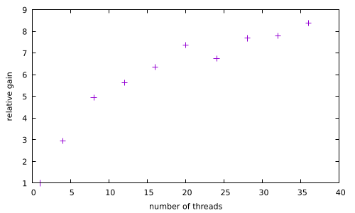
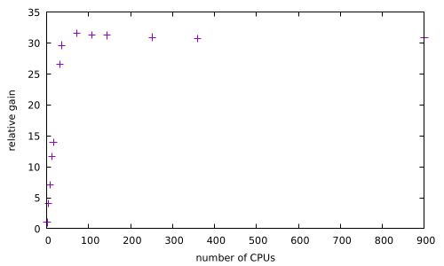

# Internship - Week 4 - Summary

## Progress on HPC runs of MD and Ab-Initio codes within the *Development of Supercomputing Training Material for Computational Chemistry* task

Efforts have focussed on *LAMMPS* runs for a small (ethanol) test case [^1] as well as on the *atomic simulation environment* (ASE) runs for MD water relaxation [^2]. 

Regarding the LAMMPS calculations on ethanol, a whole variety of job submission scripts has been uploaded in the "computationalchemistry" GitHub repository along with the tables exhibiting the recorded total wall time after completion. The pure OpenMP as well as the pure MPI and the hybrid runs are reported for the specific runs. On the other hand, submission options including the Kokkos acceleration package are reported. Although a variety of conditions have been explored (tables with wall time values are shown below), the scaling analysis mentioned in the third week's report has been carried out only for pure OpenMP submissions (see plot below).



Regarding the ASE water relaxation MD runs, pure MPI scaling analysis of the HPC calculations on Genius using ASE, has been carried out. The number of MD time-steps recorded for one hour during a temperature-ramp time evolution, has been used as scaling quantity. The corresponding output is graphically displayed below: 



Moreover, we are currently installing the LAMMPS test suite on a Centos 9 laptop via Anaconda, before doing it on Genius. The strategy includes the ABINIT implementation (separate virtual environments for QE and Wannier90 are being tried as well). Information on Quantum Espresso (QE) and on Wannier90 is being gathered, in order to carry out HPC runs. Alongside the above Anaconda strategy, test suites, virtual machines and large-scale benchmarks are being looked into. The full test suite of the *atomic simulation environment* is currently being run on Genius.

It is worth mentioning that a VASP licence is currently being negotiated with the authors of the code as well as with the VSC staff. Possible uninstalled software of interest currently being considered for very-large scale applications include both *ONETEP* (formal licence currently being applied for) and *ELK*. The latter is free software that includes new developments solving unique ill-conditioned numerical problems (the Bogolyubov equation), ie the ideal testbed for challenging High-Performance Computing teaching material development. The former uses a by-design very-large scale Ab-Initio methodology for solids, of intrinsic value due to its scope and accuracy, as opposed to both the brute-force scaling of conventional planewave methods and  the scaling/accuracy compromise of conventional real-space methods.
,
## Progress on the `BASH shell` scripting and ascii document templating skill acquisition

### `BASH shell`

The originally posed problem regarding templating of *LAMMPS* input files as a sample test for scripting, has turned out to be a straight BASH shell problem that is solved simply using the switft `sed` statement:  
```bash
#!/usr/bin/env bash
infile=$(ls in.*)
datafile=$(ls data.*)
cp $infile inback.txt
OLV1='CH3CH2OH'
OLV2=$(pwd)/$datafile
NEV1='xFORM'
NEV2='xDATAP'
sed -e "s#${OLV1}#${NEV1}#g" -e "s#${OLV2}#${NEV2}#g" inback.txt > outsedM4.txt
```
The above script is currently used to modify the LAMMPS inputs for production calculations. However, 
since this exercise has a training component, we decided to try other straight BASH scripts that go as far as producing the templates. Both array methodology and the case statement are being separately being tried (see two array scripts below):

### Work on existing templating methodology (M4 and renderest)

The appropriate syntax is being considered for both, in order to produce templates, to be run straight away. See the snippets below:

[^1]: in.ethanol/data.ethanol ("1-performance-exercise"): See the material provided with the tutorial "LAMMPS Course for Intermediate Users" https://epcced.github.io/archer2-advanced-use-of-lammps/
[^2]: "Equilibrating a TIPnP Water Box": https://wiki.fysik.dtu.dk/ase/tutorials/tipnp_equil/tipnp_equil.html