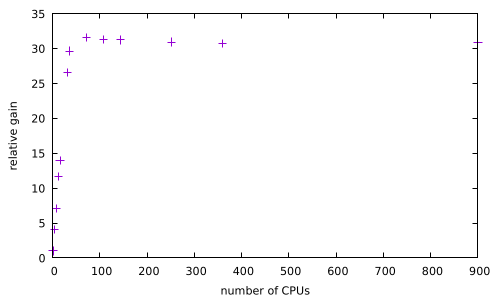

# Internship - Week 4 - Summary

## Progress on HPC runs of MD and Ab-Initio codes within the *Development of Supercomputing Training Material for Computational Chemistry* task

Efforts have focussed on both running *LAMMPS* for a small (ethanol box) test case [^1] and running the *atomic simulation environment* (ASE) for MD water box relaxation [^2]. 

On the one hand, LAMMPS calculations on the ethanol box are used as a testbed to explore the different parallelisation options of the program. A set of job submission scripts are being uploaded in the "computationalchemistry" GitHub repository. Likewise, tables exhibiting the recorded total wall time after completion are shown below. Pure OpenMP as well as pure MPI and hybrid runs are reported under specific submission parameters. Moreover, HPC runs including the Kokkos acceleration package of LAMMPS are reported. On the other, a full LAMMPS scaling analysis has been carried out for pure OpenMP runs (see plot below) for this small ethanol box example.


Regarding the ASE water box relaxation MD runs, pure MPI scaling analysis of the HPC calculations on Genius, has been carried out. The number of MD time-steps recorded for one hour during a temperature-ramp time evolution, has been used as scaling quantity. A plot is shown next: 



Moreover, the full test suite of the *atomic simulation environment* has been run on Genius, although we have not been able to run it in parallel mode (sequentially simply, it takes ca four minutes on a single Genius core).

It is worth mentioning that a VASP licence is currently being negotiated with the authors of the code as well as with the VSC staff. Possible uninstalled software of interest currently being considered for very-large scale applications include both *ONETEP* (formal licence currently being applied for) and *ELK* (the Bogolyubov equation).
,
## Progress on `BASH shell` scripting

No explicit work on the M4 and renderest templating software is being reported in this document, since efforts have focused on BASH shell scripting itself.  

### `BASH shell`

Following up the script enclosed within the report submitted in week 3, and after discussions with GJB, I decided to include his suggestions in order to carry out the book-keeping work of that document in a more professional manner [^3]. See below:
```bash
#!/usr/bin/env bash

#
#define the exact intended calculation
#

tcase='ethanol'
tmpin=$(printf "in.%s" $tcase)
echo "$tmpin"

#

if [[ ! -f "$tmpin" ]]
then
	(>&2 echo "get your ducks in a row - BYE!")
	echo "get your ducks in a row - BYE!"
	exit 1
else
	infile=$(ls -1 in.*)
	sizein=$(echo "$infile" | wc -l)
	echo "$sizein"
	if [[ "$sizein" != 0 ]] 
	then
		echo "$infile"
		tmpdata=$(printf "data.%s" $tcase)
	        echo "$tmpdata"
		datafile=$(ls -1 data.*)
		echo "$datafile"
		sizedata=$(echo "$datafile" | wc -l)
		echo "$sizedata"
		datin=$(grep "$tmpdata" "$tmpin")
                echo "$datin"
		if [[ "$datin" != "" && ! -f "$tmpdata" ]]
		then
		        (>&2 echo "get your ducks in a row - BYE!")
                        echo "get your ducks in a row - BYE!"
        		exit 1
		elif [[ "$datin" != "" && -f "$tmpdata" ]]
		then
			echo "you have the pair in/data"
		else
			echo "in file fine; data file unnecessary"
		fi
		if [[ "$datin" != "" && "$datin" == $(pwd) ]]
                then
	                echo "data full path is OK!"
		else
			(>&2 echo "BYE - get your ducks in a row (data path)")
			echo "BYE - get your ducks in a row (data path)"
			exit 1
		fi
	fi
fi
```
The originally posed problem regarding templating of *LAMMPS* input files as an scripting example, has turned out to have a simple solution with the switft `sed` statement:  
```bash
#!/usr/bin/env bash
infile=$(ls in.*)
datafile=$(ls data.*)
cp $infile inback.txt
OLV1='CH3CH2OH'
OLV2=$(pwd)/$datafile
NEV1='xFORM'
NEV2='xDATAP'
sed -e "s#${OLV1}#${NEV1}#g" -e "s#${OLV2}#${NEV2}#g" inback.txt > outsedM4.txt
```
The above script is currently used by the intern to modify *LAMMPS* inputs for production calculations. However, since this exercise has a training component, we decided to test other `BASH shell` scripts that go as far as producing templates. See below a script that does the same thing as the `sed` script above, although using arrays:
```bash
#!/usr/bin/env bash
nma=1
ma='molecule'
file='oneliner.txt'
m4f='xFORM'
m4d='xDATAP'
rrf='{{formula}}'
rrd='{{datapath}}'
printf -v bf "$"%s"" $m4f
printf -v bd "$"%s"" $m4d

var=$(more "$file")
echo "$var"
arrvar=($var); len=${#arrvar[@]}; echo "$len"; echo ${#arrvar[*]}
for (( i=0; i<$len; i++ )); do echo "${arrvar[$i]}" ; done
if [[ arrvar[0]=="$ma" ]]
then
	arrvar[1]=$bf
	arrvar[2]=$bd
fi
echo ${arrvar[*]}
```


[^1]: in.ethanol/data.ethanol ("1-performance-exercise"): See the material provided with the tutorial "LAMMPS Course for Intermediate Users" https://epcced.github.io/archer2-advanced-use-of-lammps/
[^2]: "Equilibrating a TIPnP Water Box": https://wiki.fysik.dtu.dk/ase/tutorials/tipnp_equil/tipnp_equil.html
[^3]: In fact, an error was spotted by GJB on that script, which corresponds to the incorrect use of the `break` statement within a loop. In this specific case, the intended action should have been carried out using the "exit 1" statement instead (the computation definitively stops!). On the other hand, a different way of responding to input errors has been applied, ie using a message that is written both to screen and to standard error. Moreover, it should be noticed that in the original script, the final outcome is producing a file that contains a single line exactly as happens in the matching word (molecule) which exists within the in.ethanol file. In this particular ocassion, no output file is produced, although book-keeping is far stricter.
