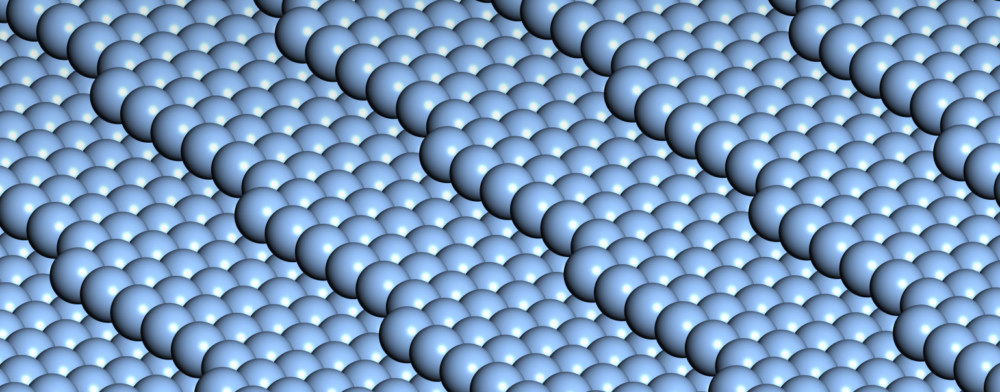

# Internship - Week 8 - Summary

## Computational Chemistry

Work carried out with Quantum Espresso [^1] is described next, and the tables depticting our progress with the Computational Chemistry packages are updated accordingly (repository "computationalchemistry"). A set of independent runs has been carried out both sequentially and under the MPI parallel mode. On the other hand, the as-provided test-suite is currently being tried.

Incidentally, it must be noted that all our CPU time on GENIUS has been consumed, and a new application for five million extra credits submitted [^2].

### Quantum Espresso calculations

Two as-provided independent systems as well as a system with input files built from scratch, have been run: 

 - GaAs PWSCF calculation under PAW (as provided),
 - SiH4 (molecule in a box) PWSCF calculation under norm-conserving pseudopotentials (as provided),
 - *Immm* Ag2PdO2 PWSCF calculation under ultrasoft pseudopotentials: The materialscloud.org website (Quantum ESPRESSO input generator and structure visualizer) lets us transform the corresponding CIF file (downloaded from the topological materials database) on QE inputs.

### Specific CIF files and geometry visualisation 

The Ag(16 10 9) surface structure [^3] is depicted below.

 
 
On the other hand, the crystal structure for the above topological material Ag2PdO2 is depicted next:

 

Finally, the modulated structure of the plagioclase feldspar CaxNa1-xAl1+xSi3-xO8 is shown below [^4]. This represents the textbook example of a solid solution.

 

[^1]: www.quantum-espresso.org
[^2]: https://admin.kuleuven.be/icts/onderzoek/hpc/extra-project-credits
[^3]: Both CIF file and atomic structure image of Ag(16 10 9) have been provided by Dr Stephen J Jenkins.
[^4]: It has been downloaded from The Bilbao Incommensurate Crystal Structure Database at https://www.cryst.ehu.es/
