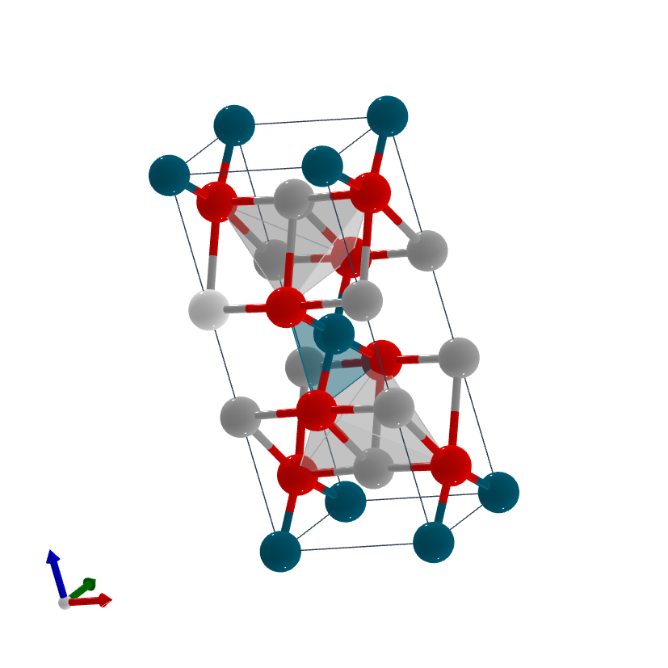

# Internship - Week 8 - Summary

## Computational Chemistry

Work carried out with Quantum Espresso [^1] is described next, and the tables depticting our progress with the Computational Chemistry packages are updated accordingly (repository "computationalchemistry"). A set of independent runs has been carried out both sequentially and under the MPI parallel mode. On the other hand, the as-provided test-suite is currently being tried.

Incidentally, it must be noted that all our CPU time on GENIUS has been consumed, and a new application for five million extra credits submitted [^2].

### Quantum Espresso calculations

Two as-provided independent systems as well as a system with input files built from scratch, have been run: 

 - GaAs PWSCF calculation under PAW (as provided),
 - SiH4 (molecule in a box) PWSCF calculation under norm-conserving pseudopotentials (as provided),
 - *Immm* Ag2PdO2 PWSCF calculation under ultrasoft pseudopotentials: The materialscloud.org website (Quantum ESPRESSO input generator and structure visualizer) lets us transform the corresponding CIF file (downloaded from the topological materials database) on QE inputs. The full set of input and output files from this quantum espresso run are uploaded to the "computationalchemistry" repository, as well as to the "geometryfilesCIF_PDB_XSF_FASTA" repository.

### Specific CIF files and geometry visualisation 

The Ag(16 10 9) surface structure [^3] is depicted below.

 
 
On the other hand, the crystal structure for the above topological material Ag2PdO2 is depicted next:

 

Finally, the modulated structure of the plagioclase feldspar CaxNa1-xAl1+xSi3-xO8 is shown below [^4]. This represents the textbook example of a solid solution.

 

[^1]: www.quantum-espresso.org
[^2]: https://admin.kuleuven.be/icts/onderzoek/hpc/extra-project-credits
[^3]: Both CIF file and atomic structure image of Ag(16 10 9) have been provided by Dr Stephen J Jenkins.
[^4]: It has been downloaded from The Bilbao Incommensurate Crystal Structure Database at https://www.cryst.ehu.es/
