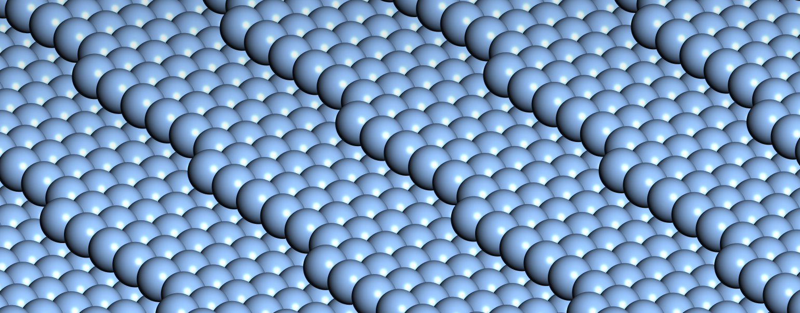
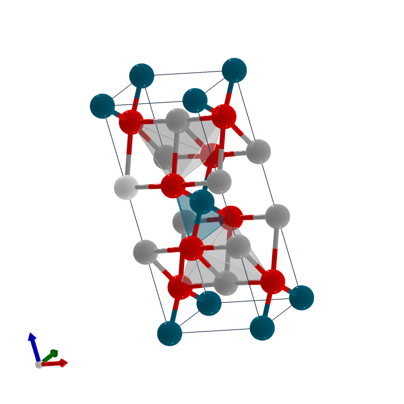

# Internship - Week 8 - Summary

## Computational Chemistry - HPC calculations for training material development

I have decided to get started with Quantum Espresso (QE) [^1], one of the best known first-principles quantum mechanical calculations codes for materials simulations. Work carried out with QE is described next, and the tables depicting our progress with the Computational Chemistry packages are updated accordingly (repository "computationalchemistry"). 

A set of independent runs has been carried out both sequentially and under the MPI parallel mode, although no systematic data are reported at this point (neither scaling studies nor walltime tables). On the other hand, the as-provided test-suite is currently being tried, as well as some  of the benchmark cases. Incidentally, it must be noted that all our CPU time on GENIUS has been consumed, and a new application for five million extra credits submitted [^2].

### Quantum Espresso 6.8 calculations

QE is based on a collection of executables/packages, at difference with most First-Principles Quantum Mechanical and Molecular Dynamics codes. Most of the calculations we are currently doing make use of the pw.x executable (PWscf package) for self-consisten field calculations.

Two as-provided independent systems as well as a system with input files built from scratch, have been run: 

 - GaAs PWscf calculation under PAW (as provided),
 - SiH4 -molecule in a box- PWscf calculation under norm-conserving pseudopotentials (as provided),
 - *Immm* Ag2PdO2 PWscf calculation under norm-conserving pseudopotentials (CIF geometry file downloaded from materialscloud.org, and processed on the QE input generator; reference input and output files are available as well). 
 
 While no further details are discussed regarding the first two cases, work on the third one deserves some comments (see subsection below). On the other hand, two QE benchmark cases are discussed as well. Moreover, some aspects of our work on the test-suite are reported below.
 
#### QE calculations on Ag2PdO2

 The materialscloud.org website (Quantum ESPRESSO input generator and structure visualizer) lets us transform the corresponding CIF file (downloaded from the topological materials database) on QE inputs. 

#### QE calculations on two PRACE benchmark cases: Gold surface ("small") and Iridium carbide ("medium")

Calculations on a Gold surface with a unit cell of 112 atoms and on an Iridium carbide supercell with 443 atoms are reported next. Since we have run out of CPU time during the latter, we were only able to compare the wall-time for the sequential calculation with that of an MPI calculation on 1152 cores for the initialisation step previous to the start of the SCF cycle (not even a single SCF step could be completed): *18630.1 seconds (sequential run) vs 63.O seconds (1152 MPI run)* for the initialisation step. Just the Gold surface input/output files are uploaded in the "computationalchemistry" repository, as this is the only calculation that has been completed within the benchmarkl set.

Both job submission file and main input file are shown below for both cases, the Gold surface and the Iridum carbide supercell. It should be noted that extra parallelisation (mpirun) parameters are required for very large core numbers (1152), ie those corresponding to k-point (4) and to Davidson diagonalisation (16) parallelisation, whilst they do not seem to be necessary for small number of cores (in fact, we have tested it, and the calculation is slower for small core numbers, when using the extra parallelisation parameters).

#### QE test suite

At this point, just independent calculations selected from the whole suite are reported.

## Computational Chemistry - Collection of specific CIF files, atomistic geometry visualisation and geometry conversion tools. 

The visualisation of atomistic geometries of materials and molecules has become crucial in simulations, therefore its importance in research and in supercomputing applications must be stressed. Materials simulation work requires the manipulation of geometry files (CIF, PDB, XSF, etc), making essential to visualise their geometry during the course of the simulations. The above PdAg2O2 QE calculations provide a good example, since conversions between the conventional cell (shown below) and the primitive cell, require the visualisation of both geometries. On the other hand, comparison with reference outputs also require the geometry visualisation stage (the software XCRYSDEN can visualise atomistic geometries from QE output files directly).

Atomistic geometry tools do not always work, even though strict CIF file validation/sanitation procedures are followed. For instance, the QE input file generator at materialscloud.org seems to partially fail on the body-centered orthorhombic PdAg2O2 as-provided CIF file, since it gives as output the QE input file for the 10 atom conventional cell, as opposed to the 5 atom primitive cell in the reference input/output files. XCRYSDEN allows visualising the reference output file provided by the same website, allowing a reconfirmation of the differences already seen in the calculated total energies (twice as much).

Another example of the above can be seen in the materials simulation academic course by Prof Dr Stefaan Cottenier [^3]. The combined use of both FINDSYM and CIF2CELL stumbles upon an inconsistency. As described by him in a video, this combination is very helpful when starting from a CIF file that corresponds to the output of a simulation or to any P1 conventional cell. On the one hand, the FINDSYM software (online run) identifies the space group of the supercell, and gives rise to a new supercell with symmetry. After running its output with CIF2CELL (simple ubuntu installation), we should be able to produce input files for QE, VASP, sprkkr, castep, etc. As a matter of fact, the second step fails, since CIF2CELL only understands Hall space-group terminology (FINDSYM produces only H-M), A simple solution based on modifying two lines is very helpful to the intern, since I have met exactly the same problem. On the other hand, CIF2CELL has its limitations, since it only produces QE input files without symmetry (ibrav=0), although the lattice information is really transparent.

A few atomistic visualisations are shown below, whilst the corresponding CIF files are uploaded to the GitHub repository "geometryfilesCIF_PDB_XSF_FASTA" (this repository contains all the geometry files and started from week 7's summary, which includes a couple of visualised geometries as well).

The Ag(16 10 9) surface structure [^4] is depicted below.

 
 
On the other hand, the crystal structure (conventional cell) for the above topological material Ag2PdO2 is depicted next:

 

Finally, the modulated structure of the plagioclase feldspar CaxNa1-xAl1+xSi3-xO8 solid solution is shown below [^5]. This represents the textbook example of a solid solution.

 

[^1]: www.quantum-espresso.org
[^2]: https://admin.kuleuven.be/icts/onderzoek/hpc/extra-project-credits
[^3]: crystallography section at https://beta.compmatphys.org/ 
[^4]: Both CIF file and atomic structure image of Ag(16 10 9) have been provided by Dr Stephen J Jenkins.
[^5]: It has been downloaded from The Bilbao Incommensurate Crystal Structure Database at https://www.cryst.ehu.es/
