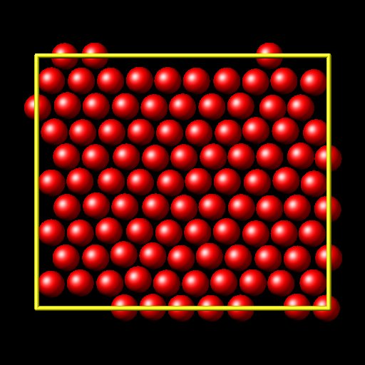

# Internship - Week 9 - Summary

At this point, and considering that I do not count with CPU time at Genius, it seems like a good idea trying to gather input and output files corresponding to all the calculations carried out so far with the Ab-Initio/MD software. On the one hand, the list of tar files uploaded to the "computationalchemistry" repository is completed. On the other, job submission scripts and input files are exhibited in this document. For cases of sequential calculations or parallel calculations on the laptop, no submission script is shown (only the main input file).  

 On the other hand, installation work (on DSI guest2 laptop), is summarised below, as well as work on the first runs with the software below:

 - GROMACS
 - PLUMED
 - AlphaFold (not installed by the intern, simply run on Genius, when/if possible)
 - OPENMM
 - OPENPLATHSAMPLING
 
The last two codes are not separately installed on Genius. Actually, on the HPC version, they take part in the distribution of other software. Firstly, PLUMED is a free-energy calculation code that makes use of OPENPATHSAMPLING. Secondly, AlphaFold is a protein structure determination sofware that uses OPENMM as its force-engine, and therefore, OpenMM is part of its distribution. Regarding the laptop installations of OPENMM and OPENPATHSAMPLING, explicit installation have been carried out. After looking at the AlphaFold documentation, and seeing that its local installation would require a huge amount of storage space (about 3 TB for the database), not available on the laptop, no attempt of installing AlphaFold is made.

## HPC calculations: tar files uploaded and inputs/job submission scripts - Development of supercomputing training material regarding Ab-Initio/MD calculations

Following up the same order appearing in the computationalchemistry repository (README.md), job submission scripts and input files are shown next:

### ABINIT

 - **Sequential** ABINIT calculation of the as provided example "tbasepar_1", located within abinit-test/tutorial ("Lead crystal - parallelism over k-points"): 
   *sequentialABINITtbasepar_1.tar.gz* (Genius),
```
#
# Lead crystal
#

# Simulation parameters
ecut  30.0
acell 10.0 10.0 10.0
rprim
    0.0  0.5  0.5
    0.5  0.0  0.5
    0.5  0.5  0.0

# K-points
ngkpt 8 8 8
nshiftk 4
shiftk
   0.5 0.5 0.5
   0.5 0.0 0.0
   0.0 0.5 0.0
   0.0 0.0 0.5
occopt 7
tsmear 0.01

# System description
ntypat 1
znucl  82
natom  1
typat  1 
xred
  0.000   0.000   0.000
nband  4

# SCF procedure
nstep   3
tolvrs  1.0d-10


## After modifying the following section, one might need to regenerate the pickle database with runtests.py -r
#%%<BEGIN TEST_INFO>
#%% [setup]
#%% executable = abinit
#%% [files]
#%% files_to_test = tbasepar_1.out, tolnlines=0, tolabs=0.0, tolrel=0.0
#%% psp_files= HGH/82pb.4.hgh
#%% [paral_info]
#%% max_nprocs = 4
#%% [extra_info]
#%% authors = Unknown
#%% keywords = NC
#%% description = Lead crystal. Parallelism over k-points
#%%<END TEST_INFO>
```
 - **Sequential** ABINIT calculation of the as provided example "tbasepar_2", located within abinit-test/tutorial ("FCC 4-atom A1-phonon deformed ferromagnetic Fe 
   crystal" - parallelism over spin): *sequentialABINITtbasepar_2.tar.gz* (Genius)
```
# FCC Fe (ferromagnetic for fun) with four atoms per cell
# Distorted with a A1 phonon, so as to keep the symmetry ...
# Only one k point in the IBZ
# Test the parallelism over the spins 

  tolvrs  1.0d-13
   ngkpt  2 2 2    

 ecut 30
 acell 3*7.00  

 ixc    1
 natom  4 
 nband 40
 nline 5
 nsppol 2
 spinat 0.0 0.0 3.0
        0.0 0.0 3.0
        0.0 0.0 3.0
        0.0 0.0 3.0
 nstep 5
 ntypat  1
 occopt 7
 shiftk 0.5 0.5 0.5
 typat  4*1
 xred  0.01 0.01 0.01
       0.49 0.49 0.01
       0.49 0.01 0.49
       0.01 0.49 0.49
 znucl 26.0


## After modifying the following section, one might need to regenerate the pickle database with runtests.py -r
#%%<BEGIN TEST_INFO>
#%% [setup]
#%% executable = abinit
#%% [files]
#%% files_to_test = tbasepar_2.out, tolnlines=0, tolabs=0.0, tolrel=0.0
#%% psp_files= HGH/26fe.8.hgh
#%% [paral_info]
#%% max_nprocs = 2
#%% [extra_info]
#%% keywords = NC
#%% authors = Unknown
#%% description = 
#%%   FCC Fe (ferromagnetic for fun) with four atoms per cell
#%%   Distorted with a A1 phonon, so as to keep the symmetry ...
#%%   Only one k point in the IBZ
#%%   Test the parallelism over the spins , 
#%%<END TEST_INFO>
```
 - **MPI** ABINIT calculation of the as provided example "tdfpt", located within abinit-test/tutoparal ("DFPT phonon calculation for Aluminium crystal - step 1: 
   ground-state electronic structure calcuation - step 2: phonon calculation": *mpiABINITtdfpt1and2.tar.gz* (DSI laptop guest2; no batch job script used)
```bash
#!/bin/bash

mpirun abinit < tdfpt_01.files > tdfpt_01.log
cp tdfpt_01.o_WFK tdfpt_02.i_WFK
cp tdfpt_01.o_WFK tdfpt_02.i_WFQ
mpirun abinit < tdfpt_02.files > tdfpt_02.log
```
```
#   FCC Al; 10 special points

#timopt -1

 acell 3*7.56
 densty 1.2
 ecut 10

 enunit 2  

 localrdwf 1
 ngkpt 8 8 8 
 nshiftk 4
 shiftk 0.5 0.5 0.5
        0.5 0.0 0.0
        0.0 0.5 0.0
        0.0 0.0 0.5

 natom  1 nband 5
 nline 3  nstep 20
 ntypat  1
 occopt  4  prtden 1   prtvol 10
 rprim   0 .5 .5  .5 0 .5  .5 .5 0
 timopt 2
 tnons   72*0.0d0
 tolvrs 1.0d-18
 typat  1  
 xred  0.0 0.0 0.0
 znucl 13.0
```
```
#   FCC Al; phonon at 1/4 1/8 1/8

 istatr 1000
 irdwfk 1
 irdwfq 1

 nbdbuf 3
 rfphon 1
 rfatpol 1 1
 rfdir  1 1 1
 nqpt   1
 qpt    0.25 -0.125 0.125

 acell 3*7.56
 densty 1.2

 ecut 10

 enunit 2  

 kptopt 3
 localrdwf 1
 ngkpt 8 8 8  
 nshiftk 4
 shiftk 0.5 0.5 0.5
        0.5 0.0 0.0
        0.0 0.5 0.0
        0.0 0.0 0.5 

 natom  1 nband 5

 nstep 20

 ntypat  1
 amu    26.96
 occopt  4 
 rprim   0 .5 .5  .5 0 .5  .5 .5 0
 timopt 2
 tolvrs 1.0d-10
 typat  1  
 xred  0.0 0.0 0.0
 znucl 13.0
```
### ASE

 - **Sequential** ASE convex hull determination for a CuxPt1-x(111) surface slab by means of a genetic algorithm: 
   *sequentialASEgenalgCuPt111slab.tar.gz* (DSI guest2 laptop)
```python
from pathlib import Path
import random

from ase.build import fcc111
from ase.calculators.emt import EMT
from ase.data import atomic_numbers, reference_states
from ase.ga.data import PrepareDB
from ase.ga import set_raw_score


def get_avg_lattice_constant(syms):
    a = 0.
    for m in set(syms):
        a += syms.count(m) * lattice_constants[m]
    return a / len(syms)


metals = ['Cu', 'Pt']
# Use experimental lattice constants
lattice_constants = dict((m, reference_states[atomic_numbers[m]]['a'])
                         for m in metals)

# Create the references (pure slabs) manually
pure_slabs = []
refs = {}
print('Reference energies:')
for m in metals:
    slab = fcc111(m, size=(2, 4, 3), a=lattice_constants[m],
                  vacuum=5, orthogonal=True)
    slab.calc = EMT()

    # We save the reference energy as E_A / N
    e = slab.get_potential_energy()
    e_per_atom = e / len(slab)
    refs[m] = e_per_atom
    print('{0} = {1:.3f} eV/atom'.format(m, e_per_atom))

    # The mixing energy for the pure slab is 0 by definition
    set_raw_score(slab, 0.0)
    pure_slabs.append(slab)

# The population size should be at least the number of different compositions
pop_size = 2 * len(slab)

# We prepare the db and write a few constants that we are going to use later
target = Path('hull.db')
if target.exists():
    target.unlink()
db = PrepareDB(target, population_size=pop_size,
               reference_energies=refs, metals=metals,
               lattice_constants=lattice_constants)

# We add the pure slabs to the database as relaxed because we have already
# set the raw_score
for slab in pure_slabs:
    db.add_relaxed_candidate(slab,
                             atoms_string=''.join(slab.get_chemical_symbols()))


# Now we create the rest of the candidates for the initial population
for i in range(pop_size - 2):
    # How many of each metal is picked at random, making sure that
    # we do not pick pure slabs
    nA = random.randint(0, len(slab) - 2)
    nB = len(slab) - 2 - nA
    symbols = [metals[0]] * nA + [metals[1]] * nB + metals

    # Making a generic slab with the correct lattice constant
    slab = fcc111('X', size=(2, 4, 3),
                  a=get_avg_lattice_constant(symbols),
                  vacuum=5, orthogonal=True)

    # Setting the symbols and randomizing the order
    slab.set_chemical_symbols(symbols)
    random.shuffle(slab.numbers)

    # Add these candidates as unrelaxed, we will relax them later
    atoms_string = ''.join(slab.get_chemical_symbols())
    db.add_unrelaxed_candidate(slab, atoms_string=atoms_string)
```
```python
import numpy as np
from ase.ga.population import RankFitnessPopulation
from ase.ga.data import DataConnection
from ase.ga.offspring_creator import OperationSelector
from ase.ga.slab_operators import (CutSpliceSlabCrossover,
                                   RandomSlabPermutation,
                                   RandomCompositionMutation)
from ase.ga import set_raw_score

from ase.calculators.emt import EMT

# Connect to the database containing all candidates
db = DataConnection('hull.db')

# Retrieve saved parameters
pop_size = db.get_param('population_size')
refs = db.get_param('reference_energies')
metals = db.get_param('metals')
lattice_constants = db.get_param('lattice_constants')


def get_mixing_energy(atoms):
    # Set the correct cell size from the lattice constant
    new_a = get_avg_lattice_constant(atoms.get_chemical_symbols())
    # Use the orthogonal fcc cell to find the current lattice constant
    current_a = atoms.cell[0][0] / np.sqrt(2)
    atoms.set_cell(atoms.cell * new_a / current_a, scale_atoms=True)

    # Calculate the energy
    atoms.calc = EMT()
    e = atoms.get_potential_energy()

    # Subtract contributions from the pure element references
    # to get the mixing energy
    syms = atoms.get_chemical_symbols()
    for m in set(syms):
        e -= syms.count(m) * refs[m]
    return e


def get_avg_lattice_constant(syms):
    a = 0.
    for m in set(syms):
        a += syms.count(m) * lattice_constants[m]
    return a / len(syms)


def get_comp(atoms):
    return atoms.get_chemical_formula()


# Specify the number of generations this script will run
num_gens = 10

# Specify the procreation operators for the algorithm and
# how often each is picked on average
# The probability for an operator is the prepended integer divided by the sum
# of integers
oclist = [(3, CutSpliceSlabCrossover()),
          (1, RandomSlabPermutation()),
          (1, RandomCompositionMutation())
          ]
operation_selector = OperationSelector(*zip(*oclist))

# Pass parameters to the population instance
# A variable_function is required to divide candidates into groups here we use
# the chemical composition
pop = RankFitnessPopulation(data_connection=db,
                            population_size=pop_size,
                            variable_function=get_comp)

# Evaluate the starting population
# The only requirement of the evaluation is to set the raw_score
# Negative mixing energy means more stable than the pure slabs
# The optimization always progress towards larger raw score,
# so we take the negative mixing energy as the raw score
print('Evaluating initial candidates')
while db.get_number_of_unrelaxed_candidates() > 0:
    a = db.get_an_unrelaxed_candidate()
    set_raw_score(a, -get_mixing_energy(a))
    db.add_relaxed_step(a)
pop.update()

# Below is the iterative part of the algorithm
gen_num = db.get_generation_number()
for i in range(num_gens):
    print('Creating and evaluating generation {0}'.format(gen_num + i))
    new_generation = []
    for _ in range(pop_size):
        # Select parents for a new candidate
        parents = pop.get_two_candidates()

        # Select an operator and use it
        op = operation_selector.get_operator()
        offspring, desc = op.get_new_individual(parents)
        # An operator could return None if an offspring cannot be formed
        # by the chosen parents
        if offspring is None:
            continue

        set_raw_score(offspring, -get_mixing_energy(offspring))
        new_generation.append(offspring)

    # We add a full relaxed generation at once, this is faster than adding
    # one at a time
    db.add_more_relaxed_candidates(new_generation)

    # update the population to allow new candidates to enter
    pop.update()
```
```python
import numpy as np
import matplotlib.pyplot as plt
from ase.phasediagram import PhaseDiagram
from ase.db import connect
from ase.io import write

db = connect('hull.db')

# Select the evaluated candidates and retrieve the chemical formula and mixing
# energy for the phase diagram
refs = []
dcts = list(db.select('relaxed=1'))
for dct in dcts:
    refs.append((dct.formula, -dct.raw_score))

pd = PhaseDiagram(refs)
ax = pd.plot(show=not True,  # set to True to show plot
             only_label_simplices=True)
plt.savefig('hull.png')

# View the simplices of the convex hull
simplices = []
toview = sorted(np.array(dcts)[pd.hull], key=lambda x: x.mass)
for dct in toview:
    simplices.append(dct.toatoms())

write('hull.traj', simplices)
```

   

 - **MPI** ASE water-box equilibration as a strong-scaling **MPI** test: *mpiASE_STRONGSCALING_waterboxequi.tar.gz* (Genius)

### LAMMPS

 - **MPI** LAMMPS calculation of c-HfO2: *mpiLAMMPScHfO2.tar.gz* (Genius),
```bash 
#!/bin/bash

#SBATCH --job-name=mpi
#SBATCH --nodes=4
#SBATCH --time=00:30:00
#SBATCH --account=lp_h_vsc35663
#SBATCH --ntasks=144
#SBATCH --cpus-per-task=1
#SBATCH --cluster=genius

module purge
module use /apps/leuven/skylake/2021a/modules/all
module load LAMMPS/29Sep2021-foss-2021a-Python-3.9.5-kokkos

mpirun lmp -in in.comb.HfO2 -l log_cubHfO2.txt 
```
```
units		metal
atom_style	charge
dimension       3
boundary        p p p

read_data  	data.c-HfO2

mass		1 178.0
group    	type1 type 1
compute   	charge1 type1 property/atom q
compute   	q1 type1 reduce ave c_charge1
mass		2 16.00
group    	type2 type 2
compute   	charge2 type2 property/atom q
compute   	q2 type2 reduce ave c_charge2

pair_style	comb
pair_coeff	* * ffield.comb Hf O

neighbor	0.5 bin
neigh_modify	every 10 delay 10 check yes 

timestep        0.00010

thermo_style	custom step temp etotal pe evdwl ecoul press vol lx ly lz xz c_q1 c_q2
thermo_modify	norm yes

fix		1 all nvt temp 300.0 300.0 0.1
thermo      	100
run    		100
fix  		2 all qeq/comb 1 0.003 file fq.out
run    		500

unfix    	1
fix		1 all box/relax aniso 0.0 vmax 0.0002

# should minimize to higher tolerance in practice

minimize	1.0e-12  1.0e-18  1000  10000
#minimize	1.0e-4  1.0e-6  1000  10000
min_modify	dmax 0.005 line quadratic

dump		1 all xyz 50000 *.xyz
dump_modify	1 element Hf O

#dump		1 all cfg 10 *.cfg id type xs ys zs q vx vy vz fx fy fz
#dump_modify	1 element Hf O

velocity	all create 300.1 2398378
thermo   	1000 
run  		50000
```
```
 Comment line
 
        1500 atoms
           0 bonds
           0 angles
           0 dihedrals
           0 impropers
 
           2 atom types
           0 bond types
           0 angle types
           0 dihedral types
           0 improper types
 
  0.0000000E+00   25.3446300000000      xlo xhi
  0.0000000E+00   25.3446300000000      ylo yhi
  0.0000000E+00   25.3446300000000      zlo zhi
     0.0000000      0.0000000      0.0000000   xy xz yz
 
 Atoms
 
      1      1     3.42000000      0.00000      0.00000      0.00000
      2      1     3.42000000      2.53446      2.53446      0.00000
      3      1     3.42000000      0.00000      2.53446      2.53446
      4      1     3.42000000      2.53446      0.00000      2.53446
      5      2    -1.71000000      1.26723      1.26723      1.26723
      6      2    -1.71000000      1.26723      1.26723      3.80169
      7      2    -1.71000000      1.26723      3.80169      1.26723
      8      2    -1.71000000      3.80169      1.26723      1.26723
      9      2    -1.71000000      3.80169      3.80169      3.80169
     10      2    -1.71000000      3.80169      1.26723      3.80169
     11      2    -1.71000000      3.80169      3.80169      1.26723
     12      2    -1.71000000      1.26723      3.80169      3.80169
     13      1     3.42000000      0.00000      0.00000      5.06893
     14      1     3.42000000      2.53446      2.53446      5.06893
     15      1     3.42000000      0.00000      2.53446      7.60339
     16      1     3.42000000      2.53446      0.00000      7.60339
     17      2    -1.71000000      1.26723      1.26723      6.33616
     18      2    -1.71000000      1.26723      1.26723      8.87062
     19      2    -1.71000000      1.26723      3.80169      6.33616
     20      2    -1.71000000      3.80169      1.26723      6.33616
     21      2    -1.71000000      3.80169      3.80169      8.87062
     22      2    -1.71000000      3.80169      1.26723      8.87062
     23      2    -1.71000000      3.80169      3.80169      6.33616
     24      2    -1.71000000      1.26723      3.80169      8.87062
     25      1     3.42000000      0.00000      0.00000     10.13785
     26      1     3.42000000      2.53446      2.53446     10.13785
     27      1     3.42000000      0.00000      2.53446     12.67232
     28      1     3.42000000      2.53446      0.00000     12.67232
     29      2    -1.71000000      1.26723      1.26723     11.40508
     30      2    -1.71000000      1.26723      1.26723     13.93955
     31      2    -1.71000000      1.26723      3.80169     11.40508
     32      2    -1.71000000      3.80169      1.26723     11.40508
     33      2    -1.71000000      3.80169      3.80169     13.93955
     34      2    -1.71000000      3.80169      1.26723     13.93955
     35      2    -1.71000000      3.80169      3.80169     11.40508
     36      2    -1.71000000      1.26723      3.80169     13.93955
     37      1     3.42000000      0.00000      0.00000     15.20678
     38      1     3.42000000      2.53446      2.53446     15.20678
     39      1     3.42000000      0.00000      2.53446     17.74124
     40      1     3.42000000      2.53446      0.00000     17.74124
     41      2    -1.71000000      1.26723      1.26723     16.47401
     42      2    -1.71000000      1.26723      1.26723     19.00847
     43      2    -1.71000000      1.26723      3.80169     16.47401
     44      2    -1.71000000      3.80169      1.26723     16.47401
     45      2    -1.71000000      3.80169      3.80169     19.00847
     46      2    -1.71000000      3.80169      1.26723     19.00847
     47      2    -1.71000000      3.80169      3.80169     16.47401
     48      2    -1.71000000      1.26723      3.80169     19.00847
     49      1     3.42000000      0.00000      0.00000     20.27570
     50      1     3.42000000      2.53446      2.53446     20.27570
     51      1     3.42000000      0.00000      2.53446     22.81017
     52      1     3.42000000      2.53446      0.00000     22.81017
     53      2    -1.71000000      1.26723      1.26723     21.54294
     54      2    -1.71000000      1.26723      1.26723     24.07740
     55      2    -1.71000000      1.26723      3.80169     21.54294
     56      2    -1.71000000      3.80169      1.26723     21.54294
     57      2    -1.71000000      3.80169      3.80169     24.07740
     58      2    -1.71000000      3.80169      1.26723     24.07740
     59      2    -1.71000000      3.80169      3.80169     21.54294
     60      2    -1.71000000      1.26723      3.80169     24.07740
     61      1     3.42000000      0.00000      5.06893      0.00000
     62      1     3.42000000      2.53446      7.60339      0.00000
     63      1     3.42000000      0.00000      7.60339      2.53446
     64      1     3.42000000      2.53446      5.06893      2.53446
     65      2    -1.71000000      1.26723      6.33616      1.26723
     66      2    -1.71000000      1.26723      6.33616      3.80169
     67      2    -1.71000000      1.26723      8.87062      1.26723
     68      2    -1.71000000      3.80169      6.33616      1.26723
     69      2    -1.71000000      3.80169      8.87062      3.80169
     70      2    -1.71000000      3.80169      6.33616      3.80169
     71      2    -1.71000000      3.80169      8.87062      1.26723
     72      2    -1.71000000      1.26723      8.87062      3.80169
     73      1     3.42000000      0.00000      5.06893      5.06893
     74      1     3.42000000      2.53446      7.60339      5.06893
     75      1     3.42000000      0.00000      7.60339      7.60339
     76      1     3.42000000      2.53446      5.06893      7.60339
     77      2    -1.71000000      1.26723      6.33616      6.33616
     78      2    -1.71000000      1.26723      6.33616      8.87062
     79      2    -1.71000000      1.26723      8.87062      6.33616
     80      2    -1.71000000      3.80169      6.33616      6.33616
     81      2    -1.71000000      3.80169      8.87062      8.87062
     82      2    -1.71000000      3.80169      6.33616      8.87062
     83      2    -1.71000000      3.80169      8.87062      6.33616
     84      2    -1.71000000      1.26723      8.87062      8.87062
     85      1     3.42000000      0.00000      5.06893     10.13785
     86      1     3.42000000      2.53446      7.60339     10.13785
     87      1     3.42000000      0.00000      7.60339     12.67232
     88      1     3.42000000      2.53446      5.06893     12.67232
     89      2    -1.71000000      1.26723      6.33616     11.40508
     90      2    -1.71000000      1.26723      6.33616     13.93955
     91      2    -1.71000000      1.26723      8.87062     11.40508
     92      2    -1.71000000      3.80169      6.33616     11.40508
     93      2    -1.71000000      3.80169      8.87062     13.93955
     94      2    -1.71000000      3.80169      6.33616     13.93955
     95      2    -1.71000000      3.80169      8.87062     11.40508
     96      2    -1.71000000      1.26723      8.87062     13.93955
     97      1     3.42000000      0.00000      5.06893     15.20678
     98      1     3.42000000      2.53446      7.60339     15.20678
     99      1     3.42000000      0.00000      7.60339     17.74124
    100      1     3.42000000      2.53446      5.06893     17.74124
    101      2    -1.71000000      1.26723      6.33616     16.47401
    102      2    -1.71000000      1.26723      6.33616     19.00847
    103      2    -1.71000000      1.26723      8.87062     16.47401
    104      2    -1.71000000      3.80169      6.33616     16.47401
    105      2    -1.71000000      3.80169      8.87062     19.00847
    106      2    -1.71000000      3.80169      6.33616     19.00847
    107      2    -1.71000000      3.80169      8.87062     16.47401
    108      2    -1.71000000      1.26723      8.87062     19.00847
    109      1     3.42000000      0.00000      5.06893     20.27570
    110      1     3.42000000      2.53446      7.60339     20.27570
    111      1     3.42000000      0.00000      7.60339     22.81017
    112      1     3.42000000      2.53446      5.06893     22.81017
    113      2    -1.71000000      1.26723      6.33616     21.54294
    114      2    -1.71000000      1.26723      6.33616     24.07740
    115      2    -1.71000000      1.26723      8.87062     21.54294
    116      2    -1.71000000      3.80169      6.33616     21.54294
    117      2    -1.71000000      3.80169      8.87062     24.07740
    118      2    -1.71000000      3.80169      6.33616     24.07740
    119      2    -1.71000000      3.80169      8.87062     21.54294
    120      2    -1.71000000      1.26723      8.87062     24.07740
    121      1     3.42000000      0.00000     10.13785      0.00000
    122      1     3.42000000      2.53446     12.67232      0.00000
    123      1     3.42000000      0.00000     12.67232      2.53446
    124      1     3.42000000      2.53446     10.13785      2.53446
    125      2    -1.71000000      1.26723     11.40508      1.26723
    126      2    -1.71000000      1.26723     11.40508      3.80169
    127      2    -1.71000000      1.26723     13.93955      1.26723
    128      2    -1.71000000      3.80169     11.40508      1.26723
    129      2    -1.71000000      3.80169     13.93955      3.80169
    130      2    -1.71000000      3.80169     11.40508      3.80169
    131      2    -1.71000000      3.80169     13.93955      1.26723
    132      2    -1.71000000      1.26723     13.93955      3.80169
    133      1     3.42000000      0.00000     10.13785      5.06893
    134      1     3.42000000      2.53446     12.67232      5.06893
    135      1     3.42000000      0.00000     12.67232      7.60339
    136      1     3.42000000      2.53446     10.13785      7.60339
    137      2    -1.71000000      1.26723     11.40508      6.33616
    138      2    -1.71000000      1.26723     11.40508      8.87062
    139      2    -1.71000000      1.26723     13.93955      6.33616
    140      2    -1.71000000      3.80169     11.40508      6.33616
    141      2    -1.71000000      3.80169     13.93955      8.87062
    142      2    -1.71000000      3.80169     11.40508      8.87062
    143      2    -1.71000000      3.80169     13.93955      6.33616
    144      2    -1.71000000      1.26723     13.93955      8.87062
    145      1     3.42000000      0.00000     10.13785     10.13785
    146      1     3.42000000      2.53446     12.67232     10.13785
    147      1     3.42000000      0.00000     12.67232     12.67232
    148      1     3.42000000      2.53446     10.13785     12.67232
    149      2    -1.71000000      1.26723     11.40508     11.40508
    150      2    -1.71000000      1.26723     11.40508     13.93955
    151      2    -1.71000000      1.26723     13.93955     11.40508
    152      2    -1.71000000      3.80169     11.40508     11.40508
    153      2    -1.71000000      3.80169     13.93955     13.93955
    154      2    -1.71000000      3.80169     11.40508     13.93955
    155      2    -1.71000000      3.80169     13.93955     11.40508
    156      2    -1.71000000      1.26723     13.93955     13.93955
    157      1     3.42000000      0.00000     10.13785     15.20678
    158      1     3.42000000      2.53446     12.67232     15.20678
    159      1     3.42000000      0.00000     12.67232     17.74124
    160      1     3.42000000      2.53446     10.13785     17.74124
    161      2    -1.71000000      1.26723     11.40508     16.47401
    162      2    -1.71000000      1.26723     11.40508     19.00847
    163      2    -1.71000000      1.26723     13.93955     16.47401
    164      2    -1.71000000      3.80169     11.40508     16.47401
    165      2    -1.71000000      3.80169     13.93955     19.00847
    166      2    -1.71000000      3.80169     11.40508     19.00847
    167      2    -1.71000000      3.80169     13.93955     16.47401
    168      2    -1.71000000      1.26723     13.93955     19.00847
    169      1     3.42000000      0.00000     10.13785     20.27570
    170      1     3.42000000      2.53446     12.67232     20.27570
    171      1     3.42000000      0.00000     12.67232     22.81017
    172      1     3.42000000      2.53446     10.13785     22.81017
    173      2    -1.71000000      1.26723     11.40508     21.54294
    174      2    -1.71000000      1.26723     11.40508     24.07740
    175      2    -1.71000000      1.26723     13.93955     21.54294
    176      2    -1.71000000      3.80169     11.40508     21.54294
    177      2    -1.71000000      3.80169     13.93955     24.07740
    178      2    -1.71000000      3.80169     11.40508     24.07740
    179      2    -1.71000000      3.80169     13.93955     21.54294
    180      2    -1.71000000      1.26723     13.93955     24.07740
    181      1     3.42000000      0.00000     15.20678      0.00000
    182      1     3.42000000      2.53446     17.74124      0.00000
    183      1     3.42000000      0.00000     17.74124      2.53446
    184      1     3.42000000      2.53446     15.20678      2.53446
    185      2    -1.71000000      1.26723     16.47401      1.26723
    186      2    -1.71000000      1.26723     16.47401      3.80169
    187      2    -1.71000000      1.26723     19.00847      1.26723
    188      2    -1.71000000      3.80169     16.47401      1.26723
    189      2    -1.71000000      3.80169     19.00847      3.80169
    190      2    -1.71000000      3.80169     16.47401      3.80169
    191      2    -1.71000000      3.80169     19.00847      1.26723
    192      2    -1.71000000      1.26723     19.00847      3.80169
    193      1     3.42000000      0.00000     15.20678      5.06893
    194      1     3.42000000      2.53446     17.74124      5.06893
    195      1     3.42000000      0.00000     17.74124      7.60339
    196      1     3.42000000      2.53446     15.20678      7.60339
    197      2    -1.71000000      1.26723     16.47401      6.33616
    198      2    -1.71000000      1.26723     16.47401      8.87062
    199      2    -1.71000000      1.26723     19.00847      6.33616
    200      2    -1.71000000      3.80169     16.47401      6.33616
    201      2    -1.71000000      3.80169     19.00847      8.87062
    202      2    -1.71000000      3.80169     16.47401      8.87062
    203      2    -1.71000000      3.80169     19.00847      6.33616
    204      2    -1.71000000      1.26723     19.00847      8.87062
    205      1     3.42000000      0.00000     15.20678     10.13785
    206      1     3.42000000      2.53446     17.74124     10.13785
    207      1     3.42000000      0.00000     17.74124     12.67232
    208      1     3.42000000      2.53446     15.20678     12.67232
    209      2    -1.71000000      1.26723     16.47401     11.40508
    210      2    -1.71000000      1.26723     16.47401     13.93955
    211      2    -1.71000000      1.26723     19.00847     11.40508
    212      2    -1.71000000      3.80169     16.47401     11.40508
    213      2    -1.71000000      3.80169     19.00847     13.93955
    214      2    -1.71000000      3.80169     16.47401     13.93955
    215      2    -1.71000000      3.80169     19.00847     11.40508
    216      2    -1.71000000      1.26723     19.00847     13.93955
    217      1     3.42000000      0.00000     15.20678     15.20678
    218      1     3.42000000      2.53446     17.74124     15.20678
    219      1     3.42000000      0.00000     17.74124     17.74124
    220      1     3.42000000      2.53446     15.20678     17.74124
    221      2    -1.71000000      1.26723     16.47401     16.47401
    222      2    -1.71000000      1.26723     16.47401     19.00847
    223      2    -1.71000000      1.26723     19.00847     16.47401
    224      2    -1.71000000      3.80169     16.47401     16.47401
    225      2    -1.71000000      3.80169     19.00847     19.00847
    226      2    -1.71000000      3.80169     16.47401     19.00847
    227      2    -1.71000000      3.80169     19.00847     16.47401
    228      2    -1.71000000      1.26723     19.00847     19.00847
    229      1     3.42000000      0.00000     15.20678     20.27570
    230      1     3.42000000      2.53446     17.74124     20.27570
    231      1     3.42000000      0.00000     17.74124     22.81017
    232      1     3.42000000      2.53446     15.20678     22.81017
    233      2    -1.71000000      1.26723     16.47401     21.54294
    234      2    -1.71000000      1.26723     16.47401     24.07740
    235      2    -1.71000000      1.26723     19.00847     21.54294
    236      2    -1.71000000      3.80169     16.47401     21.54294
    237      2    -1.71000000      3.80169     19.00847     24.07740
    238      2    -1.71000000      3.80169     16.47401     24.07740
    239      2    -1.71000000      3.80169     19.00847     21.54294
    240      2    -1.71000000      1.26723     19.00847     24.07740
    241      1     3.42000000      0.00000     20.27570      0.00000
    242      1     3.42000000      2.53446     22.81017      0.00000
    243      1     3.42000000      0.00000     22.81017      2.53446
    244      1     3.42000000      2.53446     20.27570      2.53446
    245      2    -1.71000000      1.26723     21.54294      1.26723
    246      2    -1.71000000      1.26723     21.54294      3.80169
    247      2    -1.71000000      1.26723     24.07740      1.26723
    248      2    -1.71000000      3.80169     21.54294      1.26723
    249      2    -1.71000000      3.80169     24.07740      3.80169
    250      2    -1.71000000      3.80169     21.54294      3.80169
    251      2    -1.71000000      3.80169     24.07740      1.26723
    252      2    -1.71000000      1.26723     24.07740      3.80169
    253      1     3.42000000      0.00000     20.27570      5.06893
    254      1     3.42000000      2.53446     22.81017      5.06893
    255      1     3.42000000      0.00000     22.81017      7.60339
    256      1     3.42000000      2.53446     20.27570      7.60339
    257      2    -1.71000000      1.26723     21.54294      6.33616
    258      2    -1.71000000      1.26723     21.54294      8.87062
    259      2    -1.71000000      1.26723     24.07740      6.33616
    260      2    -1.71000000      3.80169     21.54294      6.33616
    261      2    -1.71000000      3.80169     24.07740      8.87062
    262      2    -1.71000000      3.80169     21.54294      8.87062
    263      2    -1.71000000      3.80169     24.07740      6.33616
    264      2    -1.71000000      1.26723     24.07740      8.87062
    265      1     3.42000000      0.00000     20.27570     10.13785
    266      1     3.42000000      2.53446     22.81017     10.13785
    267      1     3.42000000      0.00000     22.81017     12.67232
    268      1     3.42000000      2.53446     20.27570     12.67232
    269      2    -1.71000000      1.26723     21.54294     11.40508
    270      2    -1.71000000      1.26723     21.54294     13.93955
    271      2    -1.71000000      1.26723     24.07740     11.40508
    272      2    -1.71000000      3.80169     21.54294     11.40508
    273      2    -1.71000000      3.80169     24.07740     13.93955
    274      2    -1.71000000      3.80169     21.54294     13.93955
    275      2    -1.71000000      3.80169     24.07740     11.40508
    276      2    -1.71000000      1.26723     24.07740     13.93955
    277      1     3.42000000      0.00000     20.27570     15.20678
    278      1     3.42000000      2.53446     22.81017     15.20678
    279      1     3.42000000      0.00000     22.81017     17.74124
    280      1     3.42000000      2.53446     20.27570     17.74124
    281      2    -1.71000000      1.26723     21.54294     16.47401
    282      2    -1.71000000      1.26723     21.54294     19.00847
    283      2    -1.71000000      1.26723     24.07740     16.47401
    284      2    -1.71000000      3.80169     21.54294     16.47401
    285      2    -1.71000000      3.80169     24.07740     19.00847
    286      2    -1.71000000      3.80169     21.54294     19.00847
    287      2    -1.71000000      3.80169     24.07740     16.47401
    288      2    -1.71000000      1.26723     24.07740     19.00847
    289      1     3.42000000      0.00000     20.27570     20.27570
    290      1     3.42000000      2.53446     22.81017     20.27570
    291      1     3.42000000      0.00000     22.81017     22.81017
    292      1     3.42000000      2.53446     20.27570     22.81017
    293      2    -1.71000000      1.26723     21.54294     21.54294
    294      2    -1.71000000      1.26723     21.54294     24.07740
    295      2    -1.71000000      1.26723     24.07740     21.54294
    296      2    -1.71000000      3.80169     21.54294     21.54294
    297      2    -1.71000000      3.80169     24.07740     24.07740
    298      2    -1.71000000      3.80169     21.54294     24.07740
    299      2    -1.71000000      3.80169     24.07740     21.54294
    300      2    -1.71000000      1.26723     24.07740     24.07740
    301      1     3.42000000      5.06893      0.00000      0.00000
    302      1     3.42000000      7.60339      2.53446      0.00000
    303      1     3.42000000      5.06893      2.53446      2.53446
    304      1     3.42000000      7.60339      0.00000      2.53446
    305      2    -1.71000000      6.33616      1.26723      1.26723
    306      2    -1.71000000      6.33616      1.26723      3.80169
    307      2    -1.71000000      6.33616      3.80169      1.26723
    308      2    -1.71000000      8.87062      1.26723      1.26723
    309      2    -1.71000000      8.87062      3.80169      3.80169
    310      2    -1.71000000      8.87062      1.26723      3.80169
    311      2    -1.71000000      8.87062      3.80169      1.26723
    312      2    -1.71000000      6.33616      3.80169      3.80169
    313      1     3.42000000      5.06893      0.00000      5.06893
    314      1     3.42000000      7.60339      2.53446      5.06893
    315      1     3.42000000      5.06893      2.53446      7.60339
    316      1     3.42000000      7.60339      0.00000      7.60339
    317      2    -1.71000000      6.33616      1.26723      6.33616
    318      2    -1.71000000      6.33616      1.26723      8.87062
    319      2    -1.71000000      6.33616      3.80169      6.33616
    320      2    -1.71000000      8.87062      1.26723      6.33616
    321      2    -1.71000000      8.87062      3.80169      8.87062
    322      2    -1.71000000      8.87062      1.26723      8.87062
    323      2    -1.71000000      8.87062      3.80169      6.33616
    324      2    -1.71000000      6.33616      3.80169      8.87062
    325      1     3.42000000      5.06893      0.00000     10.13785
    326      1     3.42000000      7.60339      2.53446     10.13785
    327      1     3.42000000      5.06893      2.53446     12.67232
    328      1     3.42000000      7.60339      0.00000     12.67232
    329      2    -1.71000000      6.33616      1.26723     11.40508
    330      2    -1.71000000      6.33616      1.26723     13.93955
    331      2    -1.71000000      6.33616      3.80169     11.40508
    332      2    -1.71000000      8.87062      1.26723     11.40508
    333      2    -1.71000000      8.87062      3.80169     13.93955
    334      2    -1.71000000      8.87062      1.26723     13.93955
    335      2    -1.71000000      8.87062      3.80169     11.40508
    336      2    -1.71000000      6.33616      3.80169     13.93955
    337      1     3.42000000      5.06893      0.00000     15.20678
    338      1     3.42000000      7.60339      2.53446     15.20678
    339      1     3.42000000      5.06893      2.53446     17.74124
    340      1     3.42000000      7.60339      0.00000     17.74124
    341      2    -1.71000000      6.33616      1.26723     16.47401
    342      2    -1.71000000      6.33616      1.26723     19.00847
    343      2    -1.71000000      6.33616      3.80169     16.47401
    344      2    -1.71000000      8.87062      1.26723     16.47401
    345      2    -1.71000000      8.87062      3.80169     19.00847
    346      2    -1.71000000      8.87062      1.26723     19.00847
    347      2    -1.71000000      8.87062      3.80169     16.47401
    348      2    -1.71000000      6.33616      3.80169     19.00847
    349      1     3.42000000      5.06893      0.00000     20.27570
    350      1     3.42000000      7.60339      2.53446     20.27570
    351      1     3.42000000      5.06893      2.53446     22.81017
    352      1     3.42000000      7.60339      0.00000     22.81017
    353      2    -1.71000000      6.33616      1.26723     21.54294
    354      2    -1.71000000      6.33616      1.26723     24.07740
    355      2    -1.71000000      6.33616      3.80169     21.54294
    356      2    -1.71000000      8.87062      1.26723     21.54294
    357      2    -1.71000000      8.87062      3.80169     24.07740
    358      2    -1.71000000      8.87062      1.26723     24.07740
    359      2    -1.71000000      8.87062      3.80169     21.54294
    360      2    -1.71000000      6.33616      3.80169     24.07740
    361      1     3.42000000      5.06893      5.06893      0.00000
    362      1     3.42000000      7.60339      7.60339      0.00000
    363      1     3.42000000      5.06893      7.60339      2.53446
    364      1     3.42000000      7.60339      5.06893      2.53446
    365      2    -1.71000000      6.33616      6.33616      1.26723
    366      2    -1.71000000      6.33616      6.33616      3.80169
    367      2    -1.71000000      6.33616      8.87062      1.26723
    368      2    -1.71000000      8.87062      6.33616      1.26723
    369      2    -1.71000000      8.87062      8.87062      3.80169
    370      2    -1.71000000      8.87062      6.33616      3.80169
    371      2    -1.71000000      8.87062      8.87062      1.26723
    372      2    -1.71000000      6.33616      8.87062      3.80169
    373      1     3.42000000      5.06893      5.06893      5.06893
    374      1     3.42000000      7.60339      7.60339      5.06893
    375      1     3.42000000      5.06893      7.60339      7.60339
    376      1     3.42000000      7.60339      5.06893      7.60339
    377      2    -1.71000000      6.33616      6.33616      6.33616
    378      2    -1.71000000      6.33616      6.33616      8.87062
    379      2    -1.71000000      6.33616      8.87062      6.33616
    380      2    -1.71000000      8.87062      6.33616      6.33616
    381      2    -1.71000000      8.87062      8.87062      8.87062
    382      2    -1.71000000      8.87062      6.33616      8.87062
    383      2    -1.71000000      8.87062      8.87062      6.33616
    384      2    -1.71000000      6.33616      8.87062      8.87062
    385      1     3.42000000      5.06893      5.06893     10.13785
    386      1     3.42000000      7.60339      7.60339     10.13785
    387      1     3.42000000      5.06893      7.60339     12.67232
    388      1     3.42000000      7.60339      5.06893     12.67232
    389      2    -1.71000000      6.33616      6.33616     11.40508
    390      2    -1.71000000      6.33616      6.33616     13.93955
    391      2    -1.71000000      6.33616      8.87062     11.40508
    392      2    -1.71000000      8.87062      6.33616     11.40508
    393      2    -1.71000000      8.87062      8.87062     13.93955
    394      2    -1.71000000      8.87062      6.33616     13.93955
    395      2    -1.71000000      8.87062      8.87062     11.40508
    396      2    -1.71000000      6.33616      8.87062     13.93955
    397      1     3.42000000      5.06893      5.06893     15.20678
    398      1     3.42000000      7.60339      7.60339     15.20678
    399      1     3.42000000      5.06893      7.60339     17.74124
    400      1     3.42000000      7.60339      5.06893     17.74124
    401      2    -1.71000000      6.33616      6.33616     16.47401
    402      2    -1.71000000      6.33616      6.33616     19.00847
    403      2    -1.71000000      6.33616      8.87062     16.47401
    404      2    -1.71000000      8.87062      6.33616     16.47401
    405      2    -1.71000000      8.87062      8.87062     19.00847
    406      2    -1.71000000      8.87062      6.33616     19.00847
    407      2    -1.71000000      8.87062      8.87062     16.47401
    408      2    -1.71000000      6.33616      8.87062     19.00847
    409      1     3.42000000      5.06893      5.06893     20.27570
    410      1     3.42000000      7.60339      7.60339     20.27570
    411      1     3.42000000      5.06893      7.60339     22.81017
    412      1     3.42000000      7.60339      5.06893     22.81017
    413      2    -1.71000000      6.33616      6.33616     21.54294
    414      2    -1.71000000      6.33616      6.33616     24.07740
    415      2    -1.71000000      6.33616      8.87062     21.54294
    416      2    -1.71000000      8.87062      6.33616     21.54294
    417      2    -1.71000000      8.87062      8.87062     24.07740
    418      2    -1.71000000      8.87062      6.33616     24.07740
    419      2    -1.71000000      8.87062      8.87062     21.54294
    420      2    -1.71000000      6.33616      8.87062     24.07740
    421      1     3.42000000      5.06893     10.13785      0.00000
    422      1     3.42000000      7.60339     12.67232      0.00000
    423      1     3.42000000      5.06893     12.67232      2.53446
    424      1     3.42000000      7.60339     10.13785      2.53446
    425      2    -1.71000000      6.33616     11.40508      1.26723
    426      2    -1.71000000      6.33616     11.40508      3.80169
    427      2    -1.71000000      6.33616     13.93955      1.26723
    428      2    -1.71000000      8.87062     11.40508      1.26723
    429      2    -1.71000000      8.87062     13.93955      3.80169
    430      2    -1.71000000      8.87062     11.40508      3.80169
    431      2    -1.71000000      8.87062     13.93955      1.26723
    432      2    -1.71000000      6.33616     13.93955      3.80169
    433      1     3.42000000      5.06893     10.13785      5.06893
    434      1     3.42000000      7.60339     12.67232      5.06893
    435      1     3.42000000      5.06893     12.67232      7.60339
    436      1     3.42000000      7.60339     10.13785      7.60339
    437      2    -1.71000000      6.33616     11.40508      6.33616
    438      2    -1.71000000      6.33616     11.40508      8.87062
    439      2    -1.71000000      6.33616     13.93955      6.33616
    440      2    -1.71000000      8.87062     11.40508      6.33616
    441      2    -1.71000000      8.87062     13.93955      8.87062
    442      2    -1.71000000      8.87062     11.40508      8.87062
    443      2    -1.71000000      8.87062     13.93955      6.33616
    444      2    -1.71000000      6.33616     13.93955      8.87062
    445      1     3.42000000      5.06893     10.13785     10.13785
    446      1     3.42000000      7.60339     12.67232     10.13785
    447      1     3.42000000      5.06893     12.67232     12.67232
    448      1     3.42000000      7.60339     10.13785     12.67232
    449      2    -1.71000000      6.33616     11.40508     11.40508
    450      2    -1.71000000      6.33616     11.40508     13.93955
    451      2    -1.71000000      6.33616     13.93955     11.40508
    452      2    -1.71000000      8.87062     11.40508     11.40508
    453      2    -1.71000000      8.87062     13.93955     13.93955
    454      2    -1.71000000      8.87062     11.40508     13.93955
    455      2    -1.71000000      8.87062     13.93955     11.40508
    456      2    -1.71000000      6.33616     13.93955     13.93955
    457      1     3.42000000      5.06893     10.13785     15.20678
    458      1     3.42000000      7.60339     12.67232     15.20678
    459      1     3.42000000      5.06893     12.67232     17.74124
    460      1     3.42000000      7.60339     10.13785     17.74124
    461      2    -1.71000000      6.33616     11.40508     16.47401
    462      2    -1.71000000      6.33616     11.40508     19.00847
    463      2    -1.71000000      6.33616     13.93955     16.47401
    464      2    -1.71000000      8.87062     11.40508     16.47401
    465      2    -1.71000000      8.87062     13.93955     19.00847
    466      2    -1.71000000      8.87062     11.40508     19.00847
    467      2    -1.71000000      8.87062     13.93955     16.47401
    468      2    -1.71000000      6.33616     13.93955     19.00847
    469      1     3.42000000      5.06893     10.13785     20.27570
    470      1     3.42000000      7.60339     12.67232     20.27570
    471      1     3.42000000      5.06893     12.67232     22.81017
    472      1     3.42000000      7.60339     10.13785     22.81017
    473      2    -1.71000000      6.33616     11.40508     21.54294
    474      2    -1.71000000      6.33616     11.40508     24.07740
    475      2    -1.71000000      6.33616     13.93955     21.54294
    476      2    -1.71000000      8.87062     11.40508     21.54294
    477      2    -1.71000000      8.87062     13.93955     24.07740
    478      2    -1.71000000      8.87062     11.40508     24.07740
    479      2    -1.71000000      8.87062     13.93955     21.54294
    480      2    -1.71000000      6.33616     13.93955     24.07740
    481      1     3.42000000      5.06893     15.20678      0.00000
    482      1     3.42000000      7.60339     17.74124      0.00000
    483      1     3.42000000      5.06893     17.74124      2.53446
    484      1     3.42000000      7.60339     15.20678      2.53446
    485      2    -1.71000000      6.33616     16.47401      1.26723
    486      2    -1.71000000      6.33616     16.47401      3.80169
    487      2    -1.71000000      6.33616     19.00847      1.26723
    488      2    -1.71000000      8.87062     16.47401      1.26723
    489      2    -1.71000000      8.87062     19.00847      3.80169
    490      2    -1.71000000      8.87062     16.47401      3.80169
    491      2    -1.71000000      8.87062     19.00847      1.26723
    492      2    -1.71000000      6.33616     19.00847      3.80169
    493      1     3.42000000      5.06893     15.20678      5.06893
    494      1     3.42000000      7.60339     17.74124      5.06893
    495      1     3.42000000      5.06893     17.74124      7.60339
    496      1     3.42000000      7.60339     15.20678      7.60339
    497      2    -1.71000000      6.33616     16.47401      6.33616
    498      2    -1.71000000      6.33616     16.47401      8.87062
    499      2    -1.71000000      6.33616     19.00847      6.33616
    500      2    -1.71000000      8.87062     16.47401      6.33616
    501      2    -1.71000000      8.87062     19.00847      8.87062
    502      2    -1.71000000      8.87062     16.47401      8.87062
    503      2    -1.71000000      8.87062     19.00847      6.33616
    504      2    -1.71000000      6.33616     19.00847      8.87062
    505      1     3.42000000      5.06893     15.20678     10.13785
    506      1     3.42000000      7.60339     17.74124     10.13785
    507      1     3.42000000      5.06893     17.74124     12.67232
    508      1     3.42000000      7.60339     15.20678     12.67232
    509      2    -1.71000000      6.33616     16.47401     11.40508
    510      2    -1.71000000      6.33616     16.47401     13.93955
    511      2    -1.71000000      6.33616     19.00847     11.40508
    512      2    -1.71000000      8.87062     16.47401     11.40508
    513      2    -1.71000000      8.87062     19.00847     13.93955
    514      2    -1.71000000      8.87062     16.47401     13.93955
    515      2    -1.71000000      8.87062     19.00847     11.40508
    516      2    -1.71000000      6.33616     19.00847     13.93955
    517      1     3.42000000      5.06893     15.20678     15.20678
    518      1     3.42000000      7.60339     17.74124     15.20678
    519      1     3.42000000      5.06893     17.74124     17.74124
    520      1     3.42000000      7.60339     15.20678     17.74124
    521      2    -1.71000000      6.33616     16.47401     16.47401
    522      2    -1.71000000      6.33616     16.47401     19.00847
    523      2    -1.71000000      6.33616     19.00847     16.47401
    524      2    -1.71000000      8.87062     16.47401     16.47401
    525      2    -1.71000000      8.87062     19.00847     19.00847
    526      2    -1.71000000      8.87062     16.47401     19.00847
    527      2    -1.71000000      8.87062     19.00847     16.47401
    528      2    -1.71000000      6.33616     19.00847     19.00847
    529      1     3.42000000      5.06893     15.20678     20.27570
    530      1     3.42000000      7.60339     17.74124     20.27570
    531      1     3.42000000      5.06893     17.74124     22.81017
    532      1     3.42000000      7.60339     15.20678     22.81017
    533      2    -1.71000000      6.33616     16.47401     21.54294
    534      2    -1.71000000      6.33616     16.47401     24.07740
    535      2    -1.71000000      6.33616     19.00847     21.54294
    536      2    -1.71000000      8.87062     16.47401     21.54294
    537      2    -1.71000000      8.87062     19.00847     24.07740
    538      2    -1.71000000      8.87062     16.47401     24.07740
    539      2    -1.71000000      8.87062     19.00847     21.54294
    540      2    -1.71000000      6.33616     19.00847     24.07740
    541      1     3.42000000      5.06893     20.27570      0.00000
    542      1     3.42000000      7.60339     22.81017      0.00000
    543      1     3.42000000      5.06893     22.81017      2.53446
    544      1     3.42000000      7.60339     20.27570      2.53446
    545      2    -1.71000000      6.33616     21.54294      1.26723
    546      2    -1.71000000      6.33616     21.54294      3.80169
    547      2    -1.71000000      6.33616     24.07740      1.26723
    548      2    -1.71000000      8.87062     21.54294      1.26723
    549      2    -1.71000000      8.87062     24.07740      3.80169
    550      2    -1.71000000      8.87062     21.54294      3.80169
    551      2    -1.71000000      8.87062     24.07740      1.26723
    552      2    -1.71000000      6.33616     24.07740      3.80169
    553      1     3.42000000      5.06893     20.27570      5.06893
    554      1     3.42000000      7.60339     22.81017      5.06893
    555      1     3.42000000      5.06893     22.81017      7.60339
    556      1     3.42000000      7.60339     20.27570      7.60339
    557      2    -1.71000000      6.33616     21.54294      6.33616
    558      2    -1.71000000      6.33616     21.54294      8.87062
    559      2    -1.71000000      6.33616     24.07740      6.33616
    560      2    -1.71000000      8.87062     21.54294      6.33616
    561      2    -1.71000000      8.87062     24.07740      8.87062
    562      2    -1.71000000      8.87062     21.54294      8.87062
    563      2    -1.71000000      8.87062     24.07740      6.33616
    564      2    -1.71000000      6.33616     24.07740      8.87062
    565      1     3.42000000      5.06893     20.27570     10.13785
    566      1     3.42000000      7.60339     22.81017     10.13785
    567      1     3.42000000      5.06893     22.81017     12.67232
    568      1     3.42000000      7.60339     20.27570     12.67232
    569      2    -1.71000000      6.33616     21.54294     11.40508
    570      2    -1.71000000      6.33616     21.54294     13.93955
    571      2    -1.71000000      6.33616     24.07740     11.40508
    572      2    -1.71000000      8.87062     21.54294     11.40508
    573      2    -1.71000000      8.87062     24.07740     13.93955
    574      2    -1.71000000      8.87062     21.54294     13.93955
    575      2    -1.71000000      8.87062     24.07740     11.40508
    576      2    -1.71000000      6.33616     24.07740     13.93955
    577      1     3.42000000      5.06893     20.27570     15.20678
    578      1     3.42000000      7.60339     22.81017     15.20678
    579      1     3.42000000      5.06893     22.81017     17.74124
    580      1     3.42000000      7.60339     20.27570     17.74124
    581      2    -1.71000000      6.33616     21.54294     16.47401
    582      2    -1.71000000      6.33616     21.54294     19.00847
    583      2    -1.71000000      6.33616     24.07740     16.47401
    584      2    -1.71000000      8.87062     21.54294     16.47401
    585      2    -1.71000000      8.87062     24.07740     19.00847
    586      2    -1.71000000      8.87062     21.54294     19.00847
    587      2    -1.71000000      8.87062     24.07740     16.47401
    588      2    -1.71000000      6.33616     24.07740     19.00847
    589      1     3.42000000      5.06893     20.27570     20.27570
    590      1     3.42000000      7.60339     22.81017     20.27570
    591      1     3.42000000      5.06893     22.81017     22.81017
    592      1     3.42000000      7.60339     20.27570     22.81017
    593      2    -1.71000000      6.33616     21.54294     21.54294
    594      2    -1.71000000      6.33616     21.54294     24.07740
    595      2    -1.71000000      6.33616     24.07740     21.54294
    596      2    -1.71000000      8.87062     21.54294     21.54294
    597      2    -1.71000000      8.87062     24.07740     24.07740
    598      2    -1.71000000      8.87062     21.54294     24.07740
    599      2    -1.71000000      8.87062     24.07740     21.54294
    600      2    -1.71000000      6.33616     24.07740     24.07740
    601      1     3.42000000     10.13785      0.00000      0.00000
    602      1     3.42000000     12.67232      2.53446      0.00000
    603      1     3.42000000     10.13785      2.53446      2.53446
    604      1     3.42000000     12.67232      0.00000      2.53446
    605      2    -1.71000000     11.40508      1.26723      1.26723
    606      2    -1.71000000     11.40508      1.26723      3.80169
    607      2    -1.71000000     11.40508      3.80169      1.26723
    608      2    -1.71000000     13.93955      1.26723      1.26723
    609      2    -1.71000000     13.93955      3.80169      3.80169
    610      2    -1.71000000     13.93955      1.26723      3.80169
    611      2    -1.71000000     13.93955      3.80169      1.26723
    612      2    -1.71000000     11.40508      3.80169      3.80169
    613      1     3.42000000     10.13785      0.00000      5.06893
    614      1     3.42000000     12.67232      2.53446      5.06893
    615      1     3.42000000     10.13785      2.53446      7.60339
    616      1     3.42000000     12.67232      0.00000      7.60339
    617      2    -1.71000000     11.40508      1.26723      6.33616
    618      2    -1.71000000     11.40508      1.26723      8.87062
    619      2    -1.71000000     11.40508      3.80169      6.33616
    620      2    -1.71000000     13.93955      1.26723      6.33616
    621      2    -1.71000000     13.93955      3.80169      8.87062
    622      2    -1.71000000     13.93955      1.26723      8.87062
    623      2    -1.71000000     13.93955      3.80169      6.33616
    624      2    -1.71000000     11.40508      3.80169      8.87062
    625      1     3.42000000     10.13785      0.00000     10.13785
    626      1     3.42000000     12.67232      2.53446     10.13785
    627      1     3.42000000     10.13785      2.53446     12.67232
    628      1     3.42000000     12.67232      0.00000     12.67232
    629      2    -1.71000000     11.40508      1.26723     11.40508
    630      2    -1.71000000     11.40508      1.26723     13.93955
    631      2    -1.71000000     11.40508      3.80169     11.40508
    632      2    -1.71000000     13.93955      1.26723     11.40508
    633      2    -1.71000000     13.93955      3.80169     13.93955
    634      2    -1.71000000     13.93955      1.26723     13.93955
    635      2    -1.71000000     13.93955      3.80169     11.40508
    636      2    -1.71000000     11.40508      3.80169     13.93955
    637      1     3.42000000     10.13785      0.00000     15.20678
    638      1     3.42000000     12.67232      2.53446     15.20678
    639      1     3.42000000     10.13785      2.53446     17.74124
    640      1     3.42000000     12.67232      0.00000     17.74124
    641      2    -1.71000000     11.40508      1.26723     16.47401
    642      2    -1.71000000     11.40508      1.26723     19.00847
    643      2    -1.71000000     11.40508      3.80169     16.47401
    644      2    -1.71000000     13.93955      1.26723     16.47401
    645      2    -1.71000000     13.93955      3.80169     19.00847
    646      2    -1.71000000     13.93955      1.26723     19.00847
    647      2    -1.71000000     13.93955      3.80169     16.47401
    648      2    -1.71000000     11.40508      3.80169     19.00847
    649      1     3.42000000     10.13785      0.00000     20.27570
    650      1     3.42000000     12.67232      2.53446     20.27570
    651      1     3.42000000     10.13785      2.53446     22.81017
    652      1     3.42000000     12.67232      0.00000     22.81017
    653      2    -1.71000000     11.40508      1.26723     21.54294
    654      2    -1.71000000     11.40508      1.26723     24.07740
    655      2    -1.71000000     11.40508      3.80169     21.54294
    656      2    -1.71000000     13.93955      1.26723     21.54294
    657      2    -1.71000000     13.93955      3.80169     24.07740
    658      2    -1.71000000     13.93955      1.26723     24.07740
    659      2    -1.71000000     13.93955      3.80169     21.54294
    660      2    -1.71000000     11.40508      3.80169     24.07740
    661      1     3.42000000     10.13785      5.06893      0.00000
    662      1     3.42000000     12.67232      7.60339      0.00000
    663      1     3.42000000     10.13785      7.60339      2.53446
    664      1     3.42000000     12.67232      5.06893      2.53446
    665      2    -1.71000000     11.40508      6.33616      1.26723
    666      2    -1.71000000     11.40508      6.33616      3.80169
    667      2    -1.71000000     11.40508      8.87062      1.26723
    668      2    -1.71000000     13.93955      6.33616      1.26723
    669      2    -1.71000000     13.93955      8.87062      3.80169
    670      2    -1.71000000     13.93955      6.33616      3.80169
    671      2    -1.71000000     13.93955      8.87062      1.26723
    672      2    -1.71000000     11.40508      8.87062      3.80169
    673      1     3.42000000     10.13785      5.06893      5.06893
    674      1     3.42000000     12.67232      7.60339      5.06893
    675      1     3.42000000     10.13785      7.60339      7.60339
    676      1     3.42000000     12.67232      5.06893      7.60339
    677      2    -1.71000000     11.40508      6.33616      6.33616
    678      2    -1.71000000     11.40508      6.33616      8.87062
    679      2    -1.71000000     11.40508      8.87062      6.33616
    680      2    -1.71000000     13.93955      6.33616      6.33616
    681      2    -1.71000000     13.93955      8.87062      8.87062
    682      2    -1.71000000     13.93955      6.33616      8.87062
    683      2    -1.71000000     13.93955      8.87062      6.33616
    684      2    -1.71000000     11.40508      8.87062      8.87062
    685      1     3.42000000     10.13785      5.06893     10.13785
    686      1     3.42000000     12.67232      7.60339     10.13785
    687      1     3.42000000     10.13785      7.60339     12.67232
    688      1     3.42000000     12.67232      5.06893     12.67232
    689      2    -1.71000000     11.40508      6.33616     11.40508
    690      2    -1.71000000     11.40508      6.33616     13.93955
    691      2    -1.71000000     11.40508      8.87062     11.40508
    692      2    -1.71000000     13.93955      6.33616     11.40508
    693      2    -1.71000000     13.93955      8.87062     13.93955
    694      2    -1.71000000     13.93955      6.33616     13.93955
    695      2    -1.71000000     13.93955      8.87062     11.40508
    696      2    -1.71000000     11.40508      8.87062     13.93955
    697      1     3.42000000     10.13785      5.06893     15.20678
    698      1     3.42000000     12.67232      7.60339     15.20678
    699      1     3.42000000     10.13785      7.60339     17.74124
    700      1     3.42000000     12.67232      5.06893     17.74124
    701      2    -1.71000000     11.40508      6.33616     16.47401
    702      2    -1.71000000     11.40508      6.33616     19.00847
    703      2    -1.71000000     11.40508      8.87062     16.47401
    704      2    -1.71000000     13.93955      6.33616     16.47401
    705      2    -1.71000000     13.93955      8.87062     19.00847
    706      2    -1.71000000     13.93955      6.33616     19.00847
    707      2    -1.71000000     13.93955      8.87062     16.47401
    708      2    -1.71000000     11.40508      8.87062     19.00847
    709      1     3.42000000     10.13785      5.06893     20.27570
    710      1     3.42000000     12.67232      7.60339     20.27570
    711      1     3.42000000     10.13785      7.60339     22.81017
    712      1     3.42000000     12.67232      5.06893     22.81017
    713      2    -1.71000000     11.40508      6.33616     21.54294
    714      2    -1.71000000     11.40508      6.33616     24.07740
    715      2    -1.71000000     11.40508      8.87062     21.54294
    716      2    -1.71000000     13.93955      6.33616     21.54294
    717      2    -1.71000000     13.93955      8.87062     24.07740
    718      2    -1.71000000     13.93955      6.33616     24.07740
    719      2    -1.71000000     13.93955      8.87062     21.54294
    720      2    -1.71000000     11.40508      8.87062     24.07740
    721      1     3.42000000     10.13785     10.13785      0.00000
    722      1     3.42000000     12.67232     12.67232      0.00000
    723      1     3.42000000     10.13785     12.67232      2.53446
    724      1     3.42000000     12.67232     10.13785      2.53446
    725      2    -1.71000000     11.40508     11.40508      1.26723
    726      2    -1.71000000     11.40508     11.40508      3.80169
    727      2    -1.71000000     11.40508     13.93955      1.26723
    728      2    -1.71000000     13.93955     11.40508      1.26723
    729      2    -1.71000000     13.93955     13.93955      3.80169
    730      2    -1.71000000     13.93955     11.40508      3.80169
    731      2    -1.71000000     13.93955     13.93955      1.26723
    732      2    -1.71000000     11.40508     13.93955      3.80169
    733      1     3.42000000     10.13785     10.13785      5.06893
    734      1     3.42000000     12.67232     12.67232      5.06893
    735      1     3.42000000     10.13785     12.67232      7.60339
    736      1     3.42000000     12.67232     10.13785      7.60339
    737      2    -1.71000000     11.40508     11.40508      6.33616
    738      2    -1.71000000     11.40508     11.40508      8.87062
    739      2    -1.71000000     11.40508     13.93955      6.33616
    740      2    -1.71000000     13.93955     11.40508      6.33616
    741      2    -1.71000000     13.93955     13.93955      8.87062
    742      2    -1.71000000     13.93955     11.40508      8.87062
    743      2    -1.71000000     13.93955     13.93955      6.33616
    744      2    -1.71000000     11.40508     13.93955      8.87062
    745      1     3.42000000     10.13785     10.13785     10.13785
    746      1     3.42000000     12.67232     12.67232     10.13785
    747      1     3.42000000     10.13785     12.67232     12.67232
    748      1     3.42000000     12.67232     10.13785     12.67232
    749      2    -1.71000000     11.40508     11.40508     11.40508
    750      2    -1.71000000     11.40508     11.40508     13.93955
    751      2    -1.71000000     11.40508     13.93955     11.40508
    752      2    -1.71000000     13.93955     11.40508     11.40508
    753      2    -1.71000000     13.93955     13.93955     13.93955
    754      2    -1.71000000     13.93955     11.40508     13.93955
    755      2    -1.71000000     13.93955     13.93955     11.40508
    756      2    -1.71000000     11.40508     13.93955     13.93955
    757      1     3.42000000     10.13785     10.13785     15.20678
    758      1     3.42000000     12.67232     12.67232     15.20678
    759      1     3.42000000     10.13785     12.67232     17.74124
    760      1     3.42000000     12.67232     10.13785     17.74124
    761      2    -1.71000000     11.40508     11.40508     16.47401
    762      2    -1.71000000     11.40508     11.40508     19.00847
    763      2    -1.71000000     11.40508     13.93955     16.47401
    764      2    -1.71000000     13.93955     11.40508     16.47401
    765      2    -1.71000000     13.93955     13.93955     19.00847
    766      2    -1.71000000     13.93955     11.40508     19.00847
    767      2    -1.71000000     13.93955     13.93955     16.47401
    768      2    -1.71000000     11.40508     13.93955     19.00847
    769      1     3.42000000     10.13785     10.13785     20.27570
    770      1     3.42000000     12.67232     12.67232     20.27570
    771      1     3.42000000     10.13785     12.67232     22.81017
    772      1     3.42000000     12.67232     10.13785     22.81017
    773      2    -1.71000000     11.40508     11.40508     21.54294
    774      2    -1.71000000     11.40508     11.40508     24.07740
    775      2    -1.71000000     11.40508     13.93955     21.54294
    776      2    -1.71000000     13.93955     11.40508     21.54294
    777      2    -1.71000000     13.93955     13.93955     24.07740
    778      2    -1.71000000     13.93955     11.40508     24.07740
    779      2    -1.71000000     13.93955     13.93955     21.54294
    780      2    -1.71000000     11.40508     13.93955     24.07740
    781      1     3.42000000     10.13785     15.20678      0.00000
    782      1     3.42000000     12.67232     17.74124      0.00000
    783      1     3.42000000     10.13785     17.74124      2.53446
    784      1     3.42000000     12.67232     15.20678      2.53446
    785      2    -1.71000000     11.40508     16.47401      1.26723
    786      2    -1.71000000     11.40508     16.47401      3.80169
    787      2    -1.71000000     11.40508     19.00847      1.26723
    788      2    -1.71000000     13.93955     16.47401      1.26723
    789      2    -1.71000000     13.93955     19.00847      3.80169
    790      2    -1.71000000     13.93955     16.47401      3.80169
    791      2    -1.71000000     13.93955     19.00847      1.26723
    792      2    -1.71000000     11.40508     19.00847      3.80169
    793      1     3.42000000     10.13785     15.20678      5.06893
    794      1     3.42000000     12.67232     17.74124      5.06893
    795      1     3.42000000     10.13785     17.74124      7.60339
    796      1     3.42000000     12.67232     15.20678      7.60339
    797      2    -1.71000000     11.40508     16.47401      6.33616
    798      2    -1.71000000     11.40508     16.47401      8.87062
    799      2    -1.71000000     11.40508     19.00847      6.33616
    800      2    -1.71000000     13.93955     16.47401      6.33616
    801      2    -1.71000000     13.93955     19.00847      8.87062
    802      2    -1.71000000     13.93955     16.47401      8.87062
    803      2    -1.71000000     13.93955     19.00847      6.33616
    804      2    -1.71000000     11.40508     19.00847      8.87062
    805      1     3.42000000     10.13785     15.20678     10.13785
    806      1     3.42000000     12.67232     17.74124     10.13785
    807      1     3.42000000     10.13785     17.74124     12.67232
    808      1     3.42000000     12.67232     15.20678     12.67232
    809      2    -1.71000000     11.40508     16.47401     11.40508
    810      2    -1.71000000     11.40508     16.47401     13.93955
    811      2    -1.71000000     11.40508     19.00847     11.40508
    812      2    -1.71000000     13.93955     16.47401     11.40508
    813      2    -1.71000000     13.93955     19.00847     13.93955
    814      2    -1.71000000     13.93955     16.47401     13.93955
    815      2    -1.71000000     13.93955     19.00847     11.40508
    816      2    -1.71000000     11.40508     19.00847     13.93955
    817      1     3.42000000     10.13785     15.20678     15.20678
    818      1     3.42000000     12.67232     17.74124     15.20678
    819      1     3.42000000     10.13785     17.74124     17.74124
    820      1     3.42000000     12.67232     15.20678     17.74124
    821      2    -1.71000000     11.40508     16.47401     16.47401
    822      2    -1.71000000     11.40508     16.47401     19.00847
    823      2    -1.71000000     11.40508     19.00847     16.47401
    824      2    -1.71000000     13.93955     16.47401     16.47401
    825      2    -1.71000000     13.93955     19.00847     19.00847
    826      2    -1.71000000     13.93955     16.47401     19.00847
    827      2    -1.71000000     13.93955     19.00847     16.47401
    828      2    -1.71000000     11.40508     19.00847     19.00847
    829      1     3.42000000     10.13785     15.20678     20.27570
    830      1     3.42000000     12.67232     17.74124     20.27570
    831      1     3.42000000     10.13785     17.74124     22.81017
    832      1     3.42000000     12.67232     15.20678     22.81017
    833      2    -1.71000000     11.40508     16.47401     21.54294
    834      2    -1.71000000     11.40508     16.47401     24.07740
    835      2    -1.71000000     11.40508     19.00847     21.54294
    836      2    -1.71000000     13.93955     16.47401     21.54294
    837      2    -1.71000000     13.93955     19.00847     24.07740
    838      2    -1.71000000     13.93955     16.47401     24.07740
    839      2    -1.71000000     13.93955     19.00847     21.54294
    840      2    -1.71000000     11.40508     19.00847     24.07740
    841      1     3.42000000     10.13785     20.27570      0.00000
    842      1     3.42000000     12.67232     22.81017      0.00000
    843      1     3.42000000     10.13785     22.81017      2.53446
    844      1     3.42000000     12.67232     20.27570      2.53446
    845      2    -1.71000000     11.40508     21.54294      1.26723
    846      2    -1.71000000     11.40508     21.54294      3.80169
    847      2    -1.71000000     11.40508     24.07740      1.26723
    848      2    -1.71000000     13.93955     21.54294      1.26723
    849      2    -1.71000000     13.93955     24.07740      3.80169
    850      2    -1.71000000     13.93955     21.54294      3.80169
    851      2    -1.71000000     13.93955     24.07740      1.26723
    852      2    -1.71000000     11.40508     24.07740      3.80169
    853      1     3.42000000     10.13785     20.27570      5.06893
    854      1     3.42000000     12.67232     22.81017      5.06893
    855      1     3.42000000     10.13785     22.81017      7.60339
    856      1     3.42000000     12.67232     20.27570      7.60339
    857      2    -1.71000000     11.40508     21.54294      6.33616
    858      2    -1.71000000     11.40508     21.54294      8.87062
    859      2    -1.71000000     11.40508     24.07740      6.33616
    860      2    -1.71000000     13.93955     21.54294      6.33616
    861      2    -1.71000000     13.93955     24.07740      8.87062
    862      2    -1.71000000     13.93955     21.54294      8.87062
    863      2    -1.71000000     13.93955     24.07740      6.33616
    864      2    -1.71000000     11.40508     24.07740      8.87062
    865      1     3.42000000     10.13785     20.27570     10.13785
    866      1     3.42000000     12.67232     22.81017     10.13785
    867      1     3.42000000     10.13785     22.81017     12.67232
    868      1     3.42000000     12.67232     20.27570     12.67232
    869      2    -1.71000000     11.40508     21.54294     11.40508
    870      2    -1.71000000     11.40508     21.54294     13.93955
    871      2    -1.71000000     11.40508     24.07740     11.40508
    872      2    -1.71000000     13.93955     21.54294     11.40508
    873      2    -1.71000000     13.93955     24.07740     13.93955
    874      2    -1.71000000     13.93955     21.54294     13.93955
    875      2    -1.71000000     13.93955     24.07740     11.40508
    876      2    -1.71000000     11.40508     24.07740     13.93955
    877      1     3.42000000     10.13785     20.27570     15.20678
    878      1     3.42000000     12.67232     22.81017     15.20678
    879      1     3.42000000     10.13785     22.81017     17.74124
    880      1     3.42000000     12.67232     20.27570     17.74124
    881      2    -1.71000000     11.40508     21.54294     16.47401
    882      2    -1.71000000     11.40508     21.54294     19.00847
    883      2    -1.71000000     11.40508     24.07740     16.47401
    884      2    -1.71000000     13.93955     21.54294     16.47401
    885      2    -1.71000000     13.93955     24.07740     19.00847
    886      2    -1.71000000     13.93955     21.54294     19.00847
    887      2    -1.71000000     13.93955     24.07740     16.47401
    888      2    -1.71000000     11.40508     24.07740     19.00847
    889      1     3.42000000     10.13785     20.27570     20.27570
    890      1     3.42000000     12.67232     22.81017     20.27570
    891      1     3.42000000     10.13785     22.81017     22.81017
    892      1     3.42000000     12.67232     20.27570     22.81017
    893      2    -1.71000000     11.40508     21.54294     21.54294
    894      2    -1.71000000     11.40508     21.54294     24.07740
    895      2    -1.71000000     11.40508     24.07740     21.54294
    896      2    -1.71000000     13.93955     21.54294     21.54294
    897      2    -1.71000000     13.93955     24.07740     24.07740
    898      2    -1.71000000     13.93955     21.54294     24.07740
    899      2    -1.71000000     13.93955     24.07740     21.54294
    900      2    -1.71000000     11.40508     24.07740     24.07740
    901      1     3.42000000     15.20678      0.00000      0.00000
    902      1     3.42000000     17.74124      2.53446      0.00000
    903      1     3.42000000     15.20678      2.53446      2.53446
    904      1     3.42000000     17.74124      0.00000      2.53446
    905      2    -1.71000000     16.47401      1.26723      1.26723
    906      2    -1.71000000     16.47401      1.26723      3.80169
    907      2    -1.71000000     16.47401      3.80169      1.26723
    908      2    -1.71000000     19.00847      1.26723      1.26723
    909      2    -1.71000000     19.00847      3.80169      3.80169
    910      2    -1.71000000     19.00847      1.26723      3.80169
    911      2    -1.71000000     19.00847      3.80169      1.26723
    912      2    -1.71000000     16.47401      3.80169      3.80169
    913      1     3.42000000     15.20678      0.00000      5.06893
    914      1     3.42000000     17.74124      2.53446      5.06893
    915      1     3.42000000     15.20678      2.53446      7.60339
    916      1     3.42000000     17.74124      0.00000      7.60339
    917      2    -1.71000000     16.47401      1.26723      6.33616
    918      2    -1.71000000     16.47401      1.26723      8.87062
    919      2    -1.71000000     16.47401      3.80169      6.33616
    920      2    -1.71000000     19.00847      1.26723      6.33616
    921      2    -1.71000000     19.00847      3.80169      8.87062
    922      2    -1.71000000     19.00847      1.26723      8.87062
    923      2    -1.71000000     19.00847      3.80169      6.33616
    924      2    -1.71000000     16.47401      3.80169      8.87062
    925      1     3.42000000     15.20678      0.00000     10.13785
    926      1     3.42000000     17.74124      2.53446     10.13785
    927      1     3.42000000     15.20678      2.53446     12.67232
    928      1     3.42000000     17.74124      0.00000     12.67232
    929      2    -1.71000000     16.47401      1.26723     11.40508
    930      2    -1.71000000     16.47401      1.26723     13.93955
    931      2    -1.71000000     16.47401      3.80169     11.40508
    932      2    -1.71000000     19.00847      1.26723     11.40508
    933      2    -1.71000000     19.00847      3.80169     13.93955
    934      2    -1.71000000     19.00847      1.26723     13.93955
    935      2    -1.71000000     19.00847      3.80169     11.40508
    936      2    -1.71000000     16.47401      3.80169     13.93955
    937      1     3.42000000     15.20678      0.00000     15.20678
    938      1     3.42000000     17.74124      2.53446     15.20678
    939      1     3.42000000     15.20678      2.53446     17.74124
    940      1     3.42000000     17.74124      0.00000     17.74124
    941      2    -1.71000000     16.47401      1.26723     16.47401
    942      2    -1.71000000     16.47401      1.26723     19.00847
    943      2    -1.71000000     16.47401      3.80169     16.47401
    944      2    -1.71000000     19.00847      1.26723     16.47401
    945      2    -1.71000000     19.00847      3.80169     19.00847
    946      2    -1.71000000     19.00847      1.26723     19.00847
    947      2    -1.71000000     19.00847      3.80169     16.47401
    948      2    -1.71000000     16.47401      3.80169     19.00847
    949      1     3.42000000     15.20678      0.00000     20.27570
    950      1     3.42000000     17.74124      2.53446     20.27570
    951      1     3.42000000     15.20678      2.53446     22.81017
    952      1     3.42000000     17.74124      0.00000     22.81017
    953      2    -1.71000000     16.47401      1.26723     21.54294
    954      2    -1.71000000     16.47401      1.26723     24.07740
    955      2    -1.71000000     16.47401      3.80169     21.54294
    956      2    -1.71000000     19.00847      1.26723     21.54294
    957      2    -1.71000000     19.00847      3.80169     24.07740
    958      2    -1.71000000     19.00847      1.26723     24.07740
    959      2    -1.71000000     19.00847      3.80169     21.54294
    960      2    -1.71000000     16.47401      3.80169     24.07740
    961      1     3.42000000     15.20678      5.06893      0.00000
    962      1     3.42000000     17.74124      7.60339      0.00000
    963      1     3.42000000     15.20678      7.60339      2.53446
    964      1     3.42000000     17.74124      5.06893      2.53446
    965      2    -1.71000000     16.47401      6.33616      1.26723
    966      2    -1.71000000     16.47401      6.33616      3.80169
    967      2    -1.71000000     16.47401      8.87062      1.26723
    968      2    -1.71000000     19.00847      6.33616      1.26723
    969      2    -1.71000000     19.00847      8.87062      3.80169
    970      2    -1.71000000     19.00847      6.33616      3.80169
    971      2    -1.71000000     19.00847      8.87062      1.26723
    972      2    -1.71000000     16.47401      8.87062      3.80169
    973      1     3.42000000     15.20678      5.06893      5.06893
    974      1     3.42000000     17.74124      7.60339      5.06893
    975      1     3.42000000     15.20678      7.60339      7.60339
    976      1     3.42000000     17.74124      5.06893      7.60339
    977      2    -1.71000000     16.47401      6.33616      6.33616
    978      2    -1.71000000     16.47401      6.33616      8.87062
    979      2    -1.71000000     16.47401      8.87062      6.33616
    980      2    -1.71000000     19.00847      6.33616      6.33616
    981      2    -1.71000000     19.00847      8.87062      8.87062
    982      2    -1.71000000     19.00847      6.33616      8.87062
    983      2    -1.71000000     19.00847      8.87062      6.33616
    984      2    -1.71000000     16.47401      8.87062      8.87062
    985      1     3.42000000     15.20678      5.06893     10.13785
    986      1     3.42000000     17.74124      7.60339     10.13785
    987      1     3.42000000     15.20678      7.60339     12.67232
    988      1     3.42000000     17.74124      5.06893     12.67232
    989      2    -1.71000000     16.47401      6.33616     11.40508
    990      2    -1.71000000     16.47401      6.33616     13.93955
    991      2    -1.71000000     16.47401      8.87062     11.40508
    992      2    -1.71000000     19.00847      6.33616     11.40508
    993      2    -1.71000000     19.00847      8.87062     13.93955
    994      2    -1.71000000     19.00847      6.33616     13.93955
    995      2    -1.71000000     19.00847      8.87062     11.40508
    996      2    -1.71000000     16.47401      8.87062     13.93955
    997      1     3.42000000     15.20678      5.06893     15.20678
    998      1     3.42000000     17.74124      7.60339     15.20678
    999      1     3.42000000     15.20678      7.60339     17.74124
   1000      1     3.42000000     17.74124      5.06893     17.74124
   1001      2    -1.71000000     16.47401      6.33616     16.47401
   1002      2    -1.71000000     16.47401      6.33616     19.00847
   1003      2    -1.71000000     16.47401      8.87062     16.47401
   1004      2    -1.71000000     19.00847      6.33616     16.47401
   1005      2    -1.71000000     19.00847      8.87062     19.00847
   1006      2    -1.71000000     19.00847      6.33616     19.00847
   1007      2    -1.71000000     19.00847      8.87062     16.47401
   1008      2    -1.71000000     16.47401      8.87062     19.00847
   1009      1     3.42000000     15.20678      5.06893     20.27570
   1010      1     3.42000000     17.74124      7.60339     20.27570
   1011      1     3.42000000     15.20678      7.60339     22.81017
   1012      1     3.42000000     17.74124      5.06893     22.81017
   1013      2    -1.71000000     16.47401      6.33616     21.54294
   1014      2    -1.71000000     16.47401      6.33616     24.07740
   1015      2    -1.71000000     16.47401      8.87062     21.54294
   1016      2    -1.71000000     19.00847      6.33616     21.54294
   1017      2    -1.71000000     19.00847      8.87062     24.07740
   1018      2    -1.71000000     19.00847      6.33616     24.07740
   1019      2    -1.71000000     19.00847      8.87062     21.54294
   1020      2    -1.71000000     16.47401      8.87062     24.07740
   1021      1     3.42000000     15.20678     10.13785      0.00000
   1022      1     3.42000000     17.74124     12.67232      0.00000
   1023      1     3.42000000     15.20678     12.67232      2.53446
   1024      1     3.42000000     17.74124     10.13785      2.53446
   1025      2    -1.71000000     16.47401     11.40508      1.26723
   1026      2    -1.71000000     16.47401     11.40508      3.80169
   1027      2    -1.71000000     16.47401     13.93955      1.26723
   1028      2    -1.71000000     19.00847     11.40508      1.26723
   1029      2    -1.71000000     19.00847     13.93955      3.80169
   1030      2    -1.71000000     19.00847     11.40508      3.80169
   1031      2    -1.71000000     19.00847     13.93955      1.26723
   1032      2    -1.71000000     16.47401     13.93955      3.80169
   1033      1     3.42000000     15.20678     10.13785      5.06893
   1034      1     3.42000000     17.74124     12.67232      5.06893
   1035      1     3.42000000     15.20678     12.67232      7.60339
   1036      1     3.42000000     17.74124     10.13785      7.60339
   1037      2    -1.71000000     16.47401     11.40508      6.33616
   1038      2    -1.71000000     16.47401     11.40508      8.87062
   1039      2    -1.71000000     16.47401     13.93955      6.33616
   1040      2    -1.71000000     19.00847     11.40508      6.33616
   1041      2    -1.71000000     19.00847     13.93955      8.87062
   1042      2    -1.71000000     19.00847     11.40508      8.87062
   1043      2    -1.71000000     19.00847     13.93955      6.33616
   1044      2    -1.71000000     16.47401     13.93955      8.87062
   1045      1     3.42000000     15.20678     10.13785     10.13785
   1046      1     3.42000000     17.74124     12.67232     10.13785
   1047      1     3.42000000     15.20678     12.67232     12.67232
   1048      1     3.42000000     17.74124     10.13785     12.67232
   1049      2    -1.71000000     16.47401     11.40508     11.40508
   1050      2    -1.71000000     16.47401     11.40508     13.93955
   1051      2    -1.71000000     16.47401     13.93955     11.40508
   1052      2    -1.71000000     19.00847     11.40508     11.40508
   1053      2    -1.71000000     19.00847     13.93955     13.93955
   1054      2    -1.71000000     19.00847     11.40508     13.93955
   1055      2    -1.71000000     19.00847     13.93955     11.40508
   1056      2    -1.71000000     16.47401     13.93955     13.93955
   1057      1     3.42000000     15.20678     10.13785     15.20678
   1058      1     3.42000000     17.74124     12.67232     15.20678
   1059      1     3.42000000     15.20678     12.67232     17.74124
   1060      1     3.42000000     17.74124     10.13785     17.74124
   1061      2    -1.71000000     16.47401     11.40508     16.47401
   1062      2    -1.71000000     16.47401     11.40508     19.00847
   1063      2    -1.71000000     16.47401     13.93955     16.47401
   1064      2    -1.71000000     19.00847     11.40508     16.47401
   1065      2    -1.71000000     19.00847     13.93955     19.00847
   1066      2    -1.71000000     19.00847     11.40508     19.00847
   1067      2    -1.71000000     19.00847     13.93955     16.47401
   1068      2    -1.71000000     16.47401     13.93955     19.00847
   1069      1     3.42000000     15.20678     10.13785     20.27570
   1070      1     3.42000000     17.74124     12.67232     20.27570
   1071      1     3.42000000     15.20678     12.67232     22.81017
   1072      1     3.42000000     17.74124     10.13785     22.81017
   1073      2    -1.71000000     16.47401     11.40508     21.54294
   1074      2    -1.71000000     16.47401     11.40508     24.07740
   1075      2    -1.71000000     16.47401     13.93955     21.54294
   1076      2    -1.71000000     19.00847     11.40508     21.54294
   1077      2    -1.71000000     19.00847     13.93955     24.07740
   1078      2    -1.71000000     19.00847     11.40508     24.07740
   1079      2    -1.71000000     19.00847     13.93955     21.54294
   1080      2    -1.71000000     16.47401     13.93955     24.07740
   1081      1     3.42000000     15.20678     15.20678      0.00000
   1082      1     3.42000000     17.74124     17.74124      0.00000
   1083      1     3.42000000     15.20678     17.74124      2.53446
   1084      1     3.42000000     17.74124     15.20678      2.53446
   1085      2    -1.71000000     16.47401     16.47401      1.26723
   1086      2    -1.71000000     16.47401     16.47401      3.80169
   1087      2    -1.71000000     16.47401     19.00847      1.26723
   1088      2    -1.71000000     19.00847     16.47401      1.26723
   1089      2    -1.71000000     19.00847     19.00847      3.80169
   1090      2    -1.71000000     19.00847     16.47401      3.80169
   1091      2    -1.71000000     19.00847     19.00847      1.26723
   1092      2    -1.71000000     16.47401     19.00847      3.80169
   1093      1     3.42000000     15.20678     15.20678      5.06893
   1094      1     3.42000000     17.74124     17.74124      5.06893
   1095      1     3.42000000     15.20678     17.74124      7.60339
   1096      1     3.42000000     17.74124     15.20678      7.60339
   1097      2    -1.71000000     16.47401     16.47401      6.33616
   1098      2    -1.71000000     16.47401     16.47401      8.87062
   1099      2    -1.71000000     16.47401     19.00847      6.33616
   1100      2    -1.71000000     19.00847     16.47401      6.33616
   1101      2    -1.71000000     19.00847     19.00847      8.87062
   1102      2    -1.71000000     19.00847     16.47401      8.87062
   1103      2    -1.71000000     19.00847     19.00847      6.33616
   1104      2    -1.71000000     16.47401     19.00847      8.87062
   1105      1     3.42000000     15.20678     15.20678     10.13785
   1106      1     3.42000000     17.74124     17.74124     10.13785
   1107      1     3.42000000     15.20678     17.74124     12.67232
   1108      1     3.42000000     17.74124     15.20678     12.67232
   1109      2    -1.71000000     16.47401     16.47401     11.40508
   1110      2    -1.71000000     16.47401     16.47401     13.93955
   1111      2    -1.71000000     16.47401     19.00847     11.40508
   1112      2    -1.71000000     19.00847     16.47401     11.40508
   1113      2    -1.71000000     19.00847     19.00847     13.93955
   1114      2    -1.71000000     19.00847     16.47401     13.93955
   1115      2    -1.71000000     19.00847     19.00847     11.40508
   1116      2    -1.71000000     16.47401     19.00847     13.93955
   1117      1     3.42000000     15.20678     15.20678     15.20678
   1118      1     3.42000000     17.74124     17.74124     15.20678
   1119      1     3.42000000     15.20678     17.74124     17.74124
   1120      1     3.42000000     17.74124     15.20678     17.74124
   1121      2    -1.71000000     16.47401     16.47401     16.47401
   1122      2    -1.71000000     16.47401     16.47401     19.00847
   1123      2    -1.71000000     16.47401     19.00847     16.47401
   1124      2    -1.71000000     19.00847     16.47401     16.47401
   1125      2    -1.71000000     19.00847     19.00847     19.00847
   1126      2    -1.71000000     19.00847     16.47401     19.00847
   1127      2    -1.71000000     19.00847     19.00847     16.47401
   1128      2    -1.71000000     16.47401     19.00847     19.00847
   1129      1     3.42000000     15.20678     15.20678     20.27570
   1130      1     3.42000000     17.74124     17.74124     20.27570
   1131      1     3.42000000     15.20678     17.74124     22.81017
   1132      1     3.42000000     17.74124     15.20678     22.81017
   1133      2    -1.71000000     16.47401     16.47401     21.54294
   1134      2    -1.71000000     16.47401     16.47401     24.07740
   1135      2    -1.71000000     16.47401     19.00847     21.54294
   1136      2    -1.71000000     19.00847     16.47401     21.54294
   1137      2    -1.71000000     19.00847     19.00847     24.07740
   1138      2    -1.71000000     19.00847     16.47401     24.07740
   1139      2    -1.71000000     19.00847     19.00847     21.54294
   1140      2    -1.71000000     16.47401     19.00847     24.07740
   1141      1     3.42000000     15.20678     20.27570      0.00000
   1142      1     3.42000000     17.74124     22.81017      0.00000
   1143      1     3.42000000     15.20678     22.81017      2.53446
   1144      1     3.42000000     17.74124     20.27570      2.53446
   1145      2    -1.71000000     16.47401     21.54294      1.26723
   1146      2    -1.71000000     16.47401     21.54294      3.80169
   1147      2    -1.71000000     16.47401     24.07740      1.26723
   1148      2    -1.71000000     19.00847     21.54294      1.26723
   1149      2    -1.71000000     19.00847     24.07740      3.80169
   1150      2    -1.71000000     19.00847     21.54294      3.80169
   1151      2    -1.71000000     19.00847     24.07740      1.26723
   1152      2    -1.71000000     16.47401     24.07740      3.80169
   1153      1     3.42000000     15.20678     20.27570      5.06893
   1154      1     3.42000000     17.74124     22.81017      5.06893
   1155      1     3.42000000     15.20678     22.81017      7.60339
   1156      1     3.42000000     17.74124     20.27570      7.60339
   1157      2    -1.71000000     16.47401     21.54294      6.33616
   1158      2    -1.71000000     16.47401     21.54294      8.87062
   1159      2    -1.71000000     16.47401     24.07740      6.33616
   1160      2    -1.71000000     19.00847     21.54294      6.33616
   1161      2    -1.71000000     19.00847     24.07740      8.87062
   1162      2    -1.71000000     19.00847     21.54294      8.87062
   1163      2    -1.71000000     19.00847     24.07740      6.33616
   1164      2    -1.71000000     16.47401     24.07740      8.87062
   1165      1     3.42000000     15.20678     20.27570     10.13785
   1166      1     3.42000000     17.74124     22.81017     10.13785
   1167      1     3.42000000     15.20678     22.81017     12.67232
   1168      1     3.42000000     17.74124     20.27570     12.67232
   1169      2    -1.71000000     16.47401     21.54294     11.40508
   1170      2    -1.71000000     16.47401     21.54294     13.93955
   1171      2    -1.71000000     16.47401     24.07740     11.40508
   1172      2    -1.71000000     19.00847     21.54294     11.40508
   1173      2    -1.71000000     19.00847     24.07740     13.93955
   1174      2    -1.71000000     19.00847     21.54294     13.93955
   1175      2    -1.71000000     19.00847     24.07740     11.40508
   1176      2    -1.71000000     16.47401     24.07740     13.93955
   1177      1     3.42000000     15.20678     20.27570     15.20678
   1178      1     3.42000000     17.74124     22.81017     15.20678
   1179      1     3.42000000     15.20678     22.81017     17.74124
   1180      1     3.42000000     17.74124     20.27570     17.74124
   1181      2    -1.71000000     16.47401     21.54294     16.47401
   1182      2    -1.71000000     16.47401     21.54294     19.00847
   1183      2    -1.71000000     16.47401     24.07740     16.47401
   1184      2    -1.71000000     19.00847     21.54294     16.47401
   1185      2    -1.71000000     19.00847     24.07740     19.00847
   1186      2    -1.71000000     19.00847     21.54294     19.00847
   1187      2    -1.71000000     19.00847     24.07740     16.47401
   1188      2    -1.71000000     16.47401     24.07740     19.00847
   1189      1     3.42000000     15.20678     20.27570     20.27570
   1190      1     3.42000000     17.74124     22.81017     20.27570
   1191      1     3.42000000     15.20678     22.81017     22.81017
   1192      1     3.42000000     17.74124     20.27570     22.81017
   1193      2    -1.71000000     16.47401     21.54294     21.54294
   1194      2    -1.71000000     16.47401     21.54294     24.07740
   1195      2    -1.71000000     16.47401     24.07740     21.54294
   1196      2    -1.71000000     19.00847     21.54294     21.54294
   1197      2    -1.71000000     19.00847     24.07740     24.07740
   1198      2    -1.71000000     19.00847     21.54294     24.07740
   1199      2    -1.71000000     19.00847     24.07740     21.54294
   1200      2    -1.71000000     16.47401     24.07740     24.07740
   1201      1     3.42000000     20.27570      0.00000      0.00000
   1202      1     3.42000000     22.81017      2.53446      0.00000
   1203      1     3.42000000     20.27570      2.53446      2.53446
   1204      1     3.42000000     22.81017      0.00000      2.53446
   1205      2    -1.71000000     21.54294      1.26723      1.26723
   1206      2    -1.71000000     21.54294      1.26723      3.80169
   1207      2    -1.71000000     21.54294      3.80169      1.26723
   1208      2    -1.71000000     24.07740      1.26723      1.26723
   1209      2    -1.71000000     24.07740      3.80169      3.80169
   1210      2    -1.71000000     24.07740      1.26723      3.80169
   1211      2    -1.71000000     24.07740      3.80169      1.26723
   1212      2    -1.71000000     21.54294      3.80169      3.80169
   1213      1     3.42000000     20.27570      0.00000      5.06893
   1214      1     3.42000000     22.81017      2.53446      5.06893
   1215      1     3.42000000     20.27570      2.53446      7.60339
   1216      1     3.42000000     22.81017      0.00000      7.60339
   1217      2    -1.71000000     21.54294      1.26723      6.33616
   1218      2    -1.71000000     21.54294      1.26723      8.87062
   1219      2    -1.71000000     21.54294      3.80169      6.33616
   1220      2    -1.71000000     24.07740      1.26723      6.33616
   1221      2    -1.71000000     24.07740      3.80169      8.87062
   1222      2    -1.71000000     24.07740      1.26723      8.87062
   1223      2    -1.71000000     24.07740      3.80169      6.33616
   1224      2    -1.71000000     21.54294      3.80169      8.87062
   1225      1     3.42000000     20.27570      0.00000     10.13785
   1226      1     3.42000000     22.81017      2.53446     10.13785
   1227      1     3.42000000     20.27570      2.53446     12.67232
   1228      1     3.42000000     22.81017      0.00000     12.67232
   1229      2    -1.71000000     21.54294      1.26723     11.40508
   1230      2    -1.71000000     21.54294      1.26723     13.93955
   1231      2    -1.71000000     21.54294      3.80169     11.40508
   1232      2    -1.71000000     24.07740      1.26723     11.40508
   1233      2    -1.71000000     24.07740      3.80169     13.93955
   1234      2    -1.71000000     24.07740      1.26723     13.93955
   1235      2    -1.71000000     24.07740      3.80169     11.40508
   1236      2    -1.71000000     21.54294      3.80169     13.93955
   1237      1     3.42000000     20.27570      0.00000     15.20678
   1238      1     3.42000000     22.81017      2.53446     15.20678
   1239      1     3.42000000     20.27570      2.53446     17.74124
   1240      1     3.42000000     22.81017      0.00000     17.74124
   1241      2    -1.71000000     21.54294      1.26723     16.47401
   1242      2    -1.71000000     21.54294      1.26723     19.00847
   1243      2    -1.71000000     21.54294      3.80169     16.47401
   1244      2    -1.71000000     24.07740      1.26723     16.47401
   1245      2    -1.71000000     24.07740      3.80169     19.00847
   1246      2    -1.71000000     24.07740      1.26723     19.00847
   1247      2    -1.71000000     24.07740      3.80169     16.47401
   1248      2    -1.71000000     21.54294      3.80169     19.00847
   1249      1     3.42000000     20.27570      0.00000     20.27570
   1250      1     3.42000000     22.81017      2.53446     20.27570
   1251      1     3.42000000     20.27570      2.53446     22.81017
   1252      1     3.42000000     22.81017      0.00000     22.81017
   1253      2    -1.71000000     21.54294      1.26723     21.54294
   1254      2    -1.71000000     21.54294      1.26723     24.07740
   1255      2    -1.71000000     21.54294      3.80169     21.54294
   1256      2    -1.71000000     24.07740      1.26723     21.54294
   1257      2    -1.71000000     24.07740      3.80169     24.07740
   1258      2    -1.71000000     24.07740      1.26723     24.07740
   1259      2    -1.71000000     24.07740      3.80169     21.54294
   1260      2    -1.71000000     21.54294      3.80169     24.07740
   1261      1     3.42000000     20.27570      5.06893      0.00000
   1262      1     3.42000000     22.81017      7.60339      0.00000
   1263      1     3.42000000     20.27570      7.60339      2.53446
   1264      1     3.42000000     22.81017      5.06893      2.53446
   1265      2    -1.71000000     21.54294      6.33616      1.26723
   1266      2    -1.71000000     21.54294      6.33616      3.80169
   1267      2    -1.71000000     21.54294      8.87062      1.26723
   1268      2    -1.71000000     24.07740      6.33616      1.26723
   1269      2    -1.71000000     24.07740      8.87062      3.80169
   1270      2    -1.71000000     24.07740      6.33616      3.80169
   1271      2    -1.71000000     24.07740      8.87062      1.26723
   1272      2    -1.71000000     21.54294      8.87062      3.80169
   1273      1     3.42000000     20.27570      5.06893      5.06893
   1274      1     3.42000000     22.81017      7.60339      5.06893
   1275      1     3.42000000     20.27570      7.60339      7.60339
   1276      1     3.42000000     22.81017      5.06893      7.60339
   1277      2    -1.71000000     21.54294      6.33616      6.33616
   1278      2    -1.71000000     21.54294      6.33616      8.87062
   1279      2    -1.71000000     21.54294      8.87062      6.33616
   1280      2    -1.71000000     24.07740      6.33616      6.33616
   1281      2    -1.71000000     24.07740      8.87062      8.87062
   1282      2    -1.71000000     24.07740      6.33616      8.87062
   1283      2    -1.71000000     24.07740      8.87062      6.33616
   1284      2    -1.71000000     21.54294      8.87062      8.87062
   1285      1     3.42000000     20.27570      5.06893     10.13785
   1286      1     3.42000000     22.81017      7.60339     10.13785
   1287      1     3.42000000     20.27570      7.60339     12.67232
   1288      1     3.42000000     22.81017      5.06893     12.67232
   1289      2    -1.71000000     21.54294      6.33616     11.40508
   1290      2    -1.71000000     21.54294      6.33616     13.93955
   1291      2    -1.71000000     21.54294      8.87062     11.40508
   1292      2    -1.71000000     24.07740      6.33616     11.40508
   1293      2    -1.71000000     24.07740      8.87062     13.93955
   1294      2    -1.71000000     24.07740      6.33616     13.93955
   1295      2    -1.71000000     24.07740      8.87062     11.40508
   1296      2    -1.71000000     21.54294      8.87062     13.93955
   1297      1     3.42000000     20.27570      5.06893     15.20678
   1298      1     3.42000000     22.81017      7.60339     15.20678
   1299      1     3.42000000     20.27570      7.60339     17.74124
   1300      1     3.42000000     22.81017      5.06893     17.74124
   1301      2    -1.71000000     21.54294      6.33616     16.47401
   1302      2    -1.71000000     21.54294      6.33616     19.00847
   1303      2    -1.71000000     21.54294      8.87062     16.47401
   1304      2    -1.71000000     24.07740      6.33616     16.47401
   1305      2    -1.71000000     24.07740      8.87062     19.00847
   1306      2    -1.71000000     24.07740      6.33616     19.00847
   1307      2    -1.71000000     24.07740      8.87062     16.47401
   1308      2    -1.71000000     21.54294      8.87062     19.00847
   1309      1     3.42000000     20.27570      5.06893     20.27570
   1310      1     3.42000000     22.81017      7.60339     20.27570
   1311      1     3.42000000     20.27570      7.60339     22.81017
   1312      1     3.42000000     22.81017      5.06893     22.81017
   1313      2    -1.71000000     21.54294      6.33616     21.54294
   1314      2    -1.71000000     21.54294      6.33616     24.07740
   1315      2    -1.71000000     21.54294      8.87062     21.54294
   1316      2    -1.71000000     24.07740      6.33616     21.54294
   1317      2    -1.71000000     24.07740      8.87062     24.07740
   1318      2    -1.71000000     24.07740      6.33616     24.07740
   1319      2    -1.71000000     24.07740      8.87062     21.54294
   1320      2    -1.71000000     21.54294      8.87062     24.07740
   1321      1     3.42000000     20.27570     10.13785      0.00000
   1322      1     3.42000000     22.81017     12.67232      0.00000
   1323      1     3.42000000     20.27570     12.67232      2.53446
   1324      1     3.42000000     22.81017     10.13785      2.53446
   1325      2    -1.71000000     21.54294     11.40508      1.26723
   1326      2    -1.71000000     21.54294     11.40508      3.80169
   1327      2    -1.71000000     21.54294     13.93955      1.26723
   1328      2    -1.71000000     24.07740     11.40508      1.26723
   1329      2    -1.71000000     24.07740     13.93955      3.80169
   1330      2    -1.71000000     24.07740     11.40508      3.80169
   1331      2    -1.71000000     24.07740     13.93955      1.26723
   1332      2    -1.71000000     21.54294     13.93955      3.80169
   1333      1     3.42000000     20.27570     10.13785      5.06893
   1334      1     3.42000000     22.81017     12.67232      5.06893
   1335      1     3.42000000     20.27570     12.67232      7.60339
   1336      1     3.42000000     22.81017     10.13785      7.60339
   1337      2    -1.71000000     21.54294     11.40508      6.33616
   1338      2    -1.71000000     21.54294     11.40508      8.87062
   1339      2    -1.71000000     21.54294     13.93955      6.33616
   1340      2    -1.71000000     24.07740     11.40508      6.33616
   1341      2    -1.71000000     24.07740     13.93955      8.87062
   1342      2    -1.71000000     24.07740     11.40508      8.87062
   1343      2    -1.71000000     24.07740     13.93955      6.33616
   1344      2    -1.71000000     21.54294     13.93955      8.87062
   1345      1     3.42000000     20.27570     10.13785     10.13785
   1346      1     3.42000000     22.81017     12.67232     10.13785
   1347      1     3.42000000     20.27570     12.67232     12.67232
   1348      1     3.42000000     22.81017     10.13785     12.67232
   1349      2    -1.71000000     21.54294     11.40508     11.40508
   1350      2    -1.71000000     21.54294     11.40508     13.93955
   1351      2    -1.71000000     21.54294     13.93955     11.40508
   1352      2    -1.71000000     24.07740     11.40508     11.40508
   1353      2    -1.71000000     24.07740     13.93955     13.93955
   1354      2    -1.71000000     24.07740     11.40508     13.93955
   1355      2    -1.71000000     24.07740     13.93955     11.40508
   1356      2    -1.71000000     21.54294     13.93955     13.93955
   1357      1     3.42000000     20.27570     10.13785     15.20678
   1358      1     3.42000000     22.81017     12.67232     15.20678
   1359      1     3.42000000     20.27570     12.67232     17.74124
   1360      1     3.42000000     22.81017     10.13785     17.74124
   1361      2    -1.71000000     21.54294     11.40508     16.47401
   1362      2    -1.71000000     21.54294     11.40508     19.00847
   1363      2    -1.71000000     21.54294     13.93955     16.47401
   1364      2    -1.71000000     24.07740     11.40508     16.47401
   1365      2    -1.71000000     24.07740     13.93955     19.00847
   1366      2    -1.71000000     24.07740     11.40508     19.00847
   1367      2    -1.71000000     24.07740     13.93955     16.47401
   1368      2    -1.71000000     21.54294     13.93955     19.00847
   1369      1     3.42000000     20.27570     10.13785     20.27570
   1370      1     3.42000000     22.81017     12.67232     20.27570
   1371      1     3.42000000     20.27570     12.67232     22.81017
   1372      1     3.42000000     22.81017     10.13785     22.81017
   1373      2    -1.71000000     21.54294     11.40508     21.54294
   1374      2    -1.71000000     21.54294     11.40508     24.07740
   1375      2    -1.71000000     21.54294     13.93955     21.54294
   1376      2    -1.71000000     24.07740     11.40508     21.54294
   1377      2    -1.71000000     24.07740     13.93955     24.07740
   1378      2    -1.71000000     24.07740     11.40508     24.07740
   1379      2    -1.71000000     24.07740     13.93955     21.54294
   1380      2    -1.71000000     21.54294     13.93955     24.07740
   1381      1     3.42000000     20.27570     15.20678      0.00000
   1382      1     3.42000000     22.81017     17.74124      0.00000
   1383      1     3.42000000     20.27570     17.74124      2.53446
   1384      1     3.42000000     22.81017     15.20678      2.53446
   1385      2    -1.71000000     21.54294     16.47401      1.26723
   1386      2    -1.71000000     21.54294     16.47401      3.80169
   1387      2    -1.71000000     21.54294     19.00847      1.26723
   1388      2    -1.71000000     24.07740     16.47401      1.26723
   1389      2    -1.71000000     24.07740     19.00847      3.80169
   1390      2    -1.71000000     24.07740     16.47401      3.80169
   1391      2    -1.71000000     24.07740     19.00847      1.26723
   1392      2    -1.71000000     21.54294     19.00847      3.80169
   1393      1     3.42000000     20.27570     15.20678      5.06893
   1394      1     3.42000000     22.81017     17.74124      5.06893
   1395      1     3.42000000     20.27570     17.74124      7.60339
   1396      1     3.42000000     22.81017     15.20678      7.60339
   1397      2    -1.71000000     21.54294     16.47401      6.33616
   1398      2    -1.71000000     21.54294     16.47401      8.87062
   1399      2    -1.71000000     21.54294     19.00847      6.33616
   1400      2    -1.71000000     24.07740     16.47401      6.33616
   1401      2    -1.71000000     24.07740     19.00847      8.87062
   1402      2    -1.71000000     24.07740     16.47401      8.87062
   1403      2    -1.71000000     24.07740     19.00847      6.33616
   1404      2    -1.71000000     21.54294     19.00847      8.87062
   1405      1     3.42000000     20.27570     15.20678     10.13785
   1406      1     3.42000000     22.81017     17.74124     10.13785
   1407      1     3.42000000     20.27570     17.74124     12.67232
   1408      1     3.42000000     22.81017     15.20678     12.67232
   1409      2    -1.71000000     21.54294     16.47401     11.40508
   1410      2    -1.71000000     21.54294     16.47401     13.93955
   1411      2    -1.71000000     21.54294     19.00847     11.40508
   1412      2    -1.71000000     24.07740     16.47401     11.40508
   1413      2    -1.71000000     24.07740     19.00847     13.93955
   1414      2    -1.71000000     24.07740     16.47401     13.93955
   1415      2    -1.71000000     24.07740     19.00847     11.40508
   1416      2    -1.71000000     21.54294     19.00847     13.93955
   1417      1     3.42000000     20.27570     15.20678     15.20678
   1418      1     3.42000000     22.81017     17.74124     15.20678
   1419      1     3.42000000     20.27570     17.74124     17.74124
   1420      1     3.42000000     22.81017     15.20678     17.74124
   1421      2    -1.71000000     21.54294     16.47401     16.47401
   1422      2    -1.71000000     21.54294     16.47401     19.00847
   1423      2    -1.71000000     21.54294     19.00847     16.47401
   1424      2    -1.71000000     24.07740     16.47401     16.47401
   1425      2    -1.71000000     24.07740     19.00847     19.00847
   1426      2    -1.71000000     24.07740     16.47401     19.00847
   1427      2    -1.71000000     24.07740     19.00847     16.47401
   1428      2    -1.71000000     21.54294     19.00847     19.00847
   1429      1     3.42000000     20.27570     15.20678     20.27570
   1430      1     3.42000000     22.81017     17.74124     20.27570
   1431      1     3.42000000     20.27570     17.74124     22.81017
   1432      1     3.42000000     22.81017     15.20678     22.81017
   1433      2    -1.71000000     21.54294     16.47401     21.54294
   1434      2    -1.71000000     21.54294     16.47401     24.07740
   1435      2    -1.71000000     21.54294     19.00847     21.54294
   1436      2    -1.71000000     24.07740     16.47401     21.54294
   1437      2    -1.71000000     24.07740     19.00847     24.07740
   1438      2    -1.71000000     24.07740     16.47401     24.07740
   1439      2    -1.71000000     24.07740     19.00847     21.54294
   1440      2    -1.71000000     21.54294     19.00847     24.07740
   1441      1     3.42000000     20.27570     20.27570      0.00000
   1442      1     3.42000000     22.81017     22.81017      0.00000
   1443      1     3.42000000     20.27570     22.81017      2.53446
   1444      1     3.42000000     22.81017     20.27570      2.53446
   1445      2    -1.71000000     21.54294     21.54294      1.26723
   1446      2    -1.71000000     21.54294     21.54294      3.80169
   1447      2    -1.71000000     21.54294     24.07740      1.26723
   1448      2    -1.71000000     24.07740     21.54294      1.26723
   1449      2    -1.71000000     24.07740     24.07740      3.80169
   1450      2    -1.71000000     24.07740     21.54294      3.80169
   1451      2    -1.71000000     24.07740     24.07740      1.26723
   1452      2    -1.71000000     21.54294     24.07740      3.80169
   1453      1     3.42000000     20.27570     20.27570      5.06893
   1454      1     3.42000000     22.81017     22.81017      5.06893
   1455      1     3.42000000     20.27570     22.81017      7.60339
   1456      1     3.42000000     22.81017     20.27570      7.60339
   1457      2    -1.71000000     21.54294     21.54294      6.33616
   1458      2    -1.71000000     21.54294     21.54294      8.87062
   1459      2    -1.71000000     21.54294     24.07740      6.33616
   1460      2    -1.71000000     24.07740     21.54294      6.33616
   1461      2    -1.71000000     24.07740     24.07740      8.87062
   1462      2    -1.71000000     24.07740     21.54294      8.87062
   1463      2    -1.71000000     24.07740     24.07740      6.33616
   1464      2    -1.71000000     21.54294     24.07740      8.87062
   1465      1     3.42000000     20.27570     20.27570     10.13785
   1466      1     3.42000000     22.81017     22.81017     10.13785
   1467      1     3.42000000     20.27570     22.81017     12.67232
   1468      1     3.42000000     22.81017     20.27570     12.67232
   1469      2    -1.71000000     21.54294     21.54294     11.40508
   1470      2    -1.71000000     21.54294     21.54294     13.93955
   1471      2    -1.71000000     21.54294     24.07740     11.40508
   1472      2    -1.71000000     24.07740     21.54294     11.40508
   1473      2    -1.71000000     24.07740     24.07740     13.93955
   1474      2    -1.71000000     24.07740     21.54294     13.93955
   1475      2    -1.71000000     24.07740     24.07740     11.40508
   1476      2    -1.71000000     21.54294     24.07740     13.93955
   1477      1     3.42000000     20.27570     20.27570     15.20678
   1478      1     3.42000000     22.81017     22.81017     15.20678
   1479      1     3.42000000     20.27570     22.81017     17.74124
   1480      1     3.42000000     22.81017     20.27570     17.74124
   1481      2    -1.71000000     21.54294     21.54294     16.47401
   1482      2    -1.71000000     21.54294     21.54294     19.00847
   1483      2    -1.71000000     21.54294     24.07740     16.47401
   1484      2    -1.71000000     24.07740     21.54294     16.47401
   1485      2    -1.71000000     24.07740     24.07740     19.00847
   1486      2    -1.71000000     24.07740     21.54294     19.00847
   1487      2    -1.71000000     24.07740     24.07740     16.47401
   1488      2    -1.71000000     21.54294     24.07740     19.00847
   1489      1     3.42000000     20.27570     20.27570     20.27570
   1490      1     3.42000000     22.81017     22.81017     20.27570
   1491      1     3.42000000     20.27570     22.81017     22.81017
   1492      1     3.42000000     22.81017     20.27570     22.81017
   1493      2    -1.71000000     21.54294     21.54294     21.54294
   1494      2    -1.71000000     21.54294     21.54294     24.07740
   1495      2    -1.71000000     21.54294     24.07740     21.54294
   1496      2    -1.71000000     24.07740     21.54294     21.54294
   1497      2    -1.71000000     24.07740     24.07740     24.07740
   1498      2    -1.71000000     24.07740     21.54294     24.07740
   1499      2    -1.71000000     24.07740     24.07740     21.54294
   1500      2    -1.71000000     21.54294     24.07740     24.07740
```

 - **OpenMP** (strong scaling) and **KOKKOS-hybrid** LAMMPS ethanol-box equilibration: *openmpLAMMPSstrongscalingETHANOLBOX.tar.gz* and KOKKOSPARALLhybrid36and2ethanol.tar.gz (Genius)
```bash 
 #!/bin/bash

#SBATCH --job-name=OpenMP20
#SBATCH --nodes=1
#SBATCH --time=00:20:00
#SBATCH --account=lp_h_vsc35663
#SBATCH --ntasks=1         # TOTAL Number of cores
#SBATCH --cpus-per-task=20 # Number of OpenMP threads per task
#SBATCH --cluster=genius

module purge
module use /apps/leuven/skylake/2021a/modules/all
module load LAMMPS/29Sep2021-foss-2021a-Python-3.9.5-kokkos

export OMP_NUM_THREADS=${SLURM_CPUS_PER_TASK}
export OMP_PROC_BIND=true

lmp -i in.ethanol -sf omp -l log.out
```
```
##################################################################################
#                             Variable to change                                 #
##################################################################################

variable        TEMPERATURE equal    300.0  # Temperature in K
variable        PRESSURE    equal     10.0  # Pressure in atm 
variable        TIMESTEP    equal      1.0  # dt in fs
variable        NEIGH_TIME  equal      1    # neigh_modify every x dt
variable        EQUIL_TIME  equal   1000    # equilibrate system for # timesteps in NVT
variable        PROD_TIME   equal  10000    # run simulation for # timesteps in total
variable	OUT_TIME    equal   1000    # dt between thermo output
variable	X_LENGTH    equal      8    # length of x side of the box
variable	Y_LENGTH    equal      8    # length of y side of the box
variable	Z_LENGTH    equal      8    # length of z side of the box

##################################################################################
#                                 Code                                           #
##################################################################################

units           real
atom_style      full
dimension       3
boundary        p p p

lattice         sc 6.000
variable        box_length equal ${Z_LENGTH}*2
region          box block 0 ${box_length} 0 ${box_length} 0 ${box_length}
region          start_box block 0 ${X_LENGTH} 0 ${Y_LENGTH} 0 ${Z_LENGTH}
create_box      6 box bond/types 5               &
                      angle/types 7              &
                      dihedral/types 4           &
                      extra/bond/per/atom 3      &
                      extra/special/per/atom 7   &
                      extra/angle/per/atom 6     &
                      extra/dihedral/per/atom 9
molecule        CH3CH2OH /data/leuven/356/vsc35663/theplatform/runlammps/indepRUNS/MDintroSMALLset/exercises/1-performance-exercise/omp/varyNUMTHR/run20NUMTHR/data.ethanol
create_atoms    0 region start_box mol CH3CH2OH 6871

######################################################
# Coefficients for bonds, angles, diheadrals & pairs #
######################################################

pair_style      lj/cut/coul/long 12.0
bond_style      harmonic
angle_style     harmonic
dihedral_style  opls
kspace_style    pppm      0.0001

mass		1 12.011000 # ECH
mass		2 12.011000 # ECO
mass		3  1.008000 # EHA
mass		4  1.008000 # EHC
mass		5  1.008000 # EHO
mass		6 15.999000 # EOH

set		type 1 charge -0.18
set		type 2 charge  0.145
set		type 3 charge  0.06
set		type 4 charge  0.06
set		type 5 charge  0.418
set		type 6 charge -0.683

pair_coeff      1  1  0.066  3.5 
pair_coeff	2  2  0.066  3.5
pair_coeff	3  3  0.03   2.5
pair_coeff      4  4  0.03   2.5
pair_coeff      5  5  0.03   2.5
pair_coeff      6  6  0.17   3.12

bond_coeff      1  134.0  1.529
bond_coeff      2  170.0  1.09
bond_coeff      3  170.0  1.09
bond_coeff      4  160    1.41
bond_coeff      5  276.5  0.945

angle_coeff     1  18.75  110.7
angle_coeff     2  25.0   109.5
angle_coeff     3  18.75  110.7
angle_coeff     4  27.5   108.5
angle_coeff     5  16.5   107.8
angle_coeff     6  17.5   109.5
angle_coeff     7  16.5   107.8

dihedral_coeff	1  -0.356  -0.174  0.492  0.0
dihedral_coeff  2   0.0      0.0   0.352  0.0
dihedral_coeff  3   0.0      0.0   0.3    0.0
dihedral_coeff  4   0.0      0.0   0.468  0.0

#####################################################
# Neighbour list: distance = LJ cutoff + 2.0 = 14.0 #
#####################################################
neighbor        2.0 bin

###############################
# List renewed every timestep #
###############################
neigh_modify    delay 0 every ${NEIGH_TIME} check no

##############################
# Nose-Hoover thermobarostat #
##############################

velocity	all create ${TEMPERATURE} 4928459 rot yes dist gaussian
fix		1 all nvt temp ${TEMPERATURE} ${TEMPERATURE} 20.0

#########################################
# Rebalance number of particles per CPU #
# Can speed up on muliple cores         #
#########################################
#fix    		bal all balance 1000 1.05 shift xy 10 1.05

thermo_style    custom step cpu temp etotal epair elong evdwl vol lx press
thermo		${OUT_TIME}

timestep	${TIMESTEP}

run		${EQUIL_TIME}

run		${PROD_TIME}
```
```
LAMMPS data file. CGCMM style. atom_style full generated by VMD/TopoTools v1.7 on Tue Dec 07 09:49:23 GMT 2021
 9 atoms
 8 bonds
 13 angles
 12 dihedrals

 Coords

1 1.885300 -0.040100 1.085400  # EHC 
2 1.269900 -0.047700 0.177200  # ECH 
3 1.584000 0.800700 -0.444900  # EHC 
4 1.508900 -0.963600 -0.379100 # EHC 
5 -0.203300 0.028200 0.534500  # ECO 
6 -0.499300 -0.828700 1.171400 # EHA 
7 -0.423500 0.951300 1.106400  # EHA 
8 -0.939400 0.015700 -0.667400 # EOH 
9 -1.854000 0.062600 -0.425200 # EHO 

 Types

1 4
2 1
3 4
4 4
5 2
6 3
7 3
8 6
9 5

 Bonds

1 2 1 2
2 2 2 4
3 2 2 3
4 1 2 5
5 4 5 8
6 3 5 6
7 3 5 7
8 5 8 9

 Angles

1 7 1 2 4
2 7 1 2 3
3 3 1 2 5
4 7 3 2 4
5 3 4 2 5
6 3 3 2 5
7 2 2 5 8
8 1 2 5 6
9 1 2 5 7
10 6 6 5 8
11 6 7 5 8
12 5 6 5 7
13 4 5 8 9

 Dihedrals

1 4 1 2 5 8
2 3 1 2 5 6
3 3 1 2 5 7
4 4 4 2 5 8
5 3 4 2 5 6
6 3 4 2 5 7
7 4 3 2 5 8
8 3 3 2 5 6
9 3 3 2 5 7
10 1 2 5 8 9
11 2 6 5 8 9
12 2 7 5 8 9
```
```bash
#!/bin/bash

#SBATCH --job-name=MPIpK36bar2
#SBATCH --nodes=2
#SBATCH --time=00:45:00
#SBATCH --account=lp_h_vsc35663
#SBATCH --ntasks=36          # TOTAL Number of cores
#SBATCH --cpus-per-task=2    # Number of OpenMP threads per task
#SBATCH --cluster=genius

module purge
module use /apps/leuven/skylake/2021a/modules/all
module load LAMMPS/29Sep2021-foss-2021a-Python-3.9.5-kokkos

export OMP_NUM_THREADS=${SLURM_CPUS_PER_TASK}
export OMP_PROC_BIND=true

mpirun lmp -k on t 2 -sf kk -i in.ethanol -l log.out
```

 - **Sequential** LAMMPS Monte-Carlo relaxation of a two-dimensional deformed hexagonal lattice: *sequentialLAMMPSmc.tar.gz* (Genius)
``` 
# Monte Carlo relaxation of perturbed 2d hex lattice

# set these parameters
# make sure neigh skin > 2*deltamove

variable iter loop 3000            # number of Monte Carlo moves
variable deltaperturb equal 0.2    # max size of initial perturbation per dim
variable deltamove equal 0.1       # max size of MC move in one dimension
variable density equal 1.0         # reduced LJ density of atoms on lattice
variable kT equal 0.05             # effective T in Boltzmann factor
variable seed equal 582783         # RNG seed

# problem setup

units		lj
atom_style	atomic
atom_modify     map array sort 0 0.0

dimension       2

lattice		hex ${density}
region		box block 0 10 0 5 -0.5 0.5

create_box	1 box
create_atoms	1 box
mass		1 1.0

pair_style	lj/cut 2.5
pair_coeff	1 1 1.0 1.0 2.5
pair_modify     shift yes

neighbor	0.3 bin
neigh_modify	delay 0 every 1 check yes

variable        e equal pe

# run 0 to get energy of perfect lattice
# emin = minimum energy

run             0
variable        emin equal $e

# disorder the system
# estart = initial energy

variable        x atom x+v_deltaperturb*random(-1.0,1.0,${seed})
variable        y atom y+v_deltaperturb*random(-1.0,1.0,${seed})

set             group all x v_x
set             group all y v_y

dump		1 all atom 25 dump.mc

dump		2 all image 25 image.*.jpg type type &
		zoom 1.6 adiam 1.0
dump_modify	2 pad 5

dump		3 all movie 25 movie.mpg type type &
		zoom 1.6 adiam 1.0
dump_modify	3 pad 5

variable        elast equal $e
thermo_style    custom step v_emin v_elast pe

run             0

variable        estart equal $e
variable        elast equal $e

# loop over Monte Carlo moves

variable        naccept equal 0
variable        increment equal v_naccept+1
variable        irandom equal floor(atoms*random(0.0,1.0,${seed})+1)
variable        rn equal random(0.0,1.0,${seed})
variable        boltzfactor equal "exp(atoms*(v_elast - v_e) / v_kT)"
variable        xnew equal x[v_i]+v_deltamove*random(-1.0,1.0,${seed})
variable        ynew equal y[v_i]+v_deltamove*random(-1.0,1.0,${seed})
variable        xi equal x[v_i]
variable        yi equal y[v_i]

label           loop

variable        i equal ${irandom}

variable        x0 equal ${xi}
variable        y0 equal ${yi}

set             atom $i x ${xnew}
set             atom $i y ${ynew}

run             1 pre no post no

if              "$e <= ${elast}" then &
                  "variable elast equal $e" &
                  "variable naccept equal ${increment}" &
                elif "${rn} <= ${boltzfactor}" &
                  "variable elast equal $e" &
                  "variable naccept equal ${increment}" &
                else &
                  "set atom $i x ${x0}" &
                  "set atom $i y ${y0}"

next            iter
jump            SELF loop

# final energy and stats

variable       nb equal nbuild
variable       nbuild equal ${nb}

run             0

print           "MC stats:"
print           "  starting energy = ${estart}"
print           "  final energy = $e"
print           "  minimum energy of perfect lattice = ${emin}"
print           "  accepted MC moves = ${naccept}"
print           "  neighbor list rebuilds = ${nbuild}"
```


 




 - **MPI** LAMMPS calculation of quartz amorphisation via melting/quenching temperature ramps, as an **MPI** strong-scaling case: *mpiLAMMPSstrongscalsilicaamorph.tar.gz* (Genius)b
```bash
#!/bin/bash

#SBATCH --job-name=MPI144
#SBATCH --nodes=4
#SBATCH --time=15:00:00
#SBATCH --account=lp_h_vsc35663
#SBATCH --ntasks=144         # TOTAL Number of cores
#SBATCH --cpus-per-task=1    # Number of OpenMP threads per task
#SBATCH --cluster=genius

module purge
module use /apps/leuven/skylake/2021a/modules/all
module load LAMMPS/29Sep2021-foss-2021a-Python-3.9.5-kokkos

mpirun lmp -i in.silica -l log.out
```
```
# LAMMPS input file

variable speed equal 1.0 # K/ps
variable Pi equal 100 # bars
variable Pf equal 1 # bars
variable Tinitl equal 6000 # K
variable Tinter equal 3600 # K
variable Tfinal equal 300 # K
variable durat1 equal floor((${Tinitl}-${Tinter})/${speed})*1000 # ps
variable durat2 equal floor((${Tinter}-${Tfinal})/${speed})*1000 # ps

units metal
boundary p p p
atom_style full

neighbor 1.0 bin
neigh_modify delay 1

read_data data.SiO
replicate 4 4 4

pair_style vashishta
pair_coeff * * SiO.1990.vashishta Si O

velocity all create ${Tinitl} 4928459 rot yes mom yes dist gaussian
fix mynvt all nvt temp ${Tinitl} ${Tinitl} 0.1

dump dmp all atom 10000 dump.lammpstrj

timestep 0.001
thermo 1000
run 20000
unfix mynvt

fix mynpt all npt temp ${Tinitl} ${Tinter} 0.1 iso ${Pi} ${Pf} 1

run ${durat1}

fix mynpt all npt temp ${Tinter} ${Tfinal} 0.1 aniso ${Pi} ${Pf} 1

run ${durat2}

write_data silica.data
write_dump all atom amorphous_silica.lammpstrj
```
```
# SiO

9 atoms
2 atom types

0 5.1463944279 xlo xhi
0 5.1463944279 ylo yhi
0 5.1463944279 zlo zhi

Masses

1 28.0855
2 15.9994

Atoms #atom-ID molecule-ID atom-type q x y z

1   1     1      1.1    	2.308807 0.000000 3.603467  
2   1     1      1.1   	-1.154403 1.999485 1.801733 
3   1     1      1.1    	-1.154403 -1.999485 0.000000
4   1     2      -0.550000    	1.375998 1.140800 4.245244  
5   1     2      -0.550000    	-1.675961 0.621249 7.848711 
6   1     2      -0.550000    	0.299963 -1.762049 6.046977 
7   1     2      -0.550000    	0.299963 1.762049 -4.245244 
8   1     2      -0.550000    	-1.675961 -0.621249 -0.64177
9   1     2      -0.550000    	1.375998 -1.140800 -2.443511
```
```
# DATE: 2015-10-14 UNITS: metal CONTRIBUTOR: Aidan Thompson, athomps@sandia.gov CITATION: P. Vashishta, R. K. Kalia, J. P. Rino, and I. Ebbsjo, Phys. Rev. B 41, 12197 (1990).
#
# Vashishta potential file for SiO2, P. Vashishta, R. K. Kalia, J. P. Rino, and I. Ebbsjo,
# Phys. Rev. B 41, 12197 (1990).
# 
# These parameters, some inferred indirectly, give a good
# match to the energy-volume curve for alpha-quartz in Fig. 2 of the paper.
#
# These entries are in LAMMPS "metal" units:
#   H = eV*Angstroms^eta; Zi, Zj = |e| (e = electronic charge); 
#   lambda1, lambda4, rc, r0, gamma = Angstroms; 
#   D = eV*Angstroms^4; W = eV*Angstroms^6; B = eV; 
#   other quantities are unitless
#
# element1  element2  element3
#           H  eta  Zi  Zj  lambda1  D  lambda4
#           W  rc  B  gamma  r0  C  cos(theta)

Si  Si  Si  0.82023  11  1.6  1.6  999  0.0  4.43
            0.0  10.0  0.0  0.0  0.0  0.0  0.0

O   O   O   743.848  7  -0.8 -0.8 999  22.1179  4.43
            0.0  10.0  0.0  0.0  0.0  0.0  0.0

O   Si  Si  163.859  9  -0.8  1.6  999  44.2357  4.43
            0.0  10.0  20.146  1.0  2.60  0.0  -0.77714596

Si  O   O   163.859  9  1.6  -0.8  999  44.2357  4.43
            0.0  10.0  5.0365  1.0  2.60  0.0  -0.333333333333

Si  O   Si  0.0  0.0  0.0  0.0  0.0  0.0  0.0
            0.0  0.0  0.0  0.0  0.0  0.0  0.0

Si  Si  O   0.0  0.0  0.0  0.0  0.0  0.0  0.0
            0.0  0.0  0.0  0.0  0.0  0.0  0.0            

O   Si  O   0.0  0.0  0.0  0.0  0.0  0.0  0.0
            0.0  0.0  0.0  0.0  0.0  0.0  0.0

O   O   Si  0.0  0.0  0.0  0.0  0.0  0.0  0.0
            0.0  0.0  0.0  0.0  0.0  0.0  0.0
```

 - **Sequential**, **MPI**, **OpenMP** and **hybrid** LAMMPS NVT calculation of a Lennard-Jones fluid: "sequentialLAMMPSlj.tar.gz", "mpiLAMMPSlj.tar.gz", "ompLAMMPSlj.tar.gz", "hybridLAMMPSlj.tar.gz".
```bash


```

### QUANTUM-ESPRESSO

 - **Sequential** GaAs PWscf calculation under PAW: *sequentialQEgaas.tar.gz* (Genius),
 ```
 &control
   calculation   = 'scf'
   restart_mode  = 'from_scratch'
   prefix        = 'GaAs'
   pseudo_dir    = '.'
   outdir        = '.'
   verbosity     = 'high'
   etot_conv_thr = 1.d-5
   forc_conv_thr = 1.d-4
/
&system
   ibrav = 2,
   celldm(1) = 10.6867,
   nat = 2,
   ntyp = 2,
   ecutwfc = 50,
   ecutrho = 600,
   nspin = 1
   nbnd  = 16
   la2F  = .true.
/
&electrons
   mixing_beta      = 0.3
   conv_thr         = 1.0d-8
   electron_maxstep = 200,
/
&ions
/
&cell
  press = 0.0
/
ATOMIC_SPECIES
   Ga  69.723    Ga.pbe-dn-kjpaw_psl.0.2.upf
   As  74.921595 As.pbe-n-kjpaw_psl.0.2.upf
ATOMIC_POSITIONS
 Ga  0.00 0.00 0.00
 As  0.25 0.25 0.25
K_POINTS {automatic}
   32 32 32 0 0 0
```
 - **MPI** SiH4 -molecule in a box- PWscf calculation under Hamann's ONCV pseudopotentials: *mpiQEsih4.tar.gz* (Genius),
```bash
 #!/bin/bash

#SBATCH --job-name=mpiesp
#SBATCH --nodes=1
#SBATCH --time=00:05:00
#SBATCH --account=lp_h_vsc35663
#SBATCH --ntasks=8           # TOTAL Number of cores
#SBATCH --cpus-per-task=1    # Number of OpenMP threads per task
#SBATCH --cluster=genius

module purge
module use /apps/leuven/skylake/2021a/modules/all
module load QuantumESPRESSO/6.8-intel-2021a

mpirun pw.x < silane.in > scf.out
```
```
&control
calculation  = 'scf'
restart_mode = 'from_scratch'
pseudo_dir   = './'
outdir       = './'
prefix       = 'silane'
wf_collect   = .TRUE.
/
&system
ibrav           = 1
celldm(1)       = 20
nat             = 5
ntyp            = 2
ecutwfc         = 25.0
nbnd            = 10
assume_isolated ='mp'
/
&electrons
diago_full_acc = .TRUE.
/
ATOMIC_SPECIES
Si 28.0855  Si_ONCV_PBE-1.2.upf
H  1.00794   H_ONCV_PBE-1.2.upf
ATOMIC_POSITIONS bohr
Si      10.000000   10.000000  10.000000
H       11.614581   11.614581  11.614581
H        8.385418    8.385418  11.614581
H        8.385418   11.614581   8.385418
H       11.614581    8.385418   8.385418
K_POINTS {gamma}
``` 
 - **MPI** *Immm* Ag2PdO2 PWscf calculation under ultrasoft pseudopotentials: *mpiQE_Ag2PdO2.tar.gz* (Genius),
```bash
#!/bin/bash

#SBATCH --job-name=mpiesp
#SBATCH --nodes=1
#SBATCH --time=00:59:00
#SBATCH --account=lp_h_vsc35663
#SBATCH --ntasks=8           # TOTAL Number of cores
#SBATCH --cpus-per-task=1    # Number of OpenMP threads per task
#SBATCH --cluster=genius

module purge
module use /apps/leuven/skylake/2021a/modules/all
module load QuantumESPRESSO/6.8-intel-2021a

mpirun pw.x < scf.in > scf.out
```
```
&CONTROL
  calculation = 'scf'
  etot_conv_thr =   1.0000000000d-04
  forc_conv_thr =   1.0000000000d-04
  outdir = './out/'
  prefix = ''
  pseudo_dir = './'
  tprnfor = .true.
  tstress = .true.
  verbosity = 'high'
/
&SYSTEM
  degauss =   1.0000000000d-03
  ecutwfc         =       59.00000000
  ecutrho         =      545.00000000
  ibrav = 0
  nat = 10
  nosym = .false.
  ntyp = 3
  occupations = 'smearing'
  smearing        =  'f-d'
  noncolin        =  .true.
  lspinorb        =  .true.
/
&ELECTRONS
  conv_thr =   2.0000000000d-09
  electron_maxstep = 80
  mixing_beta =   4.0000000000d-01
/
ATOMIC_SPECIES
Ag     107.8682 Ag.rel-pbe-n-rrkjus_psl.1.0.0.UPF
O      15.9994 O.rel-pbe-n-rrkjus_psl.1.0.0.UPF
Pd     106.42 Pd.rel-pbe-spn-rrkjus_psl.1.0.0.UPF
ATOMIC_POSITIONS crystal
Pd           0.0000000000       0.0000000000       0.0000000000
Pd           0.5000000000       0.5000000000       0.5000000000
O            0.5000000000       0.0000000000       0.3627000000
O            0.5000000000       0.0000000000       0.6373000000
O            0.0000000000       0.5000000000       0.8627000000
O            0.0000000000       0.5000000000       0.1373000000
Ag           0.0000000000       0.0000000000       0.3575800000
Ag           0.0000000000       0.0000000000       0.6424200000
Ag           0.5000000000       0.5000000000       0.8575800000
Ag           0.5000000000       0.5000000000       0.1424200000
K_POINTS automatic
7 11 4 0 0 0
CELL_PARAMETERS angstrom
      4.5552300000       0.0000000000       0.0000000000
      0.0000000000       3.0080300000       0.0000000000
      0.0000000000       0.0000000000       9.8977000000
```
 - **MPI** PWscf calculation of 112 atom-cell Gold surface, from the PRACE benchmark (UEABS): *mpiQEgoldsurface.tar.gz* (Genius),
```bash 
#!/bin/bash

#SBATCH --job-name=qempi
#SBATCH --nodes=1
#SBATCH --time=00:59:00
#SBATCH --account=lp_h_vsc35663
#SBATCH --ntasks=36          # TOTAL Number of cores
#SBATCH --cpus-per-task=1    # Number of OpenMP threads per task
#SBATCH --cluster=genius

module purge
module use /apps/leuven/skylake/2021a/modules/all
module load QuantumESPRESSO/6.8-intel-2021a

mpirun pw.x < ausurf.in > ausurf.out
```
```
&CONTROL
  title = ' DEISA pw benchmark ',
  calculation = 'scf',
  restart_mode = 'from_scratch', ! 'restart',
  tprnfor = .TRUE.,
  etot_conv_thr = 1.d-8,
  prefix = 'ausurf'
  pseudo_dir = './'
  outdir = './out/'
/

&SYSTEM
  ibrav = 8, 
  celldm(1) = 38.7583, 
  celldm(2) = 0.494393, 
  celldm(3) = 1.569966, 
  nat = 112,
  ntyp = 1,
  nbnd = 800, 
  ecutwfc = 25.0,
  ecutrho = 200.0,
  occupations='smearing', smearing='marzari-vanderbilt', degauss=0.05
/

&ELECTRONS
    diagonalization='david'
    mixing_beta = 0.7
/

&IONS
  ion_dynamics = 'none',
/

&CELL
  cell_dynamics = 'none',
/

ATOMIC_SPECIES
 AU  196.96  Au.pbe-nd-van.UPF  

K_POINTS (automatic)
2 2 1 1 1 0

ATOMIC_POSITIONS (angstrom)
AU       29.285000       40.578999        7.173000
AU       29.285000       35.511002        7.173000
AU       32.214001       40.578999        7.173000
AU       32.214001       35.511002        7.173000
AU       35.141998       40.578999        7.173000
AU       35.141998       35.511002        7.173000
AU       38.070999       40.578999        7.173000
AU       38.070999       35.511002        7.173000
AU       40.999001       40.578999        7.173000
AU       40.999001       35.511002        7.173000
AU       43.928001       40.578999        7.173000
AU       43.928001       35.511002        7.173000
AU       46.855999       40.578999        7.173000
AU       46.855999       35.511002        7.173000
AU       29.285000       42.270000        4.782000
AU       29.285000       37.202000        4.782000
AU       32.214001       42.270000        4.782000
AU       32.214001       37.202000        4.782000
AU       35.141998       42.270000        4.782000
AU       35.141998       37.202000        4.782000
AU       38.070999       42.270000        4.782000
AU       38.070999       37.202000        4.782000
AU       40.999001       42.270000        4.782000
AU       40.999001       37.202000        4.782000
AU       43.928001       42.270000        4.782000
AU       43.928001       37.202000        4.782000
AU       46.855999       42.270000        4.782000
AU       46.855999       37.202000        4.782000
AU       30.749001       43.115002        7.173000
AU       30.749001       38.047001        7.173000
AU       33.678001       43.115002        7.173000
AU       33.678001       38.047001        7.173000
AU       36.605999       43.115002        7.173000
AU       36.605999       38.047001        7.173000
AU       39.535000       43.115002        7.173000
AU       39.535000       38.047001        7.173000
AU       42.464001       43.115002        7.173000
AU       42.464001       38.047001        7.173000
AU       45.391998       43.115002        7.173000
AU       45.391998       38.047001        7.173000
AU       48.320999       43.115002        7.173000
AU       48.320999       38.047001        7.173000
AU       30.749001       34.666000        4.782000
AU       30.749001       39.737999        4.782000
AU       33.678001       34.666000        4.782000
AU       33.678001       39.737999        4.782000
AU       36.605999       34.666000        4.782000
AU       36.605999       39.737999        4.782000
AU       39.535000       34.666000        4.782000
AU       39.535000       39.737999        4.782000
AU       42.464001       34.666000        4.782000
AU       42.464001       39.737999        4.782000
AU       45.391998       34.666000        4.782000
AU       45.391998       39.737999        4.782000
AU       48.320999       34.666000        4.782000
AU       48.320999       39.737999        4.782000
AU       29.285000       40.578999        0.000000
AU       29.285000       35.511002        0.000000
AU       32.214001       40.578999        0.000000
AU       32.214001       35.511002        0.000000
AU       35.141998       40.578999        0.000000
AU       35.141998       35.511002        0.000000
AU       38.070999       40.578999        0.000000
AU       38.070999       35.511002        0.000000
AU       40.999001       40.578999        0.000000
AU       40.999001       35.511002        0.000000
AU       43.928001       40.578999        0.000000
AU       43.928001       35.511002        0.000000
AU       46.855999       40.578999        0.000000
AU       46.855999       35.511002        0.000000
AU       30.749001       41.424000        2.391000
AU       30.749001       36.355999        2.391000
AU       33.678001       41.424000        2.391000
AU       33.678001       36.355999        2.391000
AU       36.605999       41.424000        2.391000
AU       36.605999       36.355999        2.391000
AU       39.535000       41.424000        2.391000
AU       39.535000       36.355999        2.391000
AU       42.464001       41.424000        2.391000
AU       42.464001       36.355999        2.391000
AU       45.391998       41.424000        2.391000
AU       45.391998       36.355999        2.391000
AU       48.320999       41.424000        2.391000
AU       48.320999       36.355999        2.391000
AU       29.285000       43.959999        2.391000
AU       29.285000       38.893002        2.391000
AU       32.214001       43.959999        2.391000
AU       32.214001       38.893002        2.391000
AU       35.141998       43.959999        2.391000
AU       35.141998       38.893002        2.391000
AU       38.070999       43.959999        2.391000
AU       38.070999       38.893002        2.391000
AU       40.999001       43.959999        2.391000
AU       40.999001       38.893002        2.391000
AU       43.928001       43.959999        2.391000
AU       43.928001       38.893002        2.391000
AU       46.855999       43.959999        2.391000
AU       46.855999       38.893002        2.391000
AU       30.749001       43.115002        0.000000
AU       30.749001       38.047001        0.000000
AU       33.678001       43.115002        0.000000
AU       33.678001       38.047001        0.000000
AU       36.605999       43.115002        0.000000
AU       36.605999       38.047001        0.000000
AU       39.535000       43.115002        0.000000
AU       39.535000       38.047001        0.000000
AU       42.464001       43.115002        0.000000
AU       42.464001       38.047001        0.000000
AU       45.391998       43.115002        0.000000
AU       45.391998       38.047001        0.000000
AU       48.320999       43.115002        0.000000
AU       48.320999       38.047001        0.000000
```
 - **MPI** PWscf calculation of 443-atom cell Iridium carbide under PAW, from the PRACE benchmark: *mpiQEiridiumcarbide.tar.gz* (Genius),
```bash
#!/bin/bash

#SBATCH --job-name=mpi1152
#SBATCH --nodes=32
#SBATCH --time=02:00:00
#SBATCH --account=lp_h_vsc35663
#SBATCH --ntasks=1152        # TOTAL Number of cores
#SBATCH --cpus-per-task=1    # Number of OpenMP threads per task
#SBATCH --cluster=genius

module purge
module use /apps/leuven/skylake/2021a/modules/all
module load QuantumESPRESSO/6.8-intel-2021a

mpirun pw.x -pd .true. -npool 4 -ndiag 16 -input pw.in > med.out
```
```
 &control
    calculation = 'scf'
    prefix='GRIR'
    max_seconds=20000 !42000
    restart_mode='from_scratch'
    pseudo_dir='./',
    outdir='./',
    disk_io = 'none'
 /
 &system
    ibrav=  4
    celldm(1) = 46.5334237988185d0
    celldm(3) =  1.15276608084821
    nat=  443
    ntyp= 2,
    ecutwfc=30
    occupations = 'smearing'
        smearing='mv'
        degauss=0.025d0
    nspin = 2 
    starting_magnetization(1) = +.00
    starting_magnetization(2) = +.00
 /
 &electrons
    conv_thr =  1.0d-5
    mixing_beta=0.3d0
    mixing_mode='local-TF'
    startingwfc='atomic'
    diagonalization='david'
    electron_maxstep = 1
  /
ATOMIC_SPECIES
 C    12.010   C.pbe-paw_kj-x.UPF
 Ir  192.22   Ir.pbe-paw_kj.UPF
K_POINTS {automatic}
2 2 2 0 0 0
ATOMIC_POSITIONS (crystal)
C   0.00000000000    0.00000000000    0.29309767430
 C  0.03333333333    0.06666666667    0.29309767430
C   0.10000000000    0.00000000000    0.29309767430
 C  0.13333333333    0.06666666667    0.29309767430
C   0.20000000000    0.00000000000    0.29309767430
 C  0.23333333333    0.06666666667    0.29309767430
C   0.30000000000    0.00000000000    0.29309767430
 C  0.33333333333    0.06666666667    0.29309767430
C   0.40000000000    0.00000000000    0.29309767430
 C  0.43333333333    0.06666666667    0.29309767430
C   0.50000000000    0.00000000000    0.29309767430
 C  0.53333333333    0.06666666667    0.29309767430
C   0.60000000000    0.00000000000    0.29309767430
 C  0.63333333333    0.06666666667    0.29309767430
C   0.70000000000    0.00000000000    0.29309767430
 C  0.73333333333    0.06666666667    0.29309767430
C   0.80000000000    0.00000000000    0.29309767430
 C  0.83333333333    0.06666666667    0.29309767430
C   0.90000000000    0.00000000000    0.29309767430
 C  0.93333333333    0.06666666667    0.29309767430
C   0.00000000000    0.10000000000    0.29309767430
 C  0.03333333333    0.16666666667    0.29309767430
C   0.10000000000    0.10000000000    0.29309767430
 C  0.13333333333    0.16666666667    0.29309767430
C   0.20000000000    0.10000000000    0.29309767430
 C  0.23333333333    0.16666666667    0.29309767430
C   0.30000000000    0.10000000000    0.29309767430
 C  0.33333333333    0.16666666667    0.29309767430
C   0.40000000000    0.10000000000    0.29309767430
 C  0.43333333333    0.16666666667    0.29309767430
C   0.50000000000    0.10000000000    0.29309767430
 C  0.53333333333    0.16666666667    0.29309767430
C   0.60000000000    0.10000000000    0.29309767430
 C  0.63333333333    0.16666666667    0.29309767430
C   0.70000000000    0.10000000000    0.29309767430
 C  0.73333333333    0.16666666667    0.29309767430
C   0.80000000000    0.10000000000    0.29309767430
 C  0.83333333333    0.16666666667    0.29309767430
C   0.90000000000    0.10000000000    0.29309767430
 C  0.93333333333    0.16666666667    0.29309767430
C   0.00000000000    0.20000000000    0.29309767430
 C  0.03333333333    0.26666666667    0.29309767430
C   0.10000000000    0.20000000000    0.29309767430
 C  0.13333333333    0.26666666667    0.29309767430
C   0.20000000000    0.20000000000    0.29309767430
 C  0.23333333333    0.26666666667    0.29309767430
C   0.30000000000    0.20000000000    0.29309767430
 C  0.33333333333    0.26666666667    0.29309767430
C   0.40000000000    0.20000000000    0.29309767430
 C  0.43333333333    0.26666666667    0.29309767430
C   0.50000000000    0.20000000000    0.29309767430
 C  0.53333333333    0.26666666667    0.29309767430
C   0.60000000000    0.20000000000    0.29309767430
 C  0.63333333333    0.26666666667    0.29309767430
C   0.70000000000    0.20000000000    0.29309767430
 C  0.73333333333    0.26666666667    0.29309767430
C   0.80000000000    0.20000000000    0.29309767430
 C  0.83333333333    0.26666666667    0.29309767430
C   0.90000000000    0.20000000000    0.29309767430
 C  0.93333333333    0.26666666667    0.29309767430
C   0.00000000000    0.30000000000    0.29309767430
 C  0.03333333333    0.36666666667    0.29309767430
C   0.10000000000    0.30000000000    0.29309767430
 C  0.13333333333    0.36666666667    0.29309767430
C   0.20000000000    0.30000000000    0.29309767430
 C  0.23333333333    0.36666666667    0.29309767430
C   0.30000000000    0.30000000000    0.29309767430
 C  0.33333333333    0.36666666667    0.29309767430
C   0.40000000000    0.30000000000    0.29309767430
 C  0.43333333333    0.36666666667    0.29309767430
C   0.50000000000    0.30000000000    0.29309767430
 C  0.53333333333    0.36666666667    0.29309767430
C   0.60000000000    0.30000000000    0.29309767430
 C  0.63333333333    0.36666666667    0.29309767430
C   0.70000000000    0.30000000000    0.29309767430
 C  0.73333333333    0.36666666667    0.29309767430
C   0.80000000000    0.30000000000    0.29309767430
 C  0.83333333333    0.36666666667    0.29309767430
C   0.90000000000    0.30000000000    0.29309767430
 C  0.93333333333    0.36666666667    0.29309767430
C   0.00000000000    0.40000000000    0.29309767430
 C  0.03333333333    0.46666666667    0.29309767430
C   0.10000000000    0.40000000000    0.29309767430
 C  0.13333333333    0.46666666667    0.29309767430
C   0.20000000000    0.40000000000    0.29309767430
 C  0.23333333333    0.46666666667    0.29309767430
C   0.30000000000    0.40000000000    0.29309767430
 C  0.33333333333    0.46666666667    0.29309767430
C   0.40000000000    0.40000000000    0.29309767430
 C  0.43333333333    0.46666666667    0.29309767430
C   0.50000000000    0.40000000000    0.29309767430
 C  0.53333333333    0.46666666667    0.29309767430
C   0.60000000000    0.40000000000    0.29309767430
 C  0.63333333333    0.46666666667    0.29309767430
C   0.70000000000    0.40000000000    0.29309767430
 C  0.73333333333    0.46666666667    0.29309767430
C   0.80000000000    0.40000000000    0.29309767430
 C  0.83333333333    0.46666666667    0.29309767430
C   0.90000000000    0.40000000000    0.29309767430
 C  0.93333333333    0.46666666667    0.29309767430
C   0.00000000000    0.50000000000    0.29309767430
 C  0.03333333333    0.56666666667    0.29309767430
C   0.10000000000    0.50000000000    0.29309767430
 C  0.13333333333    0.56666666667    0.29309767430
C   0.20000000000    0.50000000000    0.29309767430
 C  0.23333333333    0.56666666667    0.29309767430
C   0.30000000000    0.50000000000    0.29309767430
 C  0.33333333333    0.56666666667    0.29309767430
C   0.40000000000    0.50000000000    0.29309767430
 C  0.43333333333    0.56666666667    0.29309767430
C   0.50000000000    0.50000000000    0.29309767430
 C  0.53333333333    0.56666666667    0.29309767430
C   0.60000000000    0.50000000000    0.29309767430
 C  0.63333333333    0.56666666667    0.29309767430
C   0.70000000000    0.50000000000    0.29309767430
 C  0.73333333333    0.56666666667    0.29309767430
C   0.80000000000    0.50000000000    0.29309767430
 C  0.83333333333    0.56666666667    0.29309767430
C   0.90000000000    0.50000000000    0.29309767430
 C  0.93333333333    0.56666666667    0.29309767430
C   0.00000000000    0.60000000000    0.29309767430
 C  0.03333333333    0.66666666667    0.29309767430
C   0.10000000000    0.60000000000    0.29309767430
 C  0.13333333333    0.66666666667    0.29309767430
C   0.20000000000    0.60000000000    0.29309767430
 C  0.23333333333    0.66666666667    0.29309767430
C   0.30000000000    0.60000000000    0.29309767430
 C  0.33333333333    0.66666666667    0.29309767430
C   0.40000000000    0.60000000000    0.29309767430
 C  0.43333333333    0.66666666667    0.29309767430
C   0.50000000000    0.60000000000    0.29309767430
 C  0.53333333333    0.66666666667    0.29309767430
C   0.60000000000    0.60000000000    0.29309767430
 C  0.63333333333    0.66666666667    0.29309767430
C   0.70000000000    0.60000000000    0.29309767430
 C  0.73333333333    0.66666666667    0.29309767430
C   0.80000000000    0.60000000000    0.29309767430
 C  0.83333333333    0.66666666667    0.29309767430
C   0.90000000000    0.60000000000    0.29309767430
 C  0.93333333333    0.66666666667    0.29309767430
C   0.00000000000    0.70000000000    0.29309767430
 C  0.03333333333    0.76666666667    0.29309767430
C   0.10000000000    0.70000000000    0.29309767430
 C  0.13333333333    0.76666666667    0.29309767430
C   0.20000000000    0.70000000000    0.29309767430
 C  0.23333333333    0.76666666667    0.29309767430
C   0.30000000000    0.70000000000    0.29309767430
 C  0.33333333333    0.76666666667    0.29309767430
C   0.40000000000    0.70000000000    0.29309767430
 C  0.43333333333    0.76666666667    0.29309767430
C   0.50000000000    0.70000000000    0.29309767430
 C  0.53333333333    0.76666666667    0.29309767430
C   0.60000000000    0.70000000000    0.29309767430
 C  0.63333333333    0.76666666667    0.29309767430
C   0.70000000000    0.70000000000    0.29309767430
 C  0.73333333333    0.76666666667    0.29309767430
C   0.80000000000    0.70000000000    0.29309767430
 C  0.83333333333    0.76666666667    0.29309767430
C   0.90000000000    0.70000000000    0.29309767430
 C  0.93333333333    0.76666666667    0.29309767430
C   0.00000000000    0.80000000000    0.29309767430
 C  0.03333333333    0.86666666667    0.29309767430
C   0.10000000000    0.80000000000    0.29309767430
 C  0.13333333333    0.86666666667    0.29309767430
C   0.20000000000    0.80000000000    0.29309767430
 C  0.23333333333    0.86666666667    0.29309767430
C   0.30000000000    0.80000000000    0.29309767430
 C  0.33333333333    0.86666666667    0.29309767430
C   0.40000000000    0.80000000000    0.29309767430
 C  0.43333333333    0.86666666667    0.29309767430
C   0.50000000000    0.80000000000    0.29309767430
 C  0.53333333333    0.86666666667    0.29309767430
C   0.60000000000    0.80000000000    0.29309767430
 C  0.63333333333    0.86666666667    0.29309767430
C   0.70000000000    0.80000000000    0.29309767430
 C  0.73333333333    0.86666666667    0.29309767430
C   0.80000000000    0.80000000000    0.29309767430
 C  0.83333333333    0.86666666667    0.29309767430
C   0.90000000000    0.80000000000    0.29309767430
 C  0.93333333333    0.86666666667    0.29309767430
C   0.00000000000    0.90000000000    0.29309767430
 C  0.03333333333    0.96666666667    0.29309767430
C   0.10000000000    0.90000000000    0.29309767430
 C  0.13333333333    0.96666666667    0.29309767430
C   0.20000000000    0.90000000000    0.29309767430
 C  0.23333333333    0.96666666667    0.29309767430
C   0.30000000000    0.90000000000    0.29309767430
 C  0.33333333333    0.96666666667    0.29309767430
C   0.40000000000    0.90000000000    0.29309767430
 C  0.43333333333    0.96666666667    0.29309767430
C   0.50000000000    0.90000000000    0.29309767430
 C  0.53333333333    0.96666666667    0.29309767430
C   0.60000000000    0.90000000000    0.29309767430
 C  0.63333333333    0.96666666667    0.29309767430
C   0.70000000000    0.90000000000    0.29309767430
 C  0.73333333333    0.96666666667    0.29309767430
C   0.80000000000    0.90000000000    0.29309767430
 C  0.83333333333    0.96666666667    0.29309767430
C   0.90000000000    0.90000000000    0.29309767430
 C  0.93333333333    0.96666666667    0.29309767430
 Ir  0.00000000000   0.00000000000   0.00000000000
 Ir  0.00000000000   0.11111111111   0.00000000000
 Ir  0.00000000000   0.22222222222   0.00000000000
 Ir  0.00000000000   0.33333333333   0.00000000000
 Ir  0.00000000000   0.44444444444   0.00000000000
 Ir  0.00000000000   0.55555555556   0.00000000000
 Ir  0.00000000000   0.66666666667   0.00000000000
 Ir  0.00000000000   0.77777777778   0.00000000000
 Ir  0.00000000000   0.88888888889   0.00000000000
 Ir  0.11111111111   0.00000000000   0.00000000000
 Ir  0.11111111111   0.11111111111   0.00000000000
 Ir  0.11111111111   0.22222222222   0.00000000000
 Ir  0.11111111111   0.33333333333   0.00000000000
 Ir  0.11111111111   0.44444444444   0.00000000000
 Ir  0.11111111111   0.55555555556   0.00000000000
 Ir  0.11111111111   0.66666666667   0.00000000000
 Ir  0.11111111111   0.77777777778   0.00000000000
 Ir  0.11111111111   0.88888888889   0.00000000000
 Ir  0.22222222222   0.00000000000   0.00000000000
 Ir  0.22222222222   0.11111111111   0.00000000000
 Ir  0.22222222222   0.22222222222   0.00000000000
 Ir  0.22222222222   0.33333333333   0.00000000000
 Ir  0.22222222222   0.44444444444   0.00000000000
 Ir  0.22222222222   0.55555555556   0.00000000000
 Ir  0.22222222222   0.66666666667   0.00000000000
 Ir  0.22222222222   0.77777777778   0.00000000000
 Ir  0.22222222222   0.88888888889   0.00000000000
 Ir  0.33333333333   0.00000000000   0.00000000000
 Ir  0.33333333333   0.11111111111   0.00000000000
 Ir  0.33333333333   0.22222222222   0.00000000000
 Ir  0.33333333333   0.33333333333   0.00000000000
 Ir  0.33333333333   0.44444444444   0.00000000000
 Ir  0.33333333333   0.55555555556   0.00000000000
 Ir  0.33333333333   0.66666666667   0.00000000000
 Ir  0.33333333333   0.77777777778   0.00000000000
 Ir  0.33333333333   0.88888888889   0.00000000000
 Ir  0.44444444444   0.00000000000   0.00000000000
 Ir  0.44444444444   0.11111111111   0.00000000000
 Ir  0.44444444444   0.22222222222   0.00000000000
 Ir  0.44444444444   0.33333333333   0.00000000000
 Ir  0.44444444444   0.44444444444   0.00000000000
 Ir  0.44444444444   0.55555555556   0.00000000000
 Ir  0.44444444444   0.66666666667   0.00000000000
 Ir  0.44444444444   0.77777777778   0.00000000000
 Ir  0.44444444444   0.88888888889   0.00000000000
 Ir  0.55555555556   0.00000000000   0.00000000000
 Ir  0.55555555556   0.11111111111   0.00000000000
 Ir  0.55555555556   0.22222222222   0.00000000000
 Ir  0.55555555556   0.33333333333   0.00000000000
 Ir  0.55555555556   0.44444444444   0.00000000000
 Ir  0.55555555556   0.55555555556   0.00000000000
 Ir  0.55555555556   0.66666666667   0.00000000000
 Ir  0.55555555556   0.77777777778   0.00000000000
 Ir  0.55555555556   0.88888888889   0.00000000000
 Ir  0.66666666667   0.00000000000   0.00000000000
 Ir  0.66666666667   0.11111111111   0.00000000000
 Ir  0.66666666667   0.22222222222   0.00000000000
 Ir  0.66666666667   0.33333333333   0.00000000000
 Ir  0.66666666667   0.44444444444   0.00000000000
 Ir  0.66666666667   0.55555555556   0.00000000000
 Ir  0.66666666667   0.66666666667   0.00000000000
 Ir  0.66666666667   0.77777777778   0.00000000000
 Ir  0.66666666667   0.88888888889   0.00000000000
 Ir  0.77777777778   0.00000000000   0.00000000000
 Ir  0.77777777778   0.11111111111   0.00000000000
 Ir  0.77777777778   0.22222222222   0.00000000000
 Ir  0.77777777778   0.33333333333   0.00000000000
 Ir  0.77777777778   0.44444444444   0.00000000000
 Ir  0.77777777778   0.55555555556   0.00000000000
 Ir  0.77777777778   0.66666666667   0.00000000000
 Ir  0.77777777778   0.77777777778   0.00000000000
 Ir  0.77777777778   0.88888888889   0.00000000000
 Ir  0.88888888889   0.00000000000   0.00000000000
 Ir  0.88888888889   0.11111111111   0.00000000000
 Ir  0.88888888889   0.22222222222   0.00000000000
 Ir  0.88888888889   0.33333333333   0.00000000000
 Ir  0.88888888889   0.44444444444   0.00000000000
 Ir  0.88888888889   0.55555555556   0.00000000000
 Ir  0.88888888889   0.66666666667   0.00000000000
 Ir  0.88888888889   0.77777777778   0.00000000000
 Ir  0.88888888889   0.88888888889   0.00000000000
Ir   0.03703703704  -0.03703703704   0.07854140049
Ir   0.03703703704   0.07407407407   0.07854140049
Ir   0.03703703704   0.18518518519   0.07854140049
Ir   0.03703703704   0.29629629630   0.07854140049
Ir   0.03703703704   0.40740740741   0.07854140049
Ir   0.03703703704   0.51851851852   0.07854140049
Ir   0.03703703704   0.62962962963   0.07854140049
Ir   0.03703703704   0.74074074074   0.07854140049
Ir   0.03703703704   0.85185185185   0.07854140049
Ir   0.14814814815  -0.03703703704   0.07854140049
Ir   0.14814814815   0.07407407407   0.07854140049
Ir   0.14814814815   0.18518518519   0.07854140049
Ir   0.14814814815   0.29629629630   0.07854140049
Ir   0.14814814815   0.40740740741   0.07854140049
Ir   0.14814814815   0.51851851852   0.07854140049
Ir   0.14814814815   0.62962962963   0.07854140049
Ir   0.14814814815   0.74074074074   0.07854140049
Ir   0.14814814815   0.85185185185   0.07854140049
Ir   0.25925925926  -0.03703703704   0.07854140049
Ir   0.25925925926   0.07407407407   0.07854140049
Ir   0.25925925926   0.18518518519   0.07854140049
Ir   0.25925925926   0.29629629630   0.07854140049
Ir   0.25925925926   0.40740740741   0.07854140049
Ir   0.25925925926   0.51851851852   0.07854140049
Ir   0.25925925926   0.62962962963   0.07854140049
Ir   0.25925925926   0.74074074074   0.07854140049
Ir   0.25925925926   0.85185185185   0.07854140049
Ir   0.37037037037  -0.03703703704   0.07854140049
Ir   0.37037037037   0.07407407407   0.07854140049
Ir   0.37037037037   0.18518518519   0.07854140049
Ir   0.37037037037   0.29629629630   0.07854140049
Ir   0.37037037037   0.40740740741   0.07854140049
Ir   0.37037037037   0.51851851852   0.07854140049
Ir   0.37037037037   0.62962962963   0.07854140049
Ir   0.37037037037   0.74074074074   0.07854140049
Ir   0.37037037037   0.85185185185   0.07854140049
Ir   0.48148148148  -0.03703703704   0.07854140049
Ir   0.48148148148   0.07407407407   0.07854140049
Ir   0.48148148148   0.18518518519   0.07854140049
Ir   0.48148148148   0.29629629630   0.07854140049
Ir   0.48148148148   0.40740740741   0.07854140049
Ir   0.48148148148   0.51851851852   0.07854140049
Ir   0.48148148148   0.62962962963   0.07854140049
Ir   0.48148148148   0.74074074074   0.07854140049
Ir   0.48148148148   0.85185185185   0.07854140049
Ir   0.59259259259  -0.03703703704   0.07854140049
Ir   0.59259259259   0.07407407407   0.07854140049
Ir   0.59259259259   0.18518518519   0.07854140049
Ir   0.59259259259   0.29629629630   0.07854140049
Ir   0.59259259259   0.40740740741   0.07854140049
Ir   0.59259259259   0.51851851852   0.07854140049
Ir   0.59259259259   0.62962962963   0.07854140049
Ir   0.59259259259   0.74074074074   0.07854140049
Ir   0.59259259259   0.85185185185   0.07854140049
Ir   0.70370370370  -0.03703703704   0.07854140049
Ir   0.70370370370   0.07407407407   0.07854140049
Ir   0.70370370370   0.18518518519   0.07854140049
Ir   0.70370370370   0.29629629630   0.07854140049
Ir   0.70370370370   0.40740740741   0.07854140049
Ir   0.70370370370   0.51851851852   0.07854140049
Ir   0.70370370370   0.62962962963   0.07854140049
Ir   0.70370370370   0.74074074074   0.07854140049
Ir   0.70370370370   0.85185185185   0.07854140049
Ir   0.81481481481  -0.03703703704   0.07854140049
Ir   0.81481481481   0.07407407407   0.07854140049
Ir   0.81481481481   0.18518518519   0.07854140049
Ir   0.81481481481   0.29629629630   0.07854140049
Ir   0.81481481481   0.40740740741   0.07854140049
Ir   0.81481481481   0.51851851852   0.07854140049
Ir   0.81481481481   0.62962962963   0.07854140049
Ir   0.81481481481   0.74074074074   0.07854140049
Ir   0.81481481481   0.85185185185   0.07854140049
Ir   0.92592592593  -0.03703703704   0.07854140049
Ir   0.92592592593   0.07407407407   0.07854140049
Ir   0.92592592593   0.18518518519   0.07854140049
Ir   0.92592592593   0.29629629630   0.07854140049
Ir   0.92592592593   0.40740740741   0.07854140049
Ir   0.92592592593   0.51851851852   0.07854140049
Ir   0.92592592593   0.62962962963   0.07854140049
Ir   0.92592592593   0.74074074074   0.07854140049
Ir   0.92592592593   0.85185185185   0.07854140049
 Ir  0.00000000000  -0.11111111111   0.15570700293   0  0  0
 Ir  0.00000000000   0.00000000000   0.15570700293   0  0  0
 Ir  0.00000000000   0.11111111111   0.15570700293   0  0  0
 Ir  0.00000000000   0.22222222222   0.15570700293   0  0  0
 Ir  0.00000000000   0.33333333333   0.15570700293   0  0  0
 Ir  0.00000000000   0.44444444444   0.15570700293   0  0  0
 Ir  0.00000000000   0.55555555556   0.15570700293   0  0  0
 Ir  0.00000000000   0.66666666667   0.15570700293   0  0  0
 Ir  0.00000000000   0.77777777778   0.15570700293   0  0  0
 Ir  0.11111111111  -0.11111111111   0.15570700293   0  0  0
 Ir  0.11111111111   0.00000000000   0.15570700293   0  0  0
 Ir  0.11111111111   0.11111111111   0.15570700293   0  0  0
 Ir  0.11111111111   0.22222222222   0.15570700293   0  0  0
 Ir  0.11111111111   0.33333333333   0.15570700293   0  0  0
 Ir  0.11111111111   0.44444444444   0.15570700293   0  0  0
 Ir  0.11111111111   0.55555555556   0.15570700293   0  0  0
 Ir  0.11111111111   0.66666666667   0.15570700293   0  0  0
 Ir  0.11111111111   0.77777777778   0.15570700293   0  0  0
 Ir  0.22222222222  -0.11111111111   0.15570700293   0  0  0
 Ir  0.22222222222   0.00000000000   0.15570700293   0  0  0
 Ir  0.22222222222   0.11111111111   0.15570700293   0  0  0
 Ir  0.22222222222   0.22222222222   0.15570700293   0  0  0
 Ir  0.22222222222   0.33333333333   0.15570700293   0  0  0
 Ir  0.22222222222   0.44444444444   0.15570700293   0  0  0
 Ir  0.22222222222   0.55555555556   0.15570700293   0  0  0
 Ir  0.22222222222   0.66666666667   0.15570700293   0  0  0
 Ir  0.22222222222   0.77777777778   0.15570700293   0  0  0
 Ir  0.33333333333  -0.11111111111   0.15570700293   0  0  0
 Ir  0.33333333333   0.00000000000   0.15570700293   0  0  0
 Ir  0.33333333333   0.11111111111   0.15570700293   0  0  0
 Ir  0.33333333333   0.22222222222   0.15570700293   0  0  0
 Ir  0.33333333333   0.33333333333   0.15570700293   0  0  0
 Ir  0.33333333333   0.44444444444   0.15570700293   0  0  0
 Ir  0.33333333333   0.55555555556   0.15570700293   0  0  0
 Ir  0.33333333333   0.66666666667   0.15570700293   0  0  0
 Ir  0.33333333333   0.77777777778   0.15570700293   0  0  0
 Ir  0.44444444444  -0.11111111111   0.15570700293   0  0  0
 Ir  0.44444444444   0.00000000000   0.15570700293   0  0  0
 Ir  0.44444444444   0.11111111111   0.15570700293   0  0  0
 Ir  0.44444444444   0.22222222222   0.15570700293   0  0  0
 Ir  0.44444444444   0.33333333333   0.15570700293   0  0  0
 Ir  0.44444444444   0.44444444444   0.15570700293   0  0  0
 Ir  0.44444444444   0.55555555556   0.15570700293   0  0  0
 Ir  0.44444444444   0.66666666667   0.15570700293   0  0  0
 Ir  0.44444444444   0.77777777778   0.15570700293   0  0  0
 Ir  0.55555555556  -0.11111111111   0.15570700293   0  0  0
 Ir  0.55555555556   0.00000000000   0.15570700293   0  0  0
 Ir  0.55555555556   0.11111111111   0.15570700293   0  0  0
 Ir  0.55555555556   0.22222222222   0.15570700293   0  0  0
 Ir  0.55555555556   0.33333333333   0.15570700293   0  0  0
 Ir  0.55555555556   0.44444444444   0.15570700293   0  0  0
 Ir  0.55555555556   0.55555555556   0.15570700293   0  0  0
 Ir  0.55555555556   0.66666666667   0.15570700293   0  0  0
 Ir  0.55555555556   0.77777777778   0.15570700293   0  0  0
 Ir  0.66666666667  -0.11111111111   0.15570700293   0  0  0
 Ir  0.66666666667   0.00000000000   0.15570700293   0  0  0
 Ir  0.66666666667   0.11111111111   0.15570700293   0  0  0
 Ir  0.66666666667   0.22222222222   0.15570700293   0  0  0
 Ir  0.66666666667   0.33333333333   0.15570700293   0  0  0
 Ir  0.66666666667   0.44444444444   0.15570700293   0  0  0
 Ir  0.66666666667   0.55555555556   0.15570700293   0  0  0
 Ir  0.66666666667   0.66666666667   0.15570700293   0  0  0
 Ir  0.66666666667   0.77777777778   0.15570700293   0  0  0
 Ir  0.77777777778  -0.11111111111   0.15570700293   0  0  0
 Ir  0.77777777778   0.00000000000   0.15570700293   0  0  0
 Ir  0.77777777778   0.11111111111   0.15570700293   0  0  0
 Ir  0.77777777778   0.22222222222   0.15570700293   0  0  0
 Ir  0.77777777778   0.33333333333   0.15570700293   0  0  0
 Ir  0.77777777778   0.44444444444   0.15570700293   0  0  0
 Ir  0.77777777778   0.55555555556   0.15570700293   0  0  0
 Ir  0.77777777778   0.66666666667   0.15570700293   0  0  0
 Ir  0.77777777778   0.77777777778   0.15570700293   0  0  0
 Ir  0.88888888889  -0.11111111111   0.15570700293   0  0  0
 Ir  0.88888888889   0.00000000000   0.15570700293   0  0  0
 Ir  0.88888888889   0.11111111111   0.15570700293   0  0  0
 Ir  0.88888888889   0.22222222222   0.15570700293   0  0  0
 Ir  0.88888888889   0.33333333333   0.15570700293   0  0  0
 Ir  0.88888888889   0.44444444444   0.15570700293   0  0  0
 Ir  0.88888888889   0.55555555556   0.15570700293   0  0  0
 Ir  0.88888888889   0.66666666667   0.15570700293   0  0  0
 Ir  0.88888888889   0.77777777778   0.15570700293   0  0  0
```

## HPC calculations: Installation and first runs with GROMACS, PLUMED, ALPHAFOLD, OPENMM and OPENPATHSAMPLING

This section constitutes a work plan in itself, since none of those codes have been run as yet. We are currently gathering information, particulary regarding input file syntax and generic input files to be used as sample cases. The PDB file ("geometryCIF_PDB_XSF_FASTA" ("k-cl-sol.pdb") repository) corresponding to the structure below (two molecules forming a complex in a KCL (saline) water solution) provides a good sample to be run with most codes, except for AlphaFold (not a protein). The example has been taken from the PAPRIKA distribution [^1]. See below:


Moreover, the list of software would not be complete if we did not include all the packages installed under conda (WSL Ubuntu 22.04 LTS) in a series of virtual environments, on the DSI guest2 laptop:

- "geniushpc": ASE, GPAW, LAMMPS, QE, CP2K, NWCHEM
- "abinitbigdft": ABINIT, BIGDFT and PYTEST;
- "nbsjarvistools": GRIP, JupyterLab, JARVIS-TOOLS, PYIRON, LAMMPS;
- "pkinetrareev": PyEMMA, OPENMM, OPENPATHSAMPLING, GROMACS, PLUMED

The ABINIT installation has one purpose: To see whether version 9.8 has already the new test suite implementation. One final point to be noted is that the presence of generic geometry files for solvated molecules (format PDB, CIF, etc) will be useful for running the ENVIRON solvation module within quantum-espresso [^2].

[^1]: https://github.com/GilsonLabUCSD/pAPRika/blob/master/docs/index.rst
[^2]: http://www.quantum-environ.org/
