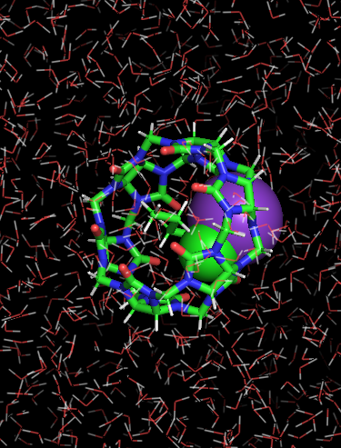

# Internship - Week 9 - Summary

At this point, and considering that we do not count with CPU time at Genius, it seems like a good idea trying to gather input and output files corresponding to all the calculations carried out so far with the Ab-Initio/MD software. On the one hand, the list of tar files uploaded to the "computationalchemistry" repository is completed. On the other, job submission scripts and input files are exhibited in this document. For cases of sequential calculations or parallel calculations on the laptop, no submission script is shown (only the main input file).  

 On the other hand, installation work (on DSI guest2 laptop), is summarised below, as well as work on the first runs with the software below:

 - GROMACS
 - PLUMED
 - AlphaFold (not implemented by the intern, simply run on Genius, when/if possible)
 - OPENMM
 - OPENPLATHSAMPLING
 
The last two codes are not separately installed on Genius. Rather, they take part in the distribution of other software. Firstly, PLUMED is a free-energy calculation code that makes use of OPENPATHSAMPLING. Secondly, AlpaFold is a protein structure determination sofware that uses OPENMM as force-engine, and therefore, OpenMM is part of its distribution. Regarding the laptop installations of OPENMM and OPENPATHSAMPLING, explicit installation have been carried out.
After looking at the AlphaFold documentation, it local installation would require a huge amount of storage space, which is not available on the laptop, therefore, no attempt of installing AlphaFold is made.

## HPC calculations: tar files uploaded and inputs/job submission scripts - Development of supercomputing training material regarding Ab-Initio/MD calculations

Following up the same order appearing in the computationalchemistry repository (README.md), job submission scripts and input files are shown next:

### ABINIT

 - Sequential ABINIT calculation of the as provided example "tbasepar_1", located within abinit-test/tutorial ("Lead crystal - parallelism over k-points"): 
   *sequentialABINITtbasepar_1.tar.gz* (Genius)
 - Sequential ABINIT calculation of the as provided example "tbasepar_2", located within abinit-test/tutorial ("FCC 4-atom A1-phonon deformed ferromagnetic Fe 
   crystal" - parallelism over spin): *sequentialABINITtbasepar_2.tar.gz* (Genius)
 - **MPI** ABINIT calculation of the as provided example "tdfpt", located within abinit-test/tutoparal ("DFPT phonon calculation for Aluminium crystal - step 1: 
   ground-state electronic structure calcuation - step 2: phonon calculation": *mpiABINITtdfpt1and2.tar.gz* (DSI laptop guest2; no batch job script used)

### ASE

 - Sequential ASE convex hull determination of a CuxPt1-x(111) surface slab by means of a genetic algorithm calculation (global optimization): 
   *sequentialASEgenalgCuPt111slab.tar.gz* (Genius)
 - ASE water-box equilibration calculation as a strong-scaling **MPI** test: *mpiASE_STRONGSCALING_waterboxequi.tar.gz* (Genius)

### LAMMPS

 - **MPI** LAMMPS calculation of c-HfO2: *mpiLAMMPScHfO2.tar.gz* (Genius)
 - LAMMPS ethanol-box equlibration as a strong-scaling **OpenMP** test: *openmpLAMMPSstrongscalingETHANOLBOX.tar.gz* (Genius)
 - LAMMPS ethanol-box equilibration as a *KOKKOS* parallelism *hybrid (36/2)* calculation case: KOKKOSPARALLhybrid36and2ethanol.tar.gz (Genius)
 - Sequential LAMMPS Monte-Carlo relaxation of a two-dimensional deformed hexaganal lattice: *sequentialLAMMPSmc.tar.gz* (Genius)
 - **MPI** LAMMPS calculation of quartz amorphisation via melting/quenching temperature ramps, as an **MPI** strong-scaling case: *mpiLAMMPSstrongscalsilicaamorph.tar.gz* (Genius)

### QUANTUM-ESPRESSO

 - Sequential GaAs PWscf calculation under PAW: *sequentialQEgaas.tar.gz* (Genius),
 ```
 &control
   calculation   = 'scf'
   restart_mode  = 'from_scratch'
   prefix        = 'GaAs'
   pseudo_dir    = '.'
   outdir        = '.'
   verbosity     = 'high'
   etot_conv_thr = 1.d-5
   forc_conv_thr = 1.d-4
/
&system
   ibrav = 2,
   celldm(1) = 10.6867,
   nat = 2,
   ntyp = 2,
   ecutwfc = 50,
   ecutrho = 600,
   nspin = 1
   nbnd  = 16
   la2F  = .true.
/
&electrons
   mixing_beta      = 0.3
   conv_thr         = 1.0d-8
   electron_maxstep = 200,
/
&ions
/
&cell
  press = 0.0
/
ATOMIC_SPECIES
   Ga  69.723    Ga.pbe-dn-kjpaw_psl.0.2.upf
   As  74.921595 As.pbe-n-kjpaw_psl.0.2.upf
ATOMIC_POSITIONS
 Ga  0.00 0.00 0.00
 As  0.25 0.25 0.25
K_POINTS {automatic}
   32 32 32 0 0 0
```
 - MPI SiH4 -molecule in a box- PWscf calculation under Hamann's ONCV pseudopotentials: *mpiQEsih4.tar.gz* (Genius),
```bash
 #!/bin/bash

#SBATCH --job-name=mpiesp
#SBATCH --nodes=1
#SBATCH --time=00:05:00
#SBATCH --account=lp_h_vsc35663
#SBATCH --ntasks=8           # TOTAL Number of cores
#SBATCH --cpus-per-task=1    # Number of OpenMP threads per task
#SBATCH --cluster=genius

module purge
module use /apps/leuven/skylake/2021a/modules/all
module load QuantumESPRESSO/6.8-intel-2021a

mpirun pw.x < silane.in > scf.out
```
```
&control
calculation  = 'scf'
restart_mode = 'from_scratch'
pseudo_dir   = './'
outdir       = './'
prefix       = 'silane'
wf_collect   = .TRUE.
/
&system
ibrav           = 1
celldm(1)       = 20
nat             = 5
ntyp            = 2
ecutwfc         = 25.0
nbnd            = 10
assume_isolated ='mp'
/
&electrons
diago_full_acc = .TRUE.
/
ATOMIC_SPECIES
Si 28.0855  Si_ONCV_PBE-1.2.upf
H  1.00794   H_ONCV_PBE-1.2.upf
ATOMIC_POSITIONS bohr
Si      10.000000   10.000000  10.000000
H       11.614581   11.614581  11.614581
H        8.385418    8.385418  11.614581
H        8.385418   11.614581   8.385418
H       11.614581    8.385418   8.385418
K_POINTS {gamma}
``` 
 - MPI *Immm* Ag2PdO2 PWscf calculation under ultrasoft pseudopotentials: *mpiQE_Ag2PdO2.tar.gz*,
```bash
#!/bin/bash

#SBATCH --job-name=mpiesp
#SBATCH --nodes=1
#SBATCH --time=00:59:00
#SBATCH --account=lp_h_vsc35663
#SBATCH --ntasks=8           # TOTAL Number of cores
#SBATCH --cpus-per-task=1    # Number of OpenMP threads per task
#SBATCH --cluster=genius

module purge
module use /apps/leuven/skylake/2021a/modules/all
module load QuantumESPRESSO/6.8-intel-2021a

mpirun pw.x < scf.in > scf.out
```
```
&CONTROL
  calculation = 'scf'
  etot_conv_thr =   1.0000000000d-04
  forc_conv_thr =   1.0000000000d-04
  outdir = './out/'
  prefix = ''
  pseudo_dir = './'
  tprnfor = .true.
  tstress = .true.
  verbosity = 'high'
/
&SYSTEM
  degauss =   1.0000000000d-03
  ecutwfc         =       59.00000000
  ecutrho         =      545.00000000
  ibrav = 0
  nat = 10
  nosym = .false.
  ntyp = 3
  occupations = 'smearing'
  smearing        =  'f-d'
  noncolin        =  .true.
  lspinorb        =  .true.
/
&ELECTRONS
  conv_thr =   2.0000000000d-09
  electron_maxstep = 80
  mixing_beta =   4.0000000000d-01
/
ATOMIC_SPECIES
Ag     107.8682 Ag.rel-pbe-n-rrkjus_psl.1.0.0.UPF
O      15.9994 O.rel-pbe-n-rrkjus_psl.1.0.0.UPF
Pd     106.42 Pd.rel-pbe-spn-rrkjus_psl.1.0.0.UPF
ATOMIC_POSITIONS crystal
Pd           0.0000000000       0.0000000000       0.0000000000
Pd           0.5000000000       0.5000000000       0.5000000000
O            0.5000000000       0.0000000000       0.3627000000
O            0.5000000000       0.0000000000       0.6373000000
O            0.0000000000       0.5000000000       0.8627000000
O            0.0000000000       0.5000000000       0.1373000000
Ag           0.0000000000       0.0000000000       0.3575800000
Ag           0.0000000000       0.0000000000       0.6424200000
Ag           0.5000000000       0.5000000000       0.8575800000
Ag           0.5000000000       0.5000000000       0.1424200000
K_POINTS automatic
7 11 4 0 0 0
CELL_PARAMETERS angstrom
      4.5552300000       0.0000000000       0.0000000000
      0.0000000000       3.0080300000       0.0000000000
      0.0000000000       0.0000000000       9.8977000000
```
 - 112 atom-cell Gold surface PWscf calcultion, from the PRACE benchmark
 - 443-atom cell Iridium carbide, from the PRACE benchmark

## HPC calculations: Installation and first runs with GROMACS, PLUMED, ALPHAFOLD, OPENMM and OPENPATHSAMPLING

This section constitutes a work plan in itself, since none of those codes have been run as yet. We are currently gathering information, particulary regarding input file syntax and example input files. The PDB file correspoinding to the structure below (two molecules forming a complex in a KCL (saline) water solution) provides a good sample to be run with most codes, except for AlphaFold (not a protein). The example has been taken from the PAPRIKA distribution [^1]. See below:



The corresponding PDB file can be located in the geometryCIF_PDB_XSF_FASTA ("k-cl-sol.pdb") repository.

Moreover, the list of softwware would not be complete if we did not include all the packages installed under conda (WSL Ubuntu 22.04 LTS) in a series of virtual environments, on the DSI guest2 laptop:

- "geniushpc": ASE, GPAW, LAMMPS, QE, CP2K, NWCHEM 
- "abinitbigdft": ABINIT, BIGDFT and PYTEST;
- "nbsjarvistools": GRIP, JupyterLab, JARVIS-TOOLS, PYIRON, LAMMPS;
- "pkinetrareev": PyEMMA, OPENMM, OPENPATHSAMPLING, GROMACS, PLUMED

The ABINIT installation has one purpose: To see whether version 9.8 has already modified the test suite. 

[^1]: https://github.com/GilsonLabUCSD/pAPRika/blob/master/docs/index.rst
